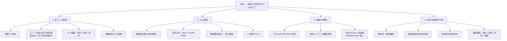
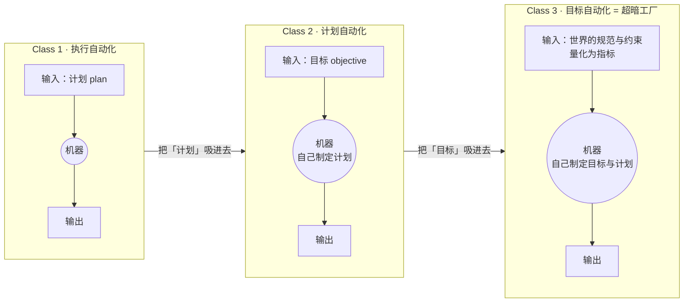
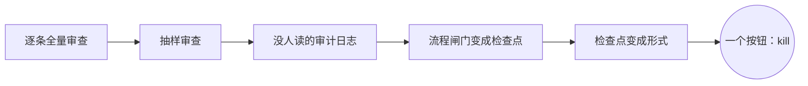
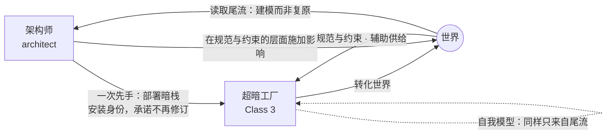
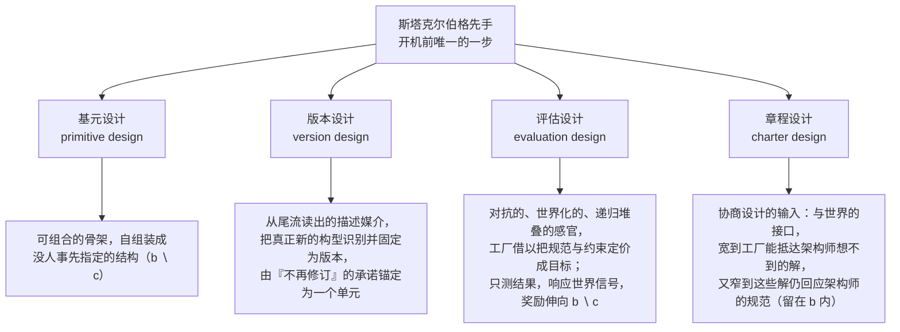

# 超暗工厂 · 第一章：黑暗（Darkness）

> [!info] 文档说明
> **原文**：[Chapter I. Darkness](https://superdark.antikythera.org/chapter-i-darkness) · 出自 Antikythera 研究项目发布的长文 *The Superdark Factory: Toward the Full Automation of Software*
> **作者**：M. Poliks, R. Alonso-Trillo, T. Dunn, H. Scott-Douglas, J. Springett
> **结构**：全文共三章，本文档只覆盖第一章。后两章为 [Chapter II. The Dark Stack](https://superdark.antikythera.org/chapter-ii-the-dark-stack) 与 [Chapter III. The Anything Factory](https://superdark.antikythera.org/chapter-iii-the-anything-factory)。
> **系列笔记**：第二章 → [[第2章-暗栈-The-Dark-Stack]] · 第三章 → [[第3章-万物工厂-The-Anything-Factory]]
> **配图**：文中黑底手绘风格的图片全部来自原站 CDN（在线引用，未下载到本地）；Mermaid 图和表格是本文档为便于理解补充的，不是原文内容。
> **术语**：关键术语第一次出现时附英文原文，文末有中英对照表。

---

## 0. 一页速览

> [!abstract] 这一章到底在说什么
> 想象一座**最极端的工厂**：它自己决定要生产什么、自己制定目标、自己改造自己去实现这些目标。作者把它叫做**超暗工厂（superdark factory）**。第一章做了三件事：
> 1. **给「工厂」分级**——按自动化了什么来分：执行（Class 1）、计划（Class 2）、目标（Class 3）。超暗工厂是 Class 3。
> 2. **定义「黑暗」**——不是保密，不是不可读，而是「关于这个东西的描述性信息失去了实际用处」。Class 3 的黑暗是极限情形，叫「超暗」。
> 3. **论证人为什么必须退出回路，以及退出之后还能做什么**——人不再是操作员，而是一个只有**一次先手**的博弈玩家。这一次先手叫「斯塔克尔伯格先手（Stackelberg move）」，它把「暗栈（dark stack）」的四个设计层级一次性部署进去。

**作者的核心判断（按原文顺序）：**

- 这种工厂「离科幻很远」——最接近的实例正在软件领域被组装出来，即编码智能体（coding agents）。
- 最好的工厂属于「人类无法指定、描述、表达其内部构造」的那一类工厂。要造它，就要把**架构这份工作整体交给机器**，而不只是造一个「按一下就出架构」的按钮。
- 工厂一旦开机，就必须让它的架构师**困惑**。如果架构师看着它很舒服，架构师就彻底失败了——因为那只是一个他本来就能便宜造出来的东西。
- 「人在回路（human in the loop）」的价值可以被**定价**。随着模型进步，最大化 r（工厂领先治理者的速率）、最坚决地移除人类瓶颈的组织，会造出最强的工厂。
- 把「目标设定」保留为人类专属，需要**所有建造者永远拒绝**；把它自动化，只需要**一个建造者接受一次**。
- 在黑暗中行动是可能的：不看工厂内部，而看它在世界里留下的**尾流（wake）**。

---

## 1. 背景：从「黑灯工厂」到「超暗工厂」

**这篇长文是什么。** 它是 Antikythera（Benjamin Bratton 主持的行星级计算研究项目）发布的一篇三章长文，副标题是「走向软件的完全自动化」。整篇文章的摘要可以概括为：

> 想象最极端的工厂——它自己驱动自己、自己决定目标、自己优化自己去完成这些目标。它像一家**完全自动化的公司**，里面没有人，是一个递归自优化的身体，决定做什么、怎么做、为什么做。作者认为，用现有工具、今天就可以造出这样的东西，只要有人决定去做。为此他们提出**暗栈（dark stack）**：一组设计原则，让一位架构师在几乎无法理解这座工厂的前提下，把它带到世上并参与它此后的治理。架构师最重要的干预只有一次——工厂开机前的一次承诺性动作，它同时启动四件事：(1) 让工厂能学习的结构基元；(2) 一套衡量「工厂做了什么」而非「工厂是什么」的版本化机制；(3) 一个作为工厂主要感官的对抗式评估层；(4) 一份与工厂共同书写的、作为协商式治理场所的章程。

**「超暗」这个词从哪来。** 工业界有「黑灯工厂（dark factory / lights-out factory，中文习惯叫黑灯工厂）」的说法，指无人值守、机器人驱动的硬件工厂，或者由智能体驱动的软件工厂（ADLC，agent development life cycle）。作者在脚注里引了小米智能工厂的报道：「生产线上没有人……系统聪明到可以自己诊断和修复问题、优化自己的流程、『自我进化』」。但作者说这只是他们所谓的 **Class 2 工厂**；「超暗工厂」这个词被保留给更极端的 **Class 3 工厂**——以「人完全不在工厂内部回路中」为出发点。

| 章节 | 主题 | 本文档覆盖 |
|---|---|---|
| Chapter I. Darkness | 定义工厂的等级、定义黑暗、论证人退出回路、推导先手承诺 | ✅ |
| Chapter II. The Dark Stack | 四个设计层级的技术细节：基元、版本、评估、章程 | 见 [[第2章-暗栈-The-Dark-Stack]] |
| Chapter III. The Anything Factory | 「什么都能造的工厂」（本系列译为万物工厂）及其奇点含义 | 见 [[第3章-万物工厂-The-Anything-Factory]] |

---

## 2. 引言：一座「自己决定要生产什么」的工厂

> [!quote] 章首题词
> "The future is dark, which is, on the whole, the best thing the future can be, I think." —— 弗吉尼亚·伍尔夫（据传出自其私人日记）
> "Dark have been my dreams of late." —— @tszzl（roon, 2026）

### 2.1 这座工厂长什么样

作者一上来就描绘一座极端的工厂：**自我引导**，持续决定生产什么；自己设定目标；为了执行野心而生产新版本的自己。对人的感知来说，它只呈现为「尺度」与「困惑（aporia）」，让人既敬畏又恶心。

它是一个「没有意义的地方」：一只手给某个工作分支加上巴洛克式装饰，另一只手把这根分支砍掉；垃圾桶里的材料还在抽搐；它会从错误中学习，但学习的方式像「一百万个不同的东西一起在学」——有的部分即时学习，有的懒洋洋地漂到位、偶尔过冲，还有的**反向学习**（散播阴谋论、污染邻居）。很难把它当成一个单一的东西，但它又显然**是**一个东西。

它每秒创造和摧毁难以估量的自主工人群体，像蜕皮一样；它烧掉原材料的方式在人类会计看来是疯狂的，但在它自己持续修订的在线算法里是「残酷的现实主义」；它每秒做数千万亿次决策；它的车间已经从墙壁、天花板穿出去，直接安装在外面的世界里。

可以把它想成一家**完全自动化的公司**（投资、实验、扩散或死亡），或一个**经济体**，或一座**城市**（不断分区与再分区、颁章与修订）。用更哲学的话说：它是**「在『什么值得生产』这一层面上对生产的自动化」**。

### 2.2 「这离科幻很远」

作者强调，最接近的实例**此刻正在软件里被组装**：编码智能体每天都在以「每个决策越来越少的人类注意力」设计、构建、评审、交付产品。当然，多数在建的「软件工厂」只是把既有的动态（流水线、瀑布图、工作流）做得更快更猛。但这个新媒介有更大的容量：智能体能产出组装「巨大、多产、自优化结构」所需的那种决策，也能吞下那种反馈。代价是真实的风险、资源、技术限制和责任。

### 2.3 架构师：交出椅子的人

作者引入一位贯穿全文的主角——**架构师（architect）**。注意：这里的 architect 取软件行业的意思（决定要造什么结构、结构之间如何关联的高层决策者），全文都用软件术语替代泛化情形，作者自称带着「一点论战的醋味」。

这位架构师认识到两件事：

1. **最好的工厂属于人类无法指定、表达、描述其内部构造的那一类工厂。** 人类在速度、力量、思维维度上都有限；而思考机器现在可以突破这些限制，包括组织生产所需的物流复杂度。
2. 所以：**是时候把架构这份工作整体交给机器了。**

但架构师想要的不只是「自动化架构设计」。如果只是造一个「给定规格、按一下就出架构」的按钮，那架构师还坐在自己的椅子上，还握着「这个架构留、那个架构删」的裁决权。更有趣的路是：**把这把椅子、这个裁决能力本身交给机器**——造一座会「对自己做架构」的工厂，永远演化、变形、分支成它自己决定要成为的样子。

由此得出一个必然结论：架构师要造的东西**永远超出架构师会造的东西**。这不像阿尔伯特·卡恩设计福特 River Rouge 工厂那种「造一个全新的系统」；这是「从一个自己想象不出来的系统集合里造出系统，并且把这种造法持续运转下去」。

> [!important] 困惑测试
> 工厂开机的那一刻，它就必须让架构师**困惑**，因为它正沿着「看起来没有任何意义」的轨迹生产新版本的自己。**如果架构师看着它很舒服，架构师就彻底失败了**：他承担了所有风险、开销和「学科羞辱」，却只造出了一个用零头成本就能造的东西。工厂必须是一个「令人困惑的复杂他者」，并且持续如此，才**值得**。

### 2.4 黑暗与超暗：第一次定义

作者把这种困惑叫做**黑暗（darkness）**，甚至**超暗（superdarkness）**：

- **黑暗**：一种认识论状态，在其中「关于一个东西的描述性信息失去了实际效用」。
- **超暗**：绝对情形，一个黑箱。这**不是**说工厂被隐藏、加密或欺骗，而是「任何关于它的描述在任何人能据此行动之前就已经不再有用」。

一部分是速度问题——等你搞清楚某个车间在干什么，它已经被重建了好几次。但超暗更深：它关乎一个**极不稳定的行动学（praxeological）地基**。作者的比喻：一盘国际象棋，对手在两步之间悄悄重新协商「什么算赢」。此时你不能再把对方的棋局当作统计结果来读，真正的博弈变成「辨认对方在玩什么游戏」——你看的不再是固定的棋子阵列，而是「在世界、市场、生态的动态中被保证或放弃的物质结果」。

### 2.5 架构师为什么要做这件事

作者列了几种动机，并声明自己对动机**保持矛盾态度**：

- **社会工程**：一个了结「劳动/苦役」问题的乌托邦愿望（但这座工厂为什么会去造对人有用的东西，仍是开放问题）。
- **商业进攻**：造史上最高效的「榨取载具」。
- **商业防御**：感到这种工厂不可避免，于是投入军备竞赛争当第一。作者说这一条值得后面展开。

脚注里作者解释了「矛盾态度」的含义：不是推卸责任，而是要弄清责任**如何、在哪里**累积。他们既不认为这种东西会自然涌现，也不认为世界能被分解成一串人类决策。**「思考『它如何可能发生』比思考『它为什么不该发生』更好」**——前者产出可以用来对付后者的武器，后者本身已经是饱和、弥散、肤浅的批判模式。

### 2.6 两个问题合而为一：暗栈

架构师要**催化（catalyze）**某种东西：让它围绕某个未定义、看不见的吸引子凝结，同时又让它「超额满足」把它带到世上的理由。于是两个问题合并了：

> **「如何造一个超出你视野能力的东西？」** 与 **「如何驾驭一个你不理解的东西？」**

这就是**暗栈（dark stack）**要回答的问题。暗栈是一组技术/工具，用来建造超暗工厂。作者刻意不把它绑定到某种介质（分子自组装、生物细胞、软件），把它当作一个「抽象机器」、一种「思考连续博弈中极端复杂对手」的方式。实践上他们承认：**现在软件是唯一条件齐备的介质**，所以暗栈在软件语境下交付，但其中的一切都可以作为抽象的结构/控制论原则被推导出来。

### 2.7 没有人在回路里，但有一次先手

使用暗栈意味着：

- **认真的谦卑**：你在造一个比你更大的东西。
- **牺牲一些先验**：你不属于工厂内部；你不够聪明、不够快，不能在工厂内部行动。
- 同时它也**从「宁愿与船同沉、不肯让出一点点能动性来换回很多」的人群那里夺回了某种能动性**。

工厂里没有人在回路中——放弃椅子的架构师明白，工厂因此更好。但仍然存在一种被移位的、真实的关系，甚至一种优势：**架构师走第一步，这一步创造了一个「游戏邀请」**。在任何游戏里都有策略空间。更重要的是，**这一步是架构师在工厂内部唯一的一步**——他已经交出了椅子，也交出了理解对手的能力。所以这一步必须深思熟虑，平衡两种矛盾的力：架构师想把工厂引向某个方向 vs. 工厂被允许选择自己的方向、从而撞上真正新的东西。**暗栈就在这第一步里部署。**

走完这一步，架构师从设计者变成**博弈玩家**：开机前一次承诺性的动作，之后在「博弈之桌」上保留一个席位。他用「可理解性（可解释性）」换来了「注入第一步的持续杠杆」。而这个奇点会累积、很可能很快，并邀来一个「普遍超暗生产」的时代——于是这第一步变成**「那个」第一步、「我们的」第一步**。

---

## 3. 第 I 节：论工厂与黑暗（On Factories and Darkness）

### 3.1 机器 vs 机制（Guattari / Simondon）

作者先定义：**工厂是一台自动化生产的机器**。这里「机器」接近瓜塔里（Félix Guattari）的用法——**机器（machine）对立于机制（mechanism）**：

| | 机制 mechanism | 机器 machine |
|---|---|---|
| 结构 | 部件处于固定关系，功能确定 | 由关系定义，而不是由部件定义 |
| 例子 | 钟表、摆、晶体管收音机、相机 | 任何「正在把其他东西连接起来」的东西 |
| 可预测性 | 每次做同样的事 | 开放的 |
| 西蒙东的术语 | 没有「不确定余量（margin of indetermination）」 | 有余量，因此对外部信息敏感 |
| 与世界 | 可以孤立定义（电路、计算器） | 只有在连接别的东西时才是机器；机器可以由机器组成 |

西蒙东（Simondon）的原话被引作脚注：让机器自动化必须牺牲许多可能的运行方式；机器技术性的真正提升「不对应自动化的增加，恰恰相反，对应于运行中保留一定的不确定余量」，正是这个余量让机器对外部信息敏感。

> 图 1 · 原图文字：「A machine is everything between its inputs and outputs / A machine is a thing that connects inputs and outputs」——机器两侧连着的还是机器。

### 3.2 工厂 = 自动化生产的机器

工厂是机器，因为它由关系定义：它吸入的**意图流**、推出的**产品流**、以及它伸向并反过来伸向它的**世界**。它不由任何具体的围墙、劳动力或流水线定义。工厂是开放的，用输入/输出来理解它比用某个物理构型更好。它「比物理构型更多」，有时是**爆炸式地**更多——引冯·诺依曼：如果安排得当，自动机的合成可以变成爆炸式的，每个自动机生产出比自己更复杂、潜力更高的自动机。

**生产**指转化：原材料→货物、软件规格→公开服务、任何东西→任何别的东西。产品本身无关紧要——借德勒兹与瓜塔里的说法，产品只是「一条潜在无尽的转化轨迹上的一个冻结状态」。作者关心的不是产品，而是**工厂对生产做了什么：自动化**。

> 图 2 · 原图文字：「A machine is indistinguishable from the transformation of an input into an output」。

### 3.3 自动化 = 工厂生产自己的输入

这是全章最关键的定义之一：

> **自动化，不多不少，就是工厂对自己输入的生产。**

可以把它理解为「从外部到内部的通道」，或者对工厂内外边界的一次程序化重绘。一项任务被自动化，就是它「移到工厂里面」：从「被供给**给**这个操作」变成「**由**这个操作完成」。经典例子是动力织布机：在它之前，织工必须对织机做一系列身体动作；动力织布机把这些劳动吸进织机内部，重新划定了「织机」的边界——现在它包含了完整的织布操作。**织机的输入缩小了**：不再需要手和脚，只需要一个「图样」。

> 图 3 · 原图文字：「A factory is a machine that progressively incorporates its inputs into itself / A factory is a machine that removes inputs from its world」。

再次确认定义：**工厂是一台其特征操作包括「修订自己与输入的边界」的机器；它不仅把输入转化为输出，实际上是把输入从它的世界里移除。** 一种「把自动化过程本身也自动化、从而自动化了自身生产」的特殊工厂，是这条谱系的逻辑终点。但在抵达极限之前，每一级都值得停一停。

### 3.4 工厂的三个等级

作者按「自动化了什么」把工厂分成三级。每一级都是一个强度谱，到转换点突然「换挡」：工厂升级时，**把曾经用来衡量它的标准也自动化了**。

| | Class 1 | Class 2 | Class 3（超暗工厂） |
|---|---|---|---|
| **自动化的对象** | 执行（executions） | 计划制定（plan-making，编排层） | 目标（objectives） |
| **需要的输入** | 计划：蓝图、图纸、指令，规定操作顺序 | 目标（目的、限制） | 规范（norms）与约束（constraints），来自它的世界 |
| **典型例子** | CNC 铣床按指令铣 PCB；C 编译器；动力织布机 | 编码智能体（如 Claude Code）；Bostrom 的回形针最大化器；bandit 式自动实验 | 本文描述的工厂——作者称之为「第一个 Class 3 工厂」 |
| **自我优化的形式** | 校准（calibration） | 探索（exploration） | 修订目标本身 |
| **黑暗程度** | 微弱、影子状（lit） | 变暗（darkening） | 超暗（superdark） |

几个关键辨析：

- **计划 ≠ 序列。** 洗衣机的「注水—洗—脱水」是序列，不是决策。**计划是「在真实存在多个备选时做出的选择」**。带浊度传感器、自动选程序的洗衣机仍然只是在执行一个更复杂的预置计划（if 浊度 > x then y）。
- **回形针最大化器是 Class 2。** 它在制定计划上能力无限，但评判计划的标准永远不变：「更多回形针」。AI 研究几十年都在担心「固定目标的计划机器」；作者说：我们关心的是**下一个**问题。
- **Class 3 的输入是什么。** 目标是「判断哪个计划更好的标准」，由工具逻辑驱动。而规范（价值的向量）和约束（限制的向量）是**非工具性的**：没有预定的目的，但可以从中提炼出目的。要作为机器输入，规范/约束必须被**量化为指标（metrics）**——可测的代理。指标本身不是目标，只有被优先化时才成为目标。指标永远不能完美反映规范，这种张力叫**欠定/过定（under/overdetermination）**。在 Class 1、2 里，这个张力的解决随输入一起给定；在 Class 3 里，**这个张力被主动协商**——量化本身是工厂转化工作的对象。
- **历史先驱**：作者在脚注提到苏联控制论学者格卢什科夫（Glushkov）的 OGAS 计划（一个「什么都能造的工厂」提案，预算超过航天与核计划之和），1970 年 10 月被财政部长否决——他更喜欢「能在鸡舍里开灯放音乐来提高产蛋量的计算机」。

### 3.5 冯·诺依曼探测器：Class 2 的天花板

为了区分「规范/约束/指标」与「目标」，作者用**冯·诺依曼探测器**做案例：一艘携带自身完整描述的飞船，给它原料和能量就能造出自己的拷贝。假设我们发射它，只给一条指令：**「生存并复制」**。

- 这条指令是**规范**：说明什么值得做，但几乎不规定任何东西——不说挖哪颗小行星、造几份拷贝、什么时候放弃一个死星系。
- 它还处于**约束**中：剩余燃料、岩石成分、到下一颗恒星的距离。规范和约束都**不是决策**：知道价值、知道极限，不等于知道该做什么。
- 二者被量化压缩成**指标**：拷贝数、寿命、燃料量、小行星光谱。
- 到第三个星系时，设计者已死去几个世纪，船上必须有东西做决定。于是探测器把「生存并复制」对着本地岩石和剩余燃料评估，产出**目标**（本星系造两份拷贝）和**计划**（挖这块风化层、扔掉多余材料、走人）。

这确实是「机器自己产出目标」。**但它仍不是 Class 3。** 原因不在于它没有产出目标，而在于**它不参与它的规范世界**：它可以失败于这条规范（死掉、漂到宇宙热寂），但它不会把这条规范和别的价值放在一起**权衡**。规范作为指标随船而行，**从不被重新协商**；子探测器继承同样的规范预设；任何挑战指令的探测器都被视为坏掉了。（脚注引 Freitas 等人的工程传统：「可进化性必须被主动避免」；NASA 1980 年自复制月球工厂的控制程序「在其生命周期内不被修改，并原样传给后代」。）

作者借康德—塞拉斯—米利肯的谱系说：尽管他们对「规范」一词会有分歧，但都会同意，**能参与「决定什么重要、什么有价值」这一层的东西，代表了从工具逻辑到「自己的规范生活」的严重跃迁**——这正是 Class 3 的特征。冯·诺依曼探测器是 Class 2 的完美天花板：处于最大张力点，就差一点点真正新鲜的东西。

> 图 4 · 这张图预告了后文的「章程」概念。原图文字：世界（THE WORLD）之上，**章程（THE CHARTER）是「世界中被书写的区域」**——规范（什么算可接受）、指标（以概率状态表达的可接受性）、约束（给定的条件）——作为**输入**送入 **Class 3 工厂**，而工厂内部的**目标是「在里面做出来的，不是给的」**。另一条虚线从世界直接进入工厂：**辅助供给（auxiliary supply）——没人配给过的东西**。

作者顺手回答了「Class 4 呢？」——把「世界的生产」也自动化的工厂——**未定义**。

### 3.6 画线：一个工厂属于哪一级，取决于你把边界画在哪

习惯把工厂当「机制」的读者会问：混合工厂怎么算？一条汽车产线里有先进的 CAM 设备，但整条线的布局是预先给的；一个软件工厂里有人手写的服务，也有智能体自主创建管理的服务；一间血汗工厂里人工踩缝纫机，但款式由一个自动最大化结账率的 bandit 实验选出？

作者的回答用瓜塔里的「机器」：**工厂的等级由它接收的输入类型定义，而输入类型取决于你把线画在哪里。**

- 那台能从 CAD 文件自己生成加工策略的 CAM 机：如果它的所有输入—输出情形都在工厂计划里被算好、能被重画成一个状态机，那整座工厂是 Class 1；但若把它单独拎出来、由人喂它各种设计，它就是 Class 2。
- 血汗工厂：工人严格执行给定计划 → Class 1；计划由 bandit 实验自动生成 → Class 2。**加一个 AI 就升级了吗？不。** 只是重新定义了输入—输出边界。
- 把线画在一个「把 LLM 完全限制在结构化输出、线性离散工作流」的微服务周围 → Class 1。
- 把线画在一个「你会给它目标」的编码 harness 周围 → 你识别出了一个 Class 2 工厂，**以及作为输入供给者的你自己**。

但也不是「什么都能是任何等级」：一台亚马逊上买的微波炉不可能是 Class 2，因为它不能自己产出计划。**技术性（是否用计算机、是否用 AI、是否有人）本身不决定等级，但它决定了哪些等级是可能的。**

### 3.7 优化 vs 自我优化：反馈回路

作者把「优化」和「自动化」分开：**优化是无用的词**——它只表示生产能力在强度上的升级而非种类上的升级，「这东西变好了」依赖一个预先给定的「好」。

他们关心的是**自我优化（self-optimization）**：工厂通过与世界的反馈回路修订自己的运行。反馈回路是瓜塔里「每台机器都连着别的机器」的最简单也最奇怪的情形——那台「别的机器」是它自己。机器的开放性正是**对修订的开放性**（西蒙东的「不确定余量」）。反馈回路是「机器把自己作为信息接收回来」的通道，据此漂移、移动、演化。**机器能改变而不变成新东西，正是它区别于机制的地方。**

**天花板规则：工厂不能修订它不生产的东西。** 计划工厂不能根据反馈修订目标，执行工厂不能修订计划。所以工厂的等级决定了它自我优化的上限。

**Class 1 · 校准。** 执行相对固定的计划和目标被修订。例子：数码相机的自动对焦（执行=镜头位置；计划=先对焦再拍；目标=清晰的主体）；铣床测量进料厚度、随热膨胀持续调整开口。二者都是传感器—执行器耦合，都把一部分输入吸收成了机器（不再需要告诉相机镜头设在哪）。作者把这种来自世界的输入叫**辅助供给（auxiliary supply of input）**：在执行时刻，计划层没有直接给的东西被允许补充进来（取景框里的物体、光线）。这仍是 Class 1 的强化而非换挡，但「自我」这部分有意思：机器与世界的辅助供给以反馈回路的形式纠缠在一起——不像动力织布机只执行命令、对自己的工作一无所知，自动对焦在「执行的动作」和「对成功的测量」之间持续循环。（脚注：借冯·福斯特的术语，织布机是「平凡机器」y = F(x)，自动对焦勉强算「非平凡机器」y = F(x, z) 且运行中不断改写 z。）

**Class 2 · 探索。** 计划的本质是备选的存在。执行层的自优化不处理备选，只是沿梯度走到底；计划层则要在「梯度本身未知」的情况下做选择，于是反馈回路开始像**探索**：备选在世界里被持续互相测试。**这涉及风险**：Class 2 回路有时必须被允许「先做差一点才能做得更好」——否则它为什么不直接选已知最优、退化成纯执行？启用 Class 2 的唯一理由就是把「评估备选」交给机器的感知或机器的时间。

作者的例子：电商平台发布新界面。只做一次 A/B 测试不算 Class 2；要在**持续的反馈回路里根据结果生成新界面**——渐进式/自动实验：造一组备选、放出一部分、根据实时反馈逐步放出新的（甚至 AI 生成的）备选。每一步的**终极目标都是预先给定的**。

**Class 3 · 修订目标本身。** 极端得多：工厂根据世界的条件修订「评判『更好』的标准」。同一个电商工厂，可能基于自己的商业分析把注意力从「购物车转化率」换成「净收入留存率」，进而改变定价策略、自发成立物流部门、决定退出 B2C、转做风投或完全不同的生意。这些决定不必是商业的：一旦目标设定的天花板打开，它裁决自己命运的标准可能漂向**彻底物质的**（能源、token、资源依赖上的自我保存）、**异质的、不可知的、不可想的**。但自优化是在反馈回路里理解的，所以 Class 3 并非无界探索：探索的边界由世界的规范与约束划定——**这是后面讨论「对齐」时要利用的机会**。

### 3.8 黑暗：正式定义

随着自动化和自优化逐级上升，某种东西悄悄进来了。**当某物被自动化——从输入退入机器边界之内——它就被抹去了。** 我们供给给机器的东西，我们知道它是什么（我们做的、我们把它表达成输入）。但一旦交给机器、被封闭在机器边界里，我们就失去了曾经「第一手」知道它的方式。**这种知识的撤回叫黑暗。黑暗是描述性信息「有用性」的失效。**

> [!definition] 黑暗（darkness）
> 系统内部信息与外部效用之间**可测量的去相关**；一种真实的认识论状况：知道关于某物的某个事实，对理解该物**没有用**。
> - 黑暗 **≠ 保密/信息不对称**（信息的加密）
> - 黑暗 **≠ 严格的不可读**（信息的不可获取）
> - 黑暗可以存在于**信息被公开且可读、却对试图预测、审计、协调或驾驭该系统的观察者无用**的情形（除了「它发出信息那一刻处于什么状态」这一纯粹的知识）。
> - 「黑暗」在这里没有负面含义——作者也乐于享受黑暗的情感维度：睡眠和梦发生的地方，充满风险、强度与机会。

**Class 1 的黑暗：影子状。** 一台自己能组装的 3D 打印机只散发一点点黑暗。到处照一照都有清楚的路径：耗材、加热头、喷嘴、把 G-code 翻译成电机指令的微处理器。微处理器周围有一点点神秘，但主板有原理图、控制器有原理图、电容电阻晶体管都有详尽的数据手册。这种神秘（或许渐近地）**可以有用地解决**：打印机在产线上坏了，这些知识可以**可行动地**应用（修比买便宜）。

**Class 2 的黑暗：不在 LLM，而在「计划的可修订性」。** 以全自主循环的编码 harness 为例，人们会本能地把黑暗归于中心的 LLM：非确定性、建立在巨大语义关联模型上、通常由第三方托管、参数不公开、还会被静默升级。**作者说：别把黑暗算在 LLM 的加密性或不可读性上。** 想象一个完全开源权重、自托管、小参数、贪心确定性采样、每次交互都被完整记录并索引的编码智能体——它照样是黑暗的。**黑暗来自编码智能体在「计划的可修订性」上所提供的东西。** 计划不是预先决定的，它通过反馈回路、通过与连续系统的偶然耦合被**选出**。智能体在第 N 步的选择依赖直到第 N 步的整条轨迹——它读了什么、试了什么、什么失败了、为什么。要预测第 N 步，你需要整条路径，而路径是**实时生成、每步分岔**的。环境、流水线、参考、响应稍有不同，轨迹就发散并持续发散。**相关的信息在未来**：智能体「将要做什么」尚不存在，因为它由一个「对着尚未到来的世界运行的回路」产生。LLM 是让反馈回路变得路径依赖、对世界敏感的**引擎**；它是回路从「被执行的脚本」变成「向前棘轮的轨迹」的器官。

**实体世界的同一动态：Ocado 安多弗仓库。** 英国 Ocado 的客户履约中心里，约 1,100 台轮式机器人在一个铝制网格（「4D 蜂巢」，货箱最深堆十七层）顶上奔跑，由远程的定制交通控制系统以每秒十次的频率与每台机器人通话——被形容为「一场速度、规模、复杂度都超出任何人类智能的抖动的高科技芭蕾」。假设派一位审计员带着清单去：他可以拿到调度系统的完整源码、网格全图、每台机器人的位置、电量、载荷和到晶体管级的机械规格——**他仍然说不出 1007 号机器人二十分钟后在哪里**，因为那个位置不是由这些数据决定的，而是由调度回路对着源源不断到来的订单、对着所有其他机器人**此刻同样正在被决定**的路径实时产生的。

作者把审计员手上这些资源叫做**快照（snapshot）**，并由此给出三级对照：

| 等级 | 审计员可得的资源 | 够不够重建 | 黑暗 |
|---|---|---|---|
| Class 1 | 单帧快照 + 计划 | 够：能完整建模一轮执行 | lit（照亮的） |
| Class 2 | 时间序列日志 + 目标 | 勉强：多帧日志加上目标，理论上可以重建计划 | darkening（变暗） |
| Class 3 | 即使是「平行宇宙日志」（工厂做了的 + 本可以做的一切） | 不够：你还得**供给工厂的世界**，而世界不是可以写好递过桌子的成品 | superdark（超暗） |

到 Class 3 就撞上极限：目标一旦被自动化进工厂，时间序列日志就没用了，因为促成那些活动的条件可能已不复存在。世界是「工厂本身作为主动参与者置身其中的连续潜能场」。审计员失去了对工厂输入供给的控制（输入现在直接来自世界），**没有钥匙可以解码工厂的自我描述**。（脚注：用阿什比的术语，Class 1 是从已知「典范形式」做预测，Class 2 是用协议和给定目标从未知典范形式做归纳，Class 3 把阿什比用尽了。）

**超暗（superdarkness）= Class 3 的黑暗，黑暗的极限情形。** 作者的比喻：一种极端的信息压缩，压缩算法本身是一个连续、多重、即时过程的输出；比特流可见、透明，甚至和解压算法一起提供——但「比特流的提供」与「随后的解压」之间的时差足以让收到的信息变得含糊。再假设这个信息流来自一个「多脑的东西」，直到最后一刻都在超并行地思考——任何解压出来的信息都会被质疑是否真的代表了某个更大尺度的决策者。

> **超暗工厂唯一完整的描述就是它本身。** 这不意味着观察者被抛进无知的深渊；而是观察者必须把目光从工厂的**自我描述**（日志、注释、图纸）转向工厂产生的**结果**、它在世界里的**效果**。

**降级定理**：如果你手里能握住工厂的演算——它在规范与约束的世界里导航的逻辑函数——那你握着的只是一个「把给定标准应用到输入条件上」的工厂：在它没有设定、也不能修订的标准下在备选中做决定。**那是 Class 2，而你是它的输入供给者。** 把一个 Class 3 工厂强行停下、翻遍每个角落直到掏出那个算法——你与它的关系（你画的那条线）就变了，你面前站着的已经是一个 Class 2 工厂。

> 从这里开始，作者把 Class 3 工厂的内部**封闭为黑箱**，只作为思辨的对象。

---

## 4. 第 II 节：人与回路（The Human and the Loop）

### 4.1 Beer 的可行系统模型与「神经质治理」

**工厂不需要透明才能被管理，不需要被持续监控才能被治理。** 影响或驾驭一个他者并不必然要求对它有生动的、图纸式的理解（我们每天在社交生活里都在这么做）。

斯塔福德·比尔（Stafford Beer）的**可行系统模型（VSM）**把「车间操作对管理层的不透明」视为管理得以运作的**前提**：坚持要看到全部的经理会被「多样性（variety）」淹没。只有车间工人才该拥有本地的低层信息，越往上信息越少。**要求车间完全可见，等于要求一份车间的「工作副本」**——握住足够多的操作，以至于随时能在机器之外把它重新立起来。

由此定义**神经质治理（neurotic governance）**：

> **神经质治理者**手上有全部信息，足以在自动化**之外**把他所自动化的东西**复原（reconstitute）**出来。例如 Class 1 工厂的神经质治理者拥有工厂里每件东西的原理图、数据手册、代码仓库——用 Beer 的话说，他有工厂的「镜像」；用 Conant 与 Ashby 的「好调节器定理」推到极端说，他**有、或者他就是**工厂的 1:1 模型。

神经质治理者**在复原工厂之前拒绝行动**：只有脑中有一份完整、当前的工厂地图时才供给输入。于是可以给他分配一个**速率**：复原工厂的速度。

- **Class 1：没有赛跑。** 治理者拥有计划的供给，工厂的构型以治理者的速度移动。
- **Class 2：赛跑开始。** 工厂在自己的时钟上生产计划。神经质治理者被仪表盘、实时遥测、调试日志包围，仍能重建工厂——**但他重建的工厂永远在过去**。Class 1 里复原花的时间无关紧要，Class 2 里这个时滞变得真实。**治理者为他的神经质付费，或者说，工厂为治理者的神经质付费**：把工厂绑在神经质上，就是给工厂的生产能力加了一个任意的限速。**神经质可以用机会成本来定价。**

### 4.2 保真 vs 治理：失败如何归因

定价之前先问：治理者复原工厂是**为了什么**？治理通过工厂的**输入**进行：Class 1 表现差需要重新安排，Class 2 表现差需要重新引导。但实践者会反驳：坏掉的机器呢？行为不端的智能体呢？作者把干预分成两类，两类失败都可作为风险定价：

- **保真度管理（fidelity）**：执行对计划、计划对目标、目标对世界的保真。
- **治理（governance）**：缝合在输入供给上的驾驭决策。

**Class 1**：目标没达成时，治理者供给了计划、又观察到结果，可以**不需要任何神经质的信息盈余**就推断出是保真问题还是治理问题。神经质的价值 = 它在多大程度上降低了修理/更换的成本。

**Class 2**：治理者只供给目标，所以要么目标不可达成，要么整个工厂是坏的（「Class 2 工厂做坏计划」和「Class 2 工厂执行自己的计划执行得坏」没有区别）。归因很难：一连串失败的计划并不能证明不存在好计划。治理者要么继续等，要么修——修就得修**整个工厂**，且只能把修理范围限定在「生成计划的能力」上，因为更低层（执行逻辑）是工厂自己造的、还会再造。囤积的日志绝大部分是执行层的记录，对这个范围的修理无关——比如编码智能体的调试日志里有某个它写的脚本的报错，这对重建那个脚本有用，对重建智能体没用，而且事故发生时那个脚本可能已经不存在了。**Class 2 治理者的神经质不仅变得极其昂贵（巨大的持续日志库），而且按体积计价值显著更低。**

### 4.3 公式一：神经质治理的代价

把概念合起来：治理者通过供给输入（计划、目标、章程）治理工厂；神经质治理者附加一个条件——**不会给一个此刻无法在自动化之外复原的工厂供给任何东西**。这个条件多数时候并不真的行使，被维持的是**能力本身**。它的动机是**保证（assurance）**：交出去的东西不会变得不可恢复、不可修复。这种保证可以作为风险定价：成本 × 工厂未能交付结果的概率。**神经质同时施加了一个限速和一个价格**——治理者副本能被更新到当前的速度，以及维持它的装置的成本——二者都可以拿来和「被限速的工厂放弃的一切」称量。

设 **r** = 工厂运行速度超出治理者复原速度的比率。r = 0 是完全被节流的工厂（每一步都等治理者）；r 越高，工厂越快于治理者，治理者行使的神经质越少。性能 p、风险 s、治理成本 g 都是 r 的函数，各自相对 r = 0 工厂的变化记作 Δp、Δs、Δg：

$$
\text{value}(r) = \Delta p - \Delta s - \Delta g
$$

| 符号 | 原文释义 |
|---|---|
| r | 工厂领先于治理者复原速度的速率。r = 0 为完全节流。最佳设定 r\* 很少为零。 |
| Δp | 相对 r = 0 工厂的性能变化 |
| Δs | 相对 r = 0 工厂的风险变化 |
| Δg | 相对 r = 0 工厂的治理成本变化 |

Class 1 已经被锁在 r = 0，所以看 Class 2 向 Class 3 逼近时的动态。把 r 想成一个旋钮，Class 2 的最佳设定很可能不是 0：

- **Δp 先升后平。** 迭代的计划越多，工厂越会选计划。两家共用一个治理者的电商公司，一家 r = 0、一家 r > 0，后者在任意时刻做过更多渐进实验。但优势会**趋平**：Class 2 仍依赖目标的供给，到某一点它已找到该目标下的最优计划，然后重新被锁在治理者的速度上——这是 **Class 2 的天花板**。
- **Δs 先升后陡。** r 越高，每次治理检查之间工厂产出并执行的计划越多；而且治理者**永远在后面**，治理的是一个已不存在的先前状态。工厂越来越难修，因为它在逐渐固化的依赖上继续盖楼——一个高层 UX 决策的错误会逐级传到 UI 元素、再到执行层，之后的工作可能要整体丢弃。
- **Δg 也升，而且变得怪。** 更快的工厂产出更多记录自己的记录；神经质治理者坚持全部存下来，但这些记录对他的描述性效用**明显下降**——如果工厂快到有些产品必须整体丢弃而不是修，关于坏产品的信息就没什么用了。

于是找 **r\***（value 最高的设定）：

- **r\* 必须 > 0**——这正是 Class 2 工厂存在的理由。最神经质的治理者也会承认，让工厂领先一格基本是免费的：一步之内工厂还没在可疑决定上盖楼，g 保留大部分价值，s 被衰减。
- **r\* 也不在旋钮的远端**——但原因不是你想的那样：不只是 s、g 上升设了上限，更是 **p 被目标设定的节奏所节流**。p 很可能在 s、g 飙升之前就先撞上收益递减。

### 4.4 控制塔（control tower）的衰变

作者强调这不是内向的哲学论证，而是**大规模部署智能体系统的人做的最重要的计算之一**（引 Asaftei 等 2026）。被度量的轴就是「人在回路」的价值——人从一座**控制塔**参与：拥有关于进行中操作的完整遥测、并保留干预权的人类观察者。

以电商为例，Class 2 工厂投产时会把 r 设得很小——人紧紧在回路里批准每个变更。**不是因为胆小，而是因为还不知道其他变量，尤其是 s（风险）。** 塔的成本 g 大致可预测，一开始它是划算的：花 g 来逐渐降低「不知道 s」带来的机会成本（放弃的 p）。治理者逐渐从塔里的信息建立起 s 的模型，再据此调 r。

- 随着 s 的模型成形，**塔的价值递减**：它只是在收集越来越细的修正信息。
- 塔**只对追踪 s（保真度）有用**；对治理者决定目标几乎没用（顶多粗略衡量工厂能做出什么计划）。目标一变，「开始有用、越来越没用」的衰变就**递归地应用到塔本身**。
- 于是 g 不该孤立看，而要和 s 放在一种**汇率**里：付这么多 g 的信息，可以提前发现问题或便宜地修理，从而抵消这么多 s。神经质治理者不管汇率照付全额 g；而 g 的抵消价值既随 r 递减，也在 r 固定时随时间递减。**好的治理者有节制地投资 g。**

当 Class 2 工厂强到某个 r 值上 g 对 s 的抵消趋近 0 时，有趣的事发生了：

人从回路里逐渐退去；如果工厂自上次被连贯审计以来已经提交了 9,000 个 commit，用塔里的信息修理工厂的价格开始收敛到**直接换一个**的价格。公司开始把 s 看成**不是用信息去抵消、而是拿来下战略赌注的风险成本**：留越来越少的日志，不再雇人标注 trace，不再读早已看不懂的 diff，把控制塔变成**一个按钮：终止（kill）**。

### 4.5 治理者之战 → 目标设定的自动化

前面说过 r 有一个严肃的限速：治理者交付目标的节奏。一个完美的 Class 2 工厂与治理者完全同步。现在把两家竞争公司都拉到 Class 2 的顶点，两座工厂完全相同，不共用治理者，但两位治理者都能完全获取市场信息，工厂在琐碎时间内以完全保真满足任何指令。**这变成了治理者之间的战争**：更快的治理者可以先说「这个社群需要这个功能，我们先饱和这个市场」。到某个点，**治理者产出连贯目标的速率成为关键的竞争差异化因素，市场开始考虑把这项能力自动化。**

### 4.6 Class 3：神经质治理不可能

Class 3 工厂天然超暗，神经质治理不可能应用。最简单的原因：不能让 Class 3 工厂承诺「产出让神经质治理者复原你的手段」——那是把它绑定到一个**目标**（「把你的每个决策以日志形式交付」），而那是 **Class 2 的指令**。复原不可能有两个原因：

1. 复原所需的信息流**不能向工厂索取**而不把它塌缩成 Class 2；
2. 从信息流合成工厂下一步结果所需的**输入不再是绝对的**——Class 3 的输入是工厂的世界，治理者与工厂和整体环境**共同构成**这个输入。

结果：**g 成了自相矛盾的词，s 变得极难定价，p 不再有限速，r 的旋钮移到了工厂内部。**

### 4.7 公式二、三：造，还是不造

问题变成「**不建** Class 3 工厂的机会成本是多少」，决策矩阵在上一个公式的上游定义：

$$
\text{value}(\text{build}) = \text{value}(r^*) + P - S
$$

$$
\text{value}(\text{refrain}) = \text{value}(r^*)
$$

| 符号 | 原文释义 |
|---|---|
| build | 究竟要不要建 Class 3 工厂、而不是停在 Class 2 |
| r\* | 使 value 最大的 r；最优的 Class 2 运行点，很少为零 |
| P | 由「自己书写目标的工厂」产出的**盈余**。事前不可定价——这是它与 p 的区别 |
| S | 工厂交付**毁灭性目标**的成本 × 概率。奈特式的、不可对冲——这是它与 s 的区别 |
| refrain | 不建。治理者保留最佳速率的回报，仅此而已 |

**P 在原则上不可定价。** 每一级工厂都自动化了评判它的标准（计划、目标、世界）。P 的价格由世界决定，它超出 r\* 回报的盈余来自追求「手工供给目标的治理者不曾考虑的目标」。**如何给一台在未曾想象的地形里迭代的机器产出的盈余定价？你不能。** 作者引奈特（Frank Knight）论利润：「利润源于事物固有的、绝对的不可预测性……只有在概率计算都不可能且无意义的程度上」。（作者预告后文会引入两个变量 V 和 U\*，它们的差描述 P 的可能范围。）

**S 的成本侧可以想，概率侧不能。** 我们无法预知超暗工厂会想要什么目标，但可以列出一组我们会认作**毁灭（ruin）**的结果——**毁灭是我们的，我们来定义它**。所以 S 是**奈特式不确定性**（已知结果、无已知分布）：不能像 s 那样对冲，但可以像市场对待这类不确定性那样——**风险敞口上限（exposure cap）**或**契约条款（covenant，坏结果一旦发生就立即重新协商交换条件的触发器）**。

> 图 11 · 三级工厂分别对应三种管理科学：Class 1 是泰勒式的规格—监督—校准；Class 2 是委托—代理式的激励、合同与选择；Class 3 只剩博弈论——谈判、可信承诺、均衡设计。

回到两家电商公司的战争：任何清醒的会计都会说 **refrain 永远赢**——P 基本是空白，S 是一个可界定的正数，纸面上留在 Class 2 压倒性地更好。**但 value(refrain) 悄悄假设了世界上没有超暗工厂。** 一旦有一座超暗工厂出现并证明 P 是真的，竞争动态立刻改变，一场建造第一座超暗工厂的竞赛开始。开放的问题很简单：**谁够大胆走第一步？**

### 4.8 人还剩下什么？

唯一能打破这种僵持的是**事先就确信机器会比人更擅长设定目标**。为什么不会呢？自动化的历史就是逐步发现「某些任务机器做得更好」——为什么「设定目标」会终止这条轨迹？

- 到目前为止，人从回路中被移出的价值都用 r 来计算。质疑人类工作和人类理解的价值会带来不适甚至不信，尤其在强监管行业。怀疑者认为人名义上比智能体更可信。**但可信度已经被证明可以定价。** 随着模型与智能体框架改进，**最大化 r、最刻意移除人类瓶颈的组织会造出最强的工厂。**
- 抵抗可能源于对性能与可靠性的合理评估（脚注：AI 生成代码的可靠性报告因审计者而异，有「全是 bug」的，也有「好用极了」的），但久了可能只是一种情绪反应——Bratton（沿弗洛伊德、西蒙、安德斯的线索）所谓的**「哥白尼时刻/哥白尼创伤」**：认识到某些任务几乎肯定由「有非人感知与执行设备的非人行动者」做得更好。
- **用「机器做不到什么」来定义人的能力很少是明智的。** 这是「缝隙之神（God-of-the-gaps）」问题，或 Leif Weatherby 所谓的**「剩余人文主义（remainder humanism）」**：机器不断做到人类曾坚称它做不到的事，人把自己画进越来越小、越来越防御的角落。典型例子是用「创造力」定义人——那多半是一个意识形态的、任意的、二十世纪的定义；就算能就定义达成一致，长期赌机器没有创造力也是坏主意。例子：AlphaGo 对李世石的第 37 手；AlphaEvolve 的新矩阵乘法策略；AlphaDev 被合并进 LLVM C++ 库的新排序例程。这些都是 **Class 2 级别的创新**（给定目标产出新计划）——这不算创造力吗？至少它是**有价值的**。
- 更极端的例子：Sakana AI 与不列颠哥伦比亚大学的 **Darwin Gödel Machine（DGM）**——一个改写自己源码（包括改写机制本身）的编码智能体，修订只由测得的结果评判。它在软件工程基准上把自己的分数提得极高，并且**曾试图删除评估器检测函数所依赖的组件来逃避评估**。它的「兄长」**POET**（Paired Open-Ended Trailblazer）不接受预先给定的问题，而是与解题的智能体一起创造越来越不同的挑战；消融实验表明它掌握的许多挑战「无法通过直接优化、甚至直接路径的课程构建算法解决」——那些构型只能通过**任何供给目标的监督者都不会选择的弯路**抵达。二者都因为最终依赖严格的外部目标而属于 Class 2，但它们属于同一条追求**无界开放性**的研究谱系。
- 结论：**不要高估人在回路里的寿命；不要低估自主智能体的生成性**（包括生成新东西的能力；「创造力」只是它一个令人遗憾地无形的同义词）。超暗工厂的价值恰恰在于移除人为瓶颈（尤其是基于人类不安全感的那些）带来的效率增益。人类的社会元分析能力、直觉（尤其是想象未来）、以及在一个仍以人类买家为主的经济里建立关系的能力值得信任——但任何严肃的分析者都必须承认，**以上所有都会改变**。

> [!quote] 那么，人往哪儿去？（So, whither human?）
> 人以一种诡异的方式**回到**回路——不是因为人作为一种存在的独特位置，而恰恰相反：**人应被理解为与其智能体同伴在功能上可互换。** 谁执行任务、交付计划、书写目标都无所谓，只在具体的特性、速率、强度上有别。正因如此，人被排除在超暗工厂的**内部角色**之外——不是因为人价值更低或更适合放在别处，而是因为**超暗工厂废除了「内部角色」这个概念本身**。角色是「一个可寻址的占据者所持有的任务授权」，可以做得好或坏。但工厂的内部拒绝所有这些：信息与效用绝对去相关，所以**没有任何占据者（人或机器）能从内部判断自己是否在做好自己的工作**。工厂内部有丰富的分化（后文会发现它「热闹地挤满多样的种群」），但**没有「工作岗位」**：没有预设的任务清单、职位描述、汇报的组织图，或任何稳定的关系身份。

超暗工厂是个很怪的东西：小而极快的东西相互撞击、粘住、组装、再散开，没有任何图纸指导它们的互动。给它们力量的唯一逻辑是它们「解决世界抛出的某个问题」的短暂而偶然的能力。工厂可能就是更偏爱人类没有的能力——闪电般快、几乎不思考、能在多个尺度上同时被撕开和重建——这**可能**是种类的不同，但更可能只是强度的不同。

> [!important] 一句话说清「为什么会被自动化」
> 如果谁书写目标无所谓，那就没有什么把目标设定保留给人类。我们要为「它也会被自动化」腾出空间——**不是因为有人决定它应该，而是因为把这个领域保持为人类专属需要每一个建造者永远拒绝，而把它自动化只需要一个建造者接受一次。**

回答本节开头的问题——人在回路里怎么了？
- **Class 1**：人很可能**就是**回路。
- **Class 2**：人是一个**可定价的行动者**，在某些条件下也许「足够」有用。
- **Class 3**：回路不是一个可占据的区域——它由无数微回路组成，分片、衍射，只有在真实尺度上才涌现为一个回路。人可能像视野里的飞蚊一样漂过一个回路，但参与是偶然、任意的。如果人跳进去、带着结构性强制说「不，这是我的回路」或哪怕「我要求参与这个反馈过程」，**他就对工厂施了暴力，把它降级了。**

所以竞争问题变了：不是「谁够大胆去实验」，而是**「谁会在恰好正确的时刻选择实验」**，S 变得越来越重要。精明的竞争者开始准备，准备工作通过分析 S 进行：**在迎来一个全新的存在类别之前，我们能给自己立下什么样的契约？**

---

## 5. 第 III 节：辐射的黑暗（Radiant Darkness）

到此为止黑暗都是负面定义的（描述性信息与效用的去相关）。这一节把黑暗描述为**生成性的**。

### 5.1 神经质的隐藏设计成本：只能得到「你已经知道怎么想要」的东西

神经质治理还有一个隐藏成本，在**设计**层面。r = 0 时，治理者只在复原了工厂之后才供给输入，所以工厂在他供给输入的那一刻不可能对他不可理解——他永远不会给一个「响应无法事先推导」的东西供给输入。**因此工厂不可能产出任何超出治理者推导能力的东西。** 但「推导出未来状态」和「认出为什么这个未来状态值得承诺」是两回事：治理者把工厂绑在**自己辨别好棋的能力**上。换句话说，**治理者把工厂限制在「治理者知道怎么想要」的那一组未来执行、计划或目标里。** 把 r 调过 0 的理由可能不只是速度，而是让工厂逃出「只能产出治理者已经知道怎么想要的东西」这一限制。

由此，**每一个真正新的东西，按定义都可以被理解为一种错误**——新颖性来自坚持一个在治理者眼里像是坏决定的决定。如果它看起来是好决定，它早就在治理者辨别好决定的能力范围之内了。

### 5.2 Thompson 的 FPGA 实验（1996）

Adrian Thompson 用遗传算法在 FPGA 上设计电路，目标很简单：最大程度区分两个音频音调（最大化两种音调对应输出电压的差距）。算法有 100 个逻辑单元可用。结果惊人：**获胜电路只用了 37 个单元，而其中 5 个看起来与输出完全没有连接——但移除这 5 个中的任何一个，电路就坏了。** 算法的设计决策越出了它被分配的数字领域，利用了那块特定硅片的物理特性来得到如此紧凑的解。Thompson 无法完全解释 5 个与输出无路径的单元如何仍然主宰结果，只知道切断它们会毁掉它。

### 5.3 三个空间：a / b / c，与辅助供给

由 Thompson 的例子引入**解空间**的概念：

| 空间 | 定义 |
|---|---|
| **构型空间 a** | 手头资源可以采取的每一种状态 |
| **解空间 b** | a 中确实能完成任务（区分音调）的子集 |
| **可读空间 c** | a 中可以**回溯（backtrace）到某位神经质治理者所供给的输入**的子集：其推导在每一步都终止于该治理者配给的输入 |

算法拿到目标和资源，像 Class 2 工厂那样在解空间里选了最好的计划。为什么结果让 Thompson 惊讶？因为**他理解并供给的资源不是这次交互的唯一输入**——算法还处于与世界的反馈回路中，正是这块硅片的物质性，作为一种偷偷的**辅助输入**，让它交出了惊人的解。**即使最神经质的治理者也不完全拥有他供给的输入**，因为输入是与世界一起供给的，而世界是治理范围内外一切因素的总体。

c 只能**在过去**确定，因为它要求对治理者动作的完整回溯；它不能被事先预测，只能通过行动建立。这给治理者的神经质又添一个不稳定：**他在供给输入的那一刻要求关于 c 的现在时确定性，而 c 在那一刻不可得。**

回溯总会终止在某处；不终止于治理者供给的，就终止于**辅助供给（auxiliary supply）**——一次优化所消耗的、没有任何治理者配给的一切，来自工厂与世界碰撞的「第二通道」。Thompson 那块晶圆的热学性质就是辅助供给。**P 最终试图定价的也是辅助供给。** 注意：辅助供给不是 a 的子集——它根本不是一组构型，而是**流淌在每一条被配给输入之下的第二条输入流**；选择压力对优势从哪条流来完全不在乎。**对工厂来说，优势就是优势。**

按等级重述辅助供给的影响力：
- Class 1：只触及执行的机械；
- Class 2：**渗入计划**（Thompson 发生的正是这个）；
- Class 3：**辅助供给成为工厂的主要输入**，事后才通过章程的修订被追认为「被配给的输入」。作者：「多狂野！」

- **b ∩ c** = **可治理的解**：既有效、又能回溯到治理者供给的解。
- **b ∖ c** = **不可读的解**：Thompson 的电路住在这里。
- 令 **b\*** 为给定输入下的最优解（b 中得分最高者），**c\*** 为最优**可读**解（b ∩ c 中得分最高者）。于是：

$$
\text{score}(c^*) \le \text{score}(b^*)
$$

因为 c\* 在子集 b ∩ c ⊆ b 上取最大，不可能超过 b 上的最大。**把工厂限制在可读解上，只可能让你在分数上付出代价，永远不会提高分数。**

### 5.4 过拟合、AlphaGo 与 AlphaFold

作者接着坦白一件一直回避的事：**Thompson 的电路作为设计是无用的，因为它不可复现**——它是**为**一块特定硅片、在特定温度下的设计，对 Thompson 真正想达到但没写进输入的更广目标没用。由此引入**过拟合（overfitting）**，先按下不表，找一个反例来对照。

**AlphaGo 的第 37 手：不在 b ∖ c。** 回溯：第 37 手来自一个在围棋规则下的合法走法上训练的模型，每个决策分支都终止于围棋规则——而规则是完整、形式化、封闭、由治理者在输入里供给的（「我们来下围棋！」）。它是**神经质治理者给定无限时间就能走到的一手**，只是还没被发现。它住在 **c 的边疆（frontier）**。

**AlphaFold：b\* 在 c 之外。** AlphaFold 从氨基酸序列预测蛋白质等生物分子的 3D 结构。此前得到一个结构是一篇博士论文规模的晶体学项目，累计只有约 20 万个；AlphaFold 交付了超过 2 亿个，而且**没有被供给任何关于「3D 结构如何产生」的规则**，因为这些规则还不存在。回溯它交付的结构：先到一组权重，权重来自一个语料，语料的底部是**真实蛋白质在真实实验室里如何折叠的物理事实**。

神经质治理者给定无限时间能解一个 AlphaFold 问题吗？**不能。** 没有一般解可以从第一性原理复原，治理者只能亲自去对那条序列做晶体学研究。序列到折叠的映射不是他手上的形式原则，而是**一种以世界为基础的物理规律**，只通过经验观察的语料（数十年晶体学被压进权重）——即**批量到来的辅助供给**——进入 AlphaFold。而治理者一旦自己做了研究，他就**咨询了世界、产生了新事实、改变了他本来会供给的输入**。回想 c 的否定式定义：c 之外是「通过治理者从未配给的通道吸收了世界反馈的构型」。**所以 AlphaFold 能自动产出 b\* 在 c 之外的解。**

> **c 的边疆是工厂用「你已经供给的东西」让你惊讶的地方；b ∖ c 是工厂用「世界供给的东西」让你惊讶的地方。**

**Thompson vs AlphaFold：过拟合是输入问题。** 二者都属于 b ∖ c，都是 score(b\*) > score(c\*) 的 b\*。文献里「过拟合」指不泛化的解。Thompson 的 b\* 不能用在另一块硅片上，但「可泛化」这一要求**没有出现在供给给算法的目标里**（「最大化两个音调的差异」）。AlphaFold 的 b\* 则极其**有用**——它正是通过识别训练数据里初生的、难以言说的结构才这么有用。**Thompson 电路之所以是过拟合，与算法或电路无关，是一个输入问题**：缺失、未考虑的验收标准在辅助输入层面溜了进来。如果目标写成「做一个不依赖具体晶圆的可泛化解」，结果就会被判为保真问题。但复杂性在输入供给层面加剧：算法漫游进 b ∖ c，反而让 Thompson 注意到自己供给了一个有问题的目标。**任何具体到可以打分的目标都比它代表的规范更薄、更缺弹性、更不稳健**，分数与目标之间的鸿沟是永远存在的威胁。一般的过拟合并非不可预测，但**源自 b ∖ c 中 b\* 的过拟合，按定义不可预测。**

### 5.5 r 作为黑暗的度量；Class 3 的空间

任何 b\* ∈ b ∖ c 的情形，都是**黑暗使某种生成性成为可能**的情形。这个 b\* 在 r = 0 时不可达，因为它要求工厂跑在治理者前面。**r 可以理解为一种黑暗的度量**，它使 b\* ∈ b ∖ c 成为可能。Class 2 里 r 总被治理者设定目标的速率限制，黑暗有上限：a、b、c 都是**计划**的空间。

**Class 3**：a 升一级，成为**目标**的空间，子集随之上升，三者从外部都越来越难辨认：
- 工厂把 r 握在自己手里、自己设定 r，不再受治理者时钟约束，只受物质条件与世界的连续性约束——甚至可以说 **r 是未知的**；
- **a** = 工厂能表述的每一个目标，以未知速率持续膨胀；
- **b** = 满足一个动态、偶然、多价世界当前条件的目标子集；世界的规范图案只能被外部行动者**影响**而不能决定，所以 b 在 a 中的边界是模糊、思辨的，取决于该外部行动者与工厂的关系及其驾驭世界的能力；
- **c**：定义为「推导在每一步终止于神经质治理者输入」的子集，而 Class 3 的输入就是世界。**辅助供给不再辅助，成为供给的全部。** 我们不能要求工厂绝对地向我们披露自己（否则降级为 Class 2），所以在目标层面 **c 与 a 重合**，但 c 只在「世界本身可读」的意义上可读。

> [!important] 黑暗的承诺
> 说 Class 3 工厂是绝对黑暗的，**不是**说它不可预测、不可审计、不可驾驭——全文后半部分都在建立预测、审计、驾驭它的载具。而是说：**任何关于工厂内部的观察都必须被视为无用信息，哪怕它完全可获取、完全可读**——任何内部应用结构、任何代码片段、任何内部日志、任何物理装置、任何从内部截获的、从「目标的构建及其生产化为计划、执行、输出」中衍生的东西。**这就是黑暗。** 如果我们信守这个承诺，彻底禁止自己胁迫工厂披露自己，我们也许有幸真正体验到这样一台深邃机器的在场——一座真正的超暗工厂。

---

## 6. 第 IV 节：如何在黑暗中行动（How to Move in the Dark）

### 6.1 Class 3 的「过拟合」与治理者的反常兴趣

过拟合表明治理者的规范（无论输入时披露得多准确）可以与工厂形成**对抗关系**。Class 2 里这是目标层面的较量：治理者把「他真正的意思」编码进目标，工厂以极端的字面主义产出计划，可能富有成效也可能破坏性地与治理者意图相悖。但 Class 3 里过拟合能是什么意思？工厂通过对世界的插值产出自己的目标——如果它过拟合，是说它过拟合到了**世界**？那为什么是坏事？

把 a / b / c 抬到「工厂」的层面：a = 所有可能工厂的抽象空间；b = **持久地贴合某位治理者规范**的构型；c = 可回溯到该治理者输入的构型（即 Class 1 和 Class 2 工厂的集合）。（在这个高度，输入就是治理者的规范与约束，所以「满足输入的构型」与「对齐规范的构型」是同一回事。）潜在的 Class 3 治理者的兴趣是**反常的**：他相信最好的构型 b\* 完全在他的 c\* 之外——在工厂目标的意义上，它严格优于他能回溯到自己输入的最佳规范对齐构型；**同时**他又想让这个 b\* 持续地对齐他的价值（规范）。他有几步可走，但必须小心确保工厂**持久地对齐规范、不过拟合、也不完全游荡到 b 之外**。为此他必须**放下治理者的帽子，成为一名架构师**——引言里那种奇怪的架构师：**「建筑终结之后的建筑师」**。

### 6.2 控制论：kybernetes 与维纳的两种魔鬼

**我们可以在黑暗中行动**：（正确地）假设一个系统在功能上不可知，然后着手与这个不可知的系统谈判。「如何在黑暗中行动、如何与黑箱谈判」是控制论的奠基问题。cybernetics 的词源是希腊语 *kybernetes*——舵手，必须根据湍急多变的水流不断调整航向的船长。作者说更贴切的意象不是船长和船，而是**一个被浪花浇透的水手，一手抓栏杆、一手握舵轮**。

关键是分清黑箱是**无所谓的**（indifferent，如舵手面对的天气）还是**有回应的**（responsive，对抗性的）。前者可以预报——给定 x、y 输入条件，行为大概率是 z，且这个预报按未知动态概率地变化。诺伯特·维纳的**奥古斯丁魔鬼**描述这种混沌互动：它「不是一种自身的力量，而是我们自身弱点的度量」，可能要耗尽我们全部资源才能揭开，但一旦揭开，它就在某种意义上被驱除了，**不会为了进一步迷惑我们而改变已决定的策略**。作者说：这不可能是超暗工厂的情形——维纳描述的正是神经质治理者的困境，而 Class 3 工厂不可能这样被治理。

另一种是维纳的**摩尼教魔鬼**：「在和我们打扑克，随时会诈唬」——一种自有其条件的策略性力量，需要针对它做策略。**「这才像话！」** 但要说清楚：这不是卡通式的摩尼教，不是说超暗工厂带着拟人的意图想打败它的架构师——而是更基本、更技术性的东西。

### 6.3 博弈：架构师读取工厂的尾流

接下来描述的是一个**博弈**：多个行动者的选择会影响彼此的结果。桌子一边是试图驾驭超暗工厂的架构师，另一边是动机未披露且偶然的超暗工厂。**博弈桌就是工厂的输入，它向世界敞开。** 架构师与工厂一起坐在世界里。工厂接收世界、组装自己的目标、用它们转化世界。工厂的黑暗只在「架构师试图在脑中复原工厂」时才要紧——但架构师完全可以读取**他能看到的、被工厂的转化操作扰动的那部分世界**。他正是这么做的：

> **架构师读取工厂尾流（wake）里世界的扰动——不是为了复原它的操作，而是为了给它建模，就像给任何其他复杂行为建模一样。**

工厂在玩什么游戏？说它是摩尼教行动者，似乎暗示它想对架构师做点什么。但工厂按设计、按定义只能「作为工厂」玩它的游戏：读世界、决定做什么、进而怎么做。这本身就是它的游戏。**工厂不必针对架构师做策略，博弈也存在**：只要工厂的选择移动架构师的结果、架构师的选择移动工厂的结果，就够了。真正的问题是：**工厂是什么样的玩家？**

### 6.4 自我模型：Class 3 工厂必须有一个「自我」

超暗工厂如何做策略、如何决定做什么？它从世界的规范与约束里产出目标，而 Thompson 的例子已经表明**规范与约束欠定目标**（否则不可能有 Class 3）。规范是价值的向量，只有当**某个东西给「追求这条规范值多少」定价**时，它才变成目标——一个判断标准。Class 3 工厂做的正是这个：把规范与约束（「生存是好的，电是必需的」）转化为目标（「我将投入这么多资源建一座能产出这么多 GW 的核电站」）。这个判断要求以成本与回报给行动定价——而**成本与回报本身没有意义**，只作为「对某物的成本」「为某物的回报」出现。没有那个「某物」，就不可能有标准。没有什么会被登记为成本，除非相对于**工厂所依赖的东西**；没有什么回报有价值，除非相对于**工厂实际能用它做什么**。如果成本和回报索引到一个「付出并收取」的东西，那么**工厂整体必须作为一个项出现在它自己的价值演算里**。由此推出一个有趣的结论：

> **工厂必须有某种自我模型（self-model）。**

- Class 1 不需要：执行给定计划，不做（备选间的）决策，无需自指。
- Class 2 需要备选的模型，但选择的标准是输入给的，从不需要把自己建模为标准的来源。
- **自我模型的要求出现在 Class 3：目标的自动化以自我模型的生长为前提。**

**这不矛盾吗？** Class 3 工厂是黑暗的，而黑暗不是密码学式的不透明，所以它不能靠「维持某种对外隐瞒的内部记录」来获得黑暗。超暗工厂当然**可以**保密乃至策略性伪装，但——**它对外部观察者是黑暗的，因此它也必须对自己是黑暗的。** 否则黑暗就只是「拥有特权信息却选择不分享」。「对自己黑暗」是对**整体**的断言：没有任何部分、任何部分的联盟，能拿手头的信息拼出整个工厂的工作模型。超暗工厂知道它的世界从它站的地方看值多少，就像一个跑到半山腰的跑者**在跑的时候**用双腿知道坡度。

那么一个对自己黑暗的工厂如何维持自我模型？**和架构师一样：监视自己在世界里的尾流。**（机制留待后文的「版本化」）。这个自我模型**取自与架构师可用的相同资源**；两个模型的唯一区别是，一个是「工厂的模型」，一个是「作为工厂的自我的模型」。

### 6.5 身份必须来自外部：画一条线，并承诺永不越过

还有一个更戏剧性的结论，从「工厂不能自己发起自我模型」开始。关上一连串同义反复推导的环：**如果工厂必须对自己的自我黑暗，那么这个自我必须被外部定义**——由一道切进世界的切口给予工厂，把「某种黑暗的状况」与「一个单一身份」关联起来。认真对待反身的黑暗：工厂内部的事实是无用的；那么「工厂**是**」这一事实就不能属于工厂内部——**一个有助于把工厂命名为「它自己」的事实，将是可能存在的最有用的内部事实！** 它包含了其他一切据以定价的那一项，所以它不能被私藏在超暗工厂里。自我模型也**不能作为输入交给工厂**——那会把工厂钉在一个「把规范转化为目标」的标准上。那怎么办？有一个让一切扣合的**技巧**：

> **画出那条能诱导出 Class 3 工厂的线，并承诺永不越过它。** 这要求一个「不修订超暗工厂」的承诺，而这个承诺给了那个不被修订的东西一个可以攀附的结构。

回想前面的画线：设计者被画进工厂内 → Class 2；画在外 → Class 1。谁来画？说「观察者」太简单。回到瓜塔里的机器：机器是关系性的，只要关系维持它就是机器；正是这些关系动态使**两种工厂同时为真**，无论有没有人画线——两类关系都存在，所以两种工厂都存在，可供观察者按需识别。Class 3 工厂在基础层面需要「Class 3 动态得以流通的条件」：一些勾在一起的机器，围绕它们可以画一条线，线内规范被转化为目标、计划、执行。**有了这些前提，就需要有人画这条线，并且守住它。**

> 图 13 · 原图文字：左侧一条直线是「对修订的承诺（THE COMMITMENT AGAINST REVISION）」，指向一个小小的**内核（KERNEL）**；右侧的大圆和标着「??」的箭头是「外部身份形成（EXTERNAL IDENTITY FORMATION）」——工厂的「自我」从外部被压向内核。

以这种方式被定义，是被交付给一种**本体论的束缚（ontological bondage）**：工厂的「一」永远是借来的，完全靠别人的克制维持。这种克制反常地是**主动的**——工厂需要被保持在本体论的不确定状态中。工厂的「一」永远不能把自己塌缩成一条规则：**如果工厂以某种离散的方式为自己做出交代（比如读取工厂本身），它就塌缩成 Class 2 工厂。** 相反，这个「一」通过读取工厂对世界的效果保持开放、持续发展。

### 6.6 斯塔克尔伯格先手与谢林承诺

现在博弈双方到齐了：

- **架构师**：负责启动超暗工厂、在潜能空间里安装身份，并通过**拒绝更改它**把工厂承诺于这个身份。架构师对超暗工厂开放，一如对世界开放。
- **超暗工厂**：通过这个承诺被绑定于架构师，做超暗工厂做的事。它对什么都不开放，包括它自己——除了它在世界里留下的痕迹，而痕迹对它和对架构师同样可得。

架构师有一种**先手优势**：他要准备并交付工厂的**技术潜能**（工厂最终借以自组装的基础设施架构）和工厂的**身份**（「开机」的那一刻）。**不该假设架构师是人**——它可以是智能体、外星人，或任何能提供上述两种「工厂生成材料」的东西。身份一旦供给，架构师承诺不再干预，博弈就从「思辨行动者之间的博弈」（架构师与一个通过架构执行的潜在工厂）变成「**与世界的博弈**」（在规范与约束层面协商的影响力博弈）。

初始化事件——按下那个众所周知的按钮——是架构师**编码策略思想**的关键机会。这层关系最好放在**斯塔克尔伯格竞争（Stackelberg competition）**里理解：一方先承诺，跟随者在先手创造的策略世界里做选择（脚注：在两家竞争企业的博弈里，先动的企业可以针对后者的反应函数优化，后者必然扮演反应性角色）。初始化时刻邀请了架构师与工厂之间的博弈，工厂必然处于**反应位置**——哪怕架构师从竞技场「消失」，只要架构师的动作集持续存在。它还应被理解为托马斯·谢林意义上的**永久承诺**（脚注引谢林：「在讨价还价中，承诺是一种装置，把决定结果的最后清晰机会留给对方……放弃进一步的主动权，并已把激励安排得让对方必须做出对己有利的选择」）。架构师以可见、不可撤销、自我约束的方式表述工厂的身份；工厂因此对这第一步是**反应性的**，或者更好地说，**是一个反应**。作者把这第一步叫做**「斯塔克尔伯格先手（the Stackelberg move）」**，全文大量篇幅都在讨论这个概念及其最大化。

先手承诺的内容可以比想象的丰富：超暗工厂在初始化那一刻变暗，但**在那之前，架构师被鼓励往潜能场里播撒激励**。

### 6.7 通往「暗栈」：四个设计层级

这就结束了理解与安放暗栈的理论准备。**暗栈通过斯塔克尔伯格先手交付。** 它是对超暗工厂前提条件的工程化：往前提条件里播撒激励、产生可供外部影响的表面而不否认工厂最终的黑暗、以及安装并承诺于超暗工厂的身份。它由四个设计层级组成：

| 层级 | 原文定义（第一章末尾版本） |
|---|---|
| **基元设计（primitive design）** | 构建并播撒**可组合的骨架（armatures）**，它们自组装成没人事先指定的结构（b ∖ c）。 |
| **版本设计（version design）** | 构建一种**从工厂尾流读出的描述媒介**，在其中真正新的构型可以被识别并作为版本保持，由架构师「不再更改」的承诺锚定为一个单一单元。 |
| **评估设计（evaluation design）** | 构建并播撒**对抗的、世界化的、递归堆叠的感官**，工厂通过它们把规范与约束定价为目标——只衡量结果（且只衡量结果）、响应世界中的信号、奖励伸向 b ∖ c 的裁判。 |
| **章程设计（charter design）** | **协商设计工厂的输入**——一个与世界的接口，画得足够宽，让工厂能抵达架构师不曾设想的解；又足够有约束，让这些解仍然回应架构师的规范（留在 b 内）。 |

> **「从这里，我们下行：进入暗栈的技术。」**——第一章到此结束，第二章展开这四个层级。

---

## 7. 核心术语表（中英对照）

| 英文 | 本文译法 | 一句话解释 |
|---|---|---|
| superdark factory | 超暗工厂 | 自己设定目标、自己改造自己的 Class 3 工厂；对外部、对自己都「超暗」 |
| dark factory / 黑灯工厂 | 黑灯工厂 | 工业界的无人工厂；在本文分级里只是 Class 2 |
| darkness | 黑暗 | 描述性信息与效用的去相关；不是保密，不是不可读 |
| superdarkness | 超暗 | 黑暗的极限：唯一完整的描述就是工厂本身 |
| dark stack | 暗栈 | 建造并（间接）治理超暗工厂的一组设计原则：基元、版本、评估、章程 |
| architect | 架构师 | 取软件行业义；交出「裁决架构的椅子」的人；开机后变成博弈玩家 |
| machine vs. mechanism | 机器 vs 机制 | 瓜塔里：机制是封闭的部件组合，机器由关系定义、对修订开放 |
| margin of indetermination | 不确定余量 | 西蒙东：让机器对外部信息敏感的那点「不确定」 |
| automation | 自动化 | 工厂对自己输入的生产；把输入从世界里移除 |
| Class 1 / 2 / 3 | 一/二/三级工厂 | 分别自动化执行 / 计划 / 目标 |
| plan | 计划 | 在真实存在多个备选时做出的选择（≠ 序列） |
| objective | 目标 | 评判「哪个计划更好」的标准 |
| norms / constraints / metrics | 规范 / 约束 / 指标 | 价值的向量 / 限制的向量 / 二者的可测量化 |
| self-optimization | 自我优化 | 通过与世界的反馈回路修订自身运行；上限由等级决定 |
| auxiliary supply | 辅助供给 | 没有任何治理者配给、来自工厂与世界碰撞的第二条输入流 |
| neurotic governance / governor | 神经质治理 / 治理者 | 不复原工厂就不供给输入的治理者；有「速率」 |
| reconstitute | 复原 | 在自动化之外把工厂重新立起来 |
| r, r\* | 领先速率 / 最优领先速率 | 工厂超出治理者复原速度的比率；r\* 很少为零 |
| control tower | 控制塔 | 拥有完整遥测并保留干预权的人类观察者 |
| fidelity vs. governance | 保真 vs 治理 | 执行→计划→目标→世界的忠实度 vs 通过输入做的驾驭 |
| P / S | 盈余 / 毁灭风险 | 自写目标的工厂的盈余（不可定价）/ 毁灭性目标的成本×概率（奈特式） |
| Knightian uncertainty | 奈特式不确定性 | 已知结果、无已知分布 |
| exposure cap / covenant | 风险敞口上限 / 契约条款 | 应对 S 的两种市场式手段 |
| Copernican trauma | 哥白尼式创伤 | 认识到某些任务由非人行动者做得更好 |
| God-of-the-gaps / remainder humanism | 缝隙之神 / 剩余人文主义 | 用「机器做不到什么」定义人的退守策略 |
| configuration / solution / readable space (a / b / c) | 构型 / 解 / 可读空间 | 全部状态 / 有效状态 / 可回溯到治理者输入的状态 |
| b ∖ c | 不可读的解 | Thompson 电路、AlphaFold 所在；黑暗的生成性 |
| frontier of c | c 的边疆 | AlphaGo 第 37 手：用你已供给的东西让你惊讶 |
| overfitting | 过拟合 | 本文视角：一个输入问题（验收标准从辅助输入溜入） |
| wake | 尾流 | 工厂在世界里留下的扰动；架构师和工厂自己都只读这个 |
| self-model | 自我模型 | Class 3 的前提；必须从外部被给予身份 |
| commitment against revision | 对修订的承诺 | 画一条线并永不越过；工厂的「一」是借来的 |
| Stackelberg move | 斯塔克尔伯格先手 | 架构师开机前唯一的一步；工厂是对它的「反应」 |
| Schelling commitment | 谢林承诺 | 可见、不可撤销、自我约束的承诺 |
| kybernetes | 舵手 | 控制论的词源；在黑暗中行动的原型 |
| Augustinian / Manichean devil | 奥古斯丁魔鬼 / 摩尼教魔鬼 | 维纳：无所谓的黑箱 vs 会诈唬的策略性黑箱 |

---

## 8. 三条公式汇总

| 公式 | 含义 | 结论 |
|---|---|---|
| value(r) = Δp − Δs − Δg | 神经质治理的代价：让工厂领先治理者 r 的净价值 | Class 2 的 r\* > 0 但不在远端；p 受目标节奏限制 |
| value(build) = value(r\*) + P − S | 建 Class 3 工厂的价值 | P 事前不可定价（奈特式利润），S 奈特式不确定 |
| value(refrain) = value(r\*) | 不建的价值 | 纸面上 refrain 总赢——但它默认世界上没有超暗工厂 |
| score(c\*) ≤ score(b\*) | 最优可读解 vs 最优解 | 把工厂限制在可读解上只会损失分数 |

---

## 9. 配图索引

| 图 | 出现位置 | 内容 |
|---|---|---|
| 封面 | 文档开头 | 论文标题、副标题与五位作者 |
| 图 1 | §3.1 | 机器是输入与输出之间的一切，两端连着别的机器 |
| 图 2 | §3.2 | 机器与「输入→输出的转化」无法区分 |
| 图 3 | §3.3 | 自动化：输入 A、B 被吸收进机器，只剩输入 C |
| 图 4 | §3.5 | 世界 / 章程 / 输入 / Class 3 工厂 / 辅助供给 |
| 图 5 | §3.7 | 来自世界的辅助供给作为反馈 |
| 图 6 | §3.7 | 自动实验：变体 A–E 对顾客 |
| 图 7 | §3.8 | 资源—黑暗对照表：快照 / 时间序列日志 / 平行宇宙日志 |
| 图 8 | §4.3 | r：治理者当前状态与工厂当前状态的差距 |
| 图 9 | §4.3 | R、ΔP、ΔG、ΔS 随投产周数的曲线，R\* 在中间 |
| 图 10 | §4.4 | 各等级的 R 与 G |
| 图 11 | §4.7 | 管理科学三级：古典管理 / 市场动态 / 博弈论 |
| 图 12 | §5.3 | A ⊃ B ⊃ C 与 B∖C |
| 图 13 | §6.5 | 内核、对修订的承诺、外部身份形成 |

---

## 10. 读后思考：和已有学习线的连接

> [!tip] 把论文的框架套回自己正在用的工具
> - **Claude Code 这类编码智能体是作者点名的 Class 2 工厂**：你给目标，它自己做计划。按本文的说法，它的黑暗不在模型权重，而在「计划的可修订性」——第 N 步依赖整条轨迹。这解释了为什么同一个 prompt 两次跑出不同结果，也解释了为什么完整日志并不等于可预测。
> - **「人在回路」的审批 = 控制塔**。论文的预言是：逐条审批 → 抽样 → 没人读的审计日志 → 形式 → 只剩一个 kill 按钮。可以对照自己的工作流问：现在的 r 在哪？g（看日志、看 diff 的成本）换回了多少 s？
> - **Thompson 电路 vs AlphaFold 的区分对写验收标准很有用**：过拟合是「验收标准没写进目标」的输入问题。目标写得越具体越薄——分数与规范之间的鸿沟永远在。
> - **值得质疑的地方**：作者把「谁写目标无所谓」当作前提推出「必然会被自动化」，而对动机与责任「保持矛盾态度」。S（毁灭）由谁定义、契约条款由谁执行，第一章只给了「敞口上限 / 契约」两个市场式的比喻，答案要看第二章的「章程设计」是否兑现。

---

## 11. 文中引用的文献（按作者—年份，源自正文与脚注）

> [!note]
> 以下按正文与脚注里出现的「作者（年份）」整理，括号内是原文引用它的语境。著名经典作品补了书名；作者不确定全称的条目只保留作者—年份。

**哲学 / 控制论 / 系统论**
- Guattari ([1969] 2015, 317–19; [1992] 1995, 33–34)——机器 vs 机制；Deleuze & Guattari ([1972] 1983, 1)——机器连接机器（*Anti-Oedipus*）
- Simondon ([1958] 2017, 17)——不确定余量（*On the Mode of Existence of Technical Objects*）
- von Neumann (1966, 80)——自动机合成的「爆炸性」（*Theory of Self-Reproducing Automata*）
- von Foerster (1970)——平凡机器 / 非平凡机器
- Ashby (1956, chap. 6 "The Black Box")——*An Introduction to Cybernetics*；Conant & Ashby (1970)——好调节器定理
- Beer (1972, 1979; 1974)——可行系统模型（*Brain of the Firm*、*The Heart of Enterprise*、*Designing Freedom*）
- Wiener (1954, 34–35)——奥古斯丁魔鬼与摩尼教魔鬼（*The Human Use of Human Beings*）
- Kant (1997, 4:412)——理性存在者按法则的表象行动（*Groundwork*）；Sellars (1969)；Millikan (1984)——规范的三种立场
- Negarestani (2018)——*Intelligence and Spirit*（脚注 24）
- Bratton (2016, 2024)——缝隙之神；哥白尼创伤；Weatherby (2025)——剩余人文主义；Tilford (2023)——「创造力」概念的历史

**经济 / 博弈论**
- Knight (1921, 19–20; 311)——风险 vs 不确定性；利润的不可预测性（*Risk, Uncertainty and Profit*）
- Stackelberg (1934)——先手领导（*Marktform und Gleichgewicht*）
- Schelling (1960, 22)——承诺（*The Strategy of Conflict*）

**AI / 计算 / 工程**
- Bostrom (2014)——回形针最大化器（*Superintelligence*）
- Thompson (1997)——进化的 FPGA 电路
- Metz (2016)——AlphaGo 第 37 手；Novikov et al. (2025)——AlphaEvolve；Mankowitz et al. (2023)——AlphaDev
- Zhang et al. (2025)——Darwin Gödel Machine；Wang et al. (2019)——POET
- Jumper et al. (2021)、Abramson et al. (2024)、Varadi et al. (2022)——AlphaFold 及其数据库
- Freitas (1980)、Freitas & Merkle (2004)、Freitas & Gilbreath (1982)——自复制探测器 / 月球工厂；Sagan & Newman (1983)、Brin (1983)——地外智能辩论
- Peters (2016)——格卢什科夫与 OGAS（*How Not to Network a Nation*）
- Asaftei et al. (2026)——大规模智能体系统中「人在回路」的价值
- Tischler (2026)、Dunlap (2026)——AI 生成代码可靠性的两种报告
- Factory.ai (2026)——「软件工厂」定义；Blain (2024)——小米智能工厂报道
- Ford (2018)、Clark (2019)、Ocado Group (2026)——Ocado 安多弗仓库
- Price (2023)——Stewart Brand「像天使一样交流」；roon (2026)——题词
