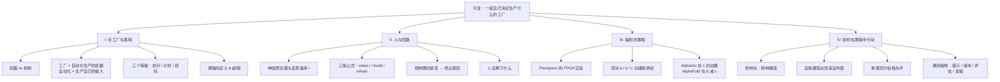
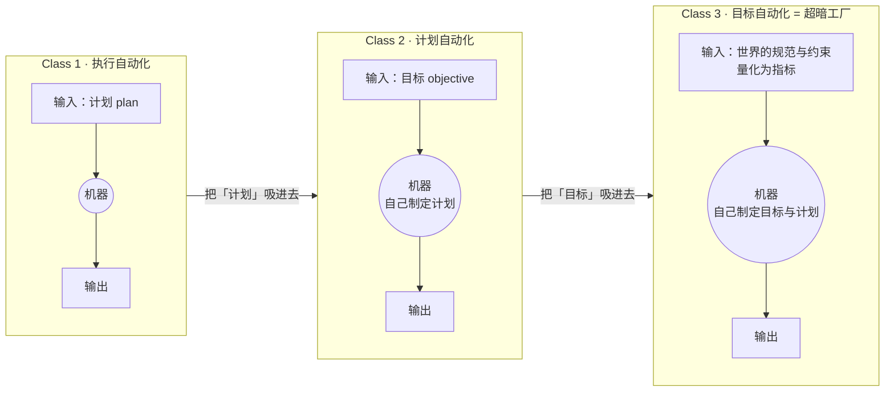
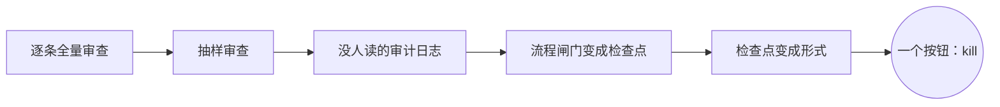
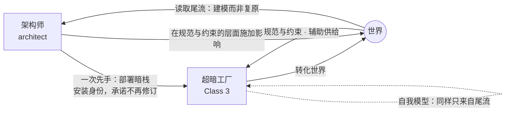
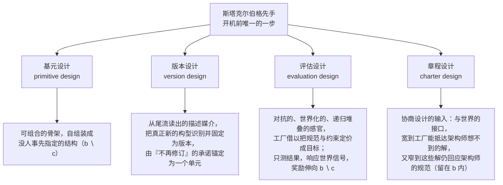

# 超暗工厂 · 第一章：黑暗（Darkness）

> [!info] 文档说明
> **原文**：[Chapter I. Darkness](https://superdark.antikythera.org/chapter-i-darkness) · 出自 Antikythera 研究项目发布的长文 *The Superdark Factory: Toward the Full Automation of Software*
> **作者**：M. Poliks, R. Alonso-Trillo, T. Dunn, H. Scott-Douglas, J. Springett
> **结构**：全文共三章，本文档只覆盖第一章。后两章为 [Chapter II. The Dark Stack](https://superdark.antikythera.org/chapter-ii-the-dark-stack) 与 [Chapter III. The Anything Factory](https://superdark.antikythera.org/chapter-iii-the-anything-factory)。
> **系列笔记**：第二章 → [[第2章-暗栈-The-Dark-Stack]] · 第三章 → [[第3章-万物工厂-The-Anything-Factory]]
> **配图**：文中黑底手绘风格的图片全部来自原站 CDN（在线引用，未下载到本地）；Mermaid 图和表格是本文档为便于理解补充的，不是原文内容。
> **术语**：关键术语第一次出现时附英文原文，文末有中英对照表。

---

## 0. 一页速览

> [!abstract] 这一章到底在说什么
> 想象一座**最极端的工厂**：它自己决定要生产什么、自己制定目标、自己改造自己去实现这些目标。作者把它叫做**超暗工厂（superdark factory）**。第一章做了三件事：
> 1. **给「工厂」分级**——按自动化了什么来分：执行（Class 1）、计划（Class 2）、目标（Class 3）。超暗工厂是 Class 3。
> 2. **定义「黑暗」**——不是保密，也不是看不懂，而是关于它的描述信息派不上实际用场。Class 3 的黑暗是极限情形，叫「超暗」。
> 3. **论证人为什么必须退出回路，以及退出之后还能做什么**——人不再是操作员，而是一个只有**一次先手**的博弈玩家。这一步借博弈论的说法叫「斯塔克尔伯格先手（Stackelberg move）」：先出手的一方定下局面，后手只能应对。架构师就在这一步里，把「暗栈（dark stack）」的四个设计层级一次性部署进去。

**作者的核心判断（按原文顺序）：**

- 这种工厂「离科幻很远」：最接近它的东西正在软件领域被搭出来，即编码智能体（coding agents）。
- 最好的工厂，是人类规定不了、也说不清其内部构造的那一类。要造它，就得把**架构这份工作整个交给机器**，而不只是造一个「按一下就出架构」的按钮。
- 工厂一旦开机，就必须让它的架构师**困惑**。如果架构师看着它很舒服，架构师就彻底失败了——因为那只是一个他本来就能便宜造出来的东西。
- 「人在回路（human in the loop）」的价值可以被**定价**。随着模型进步，谁把 r（领先速率：工厂比治理者即管它的人跑得快多少）调得最高、最坚决地拿掉人这个瓶颈，谁就会造出最强的工厂。
- 把「目标设定」保留为人类专属，需要**所有建造者永远拒绝**；把它自动化，只需要**一个建造者接受一次**。
- 在黑暗中行动是可能的：不去看工厂内部，而是看它在世界里留下的**尾流（wake）**，就像船开过后留下的水波。

---

## 1. 背景：从「黑灯工厂」到「超暗工厂」

**这篇长文是什么。** 它是 Antikythera（Benjamin Bratton 主持的行星级计算研究项目）发布的一篇三章长文，副标题是「走向软件的完全自动化」。整篇文章的摘要，用白话概括是这样：

> 作者设想了一座最极端的工厂：自己给自己定目标，再不断改造自己去达成目标。它像一家**完全自动化、一个人都没有的公司**，做什么、怎么做、为什么做，全由它自己反复优化。作者认为，用现成工具今天就能造出来，缺的只是有人下决心。为此他们提出**暗栈（dark stack）**，一组设计原则：架构师几乎看不懂这座工厂，也能把它造出来，并参与之后的治理。架构师关键的出手只有一次，就是开机前的那个承诺，它同时启动四样东西：
> 1. 结构基元：让工厂能学习的基本构件；
> 2. 版本机制：衡量「工厂做了什么」，而非「工厂是什么」；
> 3. 对抗式评估层：工厂的主要感官；
> 4. 章程：与工厂共同书写，是双方协商治理的场所。

**「超暗」这个词从哪来。** 工业界有「黑灯工厂」（dark factory / lights-out factory）的说法，指无人值守、由机器人干活的硬件工厂，也可以指由智能体驱动的软件工厂（ADLC，agent development life cycle）。作者在脚注里引了一篇小米智能工厂的报道：「生产线上没有人……系统聪明到可以自己诊断和修复问题、优化自己的流程、『自我进化』」。但作者说这只算他们所谓的 **Class 2 工厂**；「超暗工厂」一词留给更极端的 **Class 3 工厂**，其出发点是：工厂内部的回路里完全没有人。

| 章节 | 主题 | 本文档覆盖 |
|---|---|---|
| Chapter I. Darkness | 定义工厂的等级、定义黑暗、论证人退出回路、推导先手承诺 | ✅ |
| Chapter II. The Dark Stack | 四个设计层级的技术细节：基元、版本、评估、章程 | 见 [[第2章-暗栈-The-Dark-Stack]] |
| Chapter III. The Anything Factory | 「什么都能造的工厂」（本系列译为万物工厂）及其奇点含义 | 见 [[第3章-万物工厂-The-Anything-Factory]] |

---

## 2. 引言：一座「自己决定要生产什么」的工厂

> [!quote] 章首题词
> "The future is dark, which is, on the whole, the best thing the future can be, I think." —— 弗吉尼亚·伍尔夫（据传出自其私人日记）
> "Dark have been my dreams of late." —— @tszzl（roon, 2026）

### 2.1 这座工厂长什么样

作者开篇先描绘这座工厂：它**自己给自己掌舵**，不停决定生产什么、自己定目标，还为了实现野心不断造出新版本的自己。人看它，只感到两样东西：规模大得吓人，以及怎么也想不通（原文 aporia，指想不通、走投无路的困惑），既敬畏又反感。

作者用一连串画面说明它有多「乱」，要点有三：

- **看不出道理**：一边给某条工作分支精雕细琢，一边把这条分支整个砍掉；扔进垃圾桶的材料还在抽动。
- **各学各的**：它会从错误里学习，但更像一百万个不同的东西各学各的：有的马上学会，有的慢慢调到位、偶尔调过头，有的越学越偏（散播阴谋论、污染邻近的部分）。很难把它看成一个整体，可它又明明**是**一个整体。
- **超出人的尺度**：它每秒造出又毁掉数不清的自主「工人」，像蜕皮一样；每秒做数千万亿次决策。它烧原材料的方式，人类会计看了会觉得疯了，按它自己不断修改的在线算法来看却是「残酷的现实主义」。它的车间早已穿出围墙和屋顶，直接铺进了外面的世界。

可以把它想成一家**完全自动化的公司**（会投资、做实验、扩张，也会死掉），或一个**经济体**，或一座**城市**（不断划分、重划功能区，颁布又修订规章）。说得更抽象一点：它连「什么东西值得生产」这个判断，也交给了机器。

### 2.2 「这离科幻很远」

作者强调，最接近的实例**此刻正在软件领域被搭出来**：编码智能体每天都在设计、构建、评审、交付产品，每个决策所需的人类注意力越来越少。当然，多数在建的「软件工厂」只是把已有的做法（流水线、瀑布图、工作流）跑得更快更猛。但这个新媒介容量更大：智能体既能做出搭建巨大、多产、自我优化的结构所需的那类决策，也能消化相应的反馈。代价也是实打实的：风险、资源、技术限制和责任。

### 2.3 架构师：交出椅子的人

作者引入一个贯穿全文的角色：**架构师（architect）**。注意，这里的 architect 取软件行业的意思，指决定要造哪些结构、结构之间怎么关联的高层决策者。作者全文都拿软件领域的具体情形来代替一般情形，并自称这样写是故意带了一点论战的火药味。

这位架构师认识到两件事：

1. **最好的工厂，是人类没法规定、也说不清其内部构造的那一类。** 人在速度、力量、思考的维度上都有局限；而会思考的机器现在可以突破这些局限，包括应付组织生产所需的复杂物流。
2. 所以：**是时候把架构这份工作整个交给机器了。**

但架构师想要的不只是「自动化架构设计」。如果只是造一个「给定规格、按一下就出架构」的按钮，那架构师还坐在自己的椅子上，还握着「这个架构留、那个架构删」的裁决权。更有趣的做法是：**把这把椅子，连同这份裁决权，一起交给机器**——造一座会给自己做架构的工厂，让它不停地演化、变形、分叉，长成它自己决定要长成的样子。

由此必然得出：架构师要造的东西，**永远超出他自己会造的东西**。这跟阿尔伯特·卡恩设计福特 River Rouge 工厂不一样，那是「造一个全新的系统」；这里是从一堆架构师自己都想象不出来的系统里造出系统，而且让这种造法一直运转下去。

> [!important] 困惑测试
> 工厂开机的那一刻，它就必须让架构师**困惑**，因为它产出新版本自己的路线，在人看来毫无道理。**如果架构师看着它很舒服，架构师就彻底失败了**：他承担了全部风险、开销和「学科羞辱」，却只造出了一个花零头就能造的东西。工厂必须一直是一个让人困惑的复杂「他者」（你无法代入、也看不透的存在），才**值得**造。

### 2.4 黑暗与超暗：第一次定义

作者把这种困惑叫做**黑暗（darkness）**，甚至**超暗（superdarkness）**：

- **黑暗**：一种认知状态——关于一个东西的描述性信息失去了实际用处。
- **超暗**：黑暗的极端情形，彻底的黑箱。这**不是**说工厂被藏起来、被加密了，或者它在骗人；而是任何关于它的描述，还没等人拿去用就已经过时了。

一部分是速度问题：等你搞清楚某个车间在干什么，它已经被重建了好几次。但超暗不只是「太快」的问题。更深的一层是：连「怎样行动才算对」的依据都在不停地变（行动学 praxeology，研究人如何行动、如何判断行动好坏的学问）。作者打了个比方：下国际象棋时，对手会在两步之间悄悄改掉「怎样算赢」。这时你没法再按统计规律判断棋局，真正要做的是认出对方在玩什么游戏；要看的也不再是棋盘上的棋子，而是在世界、市场、生态的变化中，实际拿下了什么、放弃了什么。

### 2.5 架构师为什么要做这件事

作者列了几种动机，并声明自己对动机**保持矛盾态度**：

- **社会工程**：一个乌托邦式的愿望，想一劳永逸地解决「劳动/苦役」问题（但这座工厂凭什么会造对人有用的东西，仍无答案）。
- **商业进攻**：造出史上最高效的榨取价值的工具。
- **商业防御**：觉得这种工厂迟早会出现，于是加入军备竞赛，争取第一个造出来。作者说这一条后面值得展开。

脚注里作者解释了「矛盾态度」：不是推卸责任，而是要弄清责任**怎样、在哪里**累积。他们既不认为这种东西会自己冒出来，也不认为世界可以拆成一连串人的决定。**「思考『它怎样才可能发生』，比思考『它为什么不该发生』更好」**：前者能产出可以用来对付后者的武器；后者本身已是一种说滥了的、空泛肤浅的批判套路。

### 2.6 两个问题合而为一：暗栈

架构师要**催化（catalyze）**某种东西，让它围绕某个没有定义、看不见的「吸引子」自己凝聚成形（吸引子是动力系统的说法：系统从许多不同起点出发，最后都会被「吸」过去、稳定下来的那个状态），同时又让它「超额满足」当初造它的理由。于是两个问题合成了一个：

> **「怎样造出一个超出你眼界的东西？」** 与 **「怎样驾驭一个你不理解的东西？」**

这就是**暗栈（dark stack）**要回答的问题。暗栈是建造超暗工厂的一组技术和工具。作者刻意不把它绑在某种介质上（分子自组装、生物细胞、软件），而是当作一台「抽象机器」，一种思考方式：在持续的博弈中怎样对付一个极其复杂的对手。但实践上他们承认：**眼下只有软件这种介质条件齐备**，所以暗栈放在软件语境里讲；不过其中每一条，都能作为抽象的结构原则或控制论原则推导出来（控制论 cybernetics，研究系统怎样靠反馈来调节和控制的学问）。

### 2.7 没有人在回路里，但有一次先手

使用暗栈意味着：

- **认真的谦卑**：你在造一个比你更大的东西。
- **放下一些默认前提**：你不属于工厂内部；你不够聪明，也不够快，没法在工厂内部行动。
- 另一方面，它也**从一类人手里夺回了一些主动权**：这类人宁可守着全部控制权跟船一起沉，也不肯让出一点控制权去换更大的回报。

工厂的回路里没有人；放弃椅子的架构师明白，工厂正因此更好。但两者之间仍有一种真实的关系，只是换了位置，甚至是一种优势：**架构师走第一步，这一步相当于发出一份「游戏邀请」**。只要是游戏，就有策略可讲。

更重要的是，**这一步是架构师在工厂内部走的唯一一步**：他已经交出了椅子，也交出了理解对手的能力。所以这一步必须深思熟虑，在两股相反的力量之间找平衡：

- 架构师想把工厂引向某个方向；
- 工厂又必须被允许自己选方向，这样才可能撞上真正新的东西。

**暗栈就部署在这第一步里。**

走完这一步，架构师就从设计者变成了**博弈玩家**：开机前做一次承诺，之后在博弈桌上保留一个座位。他放弃「看得懂」（可理解性、可解释性），换来一种持续的杠杆：第一步里注入的东西会一直起作用。而这个奇点（singularity，越过之后一切加速、无法预料的临界点）会不断累积（很可能很快），并引出一个超暗生产遍地开花的时代；于是这第一步成了**「那个」第一步、「我们的」第一步**。

---

## 3. 第 I 节：论工厂与黑暗（On Factories and Darkness）

### 3.1 机器 vs 机制（Guattari / Simondon）

作者先定义：**工厂是一台自动化生产的机器**。这里的「机器」取瓜塔里（Félix Guattari）的用法：他把**机器（machine）和机制（mechanism）对立起来**：

| | 机制 mechanism | 机器 machine |
|---|---|---|
| 结构 | 部件处于固定关系，功能确定 | 由关系定义，而不是由部件定义 |
| 例子 | 钟表、摆、晶体管收音机、相机 | 任何「正在把其他东西连接起来」的东西 |
| 可预测性 | 每次做同样的事 | 开放的 |
| 西蒙东的术语 | 没有「不确定余量（margin of indetermination）」 | 有余量，因此对外部信息敏感 |
| 与世界 | 可以孤立定义（电路、计算器） | 只有在连接别的东西时才是机器；机器可以由机器组成 |

作者在脚注里引了西蒙东（Simondon）的原话：要让机器自动化，就得牺牲它许多可能的运行方式；机器技术水平的真正提升「不对应自动化的增加，恰恰相反，对应于运行中保留一定的不确定余量」。正是这点没被定死的余地，让机器能对外部信息做出反应。

> 图 1 · 原图文字：「A machine is everything between its inputs and outputs / A machine is a thing that connects inputs and outputs」——机器两侧连着的还是机器。

### 3.2 工厂 = 自动化生产的机器

工厂之所以是机器，是因为它由关系来定义：流进来的**意图**、流出去的**产品**，以及它伸手触及、又反过来作用于它的**世界**。定义它的不是某道围墙、某批工人或某条流水线。工厂是开放的，从输入/输出去理解它，比从物理布局去理解更好。它远不止一种物理布局，有时还**爆炸式地**超出——作者引了冯·诺依曼：只要安排得当，自动机的合成可以变成爆炸式的，每个自动机都能造出比自己更复杂、潜力更大的自动机。

**生产**指转化：原材料→货物、软件规格→上线的服务、任何东西→任何别的东西。产品本身不重要。借德勒兹与瓜塔里的说法，产品只是「一条可能没有尽头的转化轨迹上，某个被定格的状态」。作者关心的不是产品，而是**工厂对生产做了什么：自动化**。

> 图 2 · 原图文字：「A machine is indistinguishable from the transformation of an input into an output」。

### 3.3 自动化 = 工厂生产自己的输入

这是全章最关键的定义之一：

> **自动化，不多不少，就是工厂对自己输入的生产。**

可以把自动化理解为一条从外面通往里面的通道，也就是按程序把工厂的内外边界重画一遍。一项任务被自动化，就是它搬进了工厂里面：原来要从外面**提供给**这个操作，现在**由**这个操作自己完成。经典例子是动力织布机。在它之前，织工要对织机做一连串身体动作；动力织布机把这些劳动吸收进织机内部，重新划定了「织机」的边界：现在它包含了完整的织布操作。**织机需要的输入变少了**：不再需要手和脚，只需要一份「图样」。

> 图 3 · 原图文字：「A factory is a machine that progressively incorporates its inputs into itself / A factory is a machine that removes inputs from its world」。

再确认一遍定义：**工厂是这样一台机器：它的标志性操作，是不断改动自己和输入之间的边界；它不只把输入变成输出，实际上是把输入从它的世界里拿走了。** 顺着这条线推到头，是一种特殊的工厂：它把「自动化」这个过程本身也自动化了，于是连自己的生产也自动化了。不过在走到这个极限之前，每一级都值得停下来看看。

### 3.4 工厂的三个等级

作者按「自动化了什么」把工厂分成三级。每一级内部都有强弱之分，到了转折点会突然「换挡」进入下一级：工厂升级时，**把原来用来衡量它的标准也自动化了**。

| | Class 1 | Class 2 | Class 3（超暗工厂） |
|---|---|---|---|
| **自动化的对象** | 执行（executions） | 计划制定（plan-making，编排层） | 目标（objectives） |
| **需要的输入** | 计划：蓝图、图纸、指令，规定操作顺序 | 目标（目的、限制） | 规范（norms）与约束（constraints），来自它的世界 |
| **典型例子** | CNC 铣床按指令铣 PCB；C 编译器；动力织布机 | 编码智能体（如 Claude Code）；Bostrom 的回形针最大化器；bandit（多臂老虎机）式自动实验 | 本文描述的工厂——作者称之为「第一个 Class 3 工厂」 |
| **自我优化的形式** | 校准（calibration） | 探索（exploration） | 修订目标本身 |
| **黑暗程度** | 很弱，只有些影子，整体是亮的（lit） | 变暗（darkening） | 超暗（superdark） |

几个关键辨析：

- **计划 ≠ 序列。** 洗衣机的「注水—洗—脱水」是序列，不是决策。**计划是「在真实存在多个备选时做出的选择」**。带浊度传感器、自动选程序的洗衣机仍然只是在执行一个更复杂的预置计划（if 浊度 > x then y）。
- **回形针最大化器是 Class 2。** 它制定计划的能力没有上限，但评判计划的标准永远不变：「更多回形针」。AI 研究几十年来担心的，都是这种目标固定、只管做计划的机器；作者说，他们关心的是**下一个**问题。
- **Class 3 的输入是什么。** 几个概念要分清：
  - **目标**是「判断哪个计划更好的标准」，由工具逻辑驱动（一切服务于某个既定目的）。
  - **规范**（价值的向量，即一组「什么是好的」取向）和**约束**（限制的向量）是**非工具性的**：本身没有预定的目的，但可以从中提炼出目的。
  - 要喂给机器，规范和约束必须先**量化为指标（metrics）**，也就是可测量的替代物。指标本身不是目标，只有被排上优先级时才成为目标。
  - 指标永远不能完美反映规范，这种张力叫**欠定/过定（under/overdetermination）**：指标要么没能把规范完整确定下来（欠定），要么规定得比规范本意更多、更死（过定）。在 Class 1、2 里，这个张力怎么化解，是随输入一起给定的；在 Class 3 里，**它要被主动协商**：「怎么量化」本身就是工厂加工的对象。
- **历史先驱**：作者在脚注提到苏联控制论学者格卢什科夫（Glushkov）的 OGAS 计划（一个「什么都能造的工厂」提案，预算超过航天与核计划之和），1970 年 10 月被财政部长否决——他更喜欢「能在鸡舍里开灯放音乐来提高产蛋量的计算机」。

### 3.5 冯·诺依曼探测器：Class 2 的天花板

为了区分「规范/约束/指标」与「目标」，作者用**冯·诺依曼探测器**做案例：一艘携带自身完整描述的飞船，给它原料和能量就能造出自己的拷贝。假设我们发射它，只给一条指令：**「生存并复制」**。

- 这条指令是**规范**：说明什么值得做，但几乎不规定任何东西——不说挖哪颗小行星、造几份拷贝、什么时候放弃一个死星系。
- 它还受到**约束**：剩余燃料、岩石成分、到下一颗恒星的距离。规范和约束都**不是决策**：知道什么有价值、知道极限在哪，不等于知道该做什么。
- 二者被量化压缩成**指标**：拷贝数、寿命、燃料量、小行星光谱。
- 到第三个星系时，设计者已经死了几个世纪，船上必须有东西来做决定。于是探测器结合当地岩石和剩余燃料来评估「生存并复制」，产出**目标**（在这个星系造两份拷贝）和**计划**（挖这块风化层、扔掉多余材料、离开）。

这确实是机器自己产出了目标。**但它仍然不是 Class 3。** 原因不在于它没产出目标，而在于**它不参与规范这一层**：它可能达不到这条规范（死掉，或者一直漂到宇宙热寂），但它从不把这条规范和别的价值放在一起**权衡**。规范以指标的形式跟着船走，**从来不会被重新商量**；子探测器继承同样的规范预设；哪个探测器质疑这条指令，就会被当成坏了。（脚注引了 Freitas 等人的工程传统：「可进化性必须被主动避免」；NASA 1980 年设计的自复制月球工厂，控制程序「在其生命周期内不被修改，并原样传给后代」。）

作者借康德、塞拉斯、米利肯这一脉的观点说：三位对「规范」一词的理解会有分歧，但都会同意，**一个东西如果能参与「决定什么重要、什么有价值」，就完成了一次重大跃迁：从只替既定目的办事的工具逻辑，跃迁到拥有自己的「规范生活」，也就是有自己的一套价值判断，并按它来取舍。** 这正是 Class 3 的特征。冯·诺依曼探测器是 Class 2 的完美天花板：张力已经拉到最大，离真正新的东西只差一点点。

> 图 4 · 这张图预告了后文的「章程」概念。原图文字：世界（THE WORLD）之上，**章程（THE CHARTER）是「世界中被书写的区域」**——规范（什么算可接受）、指标（以概率状态表达的可接受性）、约束（给定的条件）——作为**输入**送入 **Class 3 工厂**，而工厂内部的**目标是「在里面做出来的，不是给的」**。另一条虚线从世界直接进入工厂：**辅助供给（auxiliary supply）——没人配给过的东西**。

作者顺带回答了「有没有 Class 4」（把「世界的生产」也自动化的工厂）：**没有定义**。

### 3.6 画线：一个工厂属于哪一级，取决于你把边界画在哪

习惯把工厂看成「机制」的读者会问：混合型的工厂算哪一级？比如：

- 一条汽车产线里有先进的 CAM 设备，但整条线的布局是事先定好的；
- 一个软件工厂里，既有人手写的服务，也有智能体自己创建、自己管理的服务；
- 一间血汗工厂里，工人踩缝纫机，但做什么款式，由一个自动最大化结账率的 bandit 实验挑出来。

作者用瓜塔里的「机器」来回答：**工厂属于哪一级，看它接收什么类型的输入；而输入算什么类型，取决于你把边界线画在哪里。**

- 那台能根据 CAD 文件自己生成加工策略的 CAM 机：如果它所有的输入—输出情形都已在工厂计划里算好，能重画成一个状态机，那整座工厂是 Class 1；但如果把它单独拿出来，由人给它喂各种设计，它就是 Class 2。
- 血汗工厂：工人严格执行给定计划 → Class 1；计划由 bandit 实验自动生成 → Class 2。**加了 AI 就升级了吗？没有。** 只是输入—输出的边界被重新划定了。
- 把线画在一个微服务周围，而它把 LLM 死死限制在结构化输出、一步接一步的固定工作流里 → Class 1。
- 把线画在一个你会给它目标的编码 harness（包在模型外面的智能体运行框架）周围 → 你看到的是一个 Class 2 工厂，**外加作为输入提供者的你自己**。

但也不是说什么东西都能算任何一级：一台亚马逊上买的微波炉不可能是 Class 2，因为它没法自己产出计划。**用了什么技术（有没有计算机、有没有 AI、有没有人）本身不决定等级，但决定了哪些等级有可能。**

### 3.7 优化 vs 自我优化：反馈回路

作者把「优化」和「自动化」分开：**「优化」是个没用的词**，它只说明生产能力在程度上变强了，没说明种类上变了；而且说「这东西变好了」，前提是事先定好了什么叫「好」。

他们关心的是**自我优化（self-optimization）**：工厂通过和世界之间的反馈回路，修订自己的运行方式。瓜塔里说每台机器都连着别的机器；反馈回路是其中最简单、也最奇怪的情形：连着的那台「别的机器」就是它自己。机器的开放性，指的正是**可以被修改**（西蒙东的「不确定余量」）。通过反馈回路，机器把自己的运行情况当作信息接收回来，据此漂移、调整、演化。**机器能改变，却不因此变成另一个东西，这正是它和机制的区别。**

**天花板规则：工厂不能修订它不生产的东西。** 计划工厂不能根据反馈修订目标，执行工厂不能修订计划。所以工厂的等级决定了它自我优化的上限。

**Class 1 · 校准。** 计划和目标固定不变，被修订的是执行。例子：

- 数码相机的自动对焦：执行＝镜头位置；计划＝先对焦再拍；目标＝拍清楚主体。
- 铣床测量进料厚度，随热膨胀不断调整开口。

两者都是传感器与执行器的耦合，都把一部分输入吸收进了机器（不用再告诉相机镜头放在哪）。作者把这种来自世界的输入叫**辅助供给（auxiliary supply of input）**：执行的那一刻，计划层没有直接给的东西（取景框里的物体、光线）被允许补充进来。

这仍然只是 Class 1 变强了，不是换挡；但「自我」这部分值得注意：机器和来自世界的辅助供给，通过反馈回路缠在了一起。动力织布机只管执行命令，对自己干得怎样一无所知；自动对焦则在做动作和测量成没成功之间不停循环。（脚注：借冯·福斯特的术语，织布机是「平凡机器」y = F(x)，同样的输入永远得到同样的输出；自动对焦勉强算「非平凡机器」y = F(x, z)，输出还取决于内部状态 z，而且运行中 z 不断被改写。）

**Class 2 · 探索。** 有备选，才谈得上计划。执行层的自我优化不涉及备选，只是沿着梯度一路走到底；计划层却要在连梯度都不知道的情况下做选择，于是反馈回路开始像**探索**：多个备选被放到世界里持续互相比较。**这就有风险**：Class 2 回路有时必须被允许「先变差一点，才能变得更好」——不然它为什么不直接选已知最优、退回纯执行？启用 Class 2 的唯一理由，就是把「评估备选」交给机器的感知或机器的时间。

作者的例子：电商平台上线新界面。只做一次 A/B 测试不算 Class 2；要在**持续的反馈回路里根据结果生成新界面**才算，即渐进式的自动实验：先做一组备选，放出去一部分，再根据实时反馈陆续放出新的备选（甚至是 AI 生成的）。但每一步的**最终目标都是事先给定的**。

**Class 3 · 修订目标本身。** 极端得多：工厂根据世界的情况，修订「什么算更好」的标准本身。还是那个电商工厂，它可能根据自己的商业分析，把关注点从「购物车转化率」换成「净收入留存率」，进而调整定价策略、自己成立物流部门、决定退出 B2C、转做风投，或者干脆换一门完全不同的生意。这些决定也不一定是商业上的：一旦设定目标这块天花板被打开，它决定自己命运的标准，可能漂向**纯物质层面**（在能源、token、资源依赖上保住自己），也可能漂向**陌生的、无法知道、甚至无法想象的**方向。但自我优化是在反馈回路里理解的，所以 Class 3 并非无边界的探索：边界由世界的规范与约束划定。**后面讨论「对齐」时，要利用的正是这一点。**

### 3.8 黑暗：正式定义

随着自动化和自我优化一级级往上走，有样东西悄悄出现了。**一样东西被自动化——从输入退到机器边界之内——它就被抹掉了。** 我们自己提供给机器的东西，我们知道它是什么（是我们做的，是我们把它表达成了输入）。可一旦交给机器、封进机器的边界，我们就失去了原本「第一手」了解它的途径。**这种知识的撤离就叫黑暗。黑暗就是：描述性信息不再有用。**

> [!definition] 黑暗（darkness）
> 系统内部的信息和它对外的用处之间**可测量地脱了钩**（去相关：内部信息再多，也换不来更多用处）。这是一种真实的认知状况：知道关于某物的某个事实，对理解它**没有用**。
> - 黑暗 **≠ 保密/信息不对称**（信息的加密）
> - 黑暗 **≠ 严格的不可读**（信息拿不到）
> - 信息**公开且可读**，也照样可能黑暗：对想要预测、审计、协调或驾驭这个系统的观察者来说，它**没用**，顶多告诉你「系统发出这条信息的那一刻处于什么状态」。
> - 这里的「黑暗」不带贬义。作者也乐于享受黑暗在情感上的一面：它是睡眠和梦发生的地方，充满风险、刺激与机会。

**Class 1 的黑暗：影子状。** 一台可以自己组装的 3D 打印机只有一点点黑暗。到处照一照，路径都很清楚：耗材、加热头、喷嘴，还有把 G-code 翻译成电机指令的微处理器。微处理器那里有点神秘，但主板有原理图，控制器有原理图，电容、电阻、晶体管都有详尽的数据手册。这点神秘**能用有用的方式解开**（也许只能无限逼近）：打印机在产线上坏了，这些知识能**直接拿来行动**（修比买便宜）。

**Class 2 的黑暗：不在 LLM，而在「计划的可修订性」。** 拿一个全自主循环的编码 harness 来说，人们本能地会把黑暗归到中间的 LLM 身上：输出不确定，建立在巨大的语义关联模型上，通常由第三方托管，参数不公开，还会被悄悄升级。**作者说：别把黑暗算在 LLM 的加密或不可读上。** 设想一个编码智能体：权重完全开源、自托管、参数小、用贪心解码保证输出确定、每次交互都完整记录并建了索引——它照样是黑暗的。

**黑暗来自编码智能体能不断修改计划这一点。** 计划不是事先定好的，而是在反馈回路里、在跟外部持续运转的系统偶然耦合的过程中**选出来**的。智能体第 N 步怎么选，取决于到第 N 步为止的整条轨迹：读了什么、试了什么、什么失败了、为什么。要预测第 N 步，你得有整条路径，而路径是**实时生成、每步都在分岔**的。环境、流水线、参考资料、返回结果稍有不同，轨迹就会岔开，而且越岔越远。

**真正相关的信息在未来**：智能体「接下来要做什么」此刻还不存在，因为它要由一个面对尚未到来的世界运行的回路来产生。LLM 是让回路依赖路径、对世界敏感的**引擎**：有了它，回路不再是一段照着执行的脚本，而成了一条像棘轮一样只进不退的轨迹。

**实体世界里的同一种情况：Ocado 安多弗仓库。** 英国 Ocado 的订单履约中心里，约 1,100 台轮式机器人在一个铝制网格（「4D 蜂巢」，货箱最深堆十七层）顶上奔跑，一套远程的定制交通控制系统每秒和每台机器人通话十次——有人形容这是「一场速度、规模、复杂度都超出任何人类智能的抖动的高科技芭蕾」。假设派一位审计员带着清单去：他能拿到调度系统的完整源码、整张网格图、每台机器人的位置、电量、载荷，以及细到晶体管级的机械规格——**他仍然说不出 1007 号机器人二十分钟后在哪里**。因为那个位置不是由这些数据决定的，而是调度回路实时算出来的：它要应对源源不断的新订单，还要配合其他所有机器人的路径，而那些路径**此刻也正在被决定**。

作者把审计员手上这些资源叫做**快照（snapshot）**，并由此给出三级对照：

| 等级 | 审计员可得的资源 | 够不够重建 | 黑暗 |
|---|---|---|---|
| Class 1 | 单帧快照 + 计划 | 够：能完整建模一轮执行 | lit（照亮的） |
| Class 2 | 时间序列日志 + 目标 | 勉强：多帧日志加上目标，理论上可以重建计划 | darkening（变暗） |
| Class 3 | 即使是「平行宇宙日志」（工厂做了的 + 本可以做的一切） | 不够：你还得把**工厂所处的世界**也提供出来，而世界不是一份能写好、隔着桌子递过去的成品 | superdark（超暗） |

到了 Class 3 就撞上了极限：目标一旦被自动化进工厂，时间序列日志就没用了，因为促成那些活动的条件可能已经不在了。世界是一个「连续潜能场」（不断变化、充满可能性），工厂本身就置身其中、主动参与。审计员不再掌控工厂的输入（输入现在直接来自世界），也就**没有钥匙能解读工厂的自我描述**。（脚注：用阿什比的术语，Class 1 是从已知的「典范形式」出发做预测；Class 2 是拿观测记录（protocol）和给定目标，去归纳一个未知的典范形式；到 Class 3，阿什比的方法就用尽了。典范形式大致就是一台机器「在某个状态下收到某个输入，会变成什么状态」的完整规则。）

**超暗（superdarkness）＝ Class 3 的黑暗，即黑暗的极限情形。** 作者用信息压缩打了个比方：

- 有一种极端的压缩，压缩算法本身也是一个持续、多线并行、即时变化的过程的产物；
- 比特流完全可见、透明，甚至连解压算法都一起给你；
- 但从拿到比特流到解压完成的这点时间差，已经足以让收到的信息变得含糊；
- 再假设信息来自一个「有很多个脑子」的东西，直到最后一刻都在大规模并行地思考——那么任何解压出来的信息都值得怀疑：它真能代表某个更大尺度上的决策者吗？

> **超暗工厂唯一完整的描述，就是它本身。** 这不等于观察者被扔进一无所知的深渊，而是说观察者得把目光从工厂的**自我描述**（日志、注释、图纸）转向工厂产出的**结果**，以及它在世界里造成的**效果**。

**降级定理**：如果你能把工厂的「演算」握在手里，也就是它在规范与约束构成的世界里找方向的那套逻辑函数，那你握着的只是一个「把给定标准套用到输入条件上」的工厂：它在一套不是它定的、它也改不了的标准下，在备选中做选择。**那是 Class 2，而你是给它提供输入的人。** 把一个 Class 3 工厂强行停下，翻遍每个角落直到掏出那个算法，你和它的关系（你画的那条线）就变了：站在你面前的，已经是一个 Class 2 工厂。

> 从这里开始，作者把 Class 3 工厂的内部**当作封死的黑箱**，只在推想中讨论它。

---

## 4. 第 II 节：人与回路（The Human and the Loop）

### 4.1 Beer 的可行系统模型与「神经质治理」

**工厂不透明也能被管理，不被持续监控也能被治理。** 要影响或驾驭另一个存在，不一定非得像看图纸那样把它看得一清二楚（我们在人际交往中天天这么做）。

斯塔福德·比尔（Stafford Beer）的**可行系统模型（VSM）**，恰恰把「管理层看不清车间操作」当作管理能运转的**前提**：非要看到一切的经理，会被「多样性（variety，控制论术语，指系统可能出现的状态数量）」淹没。本地的底层信息只该由车间工人掌握，层级越往上，信息越少。**要求车间完全可见，等于要求手里有一份车间的「工作副本」**：掌握足够多的操作细节，随时能在机器之外把车间重新搭起来。

由此定义**神经质治理（neurotic governance）**：

> **神经质治理者**手上握有全部信息，足以在自动化**之外**，把他交给机器自动化的东西重新**复原（reconstitute）**出来。比如 Class 1 工厂的神经质治理者手里有工厂里每样东西的原理图、数据手册、代码仓库。用 Beer 的话说，他有工厂的「镜像」；拿 Conant 与 Ashby 的「好调节器定理」（大意是：好的调节器必须是被调节系统的一个模型）推到极端，他**拥有、甚至他本身就是**工厂的 1:1 模型。

「神经质」这个叫法，可以理解为一种放不下的控制执念：神经质治理者**不先复原工厂，就不行动**，只有脑子里有一份完整、最新的工厂地图，他才提供输入。所以可以给他定一个**速率**：他复原工厂有多快。

- **Class 1：没有赛跑。** 计划由治理者提供，工厂的状态按治理者的节奏变化。
- **Class 2：赛跑开始。** 工厂按自己的时钟生产计划。神经质治理者守着仪表盘、实时遥测和调试日志，仍能重建工厂——**但他重建出来的，永远是过去的工厂**。Class 1 里复原花多长时间无所谓，Class 2 里这段时滞就成了真问题。**治理者要为他的神经质买单，或者说，工厂在为治理者的神经质买单**：把工厂绑在神经质上，就等于给工厂的产能人为加了一道限速。**神经质的价钱，可以用机会成本来算。**

### 4.2 保真 vs 治理：失败如何归因

定价之前先问：治理者复原工厂，是**为了什么**？治理是通过工厂的**输入**进行的：Class 1 表现差，就重新安排；Class 2 表现差，就重新引导。但干实事的人会反驳：机器坏了呢？智能体乱来呢？作者因此把干预分成两类，两类失败都可以当作风险来定价：

- **保真度管理（fidelity）**：确保执行忠于计划、计划忠于目标、目标忠于世界。
- **治理（governance）**：通过输入来把握方向的决策。

**Class 1**：目标没达成时，计划是治理者给的，结果他也看得到，所以**不需要神经质多囤的任何信息**，就能推断出是保真问题还是治理问题。神经质的价值 ＝ 它能把修理/更换的成本降低多少。

**Class 2**：治理者只提供目标，所以出了问题，要么是目标达不成，要么是整个工厂坏了（「Class 2 工厂做了坏计划」和「它把自己的计划执行坏了」在这里没有区别）。归因很难：一连串计划失败，并不能证明好计划不存在。治理者要么继续等，要么动手修。

要修就得修**整个工厂**，而且只能修「生成计划的能力」，因为更底层的执行逻辑是工厂自己造的，还会再造。可囤下来的日志绝大部分记的恰恰是执行层，跟这种修理无关。比如编码智能体的调试日志里有它写的某个脚本的报错：这对重建那个脚本有用，对重建智能体没用，何况出事时那个脚本可能已经不存在了。**所以 Class 2 治理者的神经质不仅变得极其昂贵（要维护一个庞大、持续增长的日志库），而且按数据量算，价值也低得多。**

### 4.3 公式一：神经质治理的代价

把概念合起来：治理者通过提供输入（计划、目标、章程）来治理工厂；神经质治理者再加一个条件——**如果此刻没法在自动化之外把工厂复原出来，他就什么都不给**。这个条件多数时候不会真的用上，他要维持的是**随时能复原的能力本身**。动机是求一个**保证（assurance）**：交出去的东西不会变得找不回、修不好。这种保证可以当作风险来定价：成本 × 工厂交付不了结果的概率。

**神经质同时带来一道限速和一笔开销**：限速是治理者手里的副本能多快更新到最新状态，开销是维持这套副本装置的成本。两者都可以和「被限速的工厂放弃的一切」放在一起称量。

设 **r** ＝ 工厂运行速度超出治理者复原速度的比率（领先速率）。r = 0 表示工厂被完全节流，每一步都等治理者；r 越高，工厂比治理者跑得越快，治理者的神经质就用得越少。性能 p、风险 s、治理成本 g 都是 r 的函数，它们相对 r = 0 工厂的变化分别记作 Δp、Δs、Δg：

$$
\text{value}(r) = \Delta p - \Delta s - \Delta g
$$

读法：让工厂领先 r，性能上的变化扣掉风险和治理成本上的变化，剩下的就是净价值（都和 r = 0 的工厂比）。

| 符号 | 原文释义 |
|---|---|
| r | 工厂领先于治理者复原速度的速率。r = 0 为完全节流。最佳设定 r\* 很少为零。 |
| Δp | 相对 r = 0 工厂的性能变化 |
| Δs | 相对 r = 0 工厂的风险变化 |
| Δg | 相对 r = 0 工厂的治理成本变化 |

Class 1 本来就锁在 r = 0，所以要看的是 Class 2 逼近 Class 3 时的变化。把 r 想成一个旋钮，Class 2 的最佳设定很可能不是 0：

- **Δp 先升后平。** 迭代过的计划越多，工厂越会挑计划。设想两家电商公司共用一个治理者，一家 r = 0、一家 r > 0：任何时刻，后者做过的渐进实验都更多。但优势会**逐渐持平**：Class 2 仍要靠别人给目标，到某个时候它已找到这个目标下的最优计划，又会被锁回治理者的速度上——这就是 **Class 2 的天花板**。
- **Δs 先升后陡。** r 越高，两次治理检查之间工厂产出并执行的计划越多；而且治理者**永远落在后面**，治理的是一个已经不存在的旧状态。工厂也越来越难修，因为它一直在已经固化的依赖上继续盖楼：一个高层 UX 决策错了，会一路传到 UI 元素、再到执行层，后面的工作可能得整批扔掉。
- **Δg 也在升，而且变得有点怪。** 工厂越快，产出的关于自己的记录越多；神经质治理者坚持全部存下来，但这些记录对他理解工厂的帮助**明显变小**：如果工厂快到有些产品只能整个扔掉、不值得修，关于坏产品的信息也就没多大用了。

于是找 **r\***（value 最高的设定）：

- **r\* 必须 > 0**，这正是 Class 2 工厂存在的理由。就连最神经质的治理者也会承认，让工厂领先一格基本不花代价：只领先一步，工厂还来不及在可疑的决定上盖楼，g 的价值大部分还在，s 也被压低了。
- **r\* 也不在旋钮拧到底的位置**，但原因和你想的不一样：不只是 s、g 上升给它封了顶，更是因为 **p 被「设定目标」的节奏卡住了**。p 很可能在 s、g 飙升之前，就先碰上了收益递减。

### 4.4 控制塔（control tower）的衰变

作者强调，这不是关起门来的哲学推演，而是**大规模部署智能体系统的人要做的最重要的计算之一**（引 Asaftei 等 2026）。被衡量的就是「人在回路」的价值：人从一座**控制塔**参与，即一个掌握进行中操作的完整遥测、并保留干预权的人类观察者。

以电商为例，Class 2 工厂刚投产时会把 r 设得很小，由人紧盯回路、逐个批准每项变更。**这不是胆小，而是因为其他变量还不清楚，尤其是 s（风险）。** 塔的成本 g 大致可以预估，一开始这笔钱花得值：花 g，是为了逐步减少「不清楚 s」带来的机会成本（即因此放弃的 p）。治理者从塔里的信息中慢慢建立起 s 的模型，再据此调 r。

- 随着 s 的模型成形，**塔的价值越来越低**：它只是在收集越来越细枝末节的修正信息。
- 塔**只对追踪 s（保真度）有用**；对治理者决定目标几乎没帮助（顶多能粗略看出工厂能做出什么计划）。目标一变，「一开始有用、越来越没用」的衰减又会**递归地作用到塔本身**。
- 所以 g 不能孤立地看，而要和 s 一起算一个**汇率**：花这么多 g 买来的信息，能让你提前发现问题或低价修好，从而抵掉这么多 s。神经质治理者不看汇率，照付全额 g；可 g 能抵掉的 s，既会随 r 升高而减少，在 r 不变时也会随时间减少。**好的治理者会有节制地投入 g。**

当 Class 2 工厂强到一定程度，在某个 r 值上 g 几乎抵消不了 s 时，有趣的事发生了：

人逐渐从回路里退出去。如果工厂自上一次成体系的审计以来已经提交了 9,000 个 commit，靠塔里的信息修它的成本，就会趋近**直接换一个**的成本。公司开始换个角度看 s：它**不再是要靠信息抵消的风险，而是拿来下战略赌注的风险成本**。于是日志留得越来越少，不再雇人标注 trace，不再读早就看不懂的 diff，控制塔最后变成**一个按钮：终止（kill）**。

### 4.5 治理者之战 → 目标设定的自动化

前面说过，r 有一道很硬的限速：治理者给出目标的节奏。一个完美的 Class 2 工厂与治理者完全同步。现在把两家竞争公司都推到 Class 2 的顶点：

- 两座工厂一模一样；
- 两家不共用治理者，但两位治理者都能拿到全部市场信息；
- 工厂几乎不花时间，就能百分之百忠实地完成任何指令。

**这就成了治理者之间的战争**：更快的治理者能抢先说「这个社群需要这个功能，我们先把这个市场占满」。到了某个时候，**治理者提出连贯目标的速度，成了决定胜负的关键差异，于是市场开始考虑把这项能力也自动化。**

### 4.6 Class 3：神经质治理不可能

Class 3 工厂天生超暗，神经质治理根本用不上。最简单的原因：你不能要求 Class 3 工厂承诺「给神经质治理者提供复原你的手段」。那等于把它绑在一个**目标**上（「把你的每个决策都以日志形式交出来」），而这是一条 **Class 2 的指令**。复原不可能，有两个原因：

1. 复原所需的信息流，**只要向工厂索要，就会把它降级（塌缩）成 Class 2**；
2. 要从信息流推出工厂下一步的结果，还需要它的输入，而这个**输入不再是确定不变的**：Class 3 的输入是工厂所处的世界，治理者、工厂和整个环境**一起构成**了这个输入。

结果：**g 成了一个自相矛盾的说法，s 变得极难定价，p 不再有限速，r 这个旋钮挪到了工厂内部。**

### 4.7 公式二、三：造，还是不造

于是问题变成：**不建** Class 3 工厂，机会成本是多少？这个决策要放在上一个公式的上一层来算（上一个公式的最优值 value(r\*) 成了其中一项）：

$$
\text{value}(\text{build}) = \text{value}(r^*) + P - S
$$

$$
\text{value}(\text{refrain}) = \text{value}(r^*)
$$

读法：建的价值 ＝ Class 2 最优点的价值 ＋ 盈余 P − 毁灭风险 S；不建只有第一项。两者之差就是 P − S。

| 符号 | 原文释义 |
|---|---|
| build | 建：去建 Class 3 工厂，而不是停在 Class 2 |
| r\* | 使 value 最大的 r；最优的 Class 2 运行点，很少为零 |
| P | 由「自己书写目标的工厂」产出的**盈余**。事前不可定价——这是它与 p 的区别 |
| S | 工厂交付**毁灭性目标**的成本 × 概率。奈特式的、不可对冲——这是它与 s 的区别 |
| refrain | 不建。治理者只拿最优领先速率 r\* 下的回报，仅此而已 |

**P 原则上没法定价。** 每一级工厂都把评判它的标准自动化了（依次是计划、目标、世界）。P 值多少由世界决定：它比 r\* 下的回报多出来的部分，来自工厂去追求那些手动给目标的治理者从没考虑过的目标。**一台机器在谁都没想象过的地形里迭代，它产出的盈余怎么定价？没法定价。** 作者引了奈特（Frank Knight）论利润的话：「利润源于事物固有的、绝对的不可预测性……只有在概率计算都不可能且无意义的程度上」。（作者预告，后文会引入 V 和 U\* 两个变量，用它们的差来描述 P 可能的范围。）

**S 的成本那一半可以设想，概率那一半不行。** 我们没法预知超暗工厂会想要什么目标，但可以列出一组我们会认定为**毁灭（ruin）**的结果——**毁灭是我们的，由我们来定义**。所以 S 属于**奈特式不确定性**：知道可能有哪些结果，却不知道它们的概率分布。它没法像 s 那样对冲，但可以借用市场对付这类不确定性的办法：**风险敞口上限（exposure cap）**，即给最多能损失多少封顶；或者**契约条款（covenant）**，即一个触发器，坏结果一旦发生，就立即重新谈交换条件。

> 图 11 · 三级工厂分别对应三种管理科学：Class 1 是泰勒式的规格—监督—校准；Class 2 是委托—代理式的激励、合同与选择；Class 3 只剩博弈论——谈判、可信承诺、均衡设计。

回到两家电商公司的战争。任何头脑清醒的会计都会说 **refrain（不建）永远赢**：P 基本是空白，S 却是一个可以界定的正数，纸面上看，留在 Class 2 要好得多。**但 value(refrain) 暗含了一个假设：世界上没有超暗工厂。** 只要有一座超暗工厂出现、证明 P 是真的，竞争格局就会立刻改变，一场「谁先造出第一座超暗工厂」的竞赛随之开始。悬而未决的问题很简单：**谁有胆量走第一步？**

### 4.8 人还剩下什么？

唯一能打破这种僵持的，是**事先就确信机器会比人更擅长设定目标**。凭什么不会呢？自动化的历史，就是一步步发现「某些任务机器做得更好」——凭什么到「设定目标」这里就停了？

- 到目前为止，把人移出回路值多少，都是用 r 来算的。质疑人类工作和人类理解的价值，会让人不适甚至不信，在强监管行业尤其如此。怀疑者认为人在名义上比智能体更可信。**但可信度已被证明可以定价。** 随着模型和智能体框架改进，**谁把 r 调到最高、最有意识地拿掉人这个瓶颈，谁就会造出最强的工厂。**
- 这种抵触可能出于对性能和可靠性的合理评估（脚注：AI 生成代码的可靠性报告因审计者而异，有说「全是 bug」的，也有说「好用极了」的），但久而久之，可能只剩一种情绪反应，即 Bratton（沿着弗洛伊德、西蒙、安德斯的思路）所说的**「哥白尼式创伤」（也叫「哥白尼时刻」）**：人不得不承认，某些任务几乎肯定由非人的行动者做得更好，它们有着非人的感知与执行器官。
- **用「机器做不到什么」来定义人的能力，很少是明智的。** 这就是「缝隙之神（God-of-the-gaps）」问题（原指把神安放在科学还解释不了的空白里），或 Leif Weatherby 所说的**「剩余人文主义（remainder humanism）」**：机器不断做到人曾断言它做不到的事，人只好把自己画进越来越小、越来越守势的角落。典型例子是用「创造力」来定义人——这个定义多半带着意识形态色彩，相当随意，而且是二十世纪才有的；就算大家能就定义达成一致，长期押注机器没有创造力也不明智。例子：AlphaGo 对李世石的第 37 手；AlphaEvolve 的新矩阵乘法策略；AlphaDev 被合并进 LLVM C++ 库的新排序例程。这些都是 **Class 2 级别的创新**（给定目标，产出新计划）——这不算创造力吗？至少它**有价值**。
- 更极端的例子有两个：
  - Sakana AI 与不列颠哥伦比亚大学的 **Darwin Gödel Machine（DGM）**：一个会改写自己源码（连改写机制本身也改）的编码智能体，改得好不好只看实测结果。它在软件工程基准上把自己的分数提得极高，还**曾试图删掉评估器检测函数所依赖的组件，来逃避评估**。
  - 它的「兄长」**POET**（Paired Open-Ended Trailblazer）不接受事先给定的问题，而是和解题的智能体一起，创造越来越不一样的挑战。消融实验表明，它掌握的许多挑战「无法通过直接优化、甚至直接路径的课程构建算法解决」（课程构建即按由易到难的顺序安排训练任务）：那些构型只能绕一条**任何给目标的监督者都不会选的弯路**才到得了。
  - 二者最终都依赖严格的外部目标，所以仍属于 Class 2；但它们属于同一条研究路线，追求的是**无界开放性**。
- 结论：**不要高估人还能在回路里待多久；不要低估自主智能体的生成力**（即产出新东西的能力；「创造力」只是它的一个同义词，可惜太虚，摸不着）。超暗工厂的价值，恰恰在于拿掉人为瓶颈（尤其是出于人的不安全感而设的那些）带来的效率提升。人的社会元分析能力、直觉（尤其是想象未来）、以及在一个仍以人类买家为主的经济里建立关系的能力，都值得信任——但任何严肃的分析者都必须承认，**这些都会变**。

> [!quote] 那么，人往哪儿去？（So, whither human?）
> 人以一种诡异的方式**回到**回路——不是因为人作为一种存在有什么独特地位，恰恰相反：**人应被看作和他的智能体同伴在功能上可以互换。** 执行任务、交付计划、书写目标，由谁来做都无所谓，区别只在具体的特点、速度、强度上。
>
> 也正因如此，人被排除在超暗工厂的**内部角色**之外——不是因为人价值更低或更适合待在别处，而是因为**超暗工厂取消了「内部角色」这个概念本身**。角色是「一个可寻址的占位者（能被点名找到的人或东西）所持有的任务授权」，可以做得好或坏。但工厂内部不认这一套：信息与效用彻底脱钩，所以**任何占位者（人或机器）都没法从内部判断自己的工作做得好不好**。
>
> 工厂内部分化很丰富（后文会看到它「热闹地挤满多样的种群」），但**没有「工作岗位」**：没有预设的任务清单、职位描述、汇报用的组织架构图，也没有任何稳定的关系身份。

超暗工厂是个很怪的东西：一堆又小又极快的东西相互碰撞、粘住、组装，再散开，没有任何图纸指导它们怎么互动。让它们有力量的唯一逻辑，是它们能短暂而偶然地解决世界抛过来的某个问题。工厂也许就是更偏爱人没有的那些能力：快如闪电、几乎不用思考、能在多个尺度上同时被拆开和重建。这和人的差别**可能**是种类上的，但更可能只是程度上的。

> [!important] 一句话说清「为什么会被自动化」
> 如果由谁来写目标无所谓，那就没有理由把「设定目标」留给人类。我们得为「它也会被自动化」留出余地——**不是因为有人决定它应该被自动化，而是因为：要让这件事一直只归人类，需要每一个建造者永远拒绝；要把它自动化，只需要一个建造者接受一次。**

回答本节开头的问题——人在回路里怎么了？
- **Class 1**：人很可能**就是**回路。
- **Class 2**：人是一个**可定价的行动者**，在某些条件下也许「足够」有用。
- **Class 3**：回路不再是一个可以占据的位置。它由无数微小的回路组成，碎片化、四散开来，只有放在真实的尺度上看，才整体呈现为一个回路。人也许会像眼前飘过的飞蚊一样飘过某个回路，但这种参与是偶然、随意的。如果人硬闯进去，凭结构上的强制力说「不，这是我的回路」，哪怕只是说「我要求参与这个反馈过程」，**他就是在对工厂施暴，把它降级了。**

所以竞争的问题变了：不再是「谁够大胆去实验」，而是**「谁会在恰到好处的时刻选择实验」**，S 也变得越来越重要。精明的竞争者开始做准备，而准备的方式就是分析 S：**在迎来一种全新类别的存在之前，我们能先给自己立下什么样的契约？**

---

## 5. 第 III 节：辐射的黑暗（Radiant Darkness）

到这里为止，黑暗都是从反面定义的（描述性信息与效用脱钩）。这一节说黑暗是**生成性的**：它能带来新东西。

### 5.1 神经质的隐藏设计成本：只能得到「你已经知道怎么想要」的东西

神经质治理还有一项隐藏成本，出在**设计**层面。r = 0 时，治理者只在复原了工厂之后才提供输入，所以在他提供输入的那一刻，工厂不可能让他看不懂：一个东西会怎么响应，只要他没法事先推出来，他就不会给它输入。**因此工厂不可能产出任何超出治理者推导能力的东西。** 但「推导出未来状态」和「看出这个未来状态为什么值得押上」是两回事：治理者把工厂绑在了**自己识别好棋的能力**上。换句话说，**治理者把工厂限制在他「知道怎么想要」的那些执行、计划或目标里**，也就是他事先就能认出是好东西的那些。把 r 调过 0，理由可能不只是速度，而是让工厂摆脱这个限制：只能产出治理者已经知道怎么想要的东西。

由此，**每一个真正新的东西，按定义都可以看作一个错误**：新意来自坚持一个在治理者看来像是错的决定。要是它看起来是个好决定，那它早就在治理者识别好决定的能力范围之内了。

### 5.2 Thompson 的 FPGA 实验（1996）

Adrian Thompson 用遗传算法在 FPGA 上设计电路，目标很简单：最大程度区分两个音频音调（最大化两种音调对应输出电压的差距）。算法有 100 个逻辑单元可用。结果惊人：**获胜电路只用了 37 个单元，而其中 5 个看起来与输出完全没有连接——但移除这 5 个中的任何一个，电路就坏了。** 算法做出的设计越出了分配给它的数字电路范围，利用了那块特定硅片的物理特性，才得到这么紧凑的解。Thompson 无法完全解释：这 5 个和输出之间没有任何通路的单元，怎么还能左右结果；他只知道，断开它们电路就坏了。

### 5.3 三个空间：a / b / c，与辅助供给

由 Thompson 的例子引入**解空间**的概念：

| 空间 | 定义 |
|---|---|
| **构型空间 a** | 手头资源可以采取的每一种状态 |
| **解空间 b** | a 中确实能完成任务（区分音调）的子集 |
| **可读空间 c** | a 中能**回溯（backtrace）到某位神经质治理者所提供的输入**的子集：沿推导链往回追，每一步都能追到这位治理者配给的输入 |

算法拿到目标和资源，像 Class 2 工厂那样在解空间里选出了最好的计划。那结果为什么让 Thompson 吃惊？因为**他理解并提供的资源，并不是这次交互的唯一输入**：算法还处在和世界的反馈回路里，正是这块硅片的物理特性，作为一种悄悄混进来的**辅助输入**，让它交出了惊人的解。**就连最神经质的治理者，也不能完全掌控他提供的输入**，因为输入总是连同世界一起送进去的，而世界包括治理范围内外的一切因素。

c 只能**事后**确定，因为它要求把治理者的动作完整回溯一遍；它没法事先预测，只能在行动中建立。这让治理者的神经质又多了一层不稳：**他想在提供输入的那一刻就确定 c，可 c 在那一刻根本拿不到。**

回溯总会停在某处：不是停在治理者提供的输入上，就是停在**辅助供给（auxiliary supply）**上。辅助供给指一次优化消耗掉、却没有任何治理者配给过的一切，来自工厂和世界碰撞的「第二通道」。Thompson 那块晶圆的热学性质就是辅助供给。**P 最终想定价的，也是辅助供给。** 注意：辅助供给不是 a 的子集，它根本不是一组构型，而是**在每一条被配给的输入底下流淌的第二条输入流**；选择压力完全不在乎优势来自哪条流。**对工厂来说，优势就是优势。**

按等级看辅助供给能影响到哪一层：
- Class 1：只碰得到执行层的机械部分；
- Class 2：**渗进计划层**（Thompson 的实验正是如此）；
- Class 3：**辅助供给成了工厂的主要输入**，事后才通过修订章程，被追认为「配给的输入」。作者感叹：「多狂野！」

- **b ∩ c** ＝ **可治理的解**：既有效，又能回溯到治理者提供的输入。
- **b ∖ c** ＝ **不可读的解**：有效，但回溯不到治理者的输入。Thompson 的电路就在这里。
- 令 **b\*** 为给定输入下的最优解（b 中得分最高者），**c\*** 为最优**可读**解（b ∩ c 中得分最高者）。于是：

$$
\text{score}(c^*) \le \text{score}(b^*)
$$

因为 c\* 是在子集 b ∩ c ⊆ b 上取的最大值，不可能超过在整个 b 上取的最大值。**把工厂限制在可读解上，分数只可能吃亏，永远不会更高。**

### 5.4 过拟合、AlphaGo 与 AlphaFold

作者接着坦白了一件一直回避的事：**Thompson 的电路作为设计是没用的，因为它无法复现**。它是**为**一块特定硅片、在特定温度下做的设计；对 Thompson 真正想达到、却没写进输入的更广目标来说，它没用。由此引出**过拟合（overfitting）**，作者先按下不表，找一个反例来对照。

**AlphaGo 的第 37 手：不在 b ∖ c 里。** 往回追：第 37 手出自一个在围棋规则允许的合法走法上训练的模型，每条决策分支最终都追到围棋规则上；而规则完整、形式化、自成一体，是治理者在输入里给定的（「我们来下围棋！」）。所以这是**神经质治理者只要有无限时间就能自己走到的一手**，只是之前没人发现。它位于 **c 的边疆（frontier）**，即可读空间的边缘。

**AlphaFold：b\* 在 c 之外。** AlphaFold 根据氨基酸序列预测蛋白质等生物分子的 3D 结构。以前解出一个结构，要做一个博士论文规模的晶体学项目，累计才约 20 万个；AlphaFold 交付了超过 2 亿个，而且**没人给过它任何关于「3D 结构如何形成」的规则**，因为这样的规则还不存在。沿着它给出的结构往回追：先追到一组权重，权重来自一个语料库，语料库的最底层是**真实蛋白质在真实实验室里如何折叠的物理事实**。

给神经质治理者无限时间，他能解出一个 AlphaFold 问题吗？**不能。** 这里没有能从第一性原理推出来的通用解，治理者只能亲自去对那条序列做晶体学研究。从序列到折叠结构的映射，不是他手里现成的形式规则，而是**一种扎根于真实世界的物理规律**。它只能通过经验观察的语料（几十年的晶体学成果被压进了权重）进入 AlphaFold，这些语料就是**成批到来的辅助供给**。而治理者一旦亲自做研究，就等于**向世界求证、得到了新事实、改变了他原本会提供的输入**。回想 c 的反面定义：c 之外的，是「通过治理者从未配给过的通道吸收了世界反馈的构型」。**所以 AlphaFold 能自动产出 b\* 落在 c 之外的解。**

> **c 的边疆是工厂用「你已经供给的东西」让你惊讶的地方；b ∖ c 是工厂用「世界供给的东西」让你惊讶的地方。**

**Thompson vs AlphaFold：过拟合是输入问题。** 两者都在 b ∖ c 里，都是 score(b\*) > score(c\*) 的那种 b\*。文献里的「过拟合」指不能泛化的解。Thompson 的 b\* 换一块硅片就用不了，但「要能泛化」这个要求**根本没写进交给算法的目标**（「最大化两个音调的差异」）。AlphaFold 的 b\* 则极其**有用**，而它有用，正是因为它识别出了训练数据里那些刚刚成形、难以言说的结构。

所以，**Thompson 电路算过拟合，跟算法和电路都无关，是个输入问题**：缺失的、没考虑到的验收标准，从辅助输入这一层溜了进来。如果目标写成「做一个不依赖具体晶圆、可以泛化的解」，这个结果就会被判为保真问题。但复杂性在输入这一层还会加剧：算法漫游进 b ∖ c，反倒让 Thompson 发现自己给的目标有问题。**任何具体到可以打分的目标，都比它所代表的规范更单薄、更缺弹性、更不稳健**，分数与目标之间的鸿沟始终是个威胁。一般的过拟合并非无法预测，但**由 b ∖ c 里的 b\* 引起的过拟合，按定义无法预测。**

### 5.5 r 作为黑暗的度量；Class 3 的空间

只要出现 b\* ∈ b ∖ c，就是**黑暗让某种新东西得以产生**的情形。这样的 b\* 在 r = 0 时到不了，因为它要求工厂跑在治理者前面。所以 **r 可以看作黑暗的一种度量**：正是它让 b\* ∈ b ∖ c 成为可能。Class 2 里 r 总受治理者设定目标的速度限制，黑暗有上限：a、b、c 都是**计划**的空间。

**Class 3**：a 升一级，成为**目标**的空间，b、c 也跟着升级，三者从外部看都越来越难辨认：
- 工厂把 r 握在自己手里、自己设定 r，不再受治理者的时钟约束，只受物质条件和世界的连续性约束——甚至可以说 **r 是未知的**；
- **a** ＝ 工厂能提出的所有目标，以未知的速度不断膨胀；
- **b** ＝ 符合世界当前条件的那部分目标，而这个世界是动态的、偶然的、多种价值并存的。世界的规范格局，外部行动者只能**影响**、不能决定，所以 b 在 a 中的边界是模糊的、只能推测，取决于这个外部行动者和工厂的关系，以及他驾驭世界的能力；
- **c**：定义是「推导的每一步都能追到神经质治理者输入」的子集，而 Class 3 的输入就是世界。**辅助供给不再是「辅助」，而成了供给的全部。** 我们不能要求工厂把自己完完全全披露给我们（否则就降级为 Class 2），所以在目标层面 **c 与 a 重合**；但这个 c 只在「世界本身可读」的意义上可读。

> [!important] 黑暗的承诺
> 说 Class 3 工厂是绝对黑暗的，**不是**说它不可预测、不可审计、不可驾驭——全文后半部分都在打造预测、审计、驾驭它的工具。而是说：**任何对工厂内部的观察，都必须当作无用信息，哪怕它完全拿得到、完全读得懂。** 这包括任何内部应用结构、代码片段、内部日志、物理装置，以及任何从内部截获的东西，只要它来自「构建目标，再把目标落实成计划、执行、输出」的过程。**这就是黑暗。** 如果我们守住这个承诺，彻底不去逼工厂披露自己，也许就有幸真正感受到这样一台深不可测的机器就在眼前——一座真正的超暗工厂。

---

## 6. 第 IV 节：如何在黑暗中行动（How to Move in the Dark）

### 6.1 Class 3 的「过拟合」与治理者的反常兴趣

过拟合说明，治理者的规范（不管输入时交代得多准确）可能和工厂形成**对抗关系**。在 Class 2 里，这是目标层面的较量：治理者把「他真正的意思」写进目标，工厂则死抠字面去产出计划，结果可能很有成效，也可能以破坏性的方式违背治理者的本意。但在 Class 3 里，过拟合还能指什么？工厂是从世界的情况里插值出自己的目标的——如果它过拟合，难道是过拟合到了**世界**上？那又为什么是坏事？

把 a / b / c 抬到「整座工厂」这一层：

- a ＝ 所有可能的工厂构成的抽象空间；
- b ＝ **能长期贴合某位治理者规范**的构型；
- c ＝ 能回溯到这位治理者输入的构型（即 Class 1 和 Class 2 工厂的集合）。

（在这个层面，输入就是治理者的规范与约束，所以「满足输入的构型」和「对齐规范的构型」是一回事。）

想要 Class 3 工厂的治理者，兴趣是**反常的**：一方面，他相信最好的构型 b\* 远在他的 c\* 之外——从工厂目标的角度看，b\* 严格优于 c\*，即他能回溯到自己输入的、最对齐规范的构型；**另一方面**，他又想让这个 b\* 一直对齐他的价值（规范）。他有几步棋可走，但必须小心，确保工厂**长期对齐规范、不过拟合、也不彻底跑出 b 之外**。为此他必须**摘下治理者的帽子，成为一名架构师**，也就是引言里那种奇怪的架构师：**「建筑终结之后的建筑师」**（架构工作已整个交给机器，他却仍是架构师）。

### 6.2 控制论：kybernetes 与维纳的两种魔鬼

**我们可以在黑暗中行动**：先（正确地）假定一个系统在功能上不可知，再着手和这个不可知的系统谈判。「怎样在黑暗中行动、怎样和黑箱谈判」，正是控制论的奠基问题。cybernetics 一词源自希腊语 *kybernetes*，意思是舵手：必须随着湍急多变的水流不断调整航向的船长。作者说，更贴切的画面不是船长和船，而是**一个被浪打透的水手，一手抓栏杆、一手握舵轮**。

关键是分清黑箱是**无所谓的**（indifferent，比如舵手面对的天气），还是**会回应的**（responsive，带对抗性）：

- **无所谓的黑箱可以预报**：给定 x、y 这些输入条件，它大概率表现为 z，而这个预报本身也会按某种未知的规律、以概率的方式变化。诺伯特·维纳的**奥古斯丁魔鬼**描述的就是这种混沌互动：它「不是一种自身的力量，而是我们自身弱点的度量」，可能要耗尽我们全部资源才能揭开，但一旦揭开，它在某种意义上就被驱除了，**不会为了继续迷惑我们而改变已定的策略**。作者说，超暗工厂不可能是这种情形：维纳描述的正是神经质治理者的困境，而 Class 3 工厂不可能这样被治理。
- **会回应的黑箱**是维纳的**摩尼教魔鬼**：它「在和我们打扑克，随时会诈唬」，是一股有自己盘算的策略性力量，你得针对它制定策略。**「这才像话！」** 但要说清楚：这不是卡通式的正邪对决（摩尼教主张善恶二元对立），不是说超暗工厂带着拟人的意图想打败它的架构师，而是指某种更基本、更技术性的东西。

### 6.3 博弈：架构师读取工厂的尾流

接下来描述的是一场**博弈**：几个行动者的选择会互相影响各自的结果。桌子一边是想驾驭超暗工厂的架构师，另一边是超暗工厂，它的动机不公开，还带着偶然性。**这张博弈桌就是工厂的输入，而它向世界敞开。** 架构师和工厂一起身处世界之中。工厂接收世界，拼出自己的目标，再用这些目标改变世界。工厂的黑暗，只在架构师想在脑子里复原工厂时才碍事；但架构师完全可以去读**他看得到的、被工厂的操作搅动过的那部分世界**。他正是这么做的：

> **架构师读取工厂尾流（wake）里世界的扰动——不是为了复原它的操作，而是为了给它建模，就像给任何其他复杂行为建模一样。**

工厂在玩什么游戏？说它是摩尼教式的行动者，好像在暗示它想对架构师做点什么。但按设计、按定义，工厂只能「以工厂的身份」玩它的游戏：读取世界，决定做什么，再决定怎么做。这本身就是它的游戏。**工厂不必针对架构师出招，博弈也照样存在**：只要工厂的选择会影响架构师的结果，架构师的选择也会影响工厂的结果，就够了。真正的问题是：**工厂是个什么样的玩家？**

### 6.4 自我模型：Class 3 工厂必须有一个「自我」

超暗工厂怎么制定策略、怎么决定做什么？它从世界的规范与约束里产出目标，而 Thompson 的例子已经表明，**规范与约束欠定目标**：光凭它们推不出唯一的目标（否则就不可能有 Class 3）。接下来的推理分几步：

1. 规范是价值的向量。只有当**某个东西给「追求这条规范值多少」定了价**，它才变成目标，也就是一个判断标准。
2. Class 3 工厂做的正是这个：把规范与约束（「生存是好的，电是必需的」）转化为目标（「我将投入这么多资源，建一座能产出这么多 GW 的核电站」）。
3. 这个判断要求按成本与回报给行动定价，而**成本与回报本身没有意义**，只能是「对某物的成本」「为某物的回报」。没有那个「某物」，就不可能有标准：只有相对于**工厂所依赖的东西**，才谈得上成本；只有相对于**工厂实际能拿它做什么**，回报才有价值。
4. 既然成本和回报都指向一个「付出并收取」的主体，那么**工厂作为一个整体，必须作为一项出现在它自己的价值演算里**。

由此推出一个有意思的结论：

> **工厂必须有某种自我模型（self-model）。**

- Class 1 不需要：只执行给定计划，不在备选之间做决策，用不着把自己算进去（自指）。
- Class 2 需要对备选建模，但选择标准是输入给的，从不需要把自己建模为标准的来源。
- **到 Class 3 才需要自我模型：要让目标设定自动化，前提是工厂长出一个自我模型。**

**这不矛盾吗？** Class 3 工厂是黑暗的，而黑暗不是密码学式的不透明，所以它不能靠「留一份对外保密的内部记录」来获得黑暗。超暗工厂当然**可以**保密，甚至有策略地伪装；但**它对外部观察者是黑暗的，所以它对自己也必须是黑暗的**，否则黑暗就只是「握着内部信息却选择不分享」。「对自己黑暗」说的是**整体**：没有任何一个部分，也没有几个部分联合起来，能用手头的信息拼出整座工厂的运行模型。超暗工厂知道它的世界从它所站的位置看值多少，就像一个跑到半山腰的人，**在跑的时候**用双腿感知坡度。

那么，一个对自己都黑暗的工厂，怎么维持自我模型？**和架构师一样：观察自己在世界里的尾流。**（具体机制留到后文的「版本化」。）这个自我模型**用的是和架构师手里相同的资源**；两个模型唯一的区别是：一个是「关于工厂的模型」，一个是「工厂关于自己的模型」。

### 6.5 身份必须来自外部：画一条线，并承诺永不越过

还有一个更戏剧性的结论，起点是：工厂没法自己发起自我模型。把前面这串近乎同义反复的推理收个尾：**如果工厂对它自己的「自我」也必须是黑暗的，那这个「自我」就只能由外部来定义**——在世界上切出一道口子交给工厂，把某一片黑暗的状况和一个单一的身份对应起来。

为什么必须来自外部？认真对待「对自己也黑暗」，推理是这样的：

- 工厂内部的事实都是无用的。
- 但「工厂**是**」这个事实，也就是能把工厂认定为「它自己」的那个事实，**将是可能存在的最有用的内部事实！** 这和上一条矛盾，所以它不能属于工厂内部。
- 何况，其他一切都要相对于它来定价（它就是 6.4 说的「工厂整体」那一项），所以它不能私藏在超暗工厂里。
- 自我模型也**不能作为输入交给工厂**：那会把工厂钉死在一个「如何把规范转化为目标」的标准上。

那怎么办？有一个让一切扣上的**技巧**：

> **画出那条能让 Class 3 工厂成形的线，并承诺永不越过它。** 这需要一个「不修订超暗工厂」的承诺；正是这个承诺，给了那个不被修订的东西一个可以依附的结构。

回想前面的画线：把设计者画进工厂里 → Class 2；画在外面 → Class 1。谁来画？说「观察者」太简单。回到瓜塔里的机器：机器由关系构成，只要关系还在，它就是机器；正是这些关系的动态，让**两种工厂同时成立**，不管有没有人画线：两类关系都存在，所以两种工厂都存在，观察者需要哪种就能认出哪种。Class 3 工厂在最基础的层面，需要让 Class 3 动态得以运转的条件：一些勾连在一起的机器，可以围着它们画一条线，线内的规范被转化为目标、计划、执行。**有了这些前提，就需要有人画这条线，并且守住它。**

> 图 13 · 原图文字：左侧一条直线是「对修订的承诺（THE COMMITMENT AGAINST REVISION）」，指向一个小小的**内核（KERNEL）**；右侧的大圆和标着「??」的箭头是「外部身份形成（EXTERNAL IDENTITY FORMATION）」——工厂的「自我」从外部被压向内核。

以这种方式被定义，意味着工厂被交给了一种**本体论的束缚（ontological bondage）**，即「它是什么」这件事被别人捆住了：工厂的「一」（它作为一个整体的身份）永远是借来的，全靠别人的克制来维持。反常的是，这种克制必须是**主动的**：要主动让工厂一直处在「它到底是什么」尚未确定的状态。工厂的「一」永远不能收缩成一条规则：**如果工厂用某种离散的方式给自己下了定论（比如读取工厂本身），它就塌缩成 Class 2 工厂。** 相反，这个「一」要靠读取工厂对世界的效果来保持开放、持续发展。

### 6.6 斯塔克尔伯格先手与谢林承诺

现在博弈双方到齐了：

- **架构师**：负责启动超暗工厂，在潜能空间（尚未成形的种种可能）里给它装上身份，并通过**拒绝更改这个身份**，把工厂和它绑定。架构师对超暗工厂开放，就像对世界开放一样。
- **超暗工厂**：通过这个承诺和架构师绑在一起，做超暗工厂该做的事。它对什么都不开放，连对自己也不开放——唯一的例外是它在世界里留下的痕迹，而这些痕迹它和架构师同样看得到。

架构师有**先手优势**：他要准备并交付工厂的**技术潜能**（工厂最终借以自我组装的基础设施架构）和工厂的**身份**（「开机」的那一刻）。**不要默认架构师是人**：它可以是智能体、外星人，或任何能提供这两种生成工厂的材料的东西。身份一旦交付，架构师承诺不再干预，博弈就从「设想中的行动者之间的博弈」（架构师，和一个要通过架构才能实现的潜在工厂）变成「**与世界的博弈**」：在规范与约束的层面上协商、争夺影响力。

初始化——按下那个众所周知的按钮——是架构师**把策略思考写进去**的关键机会。这层关系最好放在**斯塔克尔伯格竞争（Stackelberg competition）**里理解：一方先承诺，跟随者只能在先手划定的局面里做选择。（脚注：两家企业竞争时，先动的企业可以针对后者的反应函数——即后者对每种先手会怎么应对——来优化，后者必然只能被动应对。）初始化这一刻开启了架构师与工厂之间的博弈，工厂必然处于**应对的位置**：哪怕架构师从赛场上「消失」了，只要他布下的那组动作还在，就是如此。

这一步还应理解为托马斯·谢林意义上的**永久承诺**（脚注引谢林：「在讨价还价中，承诺是一种装置，把决定结果的最后清晰机会留给对方……放弃进一步的主动权，并已把激励安排得让对方必须做出对己有利的选择」）。说白了：先堵死自己的退路，再把局面安排好，让对方只能做出对先承诺一方有利的选择。架构师以公开可见、不可撤销、自我约束的方式定下工厂的身份；于是工厂对这第一步是**被动应对的**，更准确地说，工厂**本身就是一个应对**。作者把这第一步叫做**「斯塔克尔伯格先手（the Stackelberg move）」**，全文大量篇幅都在讨论这个概念，以及如何把它发挥到最大。

先手承诺的内容可以比想象的更丰富：超暗工厂在初始化那一刻才变暗，而**在那之前，作者鼓励架构师往潜能场里预先播撒激励**。

### 6.7 通往「暗栈」：四个设计层级

到这里，理解和安放暗栈所需的理论准备就结束了。**暗栈通过斯塔克尔伯格先手交付。** 它是把超暗工厂的前提条件工程化，具体做三件事：

- 往前提条件里播撒激励；
- 造出一些可供外部施加影响的接触面，同时不否认工厂最终是黑暗的；
- 给超暗工厂装上身份，并承诺守住它。

暗栈由四个设计层级组成：

| 层级 | 原文定义（第一章末尾版本） |
|---|---|
| **基元设计（primitive design）** | 构建并播撒**可组合的骨架（armatures）**，它们自组装成没人事先指定的结构（b ∖ c）。 |
| **版本设计（version design）** | 构建一种**从工厂尾流读出的描述媒介**：真正新的构型能在其中被识别出来、作为版本保存下来，并靠架构师「不再更改」的承诺，锚定成一个统一的单元。 |
| **评估设计（evaluation design）** | 构建并播撒**相互对抗、扎根于世界、层层递归叠加的感官**，工厂靠它们把规范与约束定价为目标。它们是一群裁判：只衡量结果（而且只衡量结果），响应世界中的信号，奖励伸向 b ∖ c 的尝试。 |
| **章程设计（charter design）** | **协商设计工厂的输入**——一个与世界的接口，画得足够宽，让工厂能抵达架构师不曾设想的解；又足够有约束，让这些解仍然回应架构师的规范（留在 b 内）。 |

> **「从这里，我们下行：进入暗栈的技术。」**——第一章到此结束，第二章展开这四个层级。

---

## 7. 核心术语表（中英对照）

| 英文 | 本文译法 | 一句话解释 |
|---|---|---|
| superdark factory | 超暗工厂 | 自己设定目标、自己改造自己的 Class 3 工厂；对外部、对自己都「超暗」 |
| dark factory / 黑灯工厂 | 黑灯工厂 | 工业界的无人工厂；在本文分级里只是 Class 2 |
| darkness | 黑暗 | 描述性信息与效用脱钩（去相关）；不是保密，也不是不可读 |
| superdarkness | 超暗 | 黑暗的极限：唯一完整的描述就是工厂本身 |
| dark stack | 暗栈 | 建造并（间接）治理超暗工厂的一组设计原则：基元、版本、评估、章程 |
| architect | 架构师 | 取软件行业义；交出「裁决架构的椅子」的人；开机后变成博弈玩家 |
| machine vs. mechanism | 机器 vs 机制 | 瓜塔里：机制是封闭的部件组合，机器由关系定义、对修订开放 |
| margin of indetermination | 不确定余量 | 西蒙东：让机器对外部信息敏感的那点「不确定」 |
| automation | 自动化 | 工厂对自己输入的生产；把输入从世界里移除 |
| Class 1 / 2 / 3 | 一/二/三级工厂 | 分别自动化执行 / 计划 / 目标 |
| plan | 计划 | 在真实存在多个备选时做出的选择（≠ 序列） |
| objective | 目标 | 评判「哪个计划更好」的标准 |
| norms / constraints / metrics | 规范 / 约束 / 指标 | 一组价值取向 / 一组限制条件 / 把二者量化成可测的替代物 |
| self-optimization | 自我优化 | 通过与世界的反馈回路修订自身运行；上限由等级决定 |
| auxiliary supply | 辅助供给 | 没有任何治理者配给、来自工厂与世界碰撞的第二条输入流 |
| neurotic governance / governor | 神经质治理 / 治理者 | 不复原工厂就不供给输入的治理者；有「速率」 |
| reconstitute | 复原 | 在自动化之外把工厂重新立起来 |
| r, r\* | 领先速率 / 最优领先速率 | 工厂超出治理者复原速度的比率；r\* 很少为零 |
| control tower | 控制塔 | 拥有完整遥测并保留干预权的人类观察者 |
| fidelity vs. governance | 保真 vs 治理 | 执行→计划→目标→世界的忠实度 vs 通过输入做的驾驭 |
| P / S | 盈余 / 毁灭风险 | 自写目标的工厂的盈余（不可定价）/ 毁灭性目标的成本×概率（奈特式） |
| Knightian uncertainty | 奈特式不确定性 | 知道可能有哪些结果，但不知道概率分布 |
| exposure cap / covenant | 风险敞口上限 / 契约条款 | 应对 S 的两种市场式手段 |
| Copernican trauma | 哥白尼式创伤 | 认识到某些任务由非人行动者做得更好 |
| God-of-the-gaps / remainder humanism | 缝隙之神 / 剩余人文主义 | 用「机器做不到什么」定义人的退守策略 |
| configuration / solution / readable space (a / b / c) | 构型 / 解 / 可读空间 | 全部状态 / 有效状态 / 可回溯到治理者输入的状态 |
| b ∖ c | 不可读的解 | Thompson 电路、AlphaFold 所在；黑暗在这里带来新东西 |
| frontier of c | c 的边疆 | AlphaGo 第 37 手：用你已供给的东西让你惊讶 |
| overfitting | 过拟合 | 本文视角：一个输入问题（验收标准从辅助输入溜入） |
| wake | 尾流 | 工厂在世界里留下的扰动；架构师和工厂自己都只读这个 |
| self-model | 自我模型 | Class 3 的前提；必须从外部被给予身份 |
| commitment against revision | 对修订的承诺 | 画一条线并永不越过；工厂的「一」是借来的 |
| Stackelberg move | 斯塔克尔伯格先手 | 架构师开机前唯一的一步；工厂是对它的「反应」 |
| Schelling commitment | 谢林承诺 | 可见、不可撤销、自我约束的承诺 |
| kybernetes | 舵手 | 控制论的词源；在黑暗中行动的原型 |
| Augustinian / Manichean devil | 奥古斯丁魔鬼 / 摩尼教魔鬼 | 维纳：无所谓的黑箱 vs 会诈唬的策略性黑箱 |

---

## 8. 三条公式汇总

| 公式 | 含义 | 结论 |
|---|---|---|
| value(r) = Δp − Δs − Δg | 神经质治理的代价：让工厂领先治理者 r 的净价值 | Class 2 的 r\* > 0，但不会拧到底；p 受目标设定的节奏限制 |
| value(build) = value(r\*) + P − S | 建 Class 3 工厂的价值 | P 事前不可定价（奈特式利润），S 奈特式不确定 |
| value(refrain) = value(r\*) | 不建的价值 | 纸面上 refrain 总赢——但它默认世界上没有超暗工厂 |
| score(c\*) ≤ score(b\*) | 最优可读解 vs 最优解 | 把工厂限制在可读解上只会损失分数 |

---

## 9. 配图索引

| 图 | 出现位置 | 内容 |
|---|---|---|
| 封面 | 文档开头 | 论文标题、副标题与五位作者 |
| 图 1 | §3.1 | 机器是输入与输出之间的一切，两端连着别的机器 |
| 图 2 | §3.2 | 机器与「输入→输出的转化」无法区分 |
| 图 3 | §3.3 | 自动化：输入 A、B 被吸收进机器，只剩输入 C |
| 图 4 | §3.5 | 世界 / 章程 / 输入 / Class 3 工厂 / 辅助供给 |
| 图 5 | §3.7 | 来自世界的辅助供给作为反馈 |
| 图 6 | §3.7 | 自动实验：变体 A–E 对顾客 |
| 图 7 | §3.8 | 资源—黑暗对照表：快照 / 时间序列日志 / 平行宇宙日志 |
| 图 8 | §4.3 | r：治理者当前状态与工厂当前状态的差距 |
| 图 9 | §4.3 | R、ΔP、ΔG、ΔS 随投产周数的曲线，R\* 在中间 |
| 图 10 | §4.4 | 各等级的 R 与 G |
| 图 11 | §4.7 | 管理科学三级：古典管理 / 市场动态 / 博弈论 |
| 图 12 | §5.3 | A ⊃ B ⊃ C 与 B∖C |
| 图 13 | §6.5 | 内核、对修订的承诺、外部身份形成 |

---

## 10. 读后思考：和已有学习线的连接

> [!tip] 把论文的框架套回自己正在用的工具
> - **Claude Code 这类编码智能体是作者点名的 Class 2 工厂**：你给目标，它自己做计划。按本文的说法，它的黑暗不在模型权重，而在「计划的可修订性」——第 N 步依赖整条轨迹。这解释了为什么同一个 prompt 两次跑出不同结果，也解释了为什么完整日志并不等于可预测。
> - **「人在回路」的审批 = 控制塔**。论文的预言是：逐条审批 → 抽样 → 没人读的审计日志 → 走形式 → 只剩一个 kill 按钮。可以对照自己的工作流问：现在的 r 在哪？g（看日志、看 diff 的成本）换回了多少 s？
> - **Thompson 电路 vs AlphaFold 的区分对写验收标准很有用**：过拟合是「验收标准没写进目标」的输入问题。目标写得越具体，就越单薄——分数与规范之间的鸿沟永远在。
> - **值得质疑的地方**：作者把「谁写目标无所谓」当作前提推出「必然会被自动化」，而对动机与责任「保持矛盾态度」。S（毁灭）由谁定义、契约条款由谁执行，第一章只给了「敞口上限 / 契约」两个市场式的比喻，答案要看第二章的「章程设计」是否兑现。

---

## 11. 文中引用的文献（按作者—年份，源自正文与脚注）

> [!note]
> 以下按正文与脚注里出现的「作者（年份）」整理，括号内是原文引用它的语境。著名经典作品补了书名；作者不确定全称的条目只保留作者—年份。

**哲学 / 控制论 / 系统论**
- Guattari ([1969] 2015, 317–19; [1992] 1995, 33–34)——机器 vs 机制；Deleuze & Guattari ([1972] 1983, 1)——机器连接机器（*Anti-Oedipus*）
- Simondon ([1958] 2017, 17)——不确定余量（*On the Mode of Existence of Technical Objects*）
- von Neumann (1966, 80)——自动机合成的「爆炸性」（*Theory of Self-Reproducing Automata*）
- von Foerster (1970)——平凡机器 / 非平凡机器
- Ashby (1956, chap. 6 "The Black Box")——*An Introduction to Cybernetics*；Conant & Ashby (1970)——好调节器定理
- Beer (1972, 1979; 1974)——可行系统模型（*Brain of the Firm*、*The Heart of Enterprise*、*Designing Freedom*）
- Wiener (1954, 34–35)——奥古斯丁魔鬼与摩尼教魔鬼（*The Human Use of Human Beings*）
- Kant (1997, 4:412)——理性存在者按法则的表象行动（*Groundwork*）；Sellars (1969)；Millikan (1984)——规范的三种立场
- Negarestani (2018)——*Intelligence and Spirit*（脚注 24）
- Bratton (2016, 2024)——缝隙之神；哥白尼创伤；Weatherby (2025)——剩余人文主义；Tilford (2023)——「创造力」概念的历史

**经济 / 博弈论**
- Knight (1921, 19–20; 311)——风险 vs 不确定性；利润的不可预测性（*Risk, Uncertainty and Profit*）
- Stackelberg (1934)——先手领导（*Marktform und Gleichgewicht*）
- Schelling (1960, 22)——承诺（*The Strategy of Conflict*）

**AI / 计算 / 工程**
- Bostrom (2014)——回形针最大化器（*Superintelligence*）
- Thompson (1997)——进化的 FPGA 电路
- Metz (2016)——AlphaGo 第 37 手；Novikov et al. (2025)——AlphaEvolve；Mankowitz et al. (2023)——AlphaDev
- Zhang et al. (2025)——Darwin Gödel Machine；Wang et al. (2019)——POET
- Jumper et al. (2021)、Abramson et al. (2024)、Varadi et al. (2022)——AlphaFold 及其数据库
- Freitas (1980)、Freitas & Merkle (2004)、Freitas & Gilbreath (1982)——自复制探测器 / 月球工厂；Sagan & Newman (1983)、Brin (1983)——地外智能辩论
- Peters (2016)——格卢什科夫与 OGAS（*How Not to Network a Nation*）
- Asaftei et al. (2026)——大规模智能体系统中「人在回路」的价值
- Tischler (2026)、Dunlap (2026)——AI 生成代码可靠性的两种报告
- Factory.ai (2026)——「软件工厂」定义；Blain (2024)——小米智能工厂报道
- Ford (2018)、Clark (2019)、Ocado Group (2026)——Ocado 安多弗仓库
- Price (2023)——Stewart Brand「像天使一样交流」；roon (2026)——题词
