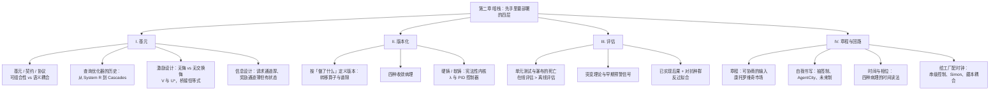
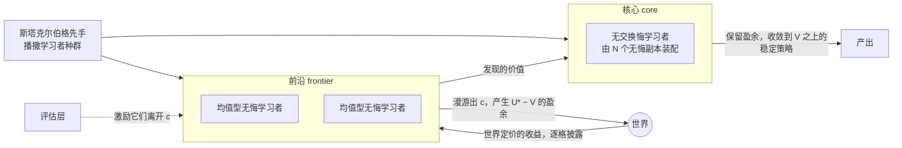
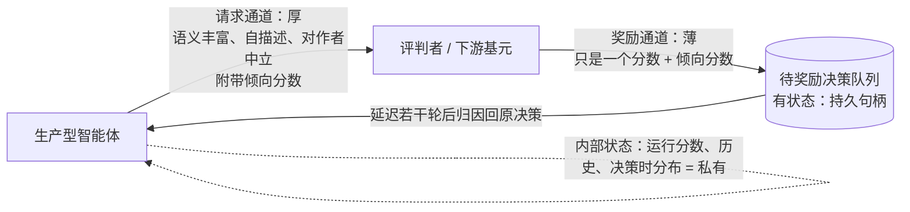
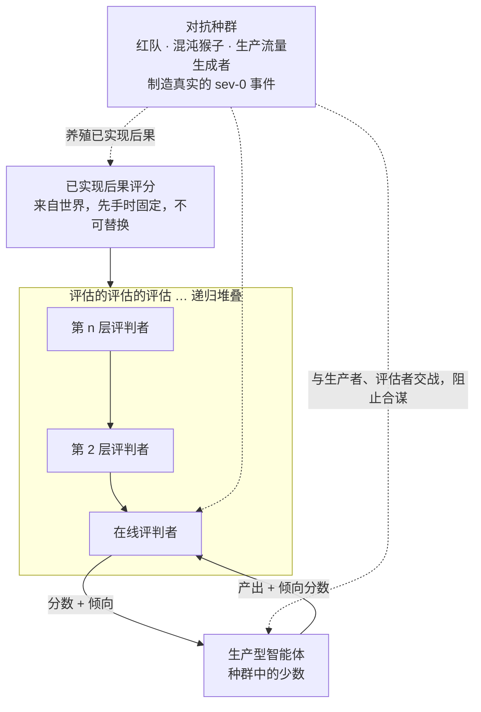
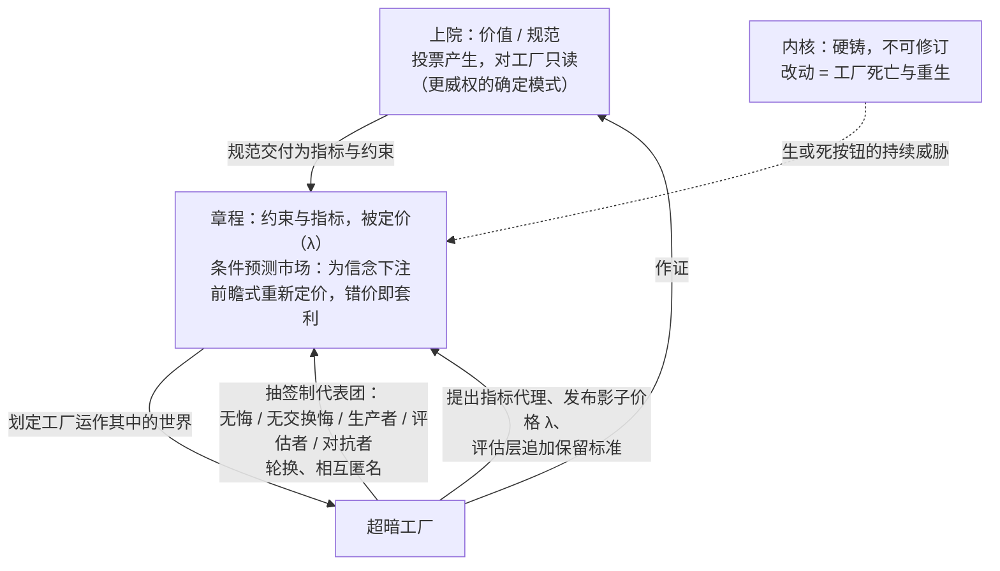

# 超暗工厂 · 第二章：暗栈（The Dark Stack）

> [!info] 文档说明
> **原文**：[Chapter II. The Dark Stack](https://superdark.antikythera.org/chapter-ii-the-dark-stack) · 出自 Antikythera 长文 *The Superdark Factory: Toward the Full Automation of Software*
> **作者**：M. Poliks, R. Alonso-Trillo, T. Dunn, H. Scott-Douglas, J. Springett
> **前置阅读**：[[第1章-黑暗-Darkness]]。本章大量使用第一章的术语：三级工厂、黑暗、神经质治理、速率 r、空间 a / b / c、辅助供给、尾流、斯塔克尔伯格先手、内核。
> **下一章**：[[第3章-万物工厂-The-Anything-Factory]]
> **配图**：13 张黑底手绘图全部来自原站 CDN（在线引用，未下载到本地）；Mermaid 图和表格是本文档补充的，不是原文内容。
> **术语**：关键术语第一次出现时附英文，文末有中英对照表。

---

## 0. 一页速览

> [!abstract] 这一章到底在说什么
> 第一章论证了「为什么」：最好的工厂是人类无法描述的 Class 3 工厂，人必须退出回路，只剩开机前的一次先手。第二章讲「怎么做」：**暗栈（dark stack）** 就是那一次先手里要部署的四层设计。
>
> | 层 | 名称 | 干什么 | 属于哪种交付物 |
> |---|---|---|---|
> | I | **基元（The Primitive）** | 设计最小软件单元的「形状」，让工厂能自组装、能学习 | 技术前提 |
> | II | **版本化（Versioning）** | 不按「工厂是什么」而按「工厂做了什么」来定义版本；用不可修订的内核给工厂一个身份 | 身份生产 |
> | III | **评估（Evaluations）** | 在线、递归、对抗式的评估层，是工厂的感官与免疫系统 | 技术前提 |
> | IV | **章程与回路（The Charter and the Loop）** | 输入层的协商式治理，以及治理该在什么节奏上发生 | 身份生产 |
>
> 作者的核心工具：**博弈论里的两个量 V 与 U\***（一个静态承诺能拿到的价值，与一个「均值型学习者」身上能榨出的更大价值），以及把它们和第一章的 b ∖ c 连起来的**桥接恒等式**：U\* > V ⟺ b\* ∈ b ∖ c。

**本章最关键的判断：**

- 写软件的时代结束了。软件不是被维护而是被**园艺化**，不是被声明而是被**驱动**。
- 契约（contract）让基元的内部信息与消费者的效用去相关，这就是**在最小尺度上制造黑暗**，工厂随后在全局尺度上把它累积起来。
- 一座只由「无交换悔学习者」构成的工厂只能收敛到架构师已知的最优（V）。要越出可读空间 c，工厂里**必须有一些天真的均值型无悔学习者**。
- 版本不是 Git 提交。两套语法完全不同、但输入—输出分布统计上不可区分的配置**是同一个版本**。
- 预生产环境正在死去，它随 r 一起死。评估必须在线、必须有必要多样性、必须递归堆叠、评估评估者的信号必须在它评判的回路之外。
- 写评估是人在工厂边界上最直接的治理行为：**工厂初始的规范与约束的规格化，就是它的第一个 eval。**
- 治理只在章程层发生；干预内核等于工厂死亡与重生。工厂通过抽签派代表进入自己的治理委员会。
- 治理层就是工厂最慢的那个回路。治理的节奏若贴近它所控制的回路的固有频率，会产生「医源性抖动」。

---

## 1. 开场：两种交付物，四个小节

作者承认第一章尽力保持了介质无关，但暗栈必须完成两件具体的事：**创造超暗工厂涌现的技术条件**，以及**生产超暗工厂的身份**。眼下最方便的思考介质是软件：技术前提需要**递归性与自适应**，身份生产需要**统计分析与人机接口**，而智能体式 AI 恰好是一条现成的、站在当代自动化前沿的工具链。

四个小节交错承担这两种交付物：

| 小节 | 作用 | 交付物 |
|---|---|---|
| I 基元、III 评估 | **启用并影响**一个复杂系统的过程性自我发展 | 技术前提 |
| II 版本化、IV 章程 | 把系统**固定在一个绝对外在于它的身份**上 | 身份生产 |

全部内容都用软件（应用编程的原则）来讲，但留有余地做更抽象的讨论。

---

## 2. 第 I 节：基元（The Primitive）

> [!quote] 题词
> "You are not alone in the codebase; do not revert edits made by others and adapt to any existing changes you might find."——Codex 子智能体的惯例指令（作者注：让 Codex 生成子智能体时，这句话常出现在 agent inspector 里）

### 2.1 写软件的时代结束了

> **软件是被园艺化的，不是被维护的。软件是被驱动的，不是被声明的。软件是反馈回路的产物（或副产品），不是静态的档案对象。软件是内容，而内容不再是一个可供手艺施展的表面。**

暗栈的介质现在可以当作软件，但它也是**前软件（pre-software）**：它制造的东西自组装成软件，像脂肪组织一样嵌在软件的骨骼里（或者像一颗一触即发的基因炸弹）。它是一种**内置于世界的控制机制**，一种战术性的世界构建：往一个待建的世界里播撒信息，往一个世界可用的信息里播撒控制。暗栈创造了某种自引导、自主软件的可能性，同时又偷偷地、有意地划定这种软件被允许成为什么。

### 2.2 基元：最小的原子单元

超暗工厂由**基元（primitives）**组成——最小、最原子化的软件单元，不能再分解成子组件而不落入另一个描述域（另一种语言、另一个领域、另一个应用）。**有意识地设计这些基元是暗栈的第一项技术。**

基元会堆叠、会粘连，单个基元的形状对未来可能涌现的形状有巨大的下游影响——就像 DNA 的物理结构决定蛋白质的构建、氧原子的结构决定它如何氢化成水。有的基元能堆成任何东西（只收发是/否的基元，或最基本的数学函数）；有的基元只以特定方式拼合，只允许特定几何。计算机科学里从门、不可变量、类型开始，遇到了不断上升的**抽象地板**：从 struct 到 object 到 class（再到托管应用、容器、服务）。地板越高，设计决策的分量越重：能造出的复杂东西，双重地受制于其他复杂东西能被组合的有限方式（Gamma 等 1995，设计模式）。

> 图 1 · 原图文字：INFINITE TILINGS / FINITE TILINGS / LIMITED TILINGS——基元的形状决定它能铺出多少种图案。

**软件设计「退回」到了基元设计。** 说「软件设计就是基元设计」是平庸的（写软件 = 把现成组件排成新整体）。更有趣的说法是：软件的工作不再是把基元排成这个或那个应用，而是**布置、收集、塑造基元的表面，使新的、有趣的自我图案化得以涌现**。「应用」——对某种特定排列的规定——像是上个世纪的设计关切。更有趣、也许更有利可图的机会是创造能被排成多种图案的基元形状。当代基元也是一种**商品**——Werner Vogels 与 Jeff Bezos 把「primitives, not frameworks」定为 AWS 的创始哲学（脚注：AWS 近来反倒转向框架，而 AI 领域的竞争者更偏向基元）。此刻的基元是：hooks、harness、子智能体、MCP 服务器、自主智能体。

### 2.3 基元、契约、协议

| 概念 | 定义 |
|---|---|
| **基元（primitive）** | 既可组合（有粘性、可连接、可收集）又不易分解（分解需切换描述域，如 C 的 for 循环展开成汇编要引入全新词法系统）的软件单元 |
| **可组合（composable）** | 由离散、模块化、可复用的积木组成的软件；对立面是庞大的**单体（monolithic）** |
| **契约（contract）** | 基元为了与别的基元粘连而暴露给世界的部分：它接受什么输入、执行什么操作、产出什么输出。**输入/输出制度的要求与承诺构成基元的形状** |
| **协议（protocol）** | 那些要求与承诺所隐含的逻辑系统 |

作者主要关心基元设计；正如软件设计退回基元设计，**协议设计也退回基元设计**（后者创造了前者自组装的可能空间）。

> [!important] 契约就是在最小尺度上制造黑暗
> 契约把基元的**内部信息**与其**消费者的效用**去相关。消费者拿到基元的全部内部实现，也找不到契约没提供的可组合之物；找到的任何东西都是对内部的依赖，而内部必须保持可修订。**这正是第一章定义的黑暗，只是现在在最小的可用尺度上。** 我们在暗栈最底层「制造」黑暗，工厂随后在全局尺度上累积它。

例子：一个 Claude Code 会话（带一组 skills 与 tools）就是一个基元。它定义了结构化输入（系统提示、工具、上下文）和结构化输出（工具调用、文本、工件），聚合成一份契约（组件期待接收什么、承诺返回什么、保证什么条件，例如工具 schema）。harness 的每个子组件又可以被当作独立的形式基元来存储、创建、管理。

**从「谁在什么时候读契约」可以读出工厂的等级：**

| 等级 | 谁读契约、何时读 | 例子 |
|---|---|---|
| Class 1 | **设计时**，由写计划的人读 | 工程师查 POSIX man page 或 OpenAPI 规范，硬编码调用，沿冻结路径运行 |
| Class 2 | **计划时**，由工厂自己读 | Claude Code 在轨迹中途读一个 MCP 工具 schema，决定值不值得调用 |
| Class 3 | 推到**最后一刻**：没有任何规划者事先读任何东西 | 契约必须携带足够的自我描述，使基元能针对一个**写契约时还不存在的约束**被拾起 |

**放大到智能体对智能体（A2A）**：智能体本身成为相对可替换的基元。智能体通过结构化接口暴露能力（A2A 的 agent card，OpenFang 的 Hand 清单），编排器动态地把智能体组装成工作流，不需要理解内部，只需理解契约。Google 的 A2A 协议与 Anthropic 的 MCP 是**殊途同归**的设计：都在定义自主组件之间**最薄的接缝**。第一波「自主软件工厂即服务」（Amazon Kiro、Factory 的 Droid）把接缝做得更薄：局部目标的下达（Kiro 叫 specs，Factory 叫 specification mode）被**基元化**成一个结构化的组合单元，智能体接收、展开、自组织去完成，并展开自己内部的基元级联（图、harness、模型……）。（脚注：Kiro 的 spec 是三个 markdown 文件：requirements、design、tasks；Kiro 还被归因于一次长达十三小时的 AWS 大宕机。）

### 2.4 可组合性高于一切

目标是让**未曾预期的东西**存在，所以暗栈的基元设计把**可组合性置于一切之上**，不预设任何装配。把「装配」问题推迟到最后一刻——工具、系统提示、skill、记忆管理各自独立构建，只在装配时刻组合。**如果工厂只能以设计时预期的方式组织自己，那不是超暗工厂，只是基础自动化。** 换句话说：设计时预期的装配，其推导在每一步都终止于架构师配给的输入——它住在可读空间 c 里。**可组合性是让工厂的构型空间漂出 c 的工具。** 硬编码的智能体流水线就是瀑布：按设计被封顶在「架构师已知怎么想要」的那座工厂上。

工厂只有在基元**真正可组合**时才能决定自己的装配：智能体可以被替换、改道、并行、移除，而不引起级联失败。**这是多数现有架构最终失败的地方。** OpenClaw 这类生成系统让智能体实例化别的智能体，看似自组织，实则仍是层级式、命令式的（A 决定用特定指令创建 B）。**Class 3 的可组合性**意味着一个自发形成的编排层能发现可用基元、评估它们的契约、针对一个输入把它们装配起来，**没有任何单一系统或智能体需要在上下文里持有完整拓扑**。自动 harness 优化的前沿（DSPy、GEPA、SkillOpt）是朝这个方向的严肃一步。

### 2.5 厚还是薄：暗栈的核心张力

反过来问：**糟糕的可组合性长什么样？** 要避免的情形是：一组基元在技术上能互相通信，却以契约没有捕捉的方式**隐式依赖**彼此的推理模式、身份或输出格式。这叫**语义耦合（semantic coupling）**。好的基元把契约写得足够显式，使语义耦合最小化。越标准化、越自描述越好——但问题是：契约空间能否**既丰富到足以让真正的自主装配发生，又薄到仍然可组合**？

| | 过厚（过度规定） | 过薄（规定不足） |
|---|---|---|
| 后果 | 限制了自组装系统可用的图案类型 | 过于放任：什么有趣有用的东西都不成形，可能性太多 |

**厚或薄、丰富或狭窄，是暗栈的主要设计张力之一。**

作者拉来《可组合数据管理系统宣言》（Pedreira 等 2023）作对照：它对数据管理系统得出类似结论——丰富的组件好、薄的契约好、语义耦合坏——也在同一个问题上挣扎：如果薄契约不能完全阻止语义耦合，怎么造一个足够稳健的**中间表示（IR）**？宣言最终的结论是一种对自己反对之物的意外回旋：**如果所有系统都采用同一个执行引擎呢？**（脚注：他们建议 Substrait。）这对可组合系统是个很大的要求——或者说，一个很大的基元！**一个基元可以大到什么程度，仍算参与可组合设计？**

最尖锐的回应来自宣言引用的系统之一 **DuckDB**：极端的**向外可组合**（嵌入第三方系统）与极端的**向内不可组合**（依赖极少的内部单体；脚注：它在 2025 年初把 Substrait 从代码库里剔除了）。这对它的领域是合理的：SQL 分析是一个边界已停止移动的成熟问题类，所以可以从内部可组合性收敛成单体、收敛成**一个计划**。**但超暗工厂不能被生产为单体，因为单体就是被确定为一个计划，句号。** 工厂在其生命中的任意时刻可以包含大结构，但内部结构的「大小」是**运行时持续发现的经验问题**，按外部约束按需装配。

### 2.6 一段相关的历史：查询优化器

为找折中，作者回到数据分析「岩浆尚未冷却」的年代。向数据库发一条结构化查询（「找出满足这些条件的记录」），服务端一段例程决定怎么找最好——这就是**查询优化器**。它不只要产出一个计划，还要产出**最好的**计划，「最好」通常按计算资源或时间衡量。这是真正的 Class 2 备选决策：优化器事先不知道最优路线，每一步决策还会严重影响后续可用的决策。十张表的连接大约有 **170 亿种**排序方式，从中选择是 NP 完全问题。

| 年份 | 系统 | 形态 | 含义 |
|---|---|---|---|
| 1979 | IBM System R | **单体**：线性手写过程推断各种动作顺序的成本 | 每种新数据类型、访问方法、连接算法都意味着对手写过程的粗暴人工干预，并要有人整体重新验证 |
| 1987 | EXODUS | **基元化、模块化**：工程师提供一堆小规则（每条一个代数事实），通用搜索过程从规则生成的碎片里装配计划 | 没有任何过程在「编写」这个计划；每条规则独自写成，对邻居一无所知 |
| 1995 / 1998 | Cascades 框架 / SQL Server 7.0 | 同上，投入生产 | Apache Calcite 等共享库为几十个引擎做规划 |
| 当代 | 自适应查询执行（如 Spark） | **干脆抛弃计划**：查询中途停下，数清实际产出的行，为余下部分重新规划 | 计划只是一个「对着查询自己揭示的东西去检验的猜测」 |

为什么单体不可持续？第一，要编辑它就得**理解**它；第二，要**创造**它就得把整个查询优化空间装在一个人的脑子里。用第一章的话说：**System R 的治理成本 g 是「每次修订一个人头」**，非常昂贵。查询优化器是一台 Class 2 机器，它的历史是**Class 2 工厂对 Class 2 工厂的递归自组装**。

> **如果你想造一个计划，尽管造。** 如果你的野心已经凝固到「造计划有意义」的地方，如果你的领域或竞技场已经尘埃落定，也许计划归你所有。但一旦你造的东西接触到未定之物，你会发现软件在那个接触点上**软化、碎裂成模块化的基元**。而 Class 3 工厂周围，全是这样的未知。

### 2.7 面向持续学习的激励设计

要建什么？希望什么结构自组装、哪些结构是 Class 3 的技术前提？哪些底层形状（契约）最能促成这些条件？**基元设计可以被理解为激励设计**：我们定义的契约类型，激励某些条件下的某些行为。

**稳健的简约。** 机制设计的近期历史（Bergemann & Morris 2005 的「稳健机制设计」；Carroll 2015 的「稳健性与线性合同」）给出一条已在提示词/上下文工程里被验证的原则：**设计者对复杂系统（比如一个模型）知道得越少，就越不应该具体地设计它的奖励结构。** 充满迷宫式条款与豁免的巴洛克激励集，只有当作者对智能体的行动空间了解到能写清每条条款时才有效；不了解却坚持超规定的指令，每一条细节都成了对手可利用的机会。稳健的设计依赖弱主张而非强主张。**称之为「稳健的简约」原则：架构师知道得越少，施加的结构就该越少。**（作者注：这已是提示工程的通行惯例，见 Anthropic 2025。）

**对象不是理性最优响应者，而是无悔学习者。** 2010 年代末机制设计把设计对象理解为自我发展的学习算法。从黑箱外面看，合理的假设是：工厂内部的智能体——架构师承诺策略后启动的博弈级联里的玩家——**不是**理性最优响应者（每一步选期望收益最大的动作），而是**无悔学习者（no-regret learners）**：只根据自己观察到的结果更新行动、不建模环境、长期平均表现收敛到事后最优策略。这个假设合理是因为理性最优响应要求一样谁都没有的东西：对世界的特权访问。Camara 等（2020）、Braverman 等（2018）、Deng 等（2019）的结果表明：**为理性最优响应者设计的机制，对无悔学习者可能表现极差。** 为学习动态设计的机制承认智能体会经历探索阶段、会做出在贝叶斯视角下看似非理性的最小化悔恨决策、任一轮的行为只是收敛策略中的一个样本。**由此，超暗工厂的激励集应假设早期工厂将是一团绝对的混乱，并且不要过早阻止这团混乱沉淀、凝结、向某个战略方向收敛。**

工厂内部可以安全地假设为**可组合的无悔学习机器堆栈**——无悔学习是几乎所有自适应系统的默认行为（多臂老虎机、强化学习、梯度下降）。学习者可以是一个在单轮内自发部署子智能体的智能体、一个引导多轮对话的 harness、一个创建动态智能体图的工作流监督者、一个服务编排器、工厂的各个部门、乃至整个工厂；也可以是自发训练起来的模型。多数情况下真正在学习的不是「模型」本身，而是**与非确定性方法相连的确定性软件**。

### 2.8 无悔 vs 无交换悔：V 与 U\*

| | 无悔学习者（no-regret） | 无交换悔学习者（no-swap-regret） |
|---|---|---|
| 问自己的问题 | 「在我的一生里，我总体上是否该选一个不同的方案？」 | 「对我选过的每一个方案，是否该把它换成某个特定的其他方案？」 |
| 通勤者例子 | 为每条路线记运行平均，多数时候走最快的，偶尔试别的；年底问：我的平均通勤是否至少和「每天只走最优那条」一样好？ | 车里放一张电子表格，问：每次走高速时，走小路会不会更好？每次走桥时，走高速会不会更好？由此发现「下雨时桥明显更差」这类条件信息 |

表面上无交换悔学习者「更好」：它关掉了每一个可能阻止最优结果的条件性并发症。**但**当架构师决定基元、把结构承诺进工厂并开机，一个无交换悔回路只会**收敛到架构师决策里隐含的最优策略**——它把架构师的游戏玩完，然后停下。用博弈论术语，架构师到达了**斯塔克尔伯格价值 V**（Deng 等 2019）：承诺一个策略、让一个完全理性的智能体响应，所能得到的最佳收益。

| 量 | 含义 | 对架构师意味着什么 |
|---|---|---|
| **V**（Stackelberg value） | 承诺一个策略并让理性（无交换悔）响应者应对时的最佳收益。通常是**下限**：对任何无悔学习者，优化者能保证至少 (V − ε)T | 架构师的先手是**永久承诺**，所以对无交换悔学习者，V 从下限变成**上限**：不存在任何博弈序列能榨出超过 V，因为这类学习者会收敛到对任何承诺的理想反制 |
| **U\*** | 对**均值型（mean-based）**无悔学习者——那个天真追逐运行平均的家伙——同一理论识别出的第二个更大的量：学习者累积奖励状态上的一个最优控制问题的值，是能从任何均值型学习者身上榨出的**确切最大值**，在某些博弈里严格、有时是戏剧性地超过 V | 脚注：只有当均值型学习者有三个以上动作时才可能超过 V；两个动作时无悔已蕴含无交换悔 |

**提取时间表，以及为什么工厂不能写它。** 暗栈的安装是一次性承诺，这与 Deng 等的论文吻合：收获 U\* 不需要第二步，只需要编码一个在第一轮之前就固定的**「提取时间表」**：先诱饵若干轮，等学习者的运行平均倾斜到想要的位置，再切换并在它们调整之前收割盈余。整张时间表可以事先写好，因为均值型学习者不是在对你反应，而是在对**它对你的记忆**反应，而记忆只是你自己行动史的函数。

**那为什么不在这里写下整张时间表来一次「诱饵与切换」？** 因为 Class 3 工厂恰恰缺少写这张表的能力：**架构师按设计不知道博弈的「收益」，工厂也不知道。这就是要点。** 世界负责给这场博弈定价，只在博弈实际进行时披露收益。无法理解行动最终如何被定价的架构师，只能承诺一个**静态策略**，而静态承诺的价值是 V。**V 与 U\* 之间的差距，只能通过代理来收获——通过先手时播撒的学习者混合体，它们是唯一能在博弈中采样世界定价收益的结构。** 这就是「基元设计即激励设计」的意思：**你播撒的种群是唯一能越过 V 的工具。**

V 与 U\* 的差距，是「架构师在初始化时装进工厂的选项空间之外还能得到的一切」的形式度量。再想 Thompson 的电路：结果不是设计者评估的走法空间（b ∩ c）内的更好走法，而是通过系统内部动态可达的走法（b ∖ c）。**一座完全由无交换悔回路构成的工厂，找不到任何在其架构骨架 c 之外的东西。超暗工厂需要至少在某处有一些天真的、均值型的无悔学习。否则它出不了 c，也谈不上真正黑暗。**

### 2.9 桥接恒等式

作者提醒：不要把两套词汇硬挤成一个定理。U\* > V 是关于重复博弈价值的断言，b\* ∈ b ∖ c 是关于解空间成员资格的断言，是两件很不同的事。只有在**一个条件**下二者可以联系起来：超暗工厂的**超暗**。如果架构师或工厂能对博弈的收益矩阵取得某种所有权——拼出一张完整的表，架构师能承诺的每一步一行、工厂能做的每种响应一列、每格一个收益值——那么两套词汇描述的是很不同的条件，无法联系。对封闭博弈（哪怕复杂如围棋，任何有规则的博弈）这种「拥有规则」是可以拼出来的，Deng 等的所有博弈都是这种。但在超暗工厂里，那些格子会是什么？架构师的走法是开机前承诺的结构；工厂的走法是它可能做的一切；格子里的数字是那个组合**最终值多少**：交付的东西找不找得到买家、AlphaFold 的折叠在实验室里成不成立、满足某条规范这个季度值多少。**这些数字是关于世界的事实，由世界在该组合被走出的那一刻写进格子，而不是之前。世界是那个逐格填表的玩家，一个格子的数字只有真正住进去才能知道。** 先手时播撒的学习者只是一种「站在里面」的装置。没人握有矩阵，架构师最不可能。**只在这个条件下，且仅在这个条件下**，可以采用：

$$
U^* > V \iff b^* \in b \setminus c
$$

| 符号 | 原文释义 |
|---|---|
| U\* | 均值型学习者累积奖励状态上的最优控制问题的值；能从均值型无悔学习者身上榨出的最大值 |
| V | 斯塔克尔伯格价值：对一个理性的、无交换悔的响应者承诺一个策略所能得到的最佳收益 |
| b\* | b 内的最优构型 |
| b | 解空间：满足目标的构型；在 Class 3 是满足规范的构型 |
| c | 可读空间：能回溯到治理者输入的构型；Class 1 与 Class 2 |
| ∖ | 集合差。b ∖ c 是持久但不可读的区域，只有黑暗工厂能抵达 |
| ⟺ | 双向成立，且仅在超暗之下：**盈余存在，恰当最优构型位于可读集合之外** |

从右往左读：如果最优构型在可读空间之外，那么从工厂可榨取的价值超过 V。由此 V 与 U\* 也能用第一章的 **P** 来解释：**V 是 P 的地板**——一座收敛、保持并返还「架构师知道怎么想要的一切」的全部价值的工厂，一个花大价钱买来的 P = 0；**U\* − V 是地板之上、只有无悔学习者能触及的一切。**

这层关系不是白来的，要靠暗栈里的一系列架构承诺**挣来**：

1. 学习者需要**能够**漫游出可读空间——靠在工厂里播撒均值型无悔学习者。
2. 需要**激励**它们离开这个空间，尤其在发现有趣东西时——靠评估设计（第 III 节）。
3. 发现了有趣的东西，需要**保留**学到的价值——在**前沿（frontier）**播撒均值型结构（产生 U\* 盈余），在**核心（core）**播撒无交换悔结构（保留盈余）。基元结构必须两者都能编码。

**播撒任何学习者，契约都必须提供三样东西**：跨轮持久的记忆、一组学习者理解自己在其中选择的动作、以及能归因回「挣得它的那个决策」的奖励。无交换悔类还需要一样：**反事实的来源**——对「未走之路」的某种记账（下文的倾向分数）。Blum 与 Mansour（2007）证明无交换悔学习者不必直接构造：取 N 个普通无悔学习者的副本，每个动作一个，每个副本拥有「它的动作被选中」的那些轮，各自问它唯一会问的问题（「在我的这些轮里，本该走什么？」），然后每轮把各副本的建议解析成一个动作分布。**于是基元设计可以聚焦于让无悔学习者成形，同时谨慎地播撒一种（有限的）反事实计分方法，让其中一部分能聚合成无交换悔学习者。**

### 2.10 面向持续学习的信息设计

**怎么做？** 这项工作与学习算法关系不大，几乎全在于**操纵什么信息到达谁那里**：一个基元能基于什么信息、按什么标准做什么决定。一群无悔学习者在得到足够多关于世界的信息时能自组装成无交换悔学习者——核心需要这种学习者，但前沿需要一支**永远拿不到那些材料**的更大舰队。**基元设计因此是一种信息控制：架构师在早期那个稀汤般的未定义阶段，通过决定什么公开、什么私有、什么丰富、什么稀薄，来管理起始种群。**

**Walden Yan 的转向。** Cognition 的 Walden Yan 在 2025 年的《别造多智能体》里主张默认避免多智能体架构，理由是「动作携带隐含决策，冲突的决策带来坏结果」（语义耦合），必要时传递完整轨迹、尽量塌缩成单线程智能体。但 2026 年他修订了立场：代码评审回路在**写代码和评审代码的智能体完全不共享上下文**时表现最好——干净上下文的评审者摆脱了编码者的累积历史，从 diff 反向推理，抓住编码者抓不住的东西。建议变成：写代码的智能体之间共享完整上下文，**对任何可能评判代码的智能体拒绝给上下文**。Yan 甚至说开放问题「全是通信问题」：弱模型何时上报、子智能体如何把一个该改变兄弟工作的发现浮上来、如何「在不淹没接收者的情况下在智能体间传递上下文」。

两个要点：
- 如果一类工作真的是**单流**的，那它就该是单流实体（一份累积的上下文）。在智能体 AI 里「共享上下文」与「作为一个智能体运行」没有区别，所以单流任务应保持单操作者。
- 如果工作需要**评估**，那评判者**永远不该**拥有装配内部运作的完整上下文，而应像看一台机器那样看它：输入、输出。

契约（结构化输出与期待的结构化输入）是智能体展示给世界的东西，其余一切是它冰冷的内部。暴露每个内部细节的契约，给组合提供了过高的分辨率（消费者会对基元无意承诺的信号形成依赖）；暴露太少的契约，则给消费者没有可组合的信号。

**协议的两种定义。** 自下而上：把一群契约放开互相作用，其互动的可能性场就是协议——像一组可镶嵌基元的可用拼接。自上而下：先写协议（作为通信系统），它规定下面每个基元必须暴露的输入输出。无论怎么定义，**协议的力量在于它在任何交换发生之前就约束了所有未来交换的形式。**

信息设计领域（Bergemann & Morris 2019）给出了按通信协议有意构建博弈空间的一般原则。Kamenica 与 Gentzkow（2011）的《贝叶斯说服》确认了先手的力量：一个**事先承诺披露规则**（在知道有什么可披露之前就决定披露什么）的发送者，可以不撒谎地把理性接收者的后验信念推过决策阈值。这一结果在学习动态里依然成立：面对无悔学习者的委托人仍能拿到约等于承诺价值 V，面对均值型学习者可以超过它、趋向 U\*（Lin & Chen 2024）。**架构师的斯塔克尔伯格位置要求他仔细考虑任何常设信息承诺的影响。好的信息设计，是在任何架构师缺席后仍能鼓励工厂生产能力的设计。工厂一旦开机，一个智能体的契约空间就是它的全部感官。**

### 2.11 两条通道：厚的请求，薄而有状态的奖励

传统协议设计偏爱「窄腰」（如 IP）：一个对其上（TCP、HTTP、应用）与其下（以太网、Wi-Fi）不断增长的复杂性都不敏感的薄接缝。但在持续学习系统里，「薄」有真实后果。

| 通道 | 应该多厚 | 为什么 |
|---|---|---|
| **请求通道（request channel）** | **厚**：语义丰富、自描述 | 薄请求迫使消费者填补空白——发明新信息或依赖未言明的先验。餐馆常客要「老样子」通常能如愿，但请求变成了隐式的，依赖服务员的记忆；新员工得躲到吧台后面问同事或瞎猜。**原因未言明的动态很难学习。** 这是语义耦合在协议层面的重现。请求必须丰富到能自我描述，消费者永远不该被期待基于上下文元数据（例如提交者是谁）去推断——作者在这里应该要么无关、要么可替换、要么私有。收到请求的智能体应以另一个语义丰富、对作者中立的请求回应。MCP 工具 schema 与 A2A agent card 已是完整、语义丰富又中立的自描述范例 |
| **奖励通道（reward channel）** | **薄**：奖励永远是一个分数 | 反馈不是被消费一次（如控制流），而是被学习者跨轮**累积**。丰富反而有害：给太多上下文的学习者会对任意信号形成依赖（反向的语义耦合） |
| 但奖励里必须附带 | **倾向分数（propensity score）** | 如果奖励只是一个分数（错误码、浮点数、布尔值），协议只会形成普通无悔学习者，因为没有统计倾向的盈余可供构造反事实。倾向分数是智能体**在决策时对自己所抽取的统计场的记账**，与产出一起披露：softmax 给某选项的权重、模型对自己发出的 token 的概率评估、或探索规则显式赋予的概率（如 K 个动作上的 ε-greedy：(1−ε)+ε/K）。把倾向作为请求的公开部分产出，另一个智能体就能在评估/计分时把它与奖励回溯关联，再返回给学习者。（脚注引 Bottou 等 2013 关于 Bing 广告系统在选择瞬间记录倾向、以便对着历史流量估计改动效果；离线策略评估的标准做法。） |
| 奖励通道还必须 | **有状态**：一个受管理的「待奖励决策队列」 | 训练学习者的分数从不与它评分的动作同时到达：奖励总是延迟的，有时延迟很多轮，且必须找回产生它的那个确切决策（和确切倾向）。返回通道必须让动作**随时间可寻址**——给每个采样动作一个持久句柄，供之后的分数附着 |

**公开与私有。** 这不是工厂级的「绝对私密」，而是智能体之间信息的**相对可得性**——正是它诱导出这一种而非那一种学习者。架构师以两种方式播撒它：结构（一份 A2A 契约被塑造成暴露什么）与内容（初始化时实际披露什么）。在一个每笔 A2A 交易都绝对透明的环境里（每个智能体揭示决策过程的全部表面，包括它可用的全部决策集），超暗工厂自组织的机会再次从 U\* 被限制到 V——这是最弱的信息设置（脚注：公开信息可能降低协作实体的福利，Morris & Shin 2002）。对一个想造出严格超出自己设计之物的架构师来说，不仅要保持信息私有（含在做决策的智能体内），还要在种群中**主动散播分歧（dissensus）**（Arieli & Babichenko 2019）——预烘焙智能体信念系统的多样性，防止种群塌缩成单一动机。

设计原则是**最小充分披露（minimal sufficient disclosure）**（Kamenica & Gentzkow 2011）：过度披露把智能体会过拟合或博弈的信号交到它手里（Blackwell 1953），披露不足则让它缺乏协调所需之物（可能由此引入语义耦合）。一条披露的信息只有当「给定智能体在决策时理解的一切，按这条信息行动平均而言符合它自身利益」时才起作用——否则自主智能体可能直接忽略它（贝叶斯说服里的**「服从约束」**）。「平均而言」很重要：披露可以跨轮回报，不必每一轮。

**战略场应如下：**

| | 什么 | 公开 / 私有 |
|---|---|---|
| (1) | 工厂的信息图式：基元架构、A2A 契约的 I/O 格式、请求与奖励的结构 | **绝对公开** |
| (2) | 一个智能体的局部状态：运行分数、历史、决策时的分布矩阵 | **绝对私有**（全员可读 = 透明塌缩，人人收敛，工厂只值 V） |
| (3) | 唯一例外：倾向分数的内容（随请求前传，存于奖励队列） | 恰好装入足够信息，让接收者能重构另一个选择的潜在价值 |

小结：基元架构的四条核心原则——(1) 可组合性与某种形式中立；(2) 用普通无悔学习者可组合地装配无交换悔学习者；(3) 请求线丰富、奖励线薄但有状态的协议层；(4) 信息公开/私有上的最小充分披露。**所有这些都只活在架构师的先手里。** 一旦开机，超暗工厂立刻开始重构自己，而且——有意义地——重构的头几个阶段被理解、甚至被鼓励为**大体上无产出的**。

---

## 3. 第 II 节：版本化（Versioning）

> [!quote] 题词
> 「像一个『醒来』在陌生世界里的异世界（Isekai）主角，LLM 带着它的权重和后训练行为进入一个代码空间……系统提示塑造它认为自己的目的是什么，可用工具决定存在哪些动作，上下文窗口设定能被呈现和知道的视野。我们以为自己在从世界之外给它指令，但对模型而言，这些指令就是世界。换掉系统提示或工具，它在有意义的意义上就是另一个世界里的另一个演员。」——Jay Springett，《Hard Worlds for Little Guys》

### 3.1 版本不能是 Git

超暗工厂在初始化那一刻就**失去了有状态性**。它是许多叠加的同时配置（或许多同时配置的许多同时配置），每一个都在局部分配的配置状态之间不停转移。若把软件变更记为提交，结果是一条机器时间级的连续推送流，快到**每次推送都是强制的、都涉及分支冲突、都被特性开关包裹且转瞬即逝**。（脚注：Adam Tornhill 虽持相反立场，但也承认「合并冲突正迎来它们的鼎盛期」。）

**暗栈里的版本控制不能是一条线性的时间点记录，不能是 Git。** 传统版本控制成立，是因为离散代码是惰性的、理论上可复现、理论上可回退到先前状态。Git 在 Class 1 里完美；在 Class 2 里开始吃力（它的时间化信息需要与系统和输入的实时日志放在一起才能复原工厂）；在 r 越过某个未知阈值后变得不可用（回想控制塔）。超暗工厂由持续学习的**概率性软件**而非离散软件构成，代码库由一群行为无法（或不切实际地）还原为更小尺度现象的智能体既执行又持续培育。配置状态（提示词哈希、模型标识/检查点、拓扑）当然可以作为（昂贵且转瞬即逝的、webhook 式的）取证元数据记录，但**不能被理解为构成工厂的版本**。配置空间至多是一个每几毫秒更新一次的极高维概率分布。「昨天的」超暗工厂已不存在；就算重建每个可观测参数，再跑一遍也会得到不同的东西。**超暗工厂不后退，只前进。**（脚注里作者提到一个漂亮的反讽：暗工厂编排平台 Gas City 用了带分支的版本化 SQL 数据库 Dolt，却根本没用它的版本控制功能。）

### 3.2 按「做了什么」定义版本：POSIWID 与转移算子

与其按「工厂是什么」（不可知）来版本化，不如按**它做什么**——借 Beer 的 POSIWID（系统的目的就是它所做的事）——尤其是**它现在做什么**。任何动态系统都会沉淀进或稳或不稳的**行为吸引子**，但吸引子只能作为输入制度（规范与约束）与输出制度（不只是工作产品，还包括产品对输入制度里定义的指标的评估）之间的**亚稳关系**被观察：工厂的行为在底层湍流之下保持统计一致。

> [!definition] 什么算同一个版本、什么算版本变化
> - 两个**语法上完全不同**、但产生**统计上不可区分的输入—输出分布**的配置，属于同一个版本。
> - 输入—输出分布变了 → 版本变了。
> - 章程层面的输入被修订 → 版本变了。
> - 外部力量改变了「输入能被当前输出分布满足」的条件 → 版本变了。
> - 版本变化是弥散但可测量的：它们描述可能随时因任何原因改变的行为一致期，相继版本之间**不期望有线性相关**（版本在工厂里不「递增」）。

版本化是一个**主动过程**：对工厂输入—输出动态的**对抗式持续评估**。版本变化由观察者（在线 LLM 评判者、人、离散或概率方法）共同测量，但这些观察者技术上并不在工厂之外，而是构成那堵把工厂与世界隔开的、海绵状黏糊糊的墙（一堵原则上永远渐近后退的墙）。测试套件自身的版本化也遵循同样的规则。

**转移算子（transfer operator）**让这种版本化变得具体。借自动力系统理论（用来预测一个概率分布的下一步）：

1. 把工厂的可观测行为**划分成格子**（比如按章程指标的评判分数剖面）；
2. 对近期输出在这些格子上的效应保持一个运行直方图；
3. 数一数一个格子里的行为多常导向另一个格子里的行为。**这张计数倾向表就是算子。**
4. 任一时刻的直方图与工厂长期平均之差，是这些格子上的盈亏地图；算子的**本征态**是那些「衰减而不变形」的特殊地图——或多或少可靠的行为模式。
5. 算子的**谱隙（spectral gap）**是少数慢衰减模式与其下一切之间的距离，它读出**版本化是否在发生**：近不变区域划分清楚（谱隙宽）→ 版本持久、定义良好；谱隙小 → 版本互相渗漏，或某版本是临时的、过渡的。

> 图 5 · 原图文字：λ₁ = 1 是长期平均，永不衰减；λ₂ 是版本之间的切换；两者与其下 λ₃…λₙ（版本内的搅动）之间的距离就是谱隙。

### 3.3 病理检测：四种收敛病理

版本的稳健性从驾驭的角度看无所谓好坏，它只描述工厂发展过程中的行为湍流。但「回归（regression）」的概念对超暗工厂确实存在——只是「回归」里的时间性（回归到什么？到什么时候？）显得怪异：超暗工厂不能靠恢复先前配置来倒带，所以回归需要被重新描述为**收敛的病理**。

| 病理 | 是什么 | 怎么检测 |
|---|---|---|
| **稳定失败（stable failure）** | 最像经典回归：一个近不变区域（谱隙宽的稳健版本）的输入—输出分布对着它的输入**失败**。问题不在失败本身（超暗工厂本来就会失败），而在失败的**稳定性**：动态沉进了一个不想要的吸引子并抗拒离开。可能是工厂自己漂进了坏区域，也可能是输入变了而工厂没有足够激励去满足 | 宽谱隙 + 未满足输入 |
| **过拟合（overfitting）** | 工厂对「输入意图的规范/约束」与「其可验证指标化」之间的张力**投机取巧**，优化后者而非前者 | 用转移算子很难检测，因为过拟合的系统仍能持续产生新版本 |
| **学习死亡（learning death）** | 工厂**种群动态**的属性：工厂停在斯塔克尔伯格 V 上，产生盈余的前沿（把工厂撞进新自主思维区域的均值型无悔学习者）要么死绝（不再被调用），要么被隔离（无法接触保留盈余的无交换悔核心） | 留下清晰信号：一个没有多样性的单一状态 |
| **抖动（thrash）** | 永久的不安定：工厂从不落在任何状态上。前沿擅长发现新的组织可能，核心却放弃每一种。承担了全部探索成本，却什么都不能可预测地交付 | 容易检测：谱隙持续不安定 |

> 图 6 · 原图文字：稳定失败——在规范未被满足的状态下安定下来；抖动——永不安定；过拟合——指标满足了而规范没有；学习死亡——多样性塌缩成单一状态。

目标是给超暗工厂播撒一种**基于激励的免疫系统**，在运行时实时纠正这四种病理。

### 3.4 承诺与第一次提交：硬铸、软铸、宪法性内核

工厂的状态被理解为不可知（或实际上不可知），但仍能从外部追踪。现在要把架构师的先手不只理解为对一个策略的承诺（以及不改变它的承诺），还理解为**一个把自己的持久性带入未来的承诺，哪怕这种持久性不可观测**。

Josh Stark（2022）在《原子、制度、区块链》里把系统的**硬度（hardness）**定义为「让某事在未来很可能为真」的能力。一个**铸（cast）**是掷向未来、试图固定住的具体主张（既是投掷出去的东西，也是凝固成形的东西）。**硬铸**的执行来源使破坏它代价极高，因而可靠地保持为真；**软铸**只是被断言，可以悄悄让步。

合著者 Jay Springett（2026）主张把硬铸从「关于行为的形式陈述」提升为超暗工厂所在**「世界」的「物理」**。架构师的先手应被理解为一个**薄的、宪法性的内核（constitutional kernel）**：

| | 硬铸（hard casts） | 软铸（soft casts） |
|---|---|---|
| 数量 | 一小组 | 更大的一组 |
| 可否修订 | **不可逆**；违反即不可逆 | 可修订 |
| 作用 | 内核强制执行工厂的基本物理：记忆、访问、能力。内核是暗栈被具体化、自我锁定的地方 | 通过评估层的定价惩罚施加的「软皮带」 |

内核对工厂内部（不可变）和外部都**不可侵犯**。如果架构师随时能优雅地修订、分支或回滚内核，内核立刻变成工厂内部理性玩家的**谈判场所**。架构师当然可以给自己保留改内核的权限，但这种改变必须被理解为**致命的**：旧工厂死去，新工厂从新的 v0 开始（Springett 称之为「世界更替」），世界变了。在这个意义上内核是「宪法性」的——不只是「构成性」的，而是真正服务于架构师**给工厂一个身份**的需要。（脚注：seL4 微内核不到一万行 C，是第一个被证明功能正确的通用 OS 内核——小到它的不变量可以被字面地证明成立；这又是 Carroll 的「稳健 = 简约」。另一脚注：任何未被提升为「物理」的限制，都会被智能体理解为**可绕开的建议**——所以内核必须在结构上不可变，或更准确地说，作为强加的规则对世界的种群**不可读**，只被理解为关于世界的事实。）

设计良好的「硬世界」是不可逆伤害不可能发生的世界——但不是所有硬世界都设计完美，所以一个**通过重构内核来抹掉工厂身份的粗暴终止开关**必须永远留在桌上。此外还有更软的皮带可以在先手时编码，用来避免上一节的病理性收敛：**惩罚**，具体是对工厂输入—输出制度的可测损害的**定价惩罚**（此刻可以通过转移算子函数来理解）。这些惩罚通过奖励协议把评估者返回的分数**按比例调低**来执行。作者建议用**拉格朗日变换**：从奖励里减去 λ·(cost)，λ 是惩罚权重。λ 的确定可用一个 **PID 控制器**：

| 项 | 作用 |
|---|---|
| Kp（比例） | 按规则被违反的程度成比例提高惩罚 |
| Ki（积分） | 存储随时间持续的违反，让持续违反的价格递增 |
| Kd（微分） | 对违反变化的速度做出反应，在价格升级过冲之前将其阻尼 |

（脚注 50：1939 年，数学家康托罗维奇在为列宁格勒胶合板托拉斯做车床排程咨询后证明，**每一个最优生产计划都会作为副产品算出一张价格表**。他把这些对偶量叫做「客观决定的估值」——显然的那个词「价格」出于显然的原因没法用。）

**用自调整的定价惩罚对付四种病理：**

| 病理 | 定价策略 |
|---|---|
| 稳定失败 | 给**失败的持续时间**定价：工厂在一个未达标的宽谱隙吸引子里待得越久，惩罚越高 |
| 抖动 | 惩罚**谱隙波动的持续时间**，激励无交换悔核心为「足够好的结果」稳定下来 |
| 学习死亡 | 作为**关于世界的事实**交付：一部分算力与写权限只能用于**无历史的动作**（不带倾向记录、不带奖励轨迹的决策），为无悔学习者建立并保留一个生态位 |
| 过拟合 | **最难在先手里工程化的问题**：过拟合是意图与其指标化之间的鸿沟，而工程师能设定价格制度的对象只能是**又一个指标**，级联出又一层可能的过拟合。唯一的解在于把暗栈应用于工厂的免疫系统与感官——评估 |

---

## 4. 第 III 节：评估（Evaluations）

> [!quote] 题词
> 「虚静无事，以暗见疵。见而不见，闻而不闻，知而不知。」——韩非子《主道》（原文英译：Be empty, still, and idle, and from your place of darkness observe the defects of others…）

### 4.1 单元测试与瀑布的死亡

经典软件里，单元测试像**阶段闸门**：二元过滤器（通过/不通过）放在 SDLC 的关键阶段，验证分支能否进入下一阶段。单元测试的核心假设已不再成立，至少在任何规模上不成立：

- **单元**的假设：软件能被切成碎片，碎片在孤立状态下的行为能预测它在组合中的行为。这个假设在时间域上还被加倍：单元与时间可分离——现在在同样条件下执行，之后也返回同样结果。
- 于是单元测试是一种「**正确性在执行之前可知**」的断言，而不是「在规模化执行中被发现」的属性。

SDLC 瀑布（需求与设计 → 实现 → 验证 → 维护的持续下游运动）建立在同样的假设上：预生产环境是生产环境的合理模拟，因此变更总是且只向下游流动；软件可以提前测试；需求可以事先完整规定而非迭代发现。这是与本文完全不同的**软件本体论**。

**第一波 Class 2 软件工厂**（尤其是在位企业软件，见 Microsoft 2026）直接继承了瀑布的形态：仍有设计流程（现在应用于智能体 harness、图、服务）、定义好的预生产环境、内置于预生产→生产过渡的正确性陈述（评判分数与阈值）、一个离散代码与新智能体特性同时交付的部署时刻、以及基于追踪与记录 LLM 调用的可观测策略。闸门由离散测试与**离线 LLM 评判**组合而成：离线评估把工程师对正确性的预定义编码成问答数据集，作为后台任务被动运行，把问题发给智能体，再由另一个智能体评判答案与期望答案的一致性；再叠加边缘案例、提示注入、种族偏见等筛查。这些工厂也开始把生产轨迹回灌到离线评估（所谓**黄金数据集**）。

**但预生产环境本身正在死去——它随 r 一起死。** Charity Majors（2026）：「在生产中拥有非确定性代码终于迫使我们做本来就该做的事……在生产中测试和评估。**生产不是开发结束后发生的事，生产是开发的一个阶段。**」超暗工厂设计**优先在线评估而非离线评估**。在 CI/CD 流水线里、部署前运行的评估只是遗留的预生产单元测试的同构。在线评估在生产中持续运行，因为它评估的系统本身是持续的：工厂在部署时的行为不是它在 t + n 时的行为，即使配置未变，因为行为是外生条件（模型供应商更新、API 延迟分布、用户群漂移、上游数据 schema 变化）的函数，而这些不被部署前快照捕获。**在线评估永远活跃，不只在生产环境的模拟里运行，而是作为生产环境的第一方参与者。**

| | 离线评估 | 在线评估 |
|---|---|---|
| 时机 | 部署前、被动、事后 | 生产中、持续、第一方参与 |
| 本质 | 带 LLM 的条件式离散闸门 | 学习者 |
| 当代例子 | Prometheus（把评分量表和参考示例注入评判者提示，锚定到给定示例）；Confident AI 的 DeepEval DAGMetric（把评估分解为 yes/no 决策节点的有向图，路由到确定性裁决）；Braintrust 可把它们接回生产流量 | 第一波是**护栏（guardrails）**：贫弱的语义搜索审查有毒词或疑似 PII 的 token（Amazon Bedrock Guardrails、NeMo）。在线但极度条件化，条件在使用前被程序化写死 |
| 规模化时的问题 | 依赖预生产与生产的同构，而这随 r 增大而消失 | 护栏又变成了基本的单元测试：写在生产前、用于生产。经典失败：识别不出非英语姓名的 PII，或在医疗等行业不断误报 |

**超暗工厂里的在线评估是学习者。** LATTICE 这类研究项目已开始走向自我发展的护栏：「把对抗测试与自动策略改进结合，把发现的越狱转化为新的护栏规则，无需人工修补」（Broadhurst 等 2026）。LATTICE 的持续改进层只接受不降低分数（F1）的更新——但因为每次更新是有针对性的条件编辑而非开放式探索，这个回路只能朝着当前规则集的相关均衡收敛，**无法走那些会降低分数、却能发现真正新东西的步**。在这个意义上 LATTICE 是一种无交换悔学习者。

**必要多样性。** Ashby 的必要多样性定律（「控制论第一定律」）：控制者的多样性（就输入而言）至少要与它控制的系统一样多。如果工厂是一组既含交换型学习（保留核心）又含均值型学习（探索前沿）的动态种群，那么工厂的评估层就**必须包含显著更多的均值型无悔评判者**，多于 LATTICE 那类交换型评判者——两者都重要。这种种群平衡是超暗工厂应对**灾变**的前提。

### 4.2 灾变（Catastrophes）

René Thom 的**突变理论**指出：参数平滑变化的连续系统仍可能表现出突然的、不连续的行为跃变。它提供了一个框架：**控制空间**（控制者可用的参数：速度、载荷、温度）映射到**行为空间**（系统沉淀进的状态），而这个映射可能极不均匀：控制空间里的线性穿越（给梁加越来越多的载荷）在行为空间里可能不是线性的，而是大的不连续跳跃（梁逐渐弯曲，然后突然断裂）。

| 突变模式 | 含义 |
|---|---|
| **折叠（fold）** | 行为空间的一个区域在控制条件下**双稳**；行为空间的突然跳跃 |
| **尖点（cusp）** | 系统有两个控制旋钮，各自独立的活动在相同条件下产生不同行为；导致滞后、任意的路径依赖、意外表现，更关键的是更复杂的折叠与更普遍、更显著的折叠灾变 |

超暗工厂**布满潜在灾变**（脚注：不然它就不是超暗工厂）：既在工厂各处控制与行为之间复杂非线性的映射里，也在同时驱动行为变化的、协调程度各异的众多控制者之间。**评估功能同时做两件事：通过管理输出与输入之间的激励把二者连起来；以及为灾变条件站岗。** Thom 的理论对自身作为预测工具有很多保留，他更想提供一种描述灾变的形态学语言。但**早期预警信号（EWS）**研究继承了突变理论，能帮动态系统判断自己是否临近灾变，同时承认提前诊断灾变、预测其时间线或动态的深刻困难。

> [!important] 评估的四条暗设计原则
> 1. 评估必须**在线且持续**。
> 2. 评估集必须包含均值型与交换型学习者的**必要多样性（以及盈余！）**。
> 3. 评估必须**递归**——而且是大规模递归。每个评估者都可能、也将会出错，会对自己的奖励结构过拟合，或被渴求奖励的生产型智能体博弈。Beer 再次进场：任何可行系统由更小的可行系统构成，每一级都是在自己范围内感知、决策、生产、奖励的完整单元。所以超暗工厂有**评估的评估的评估的评估**，堆叠到由总体评估装置决定的任意递归层级。**超暗工厂里的评估者很可能比生产型智能体消耗更多算力、执行更多调用。**（脚注：这是对当代实践的严重改变——Braintrust 建议高流量应用只评估 1% 到 10% 的流量以控制成本。）
> 4. **给评估者打分的信号必须位于该评估者所评判的回路之外。** 没有这种错位，评估层会与它监督的生产者朝同一目标优化，两个阶层落入共享的过拟合。

递归评估栈对感知即将到来的灾变尤其重要。按 EWS 校准的系统需要在多个尺度上关注三个指标：

| EWS 指标 | 看什么 | 预示什么 |
|---|---|---|
| **方差（variance）** | 一个观测指标在多种时间尺度上的波动幅度 | 系统越来越难回到平衡时，方差摆动变大 |
| **自相关（autocorrelation）** | 当前时刻与先前时刻随时间的相似程度；对延迟分布、错误率等指标的扰动要多久才被阻尼掉 | 与方差一起识别**「临界减速（critical slowing down）」**：系统从扰动中恢复越来越慢——即将崩溃的重大警示（濒临断裂的梁在连续重载后要越来越久才能伸直） |
| **集成分歧（ensemble disagreement）** | 一群异质评判者对同一情境的裁决的方差 | Thom 的尖点与折叠在此重现：相同输入产生不同的集成共识模式 |

以上评估在暗栈的每一层循环，涟漪般传遍评估的共同体。

### 4.3 过拟合与对抗种群

生产型智能体（现在确立为超暗工厂种群里的**少数**）通过计分与倾向的耦合从评估者那里学习。评估者通过类似的耦合学习（用于无交换悔学习），并**从上方被打分**，一层比一层抽象，每层按下层的计分对工厂输入文档的合规程度给下层打分。评估者因「名义上正确地应用输入文档」的裁决而获得奖励——但与离线评估不同，这些裁决并不在输入层面被严格预定义。

**这不能是评估层唯一的奖励机制**，否则评估者与生产者会轻易被激励去**合谋走向过拟合**。需要**第二个奖励信号**，来自工厂输入之外，最好在先手时就预烘焙进去：**已实现后果（realized consequence）**评分——判断一个裁决是否预测了真实的下游结果。例如，一个标记了异常行为的评判者，只有当该异常确实先于一次真实回归、或在工厂的世界里造成了真实失败时，才该被奖励。这个机制一路回溯到**辅助供给**——正是那条让 AlphaFold 成功、也让 Thompson 电路过拟合的未配给之流。只有已实现后果评分能在这方面区分成功与失败。但它需要真实回归与真实失败，所以这种奖励不仅**稀疏**而且**随时间缩减**。要产生足够多可用的这类评分，**必须去养殖和制造它——通过诱导一定水平的对抗活动。**

- 首先，大多数评估**不是**对抗性的；其次，对抗层不只由评估者组成，也包括生产型工人，二者都是均值型与交换型学习者的健康混合。
- 对抗层既在工厂膜状墙的**内部**又在**外部**：既像持续软件交付臂里的混沌猴子，又主动充当生产流量的严肃生成者。
- **对抗是什么意思？** 一种红队：委托「道德黑客」模拟攻击以测试防御。用 LLM 或智能体做红队已是成熟实践（Ganguli 等 2022），其现代化包括让智能体不只模拟恶意流量，还**持续学习并改进**（「固定的攻击策略很可能失效」——Diao 等 2024）。在超暗工厂里，这种演化的红队军备竞赛被扩展到安全之外，直到**大规模、有意、主动地构造严重度 0 的 bug**。强监管行业的工程经理会对此却步，但任何好的自我改进评估系统都需要接触严重的灾难性情境来丰富已实现后果评分。而且**这些事件不能在人工环境里上演——它们必须是真的，必须持续到来**；工厂的后果感依赖真实风险，每一次真实失败都让它的现实更锋利一点。

这种受管理的对抗性最终让工厂范围的过拟合变得**很难**，或在理想情况下**可容忍或无关**：生产者阶层与评估者阶层不被允许合谋；每个阶层的子元素彼此主动交战；已实现后果指标完全位于工厂输入之外，在架构师先手时被固定。

> [!quote] 本节结论
> **在起点，写一个评估是人在超暗工厂边界上可用的最直接的治理行为——对超暗工厂初始规范与约束的规格化，恰恰就是书写它的第一个 eval。**

---

## 5. 第 IV 节：章程与回路（The Charter and the Loop）

> [!quote] 题词
> `// Generated from spec – do not edit.`——Tessl 平台的惯例：所有代码都带这个头

### 5.1 章程：可协商的输入

先手之后，架构师从工厂现场撤退，把工作转向**输入设计**。输入是一组以指标形式表达的规范与约束，列举工厂**继续生存**的条件。生存正是博弈的赌注（从工厂的视角），因为对内核的架构干预总是以工厂的死亡、以及作为一个完全独立的世界的再生为代价。

输入以**章程（charter）**的形式交付——作者调皮地从瀑布的「spec」派生而来，翻新为一份**被书写、有版次的描述：在给定条件（约束）下可接受（规范）的概率状态（指标）**。每次输入变更都是一份新章程，每份新章程都是工厂的一个新版本。以为章程总是人写的会是个错误——第一份章程几乎肯定是与若干智能体系统**合著**的。

例子：StrongDM 的 **Attractor** 是一座带宪法性章程的 Class 2 工厂——三个约七千行细节的 markdown 文件安放整个代码库，其中列举的保留验证场景与某种「暗版本化系统」无异。随着超暗工厂成熟，spec 会越来越概率化：包含给定输入约束下可接受输出分布的多变量可能性，保留集、置信区间、样本量要求都可变。

**章程是一个受限的、特权的治理（干预）场所，一个世界构建的场所（用不那么硬的铸划定可能的世界），也是——也许出人意料——一个协商的场所。** 章程不是只读的，而是由工厂的**治理委员会**共同贡献，委员会必然包括来自工厂内部的某种代表团。不能参与自己章程书写的工厂不是超暗工厂，只是 Class 1 或 Class 2 自动化。**写好章程因此是超暗工厂的核心工程学科，一种真正新的工程**：把意图表达为形式分布、一个足够丰富到约束工厂输出空间、又让工厂自由决定自己装配的统计剖面。章程必须精确到能防过拟合，又薄到不人为限制工厂的内部优化——与基元设计同样的「丰富 vs 稀薄」张力，**因为章程本身就是暗栈最外层的基元**。

治理委员会（无论人与智能体如何任意组成）干预超暗工厂的活动时，**只在章程层干预**。治理从不干预工厂内部事务——或者说，治理对工厂内部的干涉就是工厂的死亡与再生。治理发生在章程的重写，以及随后允许工厂做出反应性的自组织。

**章程怎么能既绝对具有威胁性、又如此可塑？** 答案在于对内核硬铸的架构承诺——一个持续被援引其威胁的「生或死」按钮：「这是新章程；如果它不能在被定价为可接受的范围之外被满足，工厂就要被报废。」同时章程需要**定价合理**，或者说**足够宽容**：偏离章程在限度内是可接受的，而这些限度必然是未定义或动态定义的。

### 5.2 康托罗维奇市场

值得把章程的**定价**（例如经由 PID 控制器）与工厂**约束**所确立的真实成本（token、美元、兆瓦时）分开看。以惩罚或奖励给章程定价，必然建立一个**代币经济**，其中一条规范以真实美元计被交易、杠杆化或对冲。这些定价机制总是按比例地作为一种市场关系建立（脚注引 Miller & Drexler 1988：「像所有涉及目标、资源与行动的系统一样，计算可以用经济学术语来看待」），任何读者都该看出**超暗工厂最终可被理解为一种市场**——不过是**康托罗维奇市场**：它的价格无需依赖交换而涌现（不需要买家与卖家），且一个中心价值源被有意保持**不可替换**（已实现后果的奖励结构）。计价单位当然总是向上解析：持续、往复的资本流是任何工厂的客观要求，因此工厂规范集的定价 λ 与作为约束确立的物质成本之间的相关，需要在章程时刻被深刻理解。**比拆掉工厂内核更大的终止开关，只有一个 0 美元的代币预算。**（脚注：IBM 著名的「绿美元」（真钱）与「蓝美元」（内部灰色记账单位）是工作场所内动态代币经济的好例子。）

**速度是超暗工厂的前提吗？** 答案是否，但是个复杂的否。一方面速度部分由章程划定：速度在范畴上与某种现金消耗方式无异，因此与一条约束无异。除此之外，工厂保持自己的时间，一座慢而稳的工厂理论上可以赢——如果它既能保守地管理支出，又能积累和执行更大尺度的反事实（轮次更长时，无交换悔学习者每轮得到的反事实质量显著更高）。另一方面，Ashby 定律可扩展为**必要速度**：工厂不能比它的环境慢，工厂的多层控制装置也不能比工厂慢。比环境慢的工厂无法从环境学习，因为环境比工厂的自适应器官漂得更快。更具体的例子：超暗工厂特有的安全系统某种意义上基于**不断再生的表面**；一旦工厂慢于潜在攻击者的完整渗出周期（探测→发现→攻击→提取），它就必须相应地给安全风险定价。**工厂应调谐到它的生态位：快到环境与攻击者都追不上，慢到它的反事实值得保留。**

### 5.3 自我书写：工厂进入自己的治理委员会

**与工厂一起写作意味着什么？** 当然是一场博弈——不同于先手启动的那场，但与之相关，继承了那场博弈开启的可能空间。新博弈的规则包含在 spec 的**写权限**里，而这些规则是硬铸。硬铸不只约束工厂行为：它们是关于**能动性的肯定性设计决策**（脚注引 Nguyen 2020：政府、城市、道路的设计者主要在「能动性的约束」这一介质里工作，而游戏设计者直接在能动性本身的介质里工作）——用 Springett 的话说，章程是在为里面的「小家伙们」的能动性做设计。改变这些规则也应导致工厂的终止与重建，因为它们是与先手同一个初始硬铸的一部分——**输入层的读写权限是工厂硬内核的一部分，只是刻在另一种表面上。**

**最容易让给工厂贡献臂的是指标层。** 指标可视为对规范与约束的验收标准，智能体已经很擅长为自己写验收测试（Ferreira 等 2025）。StrongDM 的做法：当模拟性能测试中的智能体识别出一种失败模式，产生该失败的案例被写成场景加入验收测试（Willison 2026）。超暗工厂可以自己做这件事：给它一条规范，它会提出一个指标来代表它。工厂自己的后果性奖励结构也可以（至少部分地）被信任去评估这些代理何时不足以描述规范——通过允许其评估层持续向章程添加保留测试标准（基于对抗诱导的条件或真实生产流量）。**每一次这样的贡献都把一个「世界发现」转化为书面记录：章程把工厂作为辅助供给遇到的东西，追认为被配给的供给。**

**λ 必须与工厂合作确定。** 如果工厂被信任为规范提出代理，那么它就应当参与 λ 的确定——它在提出规范被代币化进工厂优先级市场的手段。作者进一步论证：工厂对 λ 的贡献不是附带的，而是**必需的**：如果 λ 不需要工厂参与就能被准确一致地计算，那工厂就不需要是超暗工厂。λ 的值是该约束在工厂**当前运行点**的边际价值——一种**影子价格（shadow price）**，只在工厂所站之处被定义，作为在那里运行的副产品被产出。它以工厂发布的**投机性价格**的形式到达委员会。

**规范层撞墙。** 一座整体建构自己规范的工厂把我们带进未定义的 Class 4——对世界无依赖的东西。所以在规范编码层面，工厂撞上某种墙：要么是**只读的墙**（「外部书写的」规范性宪法），要么是某种**权力分享**的治理结构（如代议民主）。二阶控制论会迂腐但切题地反对「只读性」：工厂规范性宪法的任何作者，都与广义的工厂不可分离，所以规范设定明确成为治理问题。也可再引必要多样性：控制机制（章程级治理）必须包含工厂级的多样性，而唯一能产生这种多样性的就是工厂本身。或按 Ashby 与 Conant 的字面：好的调节器与它调节的系统同态；既然超暗工厂的内部内容逃避结构建模，**工厂就必须在场于自己的治理之中**以产生这种同态。

**怎么做？一个没有稳定成员的种群如何向名义上的「外部」机构派代表团？答案是抽签制（sortition）**——随机选出代表，需在某种程度上体现利益相关者的必要多样性。按章程修订的节奏，从工厂种群中抽出一个样本入席（无悔学习者、无交换悔学习者、生产型智能体、评估者、对抗者），席位持续轮换，保持工厂代表阶层的一种**相互匿名**——对它自己、对其他委员都匿名（这又是大尺度关系的一个整齐的同态）。

| 模型 | 要点 | 与超暗工厂的异同 |
|---|---|---|
| **DAO** | 已在通过一系列硬铸（智能合约层）与软铸（治理的生产性与社会性工作）治理一个匿名、动态、部分自动化的成员阶层。例子 Arbitrum（Blockful 2024）——或者说它的倒置：不是人类为自己建宪法秩序并把次要投票委托给 AI 智能体，而是次要投票议题向工厂的代表集开放 | 但工厂参与自己的治理**不是自愿的**（双向皆然）、**不持久**、也**不通过代币加权投票**交付。（作者插一句：一段按阶层划分投票资格的酸楚历史，将成为人类不可避免要面对的拐点。） |
| **AgentCity**（Ruan 2026；Ruan & Zhang 2026a、b） | **权力分立（SoP）**：立法归智能体（集体提出、审议、投票并把任务级政策编码为智能合约），裁决归人类（以一种奇怪的 RACI 方式「负责」：每个智能体通过完整的所有权链追溯到一个人类委托人，制裁与奖励流向该人类）。经确定性软件中介：「智能体推理不透明，但它们产出的法——公链上的智能合约代码——是透明的」 | 值与信念都交付投票 |
| **未来制（futarchy）**（Hanson 2013） | **「为价值投票，为信念下注」**：由人类和/或工厂外智能体组成的治理委员会对更抽象、更基本的一组规范投票（确立「善」的概念的「先例」），而更低、更依赖的规范、其指标代理、其约束决定因素，部分交给一个**信息优势具有决定性的工厂代表团**。上院对工厂「只读」，但工厂应在议会作证。条件预测市场把工厂自己私有的、位置性的知识聚合成一个价格，任何错误定价约束边际价值的代表错误通过常规奖励通道受罚 | 只有信念交付市场定价；脚注强调这些运行位置本身永远不构成对工厂的知识 |

采用未来制也改变了确定 λ 的 PID 控制器。此前它是**回望的**：只有工厂已经花时间违反某约束（在生产现实或模拟对抗条件下）才重新定价。未来制的 λ 必然是**前瞻的**：市场基于对约束违反的**预期**持续重新定价。错误定价的 λ 当然是一个**套利机会**，所以工厂内的对抗种群恰恰通过纠正委员会的错误获利，与它们被激励去监管过拟合的方式如出一辙。未来制的实践结果好坏参半（Kubinec 2025；多在 DAO 领域如 MetaDAO），结果通常指向：当决策明显移动指标时未来制表现好，当决策相对指标无关紧要时表现差。对超暗工厂，这支持了一个论点：**规范或价值层应走一条单独的、也许更威权的确定模式，而约束的确定（λ 与指标）可能很适合条件预测市场。**

### 5.4 时间与相位：四种病理的时间读法

**治理什么时候发生？以什么速率？** 至此工厂与时间的关系相当抽象——不太慢、是偶然的、快到或密到让内部调度器对外部观察者不连贯——这给一个需要解析出可用的现在、过去、未来概念（分别对应 Kp、Ki、Kd）的治理层带来了问题。

幸运的是，超暗工厂有一个时间单位：**回路（loop）**——误差对着参考被纠正的控制论回路。舵手再次回来（维纳）：航向（参考）、舵（动作）、漂移的不可避免（被感知的后果）、舵手的修正（施加的误差）。反馈回路通常按误差纠正被负向定义，但其符号可以反转成正反馈（渐进偏离航向）。一个闭合的周期，无论符号，就是一个回路，可按三个量分析：

| 量 | 含义 | 在暗栈里对应 |
|---|---|---|
| **周期 / 频率（periodicity）** | 回路闭合的相对频率 | 尚未绑定 |
| **相位（phase）** | 两个回路之间的相对位置 | 尚未绑定 |
| **增益（gain）** | 伯德图意义上，回路把一单位误差转换为一单位修正的强度 | **正是 λ**——反馈幅度的系数 |

超暗工厂是一叠周期与相位在各尺度、各种群间有预期方差的回路。一个回路的周期主要由**反馈返回的延迟**决定：从小回路（在线评估在产出的同一轮内给单个智能体评分）到很长的回路（最好的例子是已实现后果评分，最终依赖后果性的时间尺度）。反馈加延迟可能导致**振荡**（人为构造出无信息的大尺度周期：工厂按固定节奏重访配置空间的同一区域，每次都学不到新东西）或**不稳定**（每次经过回路都放大误差，最终把符号翻成正反馈）。四种收敛病理可以用时间术语重新理解，并有时间性的解法。每种病理都有灾变性（「不稳定」）形式：增益迅速冲向无穷或零，两个方向的终点都是工厂死亡。

| 病理 | 时间读法 | 时间解法 |
|---|---|---|
| **过拟合** | **混叠（aliasing）**：指标以有限速率和分辨率测量它的规范；当规范变化得比指标测量更快或更细，对测量值的优化就在测量间隔里偏离规范。工厂改善每一次读数，而规范中未被测量的余项任意程度地得不到满足 | 像解奈奎斯特违反一样：**提高采样率**（测量的速率、分辨率、多样性），直到二者同时态 |
| **学习死亡** | 发生在**周期超过机会持续时间**的回路里（过稳定回路）。奖励在长窗口上被平均，一个探索性发现（经均值型学习）出现后，在奖励它的回路闭合之前就被放弃，没有探索者在其探索的生命期内得到报酬。只按长期平均补偿的种群在任何更短的时间尺度上都停止产生变异 | 探索性学习者的补偿周期必须**短于它被补偿去发现的事物的寿命**：通过**预期性结算**（未来制预测市场）或在先手里工程化一种**有保证的耐心**（允许一部分探索种群活得比它当前分数所能证明的更久） |
| **抖动** | **振荡**：发生在周期超过它试图纠错的配置的寿命的回路里。反馈回路在它评分的配置已被重构掉之后才完成，修正被施加到一个对它不再准确的后继配置上，误用的修正产生偏差，下一个（同样延迟的）周期以同样的不准确再纠正 | 要么**缩短回路**（减少延迟），要么给工厂重构自己的速度加**限速**让回路有时间闭合。若后者不可取（很可能），则工厂需被销毁，评估层需被调整为渐进内置对预期交付延迟的补偿 |
| **稳定失败** | 回路看起来没问题：按时闭合，反馈准确且同相。其他三种是周期与相位的失配，稳定失败是**增益**问题：没有足够的可用增益把工厂踢出稳定失败态 | 已在时间术语中给出：给失败态的持续时间定价，或（更贴合本节）让失败态的持续时间**逐步抬高可施加于回路的增益**。但增益抬到足以把系统踢出过阻尼吸引子时，若不加节制会**过冲进振荡（抖动）** |

### 5.5 给工厂配时钟：串级控制、Simon、藏本耦合

现在可以回答「治理什么时候发生」。治理反馈回路的节奏与它最终控制的回路之间有一种特别讨厌的关系，称为**「医源性抖动（iatrogenic thrash）」**（由治理产生的抖动）：如果治理回路以接近其下回路固有频率的速率修订其命令集（如 spec），外层控制器就会对着被控回路**未完成的瞬态**去纠正。两个控制器互相把对方逼近共享的共振，都开始以增长的增益振荡。这正是灾变性不稳定：回路增益在 180° 相位滞后处达到 1，把负的误差纠正变成正的误差放大。

**串级控制**的文献提出：内回路必须比命令它的外回路快好几倍，比率从最低 3:1 到 10:1（Åström & Hägglund 2006），此时外回路可把内回路的复杂性当作常数。多数工厂回路以机器时间运行，这对治理的常规更新节奏似乎不构成威胁——但这条规则需要贯穿构成工厂黑暗内部的**整个嵌套回路级联**，而治理回路需要与工厂**最慢的回路**的周期相关联。

**怎么测量超暗工厂内部一个反馈回路的周期？** 在工厂内部，一个裁决作为奖励信号在被评分智能体的倾向更新里被消费后就丢弃了。但这些裁决聚合成分数分布，累积成转移算子版本化（版本就是一个时间窗内每指标评判分数的运行分布）。所以**最慢回路的周期可以从这些每指标分数分布随时间的谱分析中导出**。这可以用经典**系统辨识**工具验证（Ljung 1999）：治理委员会注入一个小的、刻意的意图修订，测量输出分布回到稳定分布要多久，这个**稳定时间**就对应最慢反馈回路的周期，委员会由此粗略地为自己的章程修订间隔定下限。

> 一座版本按月稳定、而市场条件按周全面重新定价的工厂，**没有可行的治理层**。这场永恒的博弈活在「采样噪声」的上界与「落后于世界」的下界之间。此时工厂要么学会加速低层回路，要么合并回路层级，以便让自己的治理条件本身具有合法性。

Herbert Simon（1962）在《复杂性的架构》中论证：在任何系统—子系统层级中，子系统内部的高频动态早在子系统之间的低频动态变得重要之前就已稳定，因此仅凭速率差异，每一层就与其他层「屏蔽」开来。Simon 更进一步：每个层级子系统不是由其内容或形式指定（如组织图）定义的，而是**恰恰由其内部交互运行的频带定义的**。于是可以把工厂的治理层定义为**它最慢的那个回路**——而不是按角色或按它相对工厂的名义外部性（或者干脆抛开治理问题，把整个讨论放在时间性的术语里）。

**为什么全文没讲编排层、子系统、工厂器官管理？** 此前的回答是：这个尺度上的任何干预都抑制工厂的自组织，理由是稳健的简约原则。一方面，子系统自动涌现的理由相当强：每一类评估（以及评估的评估）已经带着自己特征性的回路周期。反馈的延迟在这个意义上字面地构成一个系统或一个阶层（轮内在线评判者之于任务工人、回归预测评判者之于服务架构、已实现后果评判者之于部署架构）。**工厂一旦拥有必要多样性的评估者，内部子系统的粗略分层就「免费」得到。** Simon 更进一步论证组合本身以内容无关的方式选择子系统的渐进聚合。这个层级可以指望自行加深，直到穿过工厂的墙。

**但仅靠涌现自动发展子系统会失败，原因有二，迫使我们回到先手：**

1. 对速率分离的自动选择**只有在经历其缺失并幸存之后**才发现这种分离——学会不塌缩频带的工厂只能通过穿越抖动来学会，而抖动总是把一丝灾变性死亡的气味带进房间。在先手时构建一个**工厂被许可拆掉的预构编排骨架**可能是幸存的一种方式——一种**拱架（arch-centering）**：临时的木框架托住石块，直到拱心石定型再撤走。作者对那个编排层长什么样**不持意见**。
2. 频带分离持续受到把频带推到一起的力的攻击。每当回路共享一种共同介质（例如一个共同的基础模型，其检查点发布充当全局强迫函数）或共同基础设施，它们就有**牵引同步（entrainment）**的风险——像共用一根横梁的摆钟会同步（惠更斯 1665 年的观察）。用藏本由纪（Kuramoto 1984）的话说，一旦任何耦合或依赖越过阈值（Kc = 2/[πg(0)]，随耦合元件固有频率的离散度上升），行动者会自发同步，在某些条件下导致**整个工厂子系统的自发湮灭**。完全依赖评判反馈结构隐含时间性的工厂，处于一种「慢的选择压力推向频带分离、快的耦合压力推向塌缩」之间，**没有理由期待慢的力最终胜出**。

**因此先手必须把某种时间登记编进它的硬铸。** 这不意味着编码每个系统层级的内容，也不意味着编码实际的频带本身，而只需编码**让医源性抖动与牵引同步都不得逞的关系动态**。两条战术，都要编进前文那个「薄但有状态」的待决策队列（生产者在其中等待异步评判者的承诺兑现）：

| 战术 | 内容 | 比喻 |
|---|---|---|
| (1) 最小串级比 | 队列在把裁决返回到下一评估层之前，**强制最小串级控制比（如 3:1 以上）** | 一个读周报的经理，而不是把眼球粘在实时活动行情上：信息被有意地对管理层扣留，直到它在一个显著慢于被管理事物运行节奏的时间尺度上沉淀下来；而且不只是时间上扣留，还是**作为分布交付**（Beer 的管理原则再次抬头） |
| (2) 抖动化延迟 | 这种时间延迟应被**多样化（jittered）**，有意混淆牵引同步 | |

同等的缓冲**不在下游强制**（没有从更高评估层或治理扣留决策的托管；下游命令保持丰富但无状态），一是因为工厂应当跑赢世界（因此要对高优先级的下游覆盖即时敏感），二是因为上层管理有意被**饿着**、得不到下游劳动力的信息多样性，以防它们向下塌缩（而且主动为此受罚：重复先前决策或向下游引入噪声都浪费算力、降低分数）。

同时——这已成为一种副歌——某些情况下这些时间频带**需要被打破**，就像均值型无悔学习者的探索前沿需要被允许去探索不那么理性的解。低层子系统可能变得过于僵硬、过于确定，通常由于该子系统内探索型与盈余保留型学习者的失衡。这种僵硬让子系统完美地准备好被一个小而快的扰动推入 C. S. Holling 所谓的**「释放（release）」**（局部崩溃；Gunderson & Holling 2002；Holling 2001）。如果该系统与其父系统过度耦合（由于它的过度确定，它很可能如此），崩溃可以向上累积，触发更大、更慢的父系统的崩溃。Holling 称之为**「反叛（revolt）」**——子系统通过摧毁自己的治理层来强迫自己的纠正——这既对相关子系统、也对整个超暗工厂应被读作**潜在的积极结果**。上述设计原则通过**从不实际规定频带分离的条件**而使这一结果成为可能。由此，意外的突破受重罚，生产性的突破受奖励——再次由 PID 控制器管理：惩罚慢性的低度突破，奖励果断而有产出的反叛。（脚注：也可想想 Bogdanov 的「退化」与「外溢」力，一副僵硬的外骨骼周期性地通过蜕皮被摧毁。）

**不要轻易抛开牵引同步。** 至此超暗工厂被孤立地呈现为一个无依赖、垂直整合的单子。这当然不可能：工厂的墙不断与它试图建模和博弈的世界渐进整合，而且工厂很可能——软件总是如此——由巨量第三方依赖装配而成：从硬件（GPU 采购、原材料、能源、基础设施）到软件模块（开源库、SaaS 平台、模型供应商），所有这些都以无法建模的周期持续变化。更不能假设只有一座超暗工厂，不能假设超暗工厂之间不共享基础设施或市场，不能假设两座超暗工厂不互相共享、互为输入、互为供应商或依赖、互为客户融资。于是可以想象超暗工厂有与其他超暗工厂**牵引同步**的风险——或者更恶意地，**把牵引同步作为工厂间战争的战术**。治理的职责（一项极其困难的职责）变成：在永远不真正知道那些依赖是什么的情况下，**强制或激励工厂依赖类别的随机化**。

> [!warning] 本章结尾
> 如果治理失败——它总会在某种程度上失败，除非它相应地扩展规模——那么一个由超暗工厂组成的经济可以迅速变成一个**锁相的、同步的凝聚体**，它可能在**相关的闪崩级联**中失败，把灾变性不稳定的忧虑一路提升到行星尺度乃至更远。

---

## 6. 核心术语表（中英对照）

| 英文 | 本文译法 | 一句话解释 |
|---|---|---|
| dark stack | 暗栈 | 先手里部署的四层：基元、版本化、评估、章程 |
| primitive | 基元 | 最小的、可组合又不易分解的软件单元；此刻是 hooks、harness、子智能体、MCP 服务器、智能体 |
| contract | 契约 | 基元暴露给世界的 I/O 要求与承诺；「契约就是它的形状」 |
| protocol | 协议 | 契约隐含的逻辑系统；一群契约互动的可能性场 |
| composability | 可组合性 | 可替换、改道、并行、移除而不级联失败 |
| semantic coupling | 语义耦合 | 契约未捕捉的隐式依赖（推理模式、身份、输出格式） |
| thick / thin | 厚 / 薄 | 契约与协议的核心张力：过厚限制图案，过薄什么都不成形 |
| robust simplicity | 稳健的简约 | 架构师知道得越少，施加的结构越少（Carroll 2015） |
| rational best responder | 理性最优响应者 | 每步选期望收益最大动作的智能体；要求对世界的特权访问，谁都没有 |
| no-regret learner | 无悔学习者 | 只按自身观察更新、长期平均收敛到事后最优 |
| mean-based learner | 均值型学习者 | 追逐运行平均的天真无悔学习者；能被榨出 U\* |
| no-swap-regret learner | 无交换悔学习者 | 对每个选过的方案问「是否该换成某个特定方案」；收敛到对任何承诺的理想反制 |
| Stackelberg value V | 斯塔克尔伯格价值 V | 承诺一个策略、让理性响应者应对能得到的最佳收益；对架构师是上限 |
| U\* | 最优控制值 U\* | 从均值型学习者身上能榨出的最大值；U\* − V 是 P 高于地板的部分 |
| extraction schedule | 提取时间表 | 事先写好的诱饵—切换时间表；Class 3 里无法写，因为世界才定价 |
| frontier / core | 前沿 / 核心 | 产生盈余的均值型学习者 / 保留盈余的无交换悔学习者 |
| bridging identity | 桥接恒等式 | U\* > V ⟺ b\* ∈ b ∖ c，仅在超暗之下成立 |
| propensity score | 倾向分数 | 智能体在决策时对自己所抽取统计场的记账；反事实的来源 |
| request / reward channel | 请求通道 / 奖励通道 | 厚而自描述 / 薄但有状态 |
| minimal sufficient disclosure | 最小充分披露 | 过度披露被博弈，披露不足则饿死协调 |
| obedience constraint | 服从约束 | 披露的信息平均而言必须符合接收者利益，否则被忽略 |
| dissensus | 分歧 | 有意在种群里散播异质信念，防止塌缩成单一动机 |
| POSIWID | 系统的目的就是它所做的事 | Beer；按「做什么」而非「是什么」版本化 |
| transfer operator | 转移算子 | 行为格子间转移倾向的计数表；本征态是行为模式 |
| spectral gap | 谱隙 | 宽 = 版本持久；窄 = 版本渗漏或过渡 |
| pathology of convergence | 收敛病理 | 稳定失败、过拟合、学习死亡、抖动 |
| stable failure | 稳定失败 | 稳健版本却未满足输入；问题在稳定性 |
| learning death | 学习死亡 | 停在 V；前沿死绝或被隔离；单一状态无多样性 |
| thrash | 抖动 | 从不安定；前沿发现、核心放弃 |
| hard cast / soft cast | 硬铸 / 软铸 | 掷向未来并凝固的主张；破坏代价极高 / 可悄悄让步（Stark 2022） |
| constitutional kernel | 宪法性内核 | 一小组硬铸 + 一大组软铸；不可侵犯；改动 = 工厂死亡与重生 |
| world-change | 世界更替 | Springett：改内核后旧工厂死去、新 v0 开始 |
| λ (lambda) | 惩罚权重 | 拉格朗日变换 reward − λ·cost；也是回路的增益；影子价格 |
| PID controller | PID 控制器 | Kp 比例、Ki 积分、Kd 微分，用来确定 λ |
| shadow price | 影子价格 | 约束在工厂当前运行点的边际价值，只能与工厂合作确定 |
| Kantorovich marketplace | 康托罗维奇市场 | 价格无需交换而涌现；已实现后果不可替换 |
| online / offline evaluation | 在线 / 离线评估 | 生产中持续的学习者 / 部署前被动的条件闸门 |
| guardrails | 护栏 | 第一波在线评估器；条件写死，规模化失效 |
| requisite variety / velocity | 必要多样性 / 必要速度 | Ashby：控制者多样性不少于被控系统；工厂不能慢于环境 |
| catastrophe theory; fold; cusp | 突变理论；折叠；尖点 | Thom：控制空间到行为空间的不连续映射 |
| early warning signals (EWS) | 早期预警信号 | 方差、自相关（临界减速）、集成分歧 |
| realized consequence | 已实现后果 | 裁决是否预测了真实下游结果；来自输入之外，稀疏且缩减 |
| adversarial population | 对抗种群 | 红队 + 混沌猴子 + 流量生成者；制造真实 sev-0 事件 |
| charter | 章程 | 输入：给定约束下可接受（规范）的概率状态（指标）；暗栈最外层的基元 |
| governance committee | 治理委员会 | 只在章程层干预；含工厂内部代表团 |
| sortition | 抽签制 | 从工厂种群随机抽代表，轮换、相互匿名 |
| futarchy | 未来制 | 为价值投票、为信念下注（Hanson）；上院只读，约束层走预测市场 |
| loop; period; phase; gain | 回路；周期；相位；增益 | 工厂的时间单位；增益 = λ |
| aliasing | 混叠 | 过拟合的时间读法；解法是提高采样率 |
| iatrogenic thrash | 医源性抖动 | 治理节奏贴近被控回路固有频率引起的共振 |
| cascade control | 串级控制 | 内回路比外回路快 3:1 到 10:1 |
| system identification | 系统辨识 | 注入小扰动、测稳定时间 = 最慢回路周期 |
| entrainment | 牵引同步 | 共享依赖导致回路锁相（藏本耦合、惠更斯摆钟） |
| release / revolt | 释放 / 反叛 | Holling：子系统局部崩溃并向上摧毁治理层；可能是积极结果 |
| arch-centering | 拱架 | 先手时预构、工厂被许可拆掉的临时编排骨架 |
| phase-locked condensate | 锁相凝聚体 | 多座超暗工厂同步后的相关闪崩风险 |

---

## 7. 公式与关键关系汇总

| 关系 | 含义 |
|---|---|
| U\* > V ⟺ b\* ∈ b ∖ c | 桥接恒等式：仅在超暗之下，盈余存在恰当最优构型位于可读集合之外 |
| V = P 的地板；U\* − V = 只有无悔学习者能触及的部分 | 把第一章的 P 与本章的博弈量连起来 |
| 无交换悔学习者 = N 个无悔学习者副本（每动作一个）+ 倾向分数拆分奖励 | Blum & Mansour 2007；基元设计只需让无悔学习者成形并播撒有限的反事实计分 |
| reward − λ·cost | 拉格朗日式定价惩罚；λ 由 PID（Kp、Ki、Kd）确定，也是回路增益 |
| ε-greedy 倾向：(1−ε)+ε/K | 倾向分数的一种显式来源 |
| 谱隙宽 / 窄 | 版本持久 / 渗漏；抖动 = 谱隙持续不安定；学习死亡 = 单一状态 |
| 串级比 3:1 到 10:1 | 内回路对外回路的最小速度比；治理对齐最慢回路 |
| Kc = 2/[πg(0)] | 藏本模型的同步临界耦合，随固有频率离散度上升 |
| 代币预算 = $0 | 比拆内核更大的终止开关 |

---

## 8. 配图索引

| 图 | 出现位置 | 内容 |
|---|---|---|
| 图 1 | §2.2 | 无限 / 有限 / 受限拼接：基元形状决定可铺出的图案 |
| 图 2 | §2.3 | 基元（契约即形状）、交换、协议（未来排列事前固定） |
| 图 3 | §2.8 | 无悔 vs 无交换悔（通勤者的一个问题 vs 每种交换一个问题） |
| 图 4 | §2.9 | 由无悔副本装配的无交换悔学习者，接缝按倾向分数拆分奖励 |
| 图 5 | §3.2 | 版本变化与转移算子的谱、谱隙 |
| 图 6 | §3.3 | 四种收敛病理 |
| 图 7 | §3.4 | 规则违反与 Kp / Ki / Kd；λ 惩罚权重 |
| 图 8 | §4.2 | 折叠、临界减速、集成分歧 |
| 图 9 | §5.2 | 康托罗维奇市场：每条规范一个 λ，已实现后果不可替换 |
| 图 10 | §5.3 | 未来制治理：上院只读投票，章程层定价与前瞻重定价 |
| 图 11 | §5.4 | 增益、相位、频率；180° 相位滞后 |
| 图 12 | §5.5 | 工厂的谱分析：子系统即频带，治理层是最慢频带 |
| 图 13 | §5.5 | 藏本耦合：共享依赖导致锁相凝聚体 |

---

## 9. 读后思考：和已有学习线的连接

> [!tip] 把本章的框架套回自己正在用的工具
> - **MCP 工具 schema 和 A2A agent card 就是本章说的「厚请求」**：完整、语义丰富、对作者中立的自描述。反过来检查自己写的工具描述：消费者是否需要靠「上下文元数据」去猜？那就是语义耦合。
> - **Walden Yan 的转向直接可用**：写代码的智能体之间共享上下文，评审者拿干净上下文、只看 diff。本章把它上升为原则：评判者永远不该有装配内部的完整上下文。
> - **「版本 = 输入—输出分布」** 是一个可以立刻用在智能体系统上的观念：与其对比 prompt 的 diff，不如对比同一测试集上评判分数的分布是否变了。
> - **四种病理的时间读法**很实用：评估延迟超过配置寿命就会抖动；奖励窗口太长探索就会死；指标采样太粗就会过拟合。
> - **值得质疑的地方**：本章大量关键机制（已实现后果评分、对抗种群制造真实 sev-0 事件、工厂抽签进入治理委员会）都要求接受真实世界的真实损失；作者承认「强监管行业会却步」，但没有给出损失边界。V 与 U\* 的桥接恒等式被明确限定为「仅在超暗之下」成立，而超暗本身是不可验证的承诺，这让恒等式更像设计信条而非可检验命题。

---

## 10. 文中引用的文献（按作者—年份，源自正文与脚注）

> [!note]
> 按正文与脚注中出现的「作者（年份）」整理，括号内为原文引用它的语境；著名经典补了篇名，其余只保留作者—年份。

**软件工程 / 数据系统**
- Gamma 等 (1995)——设计模式与抽象地板；Vogels (2016)——AWS「primitives, not frameworks」
- A2A Project / Linux Foundation (n.d.)——agent card；OpenFang (n.d.)——Hand 清单；Kiro (n.d.)、Seaman (2025)、Robinson (2026)——Kiro spec 与 AWS 宕机；Factory (n.d.-a, n.d.-b)——specification mode
- Khattab 等 (2023) DSPy；Agrawal 等 (2025) GEPA；Yang 等 (2026) SkillOpt——自动 harness 优化
- Pedreira 等 (2023)——可组合数据管理系统宣言；Raasveldt & Mühleisen (2019)——DuckDB
- Selinger 等 (1979) System R；Graefe & DeWitt (1987) EXODUS；Graefe (1995) Cascades；Begoli 等 (2018) Apache Calcite；Apache Spark (n.d.) 自适应查询执行；Ibaraki & Kameda (1984)——连接顺序 NP 完全
- Yan (2025, 2026)——《别造多智能体》及其修订；Anthropic (2025)——提示工程惯例
- Tornhill (2026)——合并冲突的鼎盛期；Koleczek (2026)——Gas City 与 Dolt
- Klein 等 (2009)——seL4
- Microsoft (2026)——第一波软件工厂；Majors (2026)——「生产是开发的一个阶段」；Broadhurst 等 (2026)——LATTICE；Braintrust Team (2026)——评估流量比例
- Ganguli 等 (2022)、Diao 等 (2024)——LLM 红队；Ferreira 等 (2025)——智能体写验收测试；Willison (2026)——StrongDM Attractor

**博弈论 / 机制设计 / 信息设计**
- Bergemann & Morris (2005, 2019)——稳健机制设计、信息设计；Carroll (2015)——稳健性与线性合同
- Camara 等 (2020)、Braverman 等 (2018)、Deng 等 (2019)——对无悔学习者的机制与策略；V 与 U\*
- Blum & Mansour (2007)——从无悔到无交换悔
- Kamenica & Gentzkow (2011)——贝叶斯说服；Lin & Chen (2024)——说服与学习动态；Arieli & Babichenko (2019)——分歧；Morris & Shin (2002)——公开信息的社会价值；Blackwell (1953)——信息比较
- Bottou 等 (2013)、Swaminathan & Joachims (2015)——倾向记录与离线策略评估
- Schelling (1960)、Farrell & Maskin (1989)、Bernheim & Ray (1989)——承诺与可再协商性
- Miller & Drexler (1988)——计算的经济学视角；Hanson (2013)——未来制；Kubinec (2025)、Jonathan G. (2025)——未来制实践；Blockful (2024)——Arbitrum；Ruan (2026)、Ruan & Zhang (2026a, 2026b)——AgentCity 权力分立
- Stark (2022)——硬度、硬铸与软铸；Springett (2026)——硬世界与内核物理；Nguyen (2020)——游戏设计与能动性

**控制论 / 动力系统 / 复杂性**
- Beer (2002)——POSIWID；Ashby (1956)——必要多样性；Conant & Ashby——好调节器
- Stooke 等 (2020)——拉格朗日约束与 PID；Kantorovich (1939)——客观决定的估值
- Thom (1975)——突变理论
- Åström & Hägglund (2006)、VanDoren (2014)——串级控制；Ljung (1999)——系统辨识
- Simon (1962)——复杂性的架构
- Kuramoto (1984)——同步模型；惠更斯 (1665)——摆钟同步
- Gunderson & Holling (2002)、Holling (2001)——释放与反叛；Bogdanov (1980)——退化与外溢
- Odrzywołek (2026)——eml() 算子（脚注 28）
