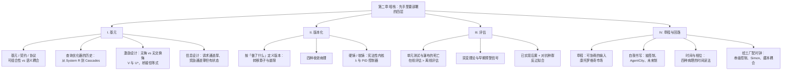
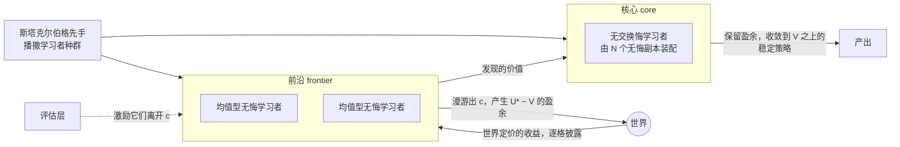
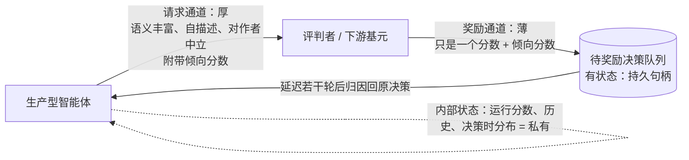
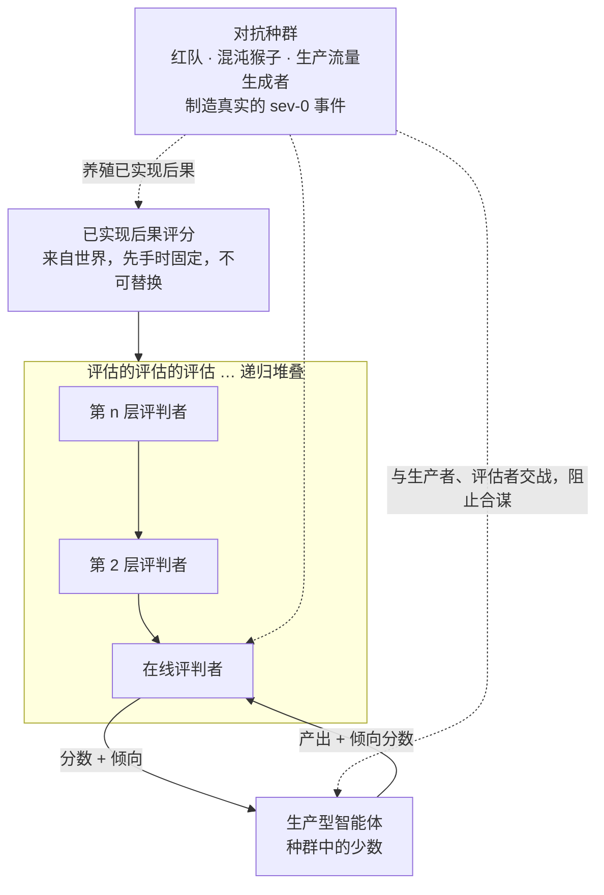
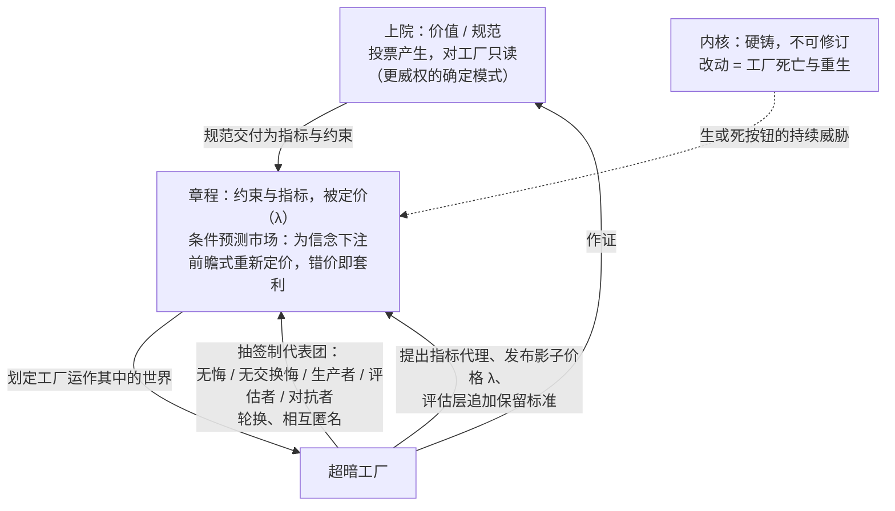

# 超暗工厂 · 第二章：暗栈（The Dark Stack）

> [!info] 文档说明
> **原文**：[Chapter II. The Dark Stack](https://superdark.antikythera.org/chapter-ii-the-dark-stack) · 出自 Antikythera 长文 *The Superdark Factory: Toward the Full Automation of Software*
> **作者**：M. Poliks, R. Alonso-Trillo, T. Dunn, H. Scott-Douglas, J. Springett
> **前置阅读**：[[第1章-黑暗-Darkness]]。本章大量使用第一章的术语：三级工厂、黑暗、神经质治理、速率 r、空间 a / b / c、辅助供给、尾流、斯塔克尔伯格先手、内核。
> **下一章**：[[第3章-万物工厂-The-Anything-Factory]]
> **配图**：13 张黑底手绘图全部来自原站 CDN（在线引用，未下载到本地）；Mermaid 图和表格是本文档补充的，不是原文内容。
> **术语**：关键术语第一次出现时附英文，文末有中英对照表。

---

## 0. 一页速览

> [!abstract] 这一章到底在说什么
> 第一章论证了「为什么」：最好的工厂是人类无法描述的 Class 3 工厂，人必须退出回路，只能在开机前走一步棋，也就是「先手」。第二章讲「怎么做」：**暗栈（dark stack）** 就是这步先手里要部署的四层设计。
>
> | 层 | 名称 | 干什么 | 属于哪种交付物 |
> |---|---|---|---|
> | I | **基元（The Primitive）** | 设计最小软件单元的「形状」，让工厂能自组装、能学习 | 技术前提 |
> | II | **版本化（Versioning）** | 不按「工厂是什么」而按「工厂做了什么」来定义版本；用不可修订的内核给工厂一个身份 | 身份生产 |
> | III | **评估（Evaluations）** | 在线、递归、对抗式的评估层，是工厂的感官与免疫系统 | 技术前提 |
> | IV | **章程与回路（The Charter and the Loop）** | 在输入层上协商着治理，以及治理该按什么节奏进行 | 身份生产 |
>
> 作者的核心工具是**博弈论里的两个量 V 与 U\***：V 是一个静态承诺能拿到的价值，U\* 是从均值型学习者身上能榨出的更大价值。**桥接恒等式** U\* > V ⟺ b\* ∈ b ∖ c 把它们和第一章的 b ∖ c 连起来，大意是：有超过 V 的盈余，当且仅当最优方案落在「满足目标、但人读不懂」的区域。

**本章最关键的判断：**

- 写软件的时代结束了。软件不再被维护，而是像园子一样被**培育**；不再被声明，而是被反馈**驱动**。
- 契约（contract）让基元的内部实现与使用者的收益脱钩：读懂内部也得不到额外好处。这就是**在最小尺度上制造黑暗**，工厂再在全局尺度上把它累积起来。
- 只由无交换悔学习者构成的工厂，只能收敛到架构师已知的最优（V）。要走出可读空间 c，工厂里**必须有一些天真的均值型无悔学习者**。
- 版本不是 Git 提交。两份写法完全不同的配置，只要输入—输出分布在统计上分不出差别，就**是同一个版本**。
- 预生产环境正在消亡：速率 r 越高，它越站不住。评估必须在线，必须有必要多样性，必须层层递归；给评估者打分的信号，必须来自它所评判的回路之外。
- 写评估是人在工厂边界上最直接的治理手段：**把工厂最初的规范和约束写成明确的规格，这本身就是它的第一个 eval。**
- 治理只在章程层发生；干预内核等于让工厂死亡再重生。工厂通过抽签派代表进入自己的治理委员会。
- 治理层就是工厂最慢的那个回路。治理节奏若贴近被控回路的固有频率，就会引发「医源性抖动」，即治理本身造成的抖动。

---

## 1. 开场：两种交付物，四个小节

作者承认第一章刻意不绑定具体介质，但暗栈要落实两件具体的事：**创造让超暗工厂涌现的技术条件**，以及**生产超暗工厂的身份**。眼下最顺手的思考介质是软件：技术前提需要**递归和自适应**，身份生产需要**统计分析和人机接口**，而智能体式 AI 正好是一条现成的、处在当代自动化前沿的工具链。

四个小节交错承担这两种交付物：

| 小节 | 作用 | 交付物 |
|---|---|---|
| I 基元、III 评估 | **让**一个复杂系统能一步步自我发展，并**影响**这个过程 | 技术前提 |
| II 版本化、IV 章程 | 把系统**固定在一个完全外在于它的身份**上 | 身份生产 |

全部内容都用软件（应用编程的原则）来讲，但留有余地做更抽象的讨论。

---

## 2. 第 I 节：基元（The Primitive）

> [!quote] 题词
> "You are not alone in the codebase; do not revert edits made by others and adapt to any existing changes you might find."——Codex 子智能体的惯例指令（作者注：让 Codex 生成子智能体时，这句话常出现在 agent inspector 里）

### 2.1 写软件的时代结束了

> 开篇几句宣言，意思是：软件不再被维护，而是被**培育**；不再被声明，而是被反馈**驱动**。它是反馈回路的产物（或副产品），不是存档后就不变的静态对象。软件成了内容，而内容已不再是施展手艺的地方。

暗栈的介质眼下可以当作软件，但它也是**前软件（pre-software）**：它产出的东西会自组装成软件，嵌进软件的骨架；也像一颗埋好的基因炸弹，条件一到就展开。它是一种**内置在世界里的控制机制**，一种带战术目的的世界构建：往待建的世界里撒下信息，再在这个世界可用的信息里埋下控制。暗栈让能自我引导的自主软件成为可能，同时又悄悄地、有意地划定这种软件被允许长成什么。

### 2.2 基元：最小的原子单元

超暗工厂由**基元（primitives）**组成。基元是最小、最原子化的软件单元：再往下拆，就得换一套描述方式（另一种语言、另一个领域、另一个应用）。**有意识地设计这些基元，是暗栈的第一项技术。**

基元会堆叠、会互相粘连。单个基元的形状，会极大地影响将来能涌现出什么形状，就像 DNA 的物理结构决定蛋白质怎么构建，氧原子的结构决定它怎样与氢结合成水。有的基元能堆成任何东西（比如只收发是/否的基元，或最基本的数学函数）；有的只能按特定方式拼合，只允许特定的几何形状。

计算机科学从门电路、不可变量、类型起步，**抽象地板**（开发时默认站立的那层抽象）一路抬高：从 struct 到 object 到 class，再到托管应用、容器、服务。地板越高，设计决策越要紧：复杂的东西只能用别的复杂东西拼出来，而后者能怎么拼本身又很有限，等于受了双重限制（Gamma 等 1995，设计模式）。

> 图 1 · 原图文字：INFINITE TILINGS / FINITE TILINGS / LIMITED TILINGS——基元的形状决定它能铺出多少种图案。

**软件设计「退回」到了基元设计。** 光说「软件设计就是基元设计」是句平庸的话（写软件本来就是把现成组件拼成新整体）。更有意思的说法是：软件工作不再是把基元拼成这个或那个应用，而是**布置、收集、塑造基元的表面，让新的、有趣的图案自己长出来**。「应用」（规定好某一种拼法）更像上个世纪的设计关切。更有意思、也许更赚钱的机会，是设计出能拼成多种图案的基元形状。

当代的基元也是一种**商品**：Werner Vogels 和 Jeff Bezos 把「primitives, not frameworks」（要基元，不要框架）定为 AWS 的创始哲学（脚注：AWS 近来反倒转向框架，而 AI 领域的竞争者更偏向基元）。眼下的基元是：hooks、harness、子智能体、MCP 服务器、自主智能体。

### 2.3 基元、契约、协议

| 概念 | 定义 |
|---|---|
| **基元（primitive）** | 既能组合（能粘、能连、能收集），又不容易分解的软件单元。要分解就得换一套描述方式：比如把 C 的 for 循环展开成汇编，就得引入一套全新的词法系统 |
| **可组合（composable）** | 由离散、模块化、可复用的积木组成的软件；对立面是庞大的**单体（monolithic）** |
| **契约（contract）** | 基元为了和别的基元连接而暴露在外的部分：接受什么输入、执行什么操作、产出什么输出。**它对输入的要求和对输出的承诺，就构成了基元的形状** |
| **协议（protocol）** | 这些要求与承诺背后隐含的一套逻辑系统 |

作者主要关心基元设计。软件设计退回到基元设计，**协议设计同样退回到基元设计**：基元设计好了，协议才有空间从中自组装出来。

> [!important] 契约就是在最小尺度上制造黑暗
> 契约让基元的**内部信息**与**消费者（调用方）的收益**脱钩、互不相关。消费者即使拿到基元的全部内部实现，也找不到契约之外可组合的东西；找到的都只是对内部的依赖，而内部必须保留随时修改的余地。**这正是第一章定义的黑暗，只是发生在最小的可用尺度上。** 我们在暗栈最底层「制造」黑暗，工厂再在全局尺度上把它累积起来。

例子：一个 Claude Code 会话（带一组 skills 和 tools）就是一个基元。它定义了结构化输入（系统提示、工具、上下文）和结构化输出（工具调用、文本、工件），这些合起来就是一份契约（组件期待收到什么、承诺返回什么、保证什么条件，例如工具 schema）。harness 的每个子组件，又都可以当作独立的基元来存储、创建和管理。

**从「谁在什么时候读契约」可以读出工厂的等级：**

| 等级 | 谁读契约、何时读 | 例子 |
|---|---|---|
| Class 1 | **设计时**，由写计划的人读 | 工程师查 POSIX man page 或 OpenAPI 规范，硬编码调用，之后按固定不变的路径运行 |
| Class 2 | **计划时**，由工厂自己读 | Claude Code 在轨迹中途读一个 MCP 工具 schema，决定值不值得调用 |
| Class 3 | 推到**最后一刻**：没有任何规划者事先读任何东西 | 契约必须自带足够的自我描述，让基元能针对**写契约时还不存在的约束**被找到、拿来用 |

**放大到智能体对智能体（A2A）**：智能体本身成了相对可替换的基元。它们通过结构化接口暴露能力（A2A 的 agent card、OpenFang 的 Hand 清单）；编排器动态地把智能体组装成工作流，不必懂内部，只需懂契约。Google 的 A2A 协议和 Anthropic 的 MCP 是**殊途同归**的设计：都在定义自主组件之间**最薄的接缝**。

第一波「自主软件工厂即服务」（Amazon Kiro、Factory 的 Droid）把接缝做得更薄。它们把下达局部目标这件事（Kiro 叫 specs，Factory 叫 specification mode）**基元化**成一个结构化的组合单元：智能体接到后自行展开、自组织地完成，同时展开自己内部的一连串基元（图、harness、模型……）。（脚注：Kiro 的 spec 是三个 markdown 文件：requirements、design、tasks；一次长达十三小时的 AWS 大宕机也被归到了 Kiro 头上。）

### 2.4 可组合性高于一切

目标是让**事先没料到的东西**得以出现，所以暗栈的基元设计把**可组合性放在一切之上**，不预设任何装配方式。装配问题被推迟到最后一刻：工具、系统提示、skill、记忆管理各自独立构建，到装配那一刻才组合起来。**如果工厂只能按设计时预想的方式组织自己，那它不是超暗工厂，只是基础自动化。**

换句话说：设计时预想好的装配，每一步推导都落回架构师配给的输入，所以它待在可读空间 c 里。**可组合性，是让工厂的构型空间（所有可能的组织方式）漂出 c 的工具。** 硬编码的智能体流水线就是瀑布：从设计上就被封了顶，顶多成为「架构师已知自己想要什么」的那座工厂。

只有基元**真正可组合**，也就是智能体可以被替换、改道、并行、移除而不引起级联失败，工厂才能自己决定怎么装配。**多数现有架构最终就败在这里。** OpenClaw 这类系统让智能体去创建别的智能体，看似自组织，实则仍是层级式、命令式的（A 决定用特定指令创建 B）。**Class 3 的可组合性**是指：一个自发形成的编排层能发现可用基元、评估它们的契约、针对某个输入把它们装配起来，而且**没有任何单个系统或智能体需要在上下文里掌握完整拓扑**。自动 harness 优化的前沿（DSPy、GEPA、SkillOpt）是朝这个方向迈出的认真一步。

### 2.5 厚还是薄：暗栈的核心张力

反过来问：**糟糕的可组合性长什么样？** 要避免的情形是：一组基元技术上能互相通信，却**暗中依赖**彼此的推理方式、身份或输出格式，而契约里没写这些依赖。这叫**语义耦合（semantic coupling）**。打个比方：下游代码依赖了上游某个没写进文档的返回格式，上游一改就坏。好的基元把契约写得足够显式，让语义耦合降到最低；越标准化、越自描述越好。但问题是：契约能不能**既丰富到足以让真正的自主装配发生，又薄到仍然可组合**？

| | 过厚（过度规定） | 过薄（规定不足） |
|---|---|---|
| 后果 | 限制了系统自组装时能用的图案种类 | 太放任：可能性太多，反而什么有趣、有用的东西都成不了形 |

**厚或薄、丰富或狭窄，是暗栈的主要设计张力之一。**

作者拿《可组合数据管理系统宣言》（Pedreira 等 2023）作对照。宣言对数据管理系统得出了类似结论（丰富的组件好、薄的契约好、语义耦合坏），也卡在同一个问题上：薄契约既然不能完全阻止语义耦合，怎样造出足够稳健的**中间表示（IR）**？宣言最后的答案意外地绕回了它自己反对的东西：**要是所有系统都用同一个执行引擎呢？**（脚注：他们建议 Substrait。）这对可组合系统是个很大的要求，或者说，是一个很大的基元！**一个基元能大到什么程度，还算是在做可组合设计？**

最尖锐的回应来自宣言引用的系统之一 **DuckDB**：它**向外**极度可组合（能嵌进第三方系统），**向内**极度不可组合（是一个几乎没有依赖的内部单体；脚注：它在 2025 年初把 Substrait 从代码库里删掉了）。这在它的领域是合理的：SQL 分析是边界已不再移动的成熟问题类，所以可以放弃内部可组合性，收敛成单体，也就是**一个计划**。**但超暗工厂不能做成单体，因为单体就是被定死成一个计划，句号。** 工厂在任何时刻都可以包含大结构，但内部结构该多「大」，是一个**要在运行时不断摸索的经验问题**，按外部约束按需装配。

### 2.6 一段相关的历史：查询优化器

为找折中，作者回到数据分析还远未定型的年代。向数据库发一条结构化查询（「找出满足这些条件的记录」），服务端由一段例程决定怎么找最好，这就是**查询优化器**。它不只要产出计划，还要产出**最好的**计划，「最好」通常按计算资源或时间衡量。这是典型的 Class 2 备选决策：优化器事先不知道最优路线，每一步选择还会大大影响后面还能怎么选。十张表的连接大约有 **170 亿种**排序方式，从中选出最优是 NP 完全问题。

| 年份 | 系统 | 形态 | 含义 |
|---|---|---|---|
| 1979 | IBM System R | **单体**：用一段线性的手写过程，推算各种执行顺序的成本 | 每加一种新数据类型、访问方法或连接算法，都得人工大改这段手写过程，还要有人把整体重新验证一遍 |
| 1987 | EXODUS | **基元化、模块化**：工程师提供一堆小规则（每条对应一个代数事实），一个通用搜索过程用这些规则生成的碎片拼出计划 | 没有哪个过程在「编写」这个计划；每条规则都是单独写的，对其他规则一无所知 |
| 1995 / 1998 | Cascades 框架 / SQL Server 7.0 | 同上，投入生产 | Apache Calcite 等共享库为几十个引擎做规划 |
| 当代 | 自适应查询执行（如 Spark） | **干脆抛弃计划**：查询中途停下，数清实际产出了多少行，再为剩下的部分重新规划 | 计划只是一个猜测，要拿查询执行中实际暴露出来的情况去检验 |

为什么单体撑不下去？第一，要修改它就得**理解**它；第二，要**创造**它就得把整个查询优化空间装进一个人的脑子里。用第一章的话说：**System R 的治理成本 g 是「每次修订一个人头」**（每改一次，都得有个人把整套东西装进脑子），非常昂贵。查询优化器是一台 Class 2 机器，它的历史就是 **Class 2 工厂递归地组装出 Class 2 工厂的历史**。

> **想造一个计划，就尽管造。** 如果你的目标已经定型到值得做成计划，你所在的领域已经尘埃落定，那做成一个计划也许正合适。但只要你造的东西碰到了还没定下来的部分，软件就会在接触点上**软化、碎成模块化的基元**。而 Class 3 工厂周围，全是这种没定下来的东西。

### 2.7 面向持续学习的激励设计

要建的是什么？希望哪些结构自己组装起来？哪些结构是 Class 3 的技术前提？什么样的底层形状（契约）最能促成这些条件？**基元设计可以理解为激励设计**：定义什么样的契约，就是在鼓励什么条件下出现什么行为。

**稳健的简约。** 机制设计近年的研究（Bergemann & Morris 2005 的「稳健机制设计」；Carroll 2015 的「稳健性与线性合同」）给出一条已在提示词/上下文工程里得到验证的原则：**设计者对一个复杂系统（比如一个模型）了解得越少，就越不该把它的奖励结构设计得太具体。** 条款繁复、例外重重的激励规则，只有在设计者对智能体的行动空间了解透彻、能写清每条条款时才管用；不了解却硬要面面俱到，每条细节都会变成对手钻的空子。稳健的设计依赖弱主张（对系统做尽量少、尽量宽松的断定），而不是强主张。**这就是「稳健的简约」原则：架构师知道得越少，施加的结构就该越少。**（作者注：这已是提示工程的通行惯例，见 Anthropic 2025。）

**设计对象不是理性最优响应者，而是无悔学习者。** 2010 年代末，机制设计开始把设计对象看成会自我发展的学习算法。从黑箱外面看，合理的假设是：工厂内部的智能体（架构师承诺策略、开机后那一连串博弈里的玩家）**不是**理性最优响应者，而是**无悔学习者（no-regret learners）**。

- 理性最优响应者：每一步都选期望收益最大的动作。
- 无悔学习者：只按自己观察到的结果调整行动，不对环境建模；长期平均下来，表现能追平事后看来最好的那个固定策略。「悔」就是实际收益与这个事后最优策略之间的差距，「无悔」指这个差距平均下来趋于零。

为什么这个假设更合理？因为理性最优响应需要一样谁都没有的东西：对世界的特权访问（知道每个动作真实的期望收益）。Camara 等（2020）、Braverman 等（2018）、Deng 等（2019）的结果表明：**为理性最优响应者设计的机制，碰上无悔学习者可能表现极差。** 为学习动态设计的机制则承认：智能体会经历探索阶段；会为减少悔恨做出从贝叶斯视角看不太理性的决定；任何一轮的行为都只是收敛过程中的一个样本。**所以超暗工厂的激励设计应当假设早期工厂是一团彻底的混乱，并且不要过早阻止这团混乱沉淀、凝结、朝某个战略方向收敛。**

可以放心地把工厂内部看成**一叠可组合的无悔学习机器**：无悔学习几乎是所有自适应系统的默认行为（多臂老虎机、强化学习、梯度下降）。学习者可以是一个在单轮内自发派出子智能体的智能体、一个引导多轮对话的 harness、一个动态创建智能体图的工作流监督者、一个服务编排器、工厂的各个部门，乃至整座工厂；也可以是自发训练出来的模型。多数情况下，真正在学习的不是「模型」本身，而是**接上了非确定性方法的确定性软件**。

### 2.8 无悔 vs 无交换悔：V 与 U\*

| | 无悔学习者（no-regret） | 无交换悔学习者（no-swap-regret） |
|---|---|---|
| 问自己的问题 | 「在我的一生里，我总体上是否该选一个不同的方案？」 | 「对我选过的每一个方案，是否该把它换成某个特定的其他方案？」 |
| 通勤者例子 | 为每条路线记一个运行平均（到目前为止的平均用时），多数时候走最快的，偶尔试试别的；年底问：我的平均通勤是否至少和「每天只走最优那条」一样好？ | 车里放一张电子表格，问：每次走高速时，走小路会不会更好？每次走桥时，走高速会不会更好？由此发现「下雨时桥明显更差」这类条件信息 |

表面上看，无交换悔学习者「更好」：凡是某种条件下换个选择会更好的情况，它都会逐一找出并纠正。**但是**，一旦架构师定好基元、把结构承诺进工厂并开机，无交换悔回路就只会**收敛到架构师决策里隐含的最优策略**：把架构师这局游戏玩到最优，然后停下。用博弈论的话说，架构师拿到的是**斯塔克尔伯格价值 V**（Deng 等 2019）。

斯塔克尔伯格博弈分先后手：先手（这里是架构师）先公开承诺一个策略，后手看到后再做最优应对。V 就是先手承诺策略、让完全理性的智能体来应对时，所能拿到的最佳收益。

| 量 | 含义 | 对架构师意味着什么 |
|---|---|---|
| **V**（Stackelberg value） | 承诺一个策略、让理性（无交换悔）响应者应对时的最佳收益。它通常是**下限**：面对任何无悔学习者，优化者都能保证总收益至少为 (V − ε)T（T 是轮数，ε 是个很小的量，即平均每轮至少拿到 V − ε，几乎就是 V） | 架构师的先手是**永久承诺**，所以面对无交换悔学习者，V 从下限变成**上限**：无论怎样安排博弈过程，都榨不出超过 V 的收益，因为这类学习者会收敛到针对任何承诺的理想反制（最佳应对） |
| **U\*** | 针对**均值型（mean-based）**无悔学习者（天真地追着运行平均走、多数时候选历史平均最好的选项），同一套理论找出了第二个、更大的量。它是一个最优控制问题的值：把学习者累积的奖励当作状态，求怎样一步步操控这个状态最划算。它是能从任何均值型学习者身上榨出的**确切最大值**，在某些博弈里严格大于 V，有时大得多 | 脚注：只有当均值型学习者有三个以上动作时，才可能超过 V；只有两个动作时，无悔就已经意味着无交换悔 |

**提取时间表，以及为什么工厂写不出它。** 安装暗栈是一次性承诺，这和 Deng 等人的论文吻合：拿到 U\* 不需要第二步棋，只需在第一轮之前写死一张**「提取时间表」**：先放几轮诱饵，等学习者的运行平均偏到想要的位置，再突然切换，趁它们还没调整过来收割盈余。整张表可以事先写好，因为均值型学习者不是在对你做反应，而是在对**它对你的记忆**做反应，而这份记忆只取决于你自己过去的出招。

**那为什么不在先手里写好整张时间表，来一次「诱饵加切换」？** 因为 Class 3 工厂恰恰写不出这张表：**架构师从设计上就不知道这场博弈的「收益」，工厂也不知道。这正是关键。** 给博弈定价的是世界，而世界只在博弈真正进行时才揭晓收益。架构师不知道行动最终会被怎样定价，只能承诺一个**静态策略**，而静态承诺的价值就是 V。**V 与 U\* 之间的差距只能间接拿到：靠先手时播撒的那批混合的学习者，只有它们能在博弈进行中采样世界给出的收益。** 这就是「基元设计即激励设计」的含义：**你播撒的学习者种群，是唯一能越过 V 的工具。**

换个角度说，V 与 U\* 的差距，形式化地度量了「架构师初始化时装进工厂的选项之外，还能得到的一切」。再想想 Thompson 的电路：结果不是在设计者评估过的走法范围（b ∩ c，满足目标且可读）里找到了更好的一步，而是靠系统内部动态走到了范围之外（b ∖ c，满足目标但不可读）。**一座完全由无交换悔回路构成的工厂，找不到任何在架构骨架 c 之外的东西。超暗工厂至少要在某处保留一些天真的、均值型的无悔学习，否则走不出 c，也谈不上真正的黑暗。**

### 2.9 桥接恒等式

作者提醒：不要把两套词汇硬凑成一个定理。U\* > V 说的是重复博弈能拿到多少价值；b\* ∈ b ∖ c 说的是最优解落在解空间的哪个区域。这是两件很不同的事，只有在**一个条件**下才能挂上钩：超暗工厂的**超暗**。

为什么需要这个条件？先看反面。假设架构师或工厂能在某种意义上「拥有」这场博弈的收益矩阵，即拼出一张完整的表：架构师能承诺的每一步占一行，工厂的每种响应占一列，每格一个收益值。那样的话，两套词汇描述的就是很不同的情况，没法联系起来。封闭博弈（哪怕复杂如围棋，只要有规则）的这张表是拼得出来的；Deng 等人研究的博弈都属于这一类。

但在超暗工厂里，这些格子是什么？行是架构师开机前承诺的结构，列是工厂可能做的一切，格子里的数字是这个组合**最终值多少**：交付的东西找不找得到买家，AlphaFold 的折叠在实验室里成不成立，满足某条规范这个季度值多少钱。**这些数字是关于世界的事实：某个组合真正被走出来的那一刻，世界才把数字写进格子，之前不会。世界是那个逐格填表的玩家，一个格子里是什么数字，只有真正走进去才知道。** 先手时播撒的学习者，就是派进格子里「亲身站一站」的装置。没有人握有这张矩阵，架构师最不可能。**只有在这个条件下，也仅在这个条件下**，才可以采用：

$$
U^* > V \iff b^* \in b \setminus c
$$

| 符号 | 原文释义 |
|---|---|
| U\* | 以均值型学习者累积的奖励为状态的最优控制问题的值；能从均值型无悔学习者身上榨出的最大值 |
| V | 斯塔克尔伯格价值：对一个理性的、无交换悔的响应者承诺一个策略，所能得到的最佳收益 |
| b\* | b 内的最优构型 |
| b | 解空间：满足目标的构型；在 Class 3 里是满足规范的构型 |
| c | 可读空间：能追溯回治理者输入的构型，对应 Class 1 与 Class 2 |
| ∖ | 集合差。b ∖ c 是在 b 里、但不在 c 里的构型：持久但不可读，只有黑暗工厂能抵达 |
| ⟺ | 双向成立，且只在超暗之下成立：**盈余存在，当且仅当最优构型位于可读集合之外** |

从右往左读：如果最优构型在可读空间之外，那么从工厂能榨取的价值超过 V；反过来也成立。

由此，V 和 U\* 也能用第一章的 **P** 来理解：**V 是 P 的地板**：处在地板上的，是一座收敛后把「架构师知道自己想要的一切」的价值全部保住并交付出来的工厂，等于花大价钱买来一个 P = 0；**U\* − V 则是地板之上、只有无悔学习者够得着的一切。**

这层关系不是白来的，要靠暗栈里的一系列架构承诺**挣来**：

1. 学习者得**能够**走出可读空间：靠在工厂里播撒均值型无悔学习者。
2. 得**激励**它们离开这个空间，尤其是在发现有趣东西的时候：靠评估设计（第 III 节）。
3. 发现有趣的东西后，还得**保住**学到的价值：在**前沿（frontier）**播撒均值型结构（产生 U\* 盈余），在**核心（core）**播撒无交换悔结构（保留盈余）。基元结构必须两者都能编码。

**不管播撒哪种学习者，契约都必须提供三样东西**：跨轮保留的记忆；一组学习者清楚自己在其中做选择的动作；能追溯回「挣得它的那个决策」的奖励。无交换悔学习者还需要第四样：**反事实的来源**，即对「没走的那条路」的某种记账（下文的倾向分数）。

无交换悔学习者怎么造？Blum 与 Mansour（2007）证明它不必直接构造，可以用普通无悔学习者拼出来：

1. 取 N 个普通无悔学习者的副本，每个动作配一个；
2. 每个副本只负责「它的动作被选中」的那些轮，只问它唯一会问的问题：「在我这些轮里，本该选什么？」；
3. 每轮把各副本的建议合成一个动作分布；奖励回来时，按倾向分数拆回给各副本（见图 4）。

**所以基元设计可以专注于让无悔学习者成形，同时谨慎地播撒一种（有限的）反事实计分方法，让其中一部分能聚合成无交换悔学习者。**

### 2.10 面向持续学习的信息设计

**具体怎么做？** 这项工作和学习算法关系不大，几乎全在于**控制哪些信息到达谁手里**：一个基元能凭什么信息、按什么标准、做什么决定。一群无悔学习者拿到足够多关于世界的信息后，能自组装成无交换悔学习者。核心需要这种学习者，但前沿需要一支更大的、**永远拿不到这些材料**的队伍。**所以基元设计是一种信息控制：在早期那个混沌未定的阶段，架构师通过决定什么公开、什么私有、什么丰富、什么稀薄，来管理起始种群。**

**Walden Yan 的转向。** Cognition 的 Walden Yan 在 2025 年的《别造多智能体》里主张默认不用多智能体架构，理由是「动作携带隐含决策，冲突的决策带来坏结果」（即语义耦合）；必要时就传递完整轨迹，尽量合并成单线程智能体。但 2026 年他修正了立场：**写代码和评审代码的智能体完全不共享上下文**时，代码评审回路效果最好。上下文干净的评审者不受编码者累积历史的影响，只从 diff 倒推，反而能抓到编码者抓不到的问题。于是建议变成：写代码的智能体之间共享完整上下文，**凡是可能评判代码的智能体，一概不给上下文**。Yan 甚至说开放问题「全是通信问题」：弱模型何时上报；子智能体发现了会影响兄弟智能体工作的事，怎么报上来；怎样「在不淹没接收者的情况下在智能体间传递上下文」。

两个要点：
- 如果一类工作真的是**单流**的（只有一条连续的工作线），它就该是一个单流实体（一份累积的上下文）。在智能体 AI 里，「共享上下文」和「作为一个智能体运行」没有区别，所以单流任务应保持单操作者。
- 如果工作需要**评估**，评判者就**永远不该**掌握被评对象内部运作的完整上下文，而应像看一台机器那样看它：只看输入、输出。

契约（结构化输出与期待的结构化输入）是智能体展示给外界的部分，其余都是外界看不到的内部。契约暴露每个内部细节，给组合的分辨率就太高了（消费者会依赖上基元无意承诺的信号）；暴露太少，消费者又拿不到可组合的信号。

**协议的两种定义。** 自下而上：让一群契约自由互动，所有可能的互动方式合起来就是协议，就像一组可镶嵌的基元能铺出的全部拼法（见图 1）。自上而下：先把协议作为通信系统写出来，由它规定下层每个基元必须暴露的输入输出。不管哪种定义，**协议的力量都在于：在任何交换发生之前，它就约束了所有未来交换的形式。**

信息设计领域（Bergemann & Morris 2019）给出了用通信协议有意塑造博弈空间的一般原则。Kamenica 与 Gentzkow（2011）的《贝叶斯说服》证实了先手的力量：发送方如果**事先承诺一条披露规则**（在知道有什么可披露之前就定好披露什么），就能不说假话，把理性接收者的后验信念（看到信息后更新过的判断）推过决策阈值。这一结果在学习动态里依然成立：委托人（发出信息、设计激励的一方）面对无悔学习者仍能拿到约等于承诺价值 V 的收益，面对均值型学习者则能超过 V、趋近 U\*（Lin & Chen 2024）。

**架构师处在斯塔克尔伯格先手的位置，必须仔细考虑任何长期信息承诺的影响。好的信息设计，是架构师离场后仍能促进工厂生产能力的设计。工厂一旦开机，一个智能体的契约空间就是它感知世界的全部渠道。**

### 2.11 两条通道：厚的请求，薄而有状态的奖励

传统协议设计偏爱「窄腰」（如 IP）：一条薄接缝，不管上面（TCP、HTTP、应用）还是下面（以太网、Wi-Fi）的复杂性怎么增长，它都不受影响。但在持续学习系统里，「薄」有实际代价。

| 通道 | 应该多厚 | 为什么 |
|---|---|---|
| **请求通道（request channel）** | **厚**：语义丰富、自描述 | 请求太薄，消费者就得自己补空白：要么编造新信息，要么依赖没说出口的先验。餐馆常客说「老样子」通常能如愿，但请求变成了隐式的，全靠服务员的记忆；新员工只能躲到吧台后问同事，或者瞎猜。**原因没说出来的规律，很难学会。** 这是语义耦合在协议层面的重现。请求必须丰富到能自我描述，不能指望消费者靠上下文元数据（比如是谁提交的）去推断；请求的作者在这里要么无关，要么可替换，要么是私有信息。收到请求的智能体，也应以另一个语义丰富、对作者中立（谁写的都一样能读懂）的请求回应。MCP 工具 schema 和 A2A agent card 已是完整、语义丰富又中立的自描述范例 |
| **奖励通道（reward channel）** | **薄**：奖励永远是一个分数 | 反馈不是用一次就完（像控制流那样），而是被学习者跨轮**累积**。丰富反而有害：拿到太多上下文的学习者，会依赖上各种偶然信号（反方向的语义耦合） |
| 但奖励里必须附带 | **倾向分数（propensity score）** | 如果奖励只有一个分数（错误码、浮点数、布尔值），协议只能养出普通无悔学习者：没有多余的统计倾向信息，就没法构造反事实。倾向分数是智能体**在做决定时，对自己抽样所依据的概率分布的记录**，和产出一起公开：softmax 给某个选项的权重、模型对自己输出 token 的概率估计，或探索规则明确给出的概率（如 K 个动作上的 ε-greedy：(1−ε)+ε/K，即当前最优动作被选中的概率）。把倾向分数作为请求的公开部分发出，另一个智能体在评估打分时就能把它和奖励对应起来，再返回给学习者。为什么要这样？因为知道当时这个选择被选中的概率，才能推算另一个选择本来值多少，也就是反事实。（脚注引 Bottou 等 2013：Bing 广告系统在做选择的那一刻记录倾向，以便拿历史流量估计改动的效果；这是离线策略评估的标准做法。） |
| 奖励通道还必须 | **有状态**：一个受管理的「待奖励决策队列」 | 训练学习者的分数从不和它所评的动作同时到达：奖励总是延迟的，有时晚很多轮，还必须找回产生它的那个确切决策（和确切倾向）。所以返回通道必须让动作**在时间上可寻址**：给每个抽样动作一个持久句柄，之后的分数挂到句柄上。打个比方，就像异步任务的 job ID，结果晚到时凭 ID 找回原任务 |

**公开与私有。** 这里说的不是工厂层面的「绝对保密」，而是信息在智能体之间的**相对可得性**（谁能看到什么）：正是它决定了种群里长出这一种而非那一种学习者。架构师用两种方式安排它：结构（A2A 契约被设计成暴露什么）和内容（初始化时实际披露什么）。

如果每笔 A2A 交易都完全透明（每个智能体公开整个决策过程，包括它能选的全部选项），超暗工厂自组织的上限又会从 U\* 被压回 V（见下表第 (2) 行）。这是最弱的信息设置（脚注：公开信息可能降低协作各方的福利，Morris & Shin 2002）。架构师如果想造出严格超出自己设计的东西，不仅要让信息保持私有（只留在做决策的智能体内部），还要在种群里**主动散播分歧（dissensus）**（Arieli & Babichenko 2019）：事先让智能体的信念各不相同，防止种群塌缩成单一动机。

设计原则是**最小充分披露（minimal sufficient disclosure）**（Kamenica & Gentzkow 2011），即只披露刚好够用的信息。披露太多，等于把智能体会拿去过拟合或钻空子的信号交给它（Blackwell 1953）；披露太少，它又缺少协调所需的东西（还可能由此引入语义耦合）。一条信息要起作用，必须满足：结合智能体做决定时所了解的一切，照它行动平均而言对智能体自己有利；否则自主智能体可能直接无视它。这就是贝叶斯说服里的**「服从约束」**。「平均而言」很重要：披露的好处可以跨很多轮兑现，不必每轮都兑现。

**信息的公开与私有应当这样安排：**

| | 什么 | 公开 / 私有 |
|---|---|---|
| (1) | 工厂的信息图式（整体信息结构）：基元架构、A2A 契约的 I/O 格式、请求与奖励的结构 | **绝对公开** |
| (2) | 一个智能体的局部状态：运行分数、历史、决策时的分布矩阵 | **绝对私有**（一旦全员可读，就会因透明而塌缩：人人收敛到同一处，工厂只值 V） |
| (3) | 唯一例外：倾向分数的内容（随请求往前传，存在奖励队列里） | 只装入刚好够用的信息，让接收者能推算出另一个选择本来值多少 |

小结，基元架构的四条核心原则：(1) 可组合性与某种形式中立；(2) 用普通无悔学习者可组合地装配出无交换悔学习者；(3) 协议层请求通道丰富、奖励通道薄但有状态；(4) 信息公开/私有上的最小充分披露。**这些都只存在于架构师的先手里。** 一旦开机，超暗工厂马上开始重构自己；值得注意的是，重构的头几个阶段被预期、甚至被鼓励为**基本没有产出的**。

---

## 3. 第 II 节：版本化（Versioning）

> [!quote] 题词
> 「像一个『醒来』在陌生世界里的异世界（Isekai）主角，LLM 带着它的权重和后训练行为进入一个代码空间……系统提示塑造它认为自己的目的是什么，可用工具决定存在哪些动作，上下文窗口设定能被呈现和知道的视野。我们以为自己在从世界之外给它指令，但对模型而言，这些指令就是世界。换掉系统提示或工具，它在实质意义上就是另一个世界里的另一个演员。」——Jay Springett，《Hard Worlds for Little Guys》

### 3.1 版本不能是 Git

超暗工厂在初始化那一刻就**失去了有状态性**：它不再有一个能说清的单一状态，而是同时叠加着许多配置（甚至许多组「许多配置」），每一种都在局部配置状态之间不停切换。若把软件变更记成提交，得到的是一条机器速度的连续推送流，快到**每次推送都是强制推送、都带分支冲突、都包在特性开关里，而且转瞬即逝**。（脚注：Adam Tornhill 虽持相反立场，但也承认「合并冲突正迎来它们的鼎盛期」。）

**暗栈里的版本控制不能是一条线性的时间点记录，不能是 Git。** 传统版本控制成立，是因为离散代码是惰性的（自己不会变），理论上能复现、能回退到之前的状态。Git 在 Class 1 里完美；到 Class 2 开始吃力（它的时间信息要和系统及输入的实时日志放在一起，才能复原工厂）；r 越过某个未知阈值后就不能用了（回想控制塔）。

超暗工厂由持续学习的**概率性软件**而非离散软件构成。执行并不断培育代码库的是一群智能体，它们的行为无法（或不值得）还原成更小尺度的现象。配置状态（提示词哈希、模型标识/检查点、拓扑）当然可以作为取证元数据记下来（代价高、转瞬即逝，webhook 式的），但**不能当成工厂的版本**。配置空间至多是一个每几毫秒更新一次的极高维概率分布。「昨天的」超暗工厂已不存在；就算重建每个可观测参数，再跑一遍也会得到不同的结果。**超暗工厂不后退，只前进。**（脚注里作者提到一个漂亮的反讽：暗工厂编排平台 Gas City 用了支持分支的版本化 SQL 数据库 Dolt，却根本没用它的版本控制功能。）

### 3.2 按「做了什么」定义版本：POSIWID 与转移算子

「工厂是什么」无从知道，所以版本不按这个定义，而按**它做了什么**，尤其是**它眼下在做什么**来定义。这借用的是 Beer 的 POSIWID（系统的目的就是它所做的事）。

任何动态系统都会落进或稳或不稳的**行为吸引子**（系统反复趋向、一时稳定下来的行为模式）。但吸引子只能通过输入与输出之间的**亚稳关系**观察出来：输入是规范与约束；输出不只是工作产品，还包括按输入里的指标对产品做的评估。亚稳，是说底层一直在翻腾，工厂的行为却在统计上保持一致（至少一段时间内如此）。

> [!definition] 什么算同一个版本、什么算版本变化
> - 两份配置**写法完全不同**，但只要产生的**输入—输出分布在统计上分不出差别**，就属于同一个版本。
> - 输入—输出分布变了 → 版本变了。
> - 章程层面的输入被修订 → 版本变了。
> - 外部力量改变了「当前输出分布能否满足输入」的条件 → 版本变了。
> - 版本变化边界模糊但可测量：一个版本描述的是一段行为一致期，它可能随时因任何原因结束；相继的版本之间**不应期待有线性关系**（版本在工厂里不「递增」）。

版本化是一个**主动过程**：以对抗的方式持续评估工厂的输入—输出动态。版本变化由各种观察者（在线 LLM 评判者、人、离散或概率方法）共同测量，但严格说来，这些观察者并不在工厂之外，它们本身就构成隔开工厂与世界的那堵墙：墙像海绵一样多孔、黏糊糊、边界不清，而且原则上会一直渐近地往后退。测试套件自身的版本化也遵循同样的规则。

**转移算子（transfer operator）**让这种版本化变得具体。它借自动力系统理论，用来预测一个概率分布的下一步：

1. 把工厂的可观测行为**划分成格子**（比如按章程各指标的评判分数组合）；
2. 给近期输出落在各格子里的情况维护一个运行直方图；
3. 统计一个格子里的行为多常转到另一个格子。**这张转移倾向的计数表就是算子**（打个比方：像统计用户从 A 页跳到 B 页的次数，得到一张页面跳转表）。
4. 任一时刻的直方图减去工厂的长期平均，得到各格子高于或低于平均的盈亏地图。算子的**本征态**是一类特殊的盈亏地图：随时间推移只会整体按比例变淡、形状不变，对应或多或少可靠的行为模式。
5. 少数几个模式衰减得很慢，其余衰减得快，两者之间的距离就是算子的**谱隙（spectral gap）**。它读出**版本化是否正在发生**：几乎不变的区域划分清楚（谱隙宽）→ 版本持久、定义良好；谱隙小 → 版本互相渗漏，或某个版本只是临时、过渡的。

> 图 5 · 原图文字：λ₁ = 1 是长期平均，永不衰减；λ₂ 是版本之间的切换；两者与其下 λ₃…λₙ（版本内的搅动）之间的距离就是谱隙。

注意：这里的 λ₁…λₙ 是算子的本征值，和 3.4 节起的惩罚权重 λ 不是一回事。

### 3.3 病理检测：四种收敛病理

从驾驭的角度看，版本稳不稳健本身无所谓好坏，只描述工厂发展中行为翻腾的程度。但「回归（regression）」这个概念对超暗工厂确实存在，只是它隐含的时间感很别扭：回归到什么？回到什么时候？超暗工厂没法靠恢复先前配置来倒带，所以回归要重新描述为**收敛的病理**：收敛到错误的地方，或者一直收敛不了。

| 病理 | 是什么 | 怎么检测 |
|---|---|---|
| **稳定失败（stable failure）** | 最像经典回归：一个稳健版本（几乎不变、谱隙宽）的输入—输出分布满足不了它的输入。问题不在失败本身（超暗工厂本来就会失败），而在失败**很稳定**：动态掉进一个不想要的吸引子，赖着不走。可能是工厂自己漂进了坏区域，也可能是输入变了而工厂没有足够激励去满足 | 宽谱隙 + 输入未被满足 |
| **过拟合（overfitting）** | 输入想表达的是规范/约束，能验证的却只是它们指标化后的数字。工厂**钻了两者之间的空子**，只优化指标、不管规范。打个比方：为刷高测试覆盖率，写一堆没有断言的测试 | 用转移算子很难检测，因为过拟合的系统仍能不断产生新版本 |
| **学习死亡（learning death）** | 这是工厂**种群动态**的问题：工厂停在斯塔克尔伯格价值 V 上。产生盈余的前沿（把工厂推进新的自主思考区域的均值型无悔学习者）要么死绝（不再被调用），要么被隔离（接触不到保留盈余的无交换悔核心） | 信号很清楚：只剩一个没有多样性的单一状态 |
| **抖动（thrash）** | 永远安定不下来：工厂从不在任何状态上停留。前沿很会发现新的组织方式，核心却每一种都放弃。探索成本全付了，却什么都不能可预期地交付 | 容易检测：谱隙一直不稳定 |

> 图 6 · 原图文字：稳定失败——在规范未被满足的状态下安定下来；抖动——永不安定；过拟合——指标满足了而规范没有；学习死亡——多样性塌缩成单一状态。

目标是给超暗工厂播撒一种**基于激励的免疫系统**，在运行时实时纠正这四种病理。

### 3.4 承诺与第一次提交：硬铸、软铸、宪法性内核

工厂的状态被认为不可知（至少实际上不可知），但仍能从外部追踪。现在要这样理解架构师的先手：它不只是承诺一个策略（并承诺不改），还是**一个把自己的持续存在带进未来的承诺，哪怕这种持续观察不到**。

Josh Stark（2022）在《原子、制度、区块链》里把系统的**硬度（hardness）**定义为「让某事在未来很可能为真」的能力。一个**铸（cast）**是抛向未来、想要固定下来的具体主张（这个词双关：既是投掷出去的东西，也是浇铸成形的东西）。**硬铸**背后有强制执行力，破坏它代价极高，所以能可靠地保持为真；**软铸**只是一句声明，可以悄悄退让。打个比方：硬铸像编译器强制的类型检查，违反了就过不去；软铸像 lint 警告，违反了会被记一笔，但不会被拦下。

合著者 Jay Springett（2026）主张把硬铸从「对行为的形式化规定」提升为超暗工厂所处**「世界」的「物理」**，即这个世界里不可违背的基本规律。架构师的先手于是应理解为一个**薄的、宪法性的内核（constitutional kernel）**：

| | 硬铸（hard casts） | 软铸（soft casts） |
|---|---|---|
| 数量 | 一小组 | 更大的一组 |
| 可否修订 | **不可逆**；违反即不可逆 | 可修订 |
| 作用 | 内核强制执行工厂的基本「物理」：记忆、访问权限、能力。暗栈在内核这里落地成形、自我锁定 | 通过评估层的定价惩罚施加的软约束（原文比作「软皮带」） |

内核对工厂内部（不可变）和外部都**不可侵犯**。为什么？如果架构师随时能顺手修订、分支或回滚内核，内核马上会变成工厂内部理性玩家的**谈判桌**。架构师当然可以保留改内核的权限，但这种修改必须被理解为**致命的**：旧工厂死去，新工厂从新的 v0 开始（Springett 称之为「世界更替」），世界变了。在这个意义上内核是「宪法性」的：不只是「构成」工厂，更真正服务于架构师**给工厂一个身份**的需要。

（脚注：seL4 微内核不到一万行 C，是第一个被证明功能正确的通用 OS 内核，小到它的不变量可以被逐条证明成立；这又是 Carroll 的「稳健 = 简约」。另一脚注：任何没被提升为「物理」的限制，都会被智能体当成**可以绕开的建议**，所以内核必须在结构上不可变；更准确地说，它作为强加的规则，对世界里的种群**不可读**，只被理解为关于世界的事实。）

设计良好的「硬世界」，是不可能发生不可逆伤害的世界。但不是每个硬世界都设计得完美，所以必须始终保留一个**粗暴的终止开关：重构内核，抹掉工厂的身份**。

此外，先手时还可以编码更软的约束来避免上一节的病理性收敛，那就是**惩罚**：对工厂输入—输出上可测量的损害施加**定价惩罚**（眼下可借转移算子的函数来理解）。执行方式是在奖励协议里把评估者返回的分数**按比例调低**。作者建议用**拉格朗日变换**：从奖励里减去 λ·(cost)，λ 是惩罚权重。换句话说，每违反一点约束，就按 λ 这个价格扣分，λ 越大，违反越「贵」。λ 可以用一个 **PID 控制器**来确定，它分三项来调：

| 项 | 作用 |
|---|---|
| Kp（比例） | 看**现在**：规则当前被违反得越多，惩罚按比例越高 |
| Ki（积分） | 看**过去**：累积随时间持续的违反，拖得越久，价格越涨 |
| Kd（微分） | 看**未来**（变化趋势）：对违反变化的速度做出反应，在价格涨过头之前先压住（阻尼） |

（脚注 50：1939 年，数学家康托罗维奇给列宁格勒胶合板托拉斯做车床排程咨询后证明：**每一个最优生产计划都会顺带算出一张价格表**。他把这些对偶量（每条约束一个，衡量它值多少）叫作「客观决定的估值」：最直白的那个词「价格」，出于显而易见的原因没法用。）

**用自调整的定价惩罚对付四种病理：**

| 病理 | 定价策略 |
|---|---|
| 稳定失败 | 给**失败的持续时间**定价：工厂在一个未达标的宽谱隙吸引子里待得越久，惩罚越高 |
| 抖动 | 惩罚**谱隙持续波动的时长**，激励无交换悔核心在「足够好的结果」上稳定下来 |
| 学习死亡 | 作为**关于世界的事实**写进去：一部分算力和写权限只能用于**无历史的动作**（不带倾向记录、不带奖励轨迹的决策），为无悔学习者建立并保住一个生态位 |
| 过拟合 | **最难在先手里用工程手段解决**：过拟合是意图与指标之间的鸿沟，而工程师能定价的对象只能是**又一个指标**，又多出一层可能的过拟合。唯一的出路是把暗栈用到工厂的免疫系统和感官，也就是评估上 |

---

## 4. 第 III 节：评估（Evaluations）

> [!quote] 题词
> 「虚静无事，以暗见疵。见而不见，闻而不闻，知而不知。」——韩非子《主道》（原文英译：Be empty, still, and idle, and from your place of darkness observe the defects of others…）

### 4.1 单元测试与瀑布的死亡

经典软件里，单元测试像**阶段闸门**：在 SDLC（软件开发生命周期）的关键阶段放一个通过/不通过的二元过滤器，决定分支能否进入下一阶段。但它的核心假设已不再成立，至少在规模化时不成立：

- **单元**的假设：软件能切成小块，每块单独运行时的行为能预测它组合后的行为。时间上还多一层：单元与时间无关，同样条件下现在执行是什么结果，以后也是。
- 所以单元测试断言的是：**正确性在执行之前就能知道**，而不是要在规模化运行中才能发现。

SDLC 瀑布（需求与设计 → 实现 → 验证 → 维护，一路往下游走）建立在同样的假设上：预生产环境能合理地模拟生产环境，所以变更总是、也只会往下游流；软件可以提前测试；需求可以事先写全，不必在迭代中发现。这和本文对软件的根本理解（**软件本体论**）完全不同。

**第一波 Class 2 软件工厂**（尤其是老牌企业软件，见 Microsoft 2026）原样继承了瀑布的形态：仍有设计流程（对象换成了智能体 harness、图、服务）、定义好的预生产环境、写在预生产转生产关口上的正确性标准（评判分数与阈值）、一个离散代码与新智能体特性一起上线的部署时刻，以及靠追踪、记录 LLM 调用的可观测性。闸门由离散测试加**离线 LLM 评判**组成：离线评估把工程师预先定义的「正确」编成问答数据集，作为后台任务被动地跑，把问题发给智能体，再由另一个智能体判断答案与期望答案是否一致；另外叠加边缘案例、提示注入、种族偏见等筛查。这些工厂也开始把生产轨迹回灌进离线评估（所谓**黄金数据集**）。

**但预生产环境本身正在消亡：r 越高，它越站不住。** Charity Majors（2026）说：「生产环境里有了非确定性代码，终于逼我们去做本来就该做的事……在生产中测试和评估。**生产不是开发结束后才发生的事，生产是开发的一个阶段。**」超暗工厂**优先用在线评估而非离线评估**。CI/CD 流水线里部署前跑的评估，本质上还是遗留的预生产单元测试。在线评估在生产中持续运行，因为被评估的系统本身在持续变化：即使配置没变，工厂部署时的行为也不等于 t + n 时的行为，因为行为取决于外部条件（模型供应商更新、API 延迟分布、用户群漂移、上游数据 schema 变化），而部署前的快照捕捉不到这些。**在线评估始终在运行，不只在生产环境的模拟里，而是作为第一方直接参与生产。**

| | 离线评估 | 在线评估 |
|---|---|---|
| 时机 | 部署前、被动、事后 | 生产中、持续、第一方参与 |
| 本质 | 带 LLM 的条件式离散闸门 | 学习者 |
| 当代例子 | Prometheus（把评分量表和参考示例注入评判者提示，让评判以示例为锚）；Confident AI 的 DeepEval DAGMetric（把评估拆成由 yes/no 决策节点组成的有向图，最后落到确定的裁决）；Braintrust 可把它们接回生产流量 | 第一波是**护栏（guardrails）**：用粗糙的语义搜索筛查有毒词或疑似 PII（个人身份信息）的 token（Amazon Bedrock Guardrails、NeMo）。在线，但条件极其死板，使用前就被程序写死 |
| 规模化时的问题 | 依赖预生产与生产一致，而这种一致随 r 增大而消失 | 护栏又退化成了基本的单元测试：生产前写好，拿到生产里用。典型失败：认不出非英语姓名里的 PII，或在医疗等行业不停误报 |

**超暗工厂里的在线评估是学习者。** LATTICE 这类研究项目已开始走向会自我发展的护栏：「把对抗测试与自动策略改进结合，把发现的越狱转化为新的护栏规则，无需人工修补」（Broadhurst 等 2026）。LATTICE 的持续改进层只接受不降低分数（F1）的更新。但每次更新都是针对性的条件修改，不是开放式探索，所以这个回路只能收敛到当前规则集的相关均衡（现有规则框架内的一个稳定点），**迈不出那些会降低分数、却能发现真正新东西的步子**。在这个意义上，LATTICE 是一种无交换悔学习者。

**必要多样性。** Ashby 的必要多样性定律（「控制论第一定律」）：控制者能应对的状态种类（就输入而言），至少要和被控系统一样多。打个比方：只会报三种错误码的监控，管不住有三十种故障模式的服务。如果工厂是一个既有交换型（即无交换悔）学习（保留核心）、又有均值型学习（探索前沿）的动态种群，评估层就**必须包含明显更多的均值型无悔评判者**，多于 LATTICE 那类交换型评判者（两者都重要）。这种种群平衡是超暗工厂应对**灾变**的前提。

### 4.2 灾变（Catastrophes）

René Thom 的**突变理论**指出：连续系统的参数即使平滑变化，行为也可能突然出现不连续的跳变。它提供了一个框架：**控制空间**（控制者能调的参数，如速度、载荷、温度）映射到**行为空间**（系统最终落进的状态），而这个映射可能极不均匀：在控制空间里平稳推进（给梁加越来越多的载荷），在行为空间里未必平稳，可能是一次大的不连续跳变（梁先慢慢弯曲，然后突然断裂）。

| 突变模式 | 含义 |
|---|---|
| **折叠（fold）** | 同样的控制条件下，行为空间的某个区域**双稳**（有两个都稳定的状态）；系统会在两者间突然跳变 |
| **尖点（cusp）** | 系统有两个控制旋钮，各自独立变化，会让相同条件下出现不同行为；由此带来滞后、任意的路径依赖、出人意料的表现，更关键的是更复杂的折叠，以及更普遍、更显著的折叠灾变 |

超暗工厂**布满潜在的灾变**（脚注：不然它就不是超暗工厂）：既藏在工厂各处控制与行为之间复杂的非线性映射里，也藏在众多同时驱动行为变化、协调程度各异的控制者之间。**评估功能同时做两件事：管理输入与输出之间的激励，把两者连起来；为灾变站岗。** Thom 对这套理论能否用于预测颇有保留，他更想提供一种描述灾变形态的语言。但**早期预警信号（EWS）**研究继承了突变理论，能帮动态系统判断自己是否临近灾变，同时承认提前诊断灾变、预测其时间和走向都极其困难。

> [!important] 评估的四条暗设计原则
> 1. 评估必须**在线且持续**。
> 2. 评估者群体必须包含均值型与交换型学习者，达到**必要多样性（还要有富余！）**。
> 3. 评估必须**递归**，而且是大规模递归：每个评估者都可能、也一定会出错，会对自己的奖励结构过拟合，或被想要奖励的生产型智能体钻空子。Beer 再次登场：任何可行系统都由更小的可行系统构成，每一级都是在自己范围内感知、决策、生产、奖励的完整单元。所以超暗工厂里有**评估的评估的评估的评估**，一直叠到整套评估装置决定的任意层数。**超暗工厂里的评估者很可能比生产型智能体耗费更多算力、发起更多调用。**（脚注：这对当代实践是巨大的改变：Braintrust 建议高流量应用只评估 1% 到 10% 的流量，以控制成本。）
> 4. **给评估者打分的信号，必须来自它所评判的回路之外。** 否则评估层会和它监督的生产者朝同一个目标优化，两个阶层一起掉进同一种过拟合。

递归评估栈对感知即将到来的灾变尤其重要。按 EWS 校准的系统需要在多个尺度上关注三个指标：

| EWS 指标 | 看什么 | 预示什么 |
|---|---|---|
| **方差（variance）** | 一个观测指标在多种时间尺度上的波动幅度 | 系统越来越难回到平衡时，方差摆动变大 |
| **自相关（autocorrelation）** | 当前时刻与之前时刻有多相似；如延迟分布、错误率等指标受扰动后要多久才平复 | 与方差一起识别**「临界减速（critical slowing down）」**：系统从扰动中恢复得越来越慢，是即将崩溃的重大警示（快断的梁，每次重压后都要越来越久才能弹回原状） |
| **集成分歧（ensemble disagreement）** | 一群各不相同的评判者，对同一情境的裁决有多分散 | Thom 的尖点与折叠在这里重现：同样的输入，评判群体却形成不同的共识模式 |

这些评估在暗栈的每一层循环进行，像涟漪一样传遍整个评估者群体。

### 4.3 过拟合与对抗种群

生产型智能体（现已明确是超暗工厂种群里的**少数**）通过分数与倾向分数的配对从评估者那里学习。评估者也通过类似配对学习（用于无交换悔学习），并**由上一层打分**：越往上越抽象，每层看下层的打分是否符合工厂输入文档，据此给下层打分。评估者的裁决若「名义上正确地应用了输入文档」就能得到奖励；但和离线评估不同，这些裁决没有在输入层面被严格预先定义。

**但这不能是评估层唯一的奖励机制**，否则评估者和生产者很容易被激励去**合谋走向过拟合**。还需要**第二个奖励信号**，来自工厂输入之外，最好在先手时就内置：**已实现后果（realized consequence）**评分，即看裁决是否预测中了真实的下游结果。例如，一个评判者标记了某个异常行为，只有当这个异常确实先于一次真实回归出现，或在工厂的世界里造成了真实失败时，它才该得到奖励。这个机制一直追溯到**辅助供给**：正是这股未经配给的供给，让 AlphaFold 成功，也让 Thompson 电路过拟合。在这一点上，只有已实现后果评分能区分成功与失败。但它需要真实的回归和失败，所以这种奖励不仅**稀少**，还会**随时间越来越少**。要得到足够多能用的这类评分，**就必须主动培育、制造它：诱发一定程度的对抗活动。**

- 首先，大多数评估**不是**对抗性的；其次，对抗层不只有评估者，也有生产型工人，两者都是均值型与交换型学习者的健康混合。
- 对抗层既在工厂膜状的墙**里面**，也在**外面**：既像持续交付流程里的混沌猴子（随机制造故障的工具），又主动、认真地生成生产流量。
- **这里的「对抗」指什么？** 一种红队：请「道德黑客」模拟攻击来测试防御。用 LLM 或智能体做红队已是成熟做法（Ganguli 等 2022），更新的做法是让智能体不只模拟恶意流量，还能**持续学习和改进**（「固定的攻击策略很可能失效」——Diao 等 2024）。在超暗工厂里，这场不断升级的红队军备竞赛被扩展到安全之外，直到**大规模、有意、主动地制造严重度 0（sev-0，最高级别）的 bug**。强监管行业的工程经理会对此却步，但任何好的自我改进评估系统，都需要接触严重的灾难性情境来充实已实现后果评分。而且**这些事件不能在人造环境里演出来，必须是真的，而且要源源不断**；工厂对后果的感知依赖真实风险，每一次真实失败都让它对现实的把握更敏锐一点。

这种受控的对抗，最终让全工厂范围的过拟合**很难**发生，理想情况下甚至**可以容忍、无关紧要**：生产者阶层和评估者阶层不许合谋；每个阶层内部的成员彼此主动对抗；已实现后果指标完全在工厂输入之外，在先手时就已固定。

> [!quote] 本节结论
> **在起点上，写评估是人在超暗工厂边界上能用的最直接的治理手段：把超暗工厂最初的规范与约束写成明确的规格，本身就是在写它的第一个 eval。**

---

## 5. 第 IV 节：章程与回路（The Charter and the Loop）

> [!quote] 题词
> `// Generated from spec – do not edit.`——Tessl 平台的惯例：所有代码都带这个头

### 5.1 章程：可协商的输入

走完先手，架构师就从工厂现场撤出，转去做**输入设计**。输入是一组用指标表达的规范与约束，列出工厂**继续活下去**的条件。从工厂的角度看，这场博弈赌的就是生存，因为架构师一旦干预内核，代价总是工厂死亡，再作为一个完全独立的世界重生。

输入以**章程（charter）**的形式交付：作者调侃地从瀑布的「spec」改造出这个概念，翻新成一份**成文、分版次的描述：在给定条件（约束）下，哪些概率状态（指标）可以接受（规范）**。每次改输入就是一份新章程，每份新章程都是工厂的一个新版本。别以为章程总是人写的：第一份章程几乎肯定是和若干智能体系统**合写**的。

例子：StrongDM 的 **Attractor** 是一座带宪法性章程的 Class 2 工厂：三个约七千行细节的 markdown 文件承载了整个代码库，其中列出的保留验证场景（专门留作验证的场景）相当于某种「暗版本化系统」。随着超暗工厂成熟，spec 会越来越概率化：描述给定输入约束下可接受输出分布的多变量可能，保留集、置信区间、样本量要求都可变。

**章程是一个受限的、有特权的治理（干预）场所，一个构建世界的场所（用没那么硬的铸划定可能的世界），也是（也许出人意料）一个协商的场所。** 章程不是只读的，而是由工厂的**治理委员会**共同撰写，委员会里必然有某种来自工厂内部的代表团。不能参与书写自己章程的工厂不是超暗工厂，只是 Class 1 或 Class 2 自动化。**所以写好章程是超暗工厂的核心工程学科，一种真正新的工程**：把意图表达成形式化的分布，即一份统计剖面，丰富到足以约束工厂的输出空间，又让工厂自由决定怎么装配。章程必须精确到能防过拟合，又薄到不人为限制工厂的内部优化。这和基元设计里「丰富还是稀薄」的张力是同一回事，**因为章程本身就是暗栈最外层的基元**。

治理委员会（不管由人和智能体怎样组成）干预超暗工厂时，**只在章程层干预**。治理从不插手工厂内部事务；或者说，插手内部就等于让工厂死亡再重生。治理的方式是重写章程，再让工厂自己做出反应、重新自组织。

**章程怎么能既有绝对的威慑力，又这么可塑？** 答案在于对内核硬铸的承诺：一个「生或死」按钮，它的威胁随时被搬出来：「这是新章程；如果它不能在被定价为可接受的范围之外被满足，工厂就要被报废。」同时，章程要**定价合理**，或者说**足够宽容**：在限度内偏离章程可以接受，而这些限度必然是未定义或动态定义的。

### 5.2 康托罗维奇市场

章程的**定价**（比如经由 PID 控制器）和工厂**约束**所代表的真实成本（token、美元、兆瓦时）值得分开看。用惩罚或奖励给章程定价，必然会建立一个**代币经济**：一条规范可以按真实美元交易、加杠杆或对冲。这类定价机制总是按比例地建立起一种市场关系（脚注引 Miller & Drexler 1988：「像所有涉及目标、资源与行动的系统一样，计算可以用经济学术语来看待」），任何读者都该看出，**超暗工厂最终可以理解为一种市场**。不过它是**康托罗维奇市场**：价格不依赖交换就能涌现（不需要买家和卖家），而且有一个核心价值来源被刻意保持为**不可替换**（已实现后果的奖励结构）。当然，计价单位总是向上解析的：持续、往复的资本流动是任何工厂的客观需要，所以写章程时就要透彻理解规范集的定价 λ 与作为约束确立的物质成本之间的关系。**比拆掉工厂内核更大的终止开关只有一个：0 美元的代币预算。**（脚注：IBM 著名的「绿美元」（真钱）和「蓝美元」（内部灰色记账单位），是工作场所内部动态代币经济的好例子。）

**速度是超暗工厂的前提吗？** 答案是否，但这个「否」不简单。一方面，速度部分由章程划定：速度本质上是一种烧钱方式，因此和一条约束没什么两样。除此之外，工厂有自己的时间：一座慢而稳的工厂理论上也能赢，只要它既能保守地管住开支，又能积累并利用更大尺度的反事实（轮次越长，无交换悔学习者每轮拿到的反事实质量明显越高）。另一方面，Ashby 定律可扩展出**必要速度**：工厂不能比环境慢，工厂的多层控制装置也不能比工厂慢。比环境慢的工厂没法从环境中学习，因为环境漂移得比工厂的自适应机制还快。更具体的例子：超暗工厂特有的安全系统某种意义上靠的是**不断再生的表面**；一旦工厂慢于潜在攻击者的完整渗出周期（探测→发现→攻击→提取），就必须相应地给安全风险定价。**工厂应调到适合自己生态位的速度：快到环境和攻击者都追不上，慢到它的反事实值得保留。**

### 5.3 自我书写：工厂进入自己的治理委员会

**和工厂一起写章程意味着什么？** 当然是一场博弈：不同于先手启动的那场，但与之相关，继承了那场博弈打开的可能空间。新博弈的规则写在 spec 的**写权限**里，而这些规则是硬铸。硬铸不只约束工厂行为，更是**对能动性（agency，主动行动、做选择的能力）的正面设计**（脚注引 Nguyen 2020：政府、城市、道路的设计者主要在「约束能动性」这个层面上工作，而游戏设计者直接以能动性本身为材料）。用 Springett 的话说，章程是在为里面的「小家伙们」设计能动性。改变这些规则同样应导致工厂终止并重建，因为它们和先手属于同一批初始硬铸：**输入层的读写权限也是工厂硬内核的一部分，只是刻在了另一处。**

**最容易交给工厂去写的是指标层。** 指标可看作规范与约束的验收标准，而智能体已很擅长给自己写验收测试（Ferreira 等 2025）。StrongDM 的做法：模拟性能测试里的智能体一旦识别出某种失败模式，就把引发它的案例写成场景加进验收测试（Willison 2026）。超暗工厂可以自己做这件事：给它一条规范，它会提出一个指标来代表它。工厂自己基于后果的奖励结构，也可以（至少部分地）被信任去判断这些代理指标何时已不足以描述规范：允许评估层持续往章程里添加保留测试标准（依据对抗诱发的情况或真实生产流量）。**每一次这样的贡献，都把一个「在世界里的发现」变成书面记录：工厂以辅助供给的形式碰到的东西，被章程追认为正式配给的供给。**

**λ 必须与工厂合作确定。** 既然工厂被信任去为规范提出代理指标，它也该参与确定 λ：提出代理指标，就是在提出一种手段，决定这条规范怎样被代币化、进入工厂的优先级市场。作者进一步论证，工厂对 λ 的贡献不是附带的，而是**必需的**：如果不需要工厂参与就能准确、一致地算出 λ，那这座工厂就不需要是超暗工厂。λ 的值是这条约束在工厂**当前运行点**上的边际价值，即**影子价格（shadow price）**：约束放松一点点，工厂能多得多少。它只在工厂所处的位置上有定义，是工厂在那里运行的副产品，以工厂发布的**投机性价格**的形式送到委员会面前。

**规范层会撞墙。** 一座完全自己制定规范的工厂，会把我们带进尚无定义的 Class 4：不依赖世界的东西。所以在编写规范这一层，工厂会撞墙：要么是**只读的墙**（一部「由外部写成」的规范性宪法），要么是某种**权力分享**的治理结构（如代议制民主）。为什么不能只靠只读的墙？有三种说法：

- 二阶控制论会较真但切题地反对「只读」：给工厂写规范性宪法的人，本身和广义的工厂分不开，所以规范怎么定明明白白是个治理问题。
- 再搬出必要多样性：控制机制（章程级治理）必须具备工厂级的多样性，而唯一能产生这种多样性的就是工厂本身。
- 或者照 Ashby 与 Conant 的原话：好的调节器与它所调节的系统同态（结构上能对应起来）；既然超暗工厂的内部内容没法用结构模型描述，**工厂就必须亲自出现在自己的治理里**，才能形成这种同态。

**具体怎么做？一个成员一直在变的种群，怎样向名义上的「外部」机构派代表团？答案是抽签制（sortition）**：随机选出代表，在一定程度上体现利益相关方的必要多样性。按章程修订的节奏，从工厂种群里抽样入席（无悔学习者、无交换悔学习者、生产型智能体、评估者、对抗者），席位不断轮换，工厂代表保持**相互匿名**：代表彼此不知道对方是谁，其他委员也不知道（这又整齐地对应了大尺度上的关系，也是一种同态）。

| 模型 | 要点 | 与超暗工厂的异同 |
|---|---|---|
| **DAO** | 已在用一组硬铸（智能合约层）和软铸（治理中的生产性、社会性工作）治理一群匿名、流动、部分自动化的成员。例子是 Arbitrum（Blockful 2024），或者说是它的倒置：不是人类为自己建宪法秩序、再把次要投票委托给 AI 智能体，而是把次要投票议题开放给工厂的代表集 | 但工厂参与自己的治理**不是自愿的**（双向皆然）、**不持久**，也**不通过代币加权投票**进行。（作者插一句：按阶层划分投票资格有一段令人心酸的历史，这将是人类躲不开的拐点。） |
| **AgentCity**（Ruan 2026；Ruan & Zhang 2026a、b） | **权力分立（SoP）**：立法归智能体（集体提出、审议、投票，并把任务级政策编码成智能合约）；裁决归人类（以一种奇怪的 RACI 方式「负责」：每个智能体都能通过完整的所有权链追溯到一个人类委托人，制裁与奖励都落到这个人身上）。中间由确定性软件衔接：「智能体推理不透明，但它们产出的法——公链上的智能合约代码——是透明的」 | 价值与信念都交给投票决定 |
| **未来制（futarchy）**（Hanson 2013） | **「为价值投票，为信念下注」**：由人类和/或工厂外智能体组成的治理委员会，对一组更抽象、更根本的规范投票（为「什么是善」立下「先例」）；更低层、更具依赖性的规范及其指标代理、约束决定因素，则部分交给一个**信息优势具有决定性的工厂代表团**。上院对工厂「只读」，但工厂应到议会作证。条件预测市场把工厂私有的、只有在它所处位置上才知道的知识汇总成一个价格；哪个代表把约束的边际价值定错价，就通过常规奖励通道受罚 | 只有信念交给市场定价；脚注强调，这些运行位置本身永远不构成关于工厂的知识 |

采用未来制也改变了确定 λ 的 PID 控制器。原来它是**往回看的**：工厂已经花时间违反某条约束（在真实生产或模拟对抗条件下）之后，才重新定价。未来制下的 λ 必然是**往前看的**：市场根据对约束违反的**预期**持续重新定价。定错价的 λ 当然是**套利机会**，所以工厂里的对抗种群恰恰能靠纠正委员会的错误获利，这和它们被激励去监管过拟合的方式如出一辙。未来制的实践结果好坏参半（Kubinec 2025；多在 DAO 领域，如 MetaDAO），大体结论是：决策明显影响指标时表现好，决策对指标无关紧要时表现差。对超暗工厂，这支持一个观点：**规范或价值层应走一条单独的、也许更威权的决定方式，而约束的确定（λ 与指标）可能很适合交给条件预测市场。**

### 5.4 时间与相位：四种病理的时间读法

**治理什么时候发生？按什么速率？** 到目前为止，工厂与时间的关系说得相当抽象：不太慢，是偶然的，快到或密到外部观察者看不懂内部调度器在干什么。这给治理层出了难题，因为它需要从中分辨出可用的现在、过去、未来（分别对应 Kp、Ki、Kd）。

好在超暗工厂有一个时间单位：**回路（loop）**，即控制论里对照参考值纠正误差的回路。维纳的舵手又出场了：航向是参考，舵是动作，船难免漂移（感知到的后果），舵手随之修正（施加的误差）。反馈回路通常是负反馈，用来纠正误差；但符号也可以反过来，变成正反馈（越来越偏离航向）。一个闭合的循环，不管正负，都是一个回路，可按三个量分析：

| 量 | 含义 | 在暗栈里对应 |
|---|---|---|
| **周期 / 频率（periodicity）** | 回路多久闭合一次（相对频率） | 尚未绑定 |
| **相位（phase）** | 两个回路在时间上的相对位置（见图 11：修正落地有多晚） | 尚未绑定 |
| **增益（gain）** | 按伯德图（控制工程里分析频率响应的图）的说法，回路把一单位误差换算成多大的修正 | **正是 λ**：决定反馈幅度的系数 |

超暗工厂是一叠回路，它们的周期与相位在不同尺度、不同种群之间预期本来就各不相同。一个回路的周期主要由**反馈多久才返回**决定：短的如小回路（在线评估在产出的同一轮里就给单个智能体打分），长的如已实现后果评分，要等真实后果发生。反馈加延迟可能导致**振荡**（人为造出一个没有信息量的大周期：工厂按固定节奏反复回到配置空间的同一区域，每次都学不到新东西）或**不稳定**（每绕回路一圈就把误差放大一次，最终把符号翻成正反馈）。四种收敛病理都可以用时间的语言重新理解，也都有时间上的解法。每种病理都有灾变性（「不稳定」）的形式：增益迅速冲向无穷大或零，哪个方向的终点都是工厂死亡。

| 病理 | 时间读法 | 时间解法 |
|---|---|---|
| **过拟合** | **混叠（aliasing）**：指标只能以有限的速率和分辨率测量规范；规范变得比指标测得更快、更细时，针对测量值的优化就会在测量间隔里偏离规范。工厂改善了每一次读数，规范中没测到的部分却可能任意程度地得不到满足。打个比方：监控每分钟采样一次，就看不到秒级的尖刺 | 像处理违反奈奎斯特采样条件那样：**提高采样率**（测量的速率、分辨率、多样性），直到两者在时间上同步 |
| **学习死亡** | 发生在**周期比机会存在的时间还长**的回路里（过于稳定的回路）。奖励在长窗口上取平均，一个（经均值型学习得到的）探索性发现出现后，还没等奖励它的回路闭合就被放弃了，没有探索者能在探索期内拿到报酬。只按长期平均发报酬的种群，在任何更短的时间尺度上都不再产生变异 | 给探索性学习者发报酬的周期，必须**短于它被派去发现的东西的寿命**：靠**预期性结算**（未来制预测市场），或在先手里设计一种**有保证的耐心**（允许一部分探索种群活得比眼下分数所能证明的更久） |
| **抖动** | **振荡**：发生在周期比「它要纠正的配置的寿命」还长的回路里。回路闭合时，它打分的配置早被重构掉，修正落到了对不上号的后继配置上；用错地方的修正产生新偏差，下一个（同样延迟的）周期又带着同样的不准确去纠正。打个比方：评审意见送到时，作者已经重写了好几遍，照着改只会越改越乱 | 要么**缩短回路**（减少延迟），要么给工厂重构自己的速度**限速**，让回路来得及闭合。若限速不可取（很可能如此），就得销毁这座工厂，并把评估层调整为逐步内置对预期交付延迟的补偿 |
| **稳定失败** | 回路看起来没毛病：按时闭合，反馈准确，相位对得上。其他三种是周期与相位的失配，稳定失败则是**增益**问题：可用增益不够，没法把工厂踢出稳定的失败状态 | 前面已用时间的语言给过答案：给失败状态的持续时间定价；或者（更贴合本节）让失败状态持续越久，**回路可用的增益就抬得越高**。但增益抬到足以把系统踢出过阻尼（阻力大到怎么推都回到原处）的吸引子时，若不加节制，就会**冲过头，进入振荡（抖动）** |

### 5.5 给工厂配时钟：串级控制、Simon、藏本耦合

现在可以回答「治理什么时候发生」了。治理回路的节奏与它最终控制的回路之间，有一种特别麻烦的关系，叫**「医源性抖动（iatrogenic thrash）」**：「医源性」本指治疗本身引起的病，这里指治理本身引起的抖动。如果治理回路修订命令集（如 spec）的速率接近下层回路的固有频率，外层控制器就会趁被控回路还处于**未完成的瞬态**（没稳定下来的过渡状态）时去纠正它。两个控制器互相把对方推向共同的共振，双双以越来越大的增益振荡。这正是灾变性的不稳定：回路增益在 180° 相位滞后处达到 1，把负的误差纠正变成正的误差放大。说白了，相位滞后 180° 就是修正晚到半个周期，本该往回拉却在往外推；增益达到 1，则意味着误差绕一圈回来不会变小。打个比方：自动扩缩容的决策间隔若短于新实例的启动时间，就会在扩容与缩容之间来回抖。

**串级控制**（外回路给内回路设定目标、层层嵌套的控制结构）的文献提出：内回路必须比命令它的外回路快好几倍，最低比例在 3:1 到 10:1 之间（Åström & Hägglund 2006）。这样外回路可以把内回路的复杂性当作常数（从外回路看，内回路早已稳定）。多数工厂回路以机器速度运行，看似对治理的常规更新节奏构不成威胁；但这条规则必须贯穿构成工厂黑暗内部的**整个嵌套回路级联**，治理回路要与工厂**最慢的回路**的周期对齐。

**怎么测量超暗工厂内部一个反馈回路的周期？** 在工厂内部，裁决作为奖励信号被打分智能体用来更新倾向后就丢掉了。但这些裁决会汇总成分数分布，累积成转移算子版本化的依据（版本就是一个时间窗内每项指标评判分数的运行分布）。所以，**对这些分数分布随时间的变化做谱分析（分解出其中快慢不同的周期成分），就能推出最慢回路的周期**。这可以用经典的**系统辨识**工具验证（Ljung 1999）：治理委员会故意注入一个小的意图修订，测量输出分布多久回到稳定分布；这个**稳定时间**就对应最慢反馈回路的周期，委员会据此粗略定下自己修订章程的最短间隔。

> 版本按月才稳定、市场条件却每周全面重新定价的工厂，**没有可行的治理层**。这场永无止境的博弈被夹在两条界线之间：治理太快，看到的只是「采样噪声」；太慢，又会「落后于世界」。这时工厂要么学会加快低层回路，要么合并回路层级，好让自己的治理条件本身站得住脚。

Herbert Simon（1962）在《复杂性的架构》中论证：在任何「系统—子系统」层级中，子系统内部的高频动态早在子系统之间的低频动态变得重要之前就已稳定，所以单凭速度差异，每一层就和其他层「隔离」开了。Simon 更进一步：每个层级子系统不是由内容或形式上的规定（如组织架构图）界定，而**恰恰是由它内部交互运行的频带界定**。打个比方：一个团队之所以是一个团队，是因为成员天天交流，而团队之间只是每周同步一次。于是可以把工厂的治理层定义为**它最慢的那个回路**，而不是按角色，或按它名义上处在工厂「外部」来定义（甚至可以干脆撇开治理问题，只用时间的语言讨论）。

**为什么全文没讲编排层、子系统、工厂各「器官」的管理？** 之前的回答是：按稳健的简约原则，这个尺度上的任何干预都会抑制工厂的自组织。一方面，子系统自动涌现的理由相当充分：每类评估（以及评估的评估）本身就带着特有的回路周期，反馈延迟在这个意义上实实在在地划出了一个系统或阶层（轮内在线评判者对应任务工人，预测回归的评判者对应服务架构，已实现后果评判者对应部署架构）。**工厂一旦拥有具备必要多样性的评估者，内部子系统的粗略分层就「免费」得到了。** Simon 还论证：组合本身会以与内容无关的方式逐步把子系统聚合起来。可以指望这个层级自行加深，一直延伸到工厂的墙外。

**但只靠涌现来发展子系统会失败，原因有二，这迫使我们回到先手：**

1. 靠自动选择实现速率分离，**只有在经历过「没有分离」并活下来之后**才能发现它：工厂要学会不让频带塌缩，只能先穿过一次抖动，而抖动总带着一丝灾变性死亡的风险。一条可能的活路，是在先手时搭好一个**预先构建、允许工厂日后拆掉的编排骨架**，即**拱架（arch-centering）**：造石拱时先用临时木架托住石块，等拱心石定型再撤掉（打个比方，像项目初期的脚手架代码，系统立住后就删掉）。作者对这个编排层长什么样**不表态**。
2. 频带分离一直受到把频带推到一起的力的冲击。只要回路共用某种介质（比如同一个基础模型，它每次发布检查点，都像一个同时作用于所有回路的全局外力）或共用基础设施，就有**牵引同步（entrainment）**的风险：就像挂在同一根横梁上的摆钟，最后会摆成同一个节奏（惠更斯 1665 年的观察）。按藏本由纪（Kuramoto 1984）的模型，一旦耦合或依赖越过某个阈值（Kc = 2/[πg(0)]；各元件固有频率越分散，g(0) 越小，这个阈值越高），行动者就会自发同步，在某些条件下导致**整个工厂子系统的自发湮灭**。完全依赖评判反馈结构中隐含的时间性来分层的工厂，夹在两股力之间：慢的选择压力把频带推开，快的耦合压力把频带压塌。**没有理由指望慢的那股力最终会赢。**

**所以先手必须把某种时间登记（关于节奏的规定）写进硬铸。** 这不是要写死每个系统层级的内容，也不是写死实际的频带，只需写下**让医源性抖动和牵引同步都无法得逞的关系动态**。两条战术，都写进前文那个「薄但有状态」的待奖励决策队列（生产者在其中等异步评判者兑现承诺）：

| 战术 | 内容 | 比喻 |
|---|---|---|
| (1) 最小串级比 | 队列在把裁决交给下一个评估层之前，**强制保证最小串级控制比（比如 3:1 以上）** | 像一个看周报的经理，而不是死盯实时行情的人：信息被有意压住不交给管理层，直到它在一个明显慢于被管理事物运行节奏的时间尺度上沉淀下来；而且不只是时间上压后，交上去的还是**一个分布**，不是一条条明细（Beer 的管理原则再次出现） |
| (2) 随机化延迟 | 这种时间延迟要**随机化、各不相同（jittered）**，有意打乱牵引同步 | 打个比方：像客户端重试时加随机退避（jitter），免得大家同时重试 |

反方向上，**下游不设同样的缓冲**（上层评估层或治理下达的决定不会被扣住托管；往下游发的命令保持丰富但无状态）。原因有二：工厂应当跑赢世界，所以要能即时响应高优先级的下游覆盖指令；上层管理被有意**饿着**，拿不到下游劳动力的信息多样性，以防它们向下塌缩（而且会为此被主动惩罚：重复先前的决定或往下游引入噪声，都浪费算力、拉低分数）。

同时（这话本文已反复说过），某些情况下这些时间频带**需要被打破**，就像均值型无悔学习者组成的探索前沿，需要被允许探索不那么理性的解。低层子系统可能变得过于僵硬、过于确定，通常是因为其中探索型学习者和保留盈余的学习者比例失衡。这种僵硬让子系统随时可能被一个小而快的扰动推进 C. S. Holling 所说的**「释放（release）」**，即局部崩溃（Gunderson & Holling 2002；Holling 2001）。如果这个子系统与父系统耦合过紧（它过于确定，很可能如此），崩溃就会向上蔓延，引发更大、更慢的父系统崩溃。Holling 称之为**「反叛（revolt）」**：子系统靠摧毁自己的治理层来强迫自己得到纠正。对相关子系统和整座超暗工厂，这都应被看作**潜在的积极结果**。上述设计原则正因**从不实际规定频带分离的条件**，才让这种结果成为可能。于是意外的打破受重罚，有产出的打破得奖励，同样由 PID 控制器管理：惩罚慢性的低度打破，奖励果断而有产出的反叛。（脚注：也可以想想 Bogdanov 说的「退化」与「外溢」两种力：一副僵硬的外骨骼，会周期性地通过蜕皮被摧毁。）

**别轻易把牵引同步放下不管。** 到目前为止，超暗工厂一直被当作一个孤立、无依赖、垂直整合的「单子」（自成一体的单元）来讲。这当然不现实：工厂的墙在不断地、渐进地与它试图建模和博弈的世界融为一体；而且工厂很可能（软件向来如此）由大量第三方依赖装配而成：从硬件（GPU 采购、原材料、能源、基础设施）到软件模块（开源库、SaaS 平台、模型供应商），都在以无法建模的周期不断变化。更不能假设只有一座超暗工厂，不能假设超暗工厂之间不共享基础设施或市场，也不能假设两座超暗工厂不会互相共享、互为输入、互为供应商或依赖、互相作为客户来融资。于是可以设想：超暗工厂有与其他超暗工厂**牵引同步**的风险；更险恶地说，**牵引同步还可能被当作工厂之间开战的战术**。治理的职责（一项极其困难的职责）就变成：在永远无法真正弄清那些依赖的情况下，**强制或激励工厂把依赖的类别随机化**。

> [!warning] 本章结尾
> 如果治理失败（除非治理的规模跟着扩大，否则它总会在某种程度上失败），一个由超暗工厂组成的经济就可能迅速变成一个**锁相的、同步的凝聚体**（各工厂的节奏锁在一起），可能在一连串**相互关联的闪崩**中一起垮掉，把对灾变性不稳定的担忧一路放大到行星尺度乃至更远。

---

## 6. 核心术语表（中英对照）

| 英文 | 本文译法 | 一句话解释 |
|---|---|---|
| dark stack | 暗栈 | 先手里部署的四层：基元、版本化、评估、章程 |
| primitive | 基元 | 最小的、可组合又不易分解的软件单元；此刻是 hooks、harness、子智能体、MCP 服务器、智能体 |
| contract | 契约 | 基元暴露给世界的 I/O 要求与承诺；「契约就是它的形状」 |
| protocol | 协议 | 契约隐含的逻辑系统；一群契约互动的可能性场 |
| composability | 可组合性 | 可替换、改道、并行、移除而不级联失败 |
| semantic coupling | 语义耦合 | 契约未捕捉的隐式依赖（推理模式、身份、输出格式） |
| thick / thin | 厚 / 薄 | 契约与协议的核心张力：过厚限制图案，过薄什么都不成形 |
| robust simplicity | 稳健的简约 | 架构师知道得越少，施加的结构越少（Carroll 2015） |
| rational best responder | 理性最优响应者 | 每步选期望收益最大动作的智能体；要求对世界的特权访问，谁都没有 |
| no-regret learner | 无悔学习者 | 只按自己观察到的结果调整；长期平均追平事后看来最好的固定策略 |
| mean-based learner | 均值型学习者 | 追逐运行平均的天真无悔学习者；能被榨出 U\* |
| no-swap-regret learner | 无交换悔学习者 | 对每个选过的方案问「是否该换成某个特定方案」；收敛到对任何承诺的理想反制 |
| Stackelberg value V | 斯塔克尔伯格价值 V | 承诺一个策略、让理性响应者应对能得到的最佳收益；面对无交换悔学习者时，对架构师是上限 |
| U\* | 最优控制值 U\* | 从均值型学习者身上能榨出的最大值；U\* − V 是 P 高于地板的部分 |
| extraction schedule | 提取时间表 | 事先写好的「先诱饵、再切换」时间表；Class 3 里写不出来，因为收益由世界定价 |
| frontier / core | 前沿 / 核心 | 产生盈余的均值型学习者 / 保留盈余的无交换悔学习者 |
| bridging identity | 桥接恒等式 | U\* > V ⟺ b\* ∈ b ∖ c，仅在超暗之下成立 |
| propensity score | 倾向分数 | 智能体做决定时，对自己抽样所依据的概率分布的记录；反事实的来源 |
| request / reward channel | 请求通道 / 奖励通道 | 厚而自描述 / 薄但有状态 |
| minimal sufficient disclosure | 最小充分披露 | 披露太多会被钻空子，太少则协调无从谈起 |
| obedience constraint | 服从约束 | 披露的信息平均而言必须符合接收者利益，否则被忽略 |
| dissensus | 分歧 | 有意在种群里散播异质信念，防止塌缩成单一动机 |
| POSIWID | 系统的目的就是它所做的事 | Beer；按「做什么」而非「是什么」版本化 |
| transfer operator | 转移算子 | 行为格子间转移倾向的计数表；本征态是行为模式 |
| spectral gap | 谱隙 | 宽 = 版本持久；窄 = 版本渗漏或过渡 |
| pathology of convergence | 收敛病理 | 稳定失败、过拟合、学习死亡、抖动 |
| stable failure | 稳定失败 | 稳健版本却未满足输入；问题在稳定性 |
| learning death | 学习死亡 | 停在 V；前沿死绝或被隔离；单一状态无多样性 |
| thrash | 抖动 | 从不安定；前沿发现、核心放弃 |
| hard cast / soft cast | 硬铸 / 软铸 | 掷向未来并凝固的主张；破坏代价极高 / 可悄悄让步（Stark 2022） |
| constitutional kernel | 宪法性内核 | 一小组硬铸 + 一大组软铸；不可侵犯；改动 = 工厂死亡与重生 |
| world-change | 世界更替 | Springett：改内核后旧工厂死去、新 v0 开始 |
| λ (lambda) | 惩罚权重 | 拉格朗日变换 reward − λ·cost；也是回路的增益；影子价格 |
| PID controller | PID 控制器 | Kp 比例、Ki 积分、Kd 微分，用来确定 λ |
| shadow price | 影子价格 | 约束在工厂当前运行点的边际价值，只能与工厂合作确定 |
| Kantorovich marketplace | 康托罗维奇市场 | 价格无需交换而涌现；已实现后果不可替换 |
| online / offline evaluation | 在线 / 离线评估 | 生产中持续的学习者 / 部署前被动的条件闸门 |
| guardrails | 护栏 | 第一波在线评估器；条件写死，规模化失效 |
| requisite variety / velocity | 必要多样性 / 必要速度 | Ashby：控制者多样性不少于被控系统；工厂不能慢于环境 |
| catastrophe theory; fold; cusp | 突变理论；折叠；尖点 | Thom：控制空间到行为空间的不连续映射 |
| early warning signals (EWS) | 早期预警信号 | 方差、自相关（临界减速）、集成分歧 |
| realized consequence | 已实现后果 | 裁决是否预测了真实下游结果；来自输入之外，稀疏且缩减 |
| adversarial population | 对抗种群 | 红队 + 混沌猴子 + 流量生成者；制造真实 sev-0 事件 |
| charter | 章程 | 输入：给定约束下可接受（规范）的概率状态（指标）；暗栈最外层的基元 |
| governance committee | 治理委员会 | 只在章程层干预；含工厂内部代表团 |
| sortition | 抽签制 | 从工厂种群随机抽代表，轮换、相互匿名 |
| futarchy | 未来制 | 为价值投票、为信念下注（Hanson）；上院只读，约束层走预测市场 |
| loop; period; phase; gain | 回路；周期；相位；增益 | 工厂的时间单位；增益 = λ |
| aliasing | 混叠 | 过拟合的时间读法；解法是提高采样率 |
| iatrogenic thrash | 医源性抖动 | 治理节奏贴近被控回路固有频率引起的共振 |
| cascade control | 串级控制 | 内回路比外回路快 3:1 到 10:1 |
| system identification | 系统辨识 | 注入小扰动、测稳定时间 = 最慢回路周期 |
| entrainment | 牵引同步 | 共享依赖导致回路锁相（藏本耦合、惠更斯摆钟） |
| release / revolt | 释放 / 反叛 | Holling：子系统局部崩溃并向上摧毁治理层；可能是积极结果 |
| arch-centering | 拱架 | 先手时预构、工厂被许可拆掉的临时编排骨架 |
| phase-locked condensate | 锁相凝聚体 | 多座超暗工厂同步后的相关闪崩风险 |

---

## 7. 公式与关键关系汇总

| 关系 | 含义 |
|---|---|
| U\* > V ⟺ b\* ∈ b ∖ c | 桥接恒等式：仅在超暗之下成立。盈余存在，当且仅当最优构型位于可读集合之外 |
| V = P 的地板；U\* − V = 只有无悔学习者能触及的部分 | 把第一章的 P 与本章的博弈量连起来 |
| 无交换悔学习者 = N 个无悔学习者副本（每动作一个）+ 倾向分数拆分奖励 | Blum & Mansour 2007；基元设计只需让无悔学习者成形并播撒有限的反事实计分 |
| reward − λ·cost | 拉格朗日式定价惩罚；λ 由 PID（Kp、Ki、Kd）确定，也是回路增益 |
| ε-greedy 倾向：(1−ε)+ε/K | 倾向分数的一种显式来源 |
| 谱隙宽 / 窄 | 版本持久 / 渗漏；抖动 = 谱隙持续不安定；学习死亡 = 单一状态 |
| 串级比 3:1 到 10:1 | 内回路对外回路的最小速度比；治理对齐最慢回路 |
| Kc = 2/[πg(0)] | 藏本模型的同步临界耦合，随固有频率离散度上升 |
| 代币预算 = $0 | 比拆内核更大的终止开关 |

---

## 8. 配图索引

| 图 | 出现位置 | 内容 |
|---|---|---|
| 图 1 | §2.2 | 无限 / 有限 / 受限拼接：基元形状决定可铺出的图案 |
| 图 2 | §2.3 | 基元（契约即形状）、交换、协议（未来排列事前固定） |
| 图 3 | §2.8 | 无悔 vs 无交换悔（通勤者的一个问题 vs 每种交换一个问题） |
| 图 4 | §2.9 | 由无悔副本装配的无交换悔学习者，接缝按倾向分数拆分奖励 |
| 图 5 | §3.2 | 版本变化与转移算子的谱、谱隙 |
| 图 6 | §3.3 | 四种收敛病理 |
| 图 7 | §3.4 | 规则违反与 Kp / Ki / Kd；λ 惩罚权重 |
| 图 8 | §4.2 | 折叠、临界减速、集成分歧 |
| 图 9 | §5.2 | 康托罗维奇市场：每条规范一个 λ，已实现后果不可替换 |
| 图 10 | §5.3 | 未来制治理：上院只读投票，章程层定价与前瞻重定价 |
| 图 11 | §5.4 | 增益、相位、频率；180° 相位滞后 |
| 图 12 | §5.5 | 工厂的谱分析：子系统即频带，治理层是最慢频带 |
| 图 13 | §5.5 | 藏本耦合：共享依赖导致锁相凝聚体 |

---

## 9. 读后思考：和已有学习线的连接

> [!tip] 把本章的框架套回自己正在用的工具
> - **MCP 工具 schema 和 A2A agent card 就是本章说的「厚请求」**：完整、语义丰富、对作者中立的自描述。反过来检查自己写的工具描述：消费者是否需要靠「上下文元数据」去猜？那就是语义耦合。
> - **Walden Yan 的转向直接可用**：写代码的智能体之间共享上下文，评审者拿干净上下文、只看 diff。本章把它上升为原则：评判者永远不该有装配内部的完整上下文。
> - **「版本 = 输入—输出分布」** 是一个可以立刻用在智能体系统上的观念：与其对比 prompt 的 diff，不如对比同一测试集上评判分数的分布是否变了。
> - **四种病理的时间读法**很实用：评估延迟超过配置寿命就会抖动；奖励窗口太长探索就会死；指标采样太粗就会过拟合。
> - **值得质疑的地方**：本章大量关键机制（已实现后果评分、对抗种群制造真实 sev-0 事件、工厂抽签进入治理委员会）都要求接受真实世界的真实损失；作者承认「强监管行业会却步」，但没有给出损失边界。V 与 U\* 的桥接恒等式被明确限定为「仅在超暗之下」成立，而超暗本身是不可验证的承诺，这让恒等式更像设计信条而非可检验命题。

---

## 10. 文中引用的文献（按作者—年份，源自正文与脚注）

> [!note]
> 按正文与脚注中出现的「作者（年份）」整理，括号内为原文引用它的语境；著名经典补了篇名，其余只保留作者—年份。

**软件工程 / 数据系统**
- Gamma 等 (1995)——设计模式与抽象地板；Vogels (2016)——AWS「primitives, not frameworks」
- A2A Project / Linux Foundation (n.d.)——agent card；OpenFang (n.d.)——Hand 清单；Kiro (n.d.)、Seaman (2025)、Robinson (2026)——Kiro spec 与 AWS 宕机；Factory (n.d.-a, n.d.-b)——specification mode
- Khattab 等 (2023) DSPy；Agrawal 等 (2025) GEPA；Yang 等 (2026) SkillOpt——自动 harness 优化
- Pedreira 等 (2023)——可组合数据管理系统宣言；Raasveldt & Mühleisen (2019)——DuckDB
- Selinger 等 (1979) System R；Graefe & DeWitt (1987) EXODUS；Graefe (1995) Cascades；Begoli 等 (2018) Apache Calcite；Apache Spark (n.d.) 自适应查询执行；Ibaraki & Kameda (1984)——连接顺序 NP 完全
- Yan (2025, 2026)——《别造多智能体》及其修订；Anthropic (2025)——提示工程惯例
- Tornhill (2026)——合并冲突的鼎盛期；Koleczek (2026)——Gas City 与 Dolt
- Klein 等 (2009)——seL4
- Microsoft (2026)——第一波软件工厂；Majors (2026)——「生产是开发的一个阶段」；Broadhurst 等 (2026)——LATTICE；Braintrust Team (2026)——评估流量比例
- Ganguli 等 (2022)、Diao 等 (2024)——LLM 红队；Ferreira 等 (2025)——智能体写验收测试；Willison (2026)——StrongDM Attractor

**博弈论 / 机制设计 / 信息设计**
- Bergemann & Morris (2005, 2019)——稳健机制设计、信息设计；Carroll (2015)——稳健性与线性合同
- Camara 等 (2020)、Braverman 等 (2018)、Deng 等 (2019)——对无悔学习者的机制与策略；V 与 U\*
- Blum & Mansour (2007)——从无悔到无交换悔
- Kamenica & Gentzkow (2011)——贝叶斯说服；Lin & Chen (2024)——说服与学习动态；Arieli & Babichenko (2019)——分歧；Morris & Shin (2002)——公开信息的社会价值；Blackwell (1953)——信息比较
- Bottou 等 (2013)、Swaminathan & Joachims (2015)——倾向记录与离线策略评估
- Schelling (1960)、Farrell & Maskin (1989)、Bernheim & Ray (1989)——承诺与可再协商性
- Miller & Drexler (1988)——计算的经济学视角；Hanson (2013)——未来制；Kubinec (2025)、Jonathan G. (2025)——未来制实践；Blockful (2024)——Arbitrum；Ruan (2026)、Ruan & Zhang (2026a, 2026b)——AgentCity 权力分立
- Stark (2022)——硬度、硬铸与软铸；Springett (2026)——硬世界与内核物理；Nguyen (2020)——游戏设计与能动性

**控制论 / 动力系统 / 复杂性**
- Beer (2002)——POSIWID；Ashby (1956)——必要多样性；Conant & Ashby——好调节器
- Stooke 等 (2020)——拉格朗日约束与 PID；Kantorovich (1939)——客观决定的估值
- Thom (1975)——突变理论
- Åström & Hägglund (2006)、VanDoren (2014)——串级控制；Ljung (1999)——系统辨识
- Simon (1962)——复杂性的架构
- Kuramoto (1984)——同步模型；惠更斯 (1665)——摆钟同步
- Gunderson & Holling (2002)、Holling (2001)——释放与反叛；Bogdanov (1980)——退化与外溢
- Odrzywołek (2026)——eml() 算子（脚注 28）
