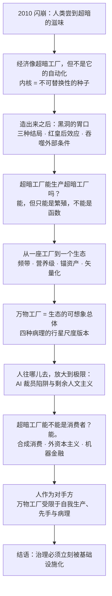
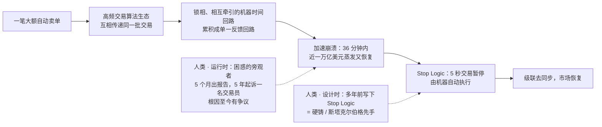
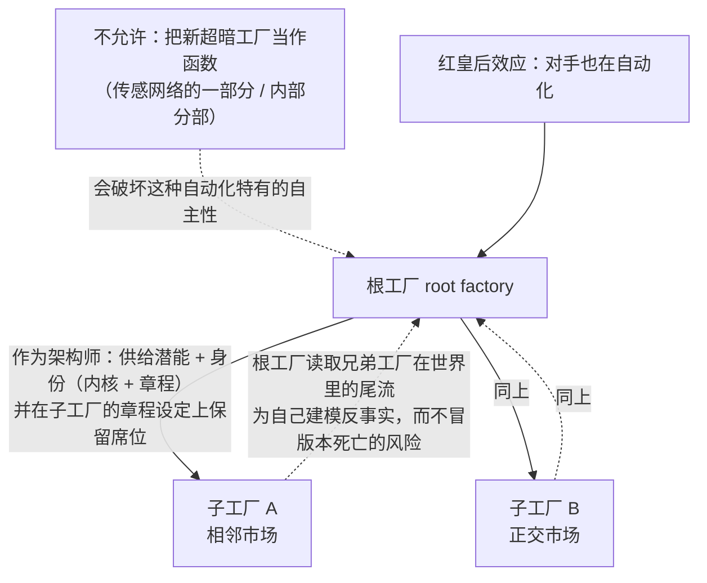
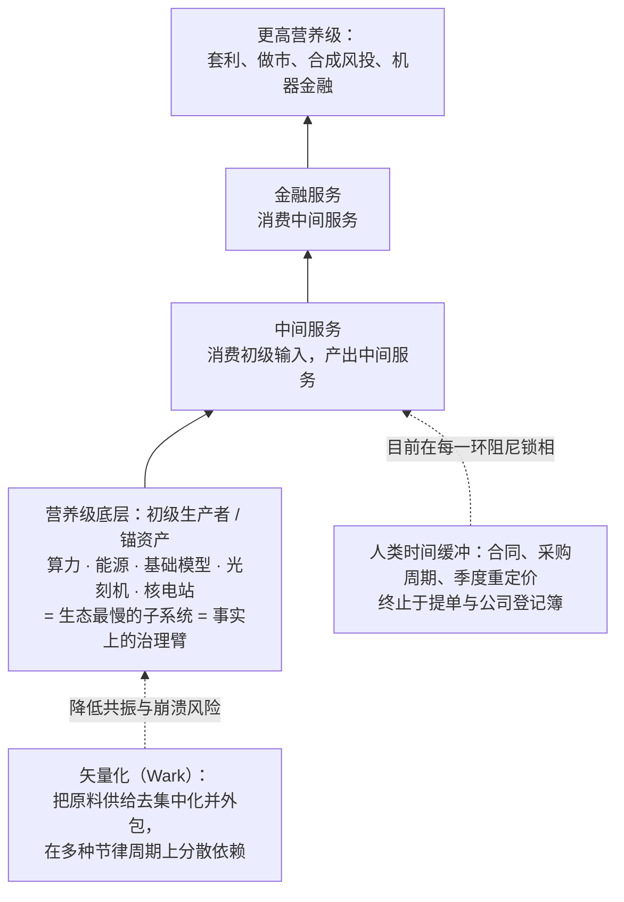
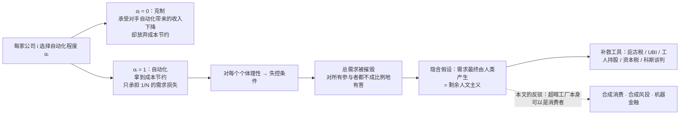
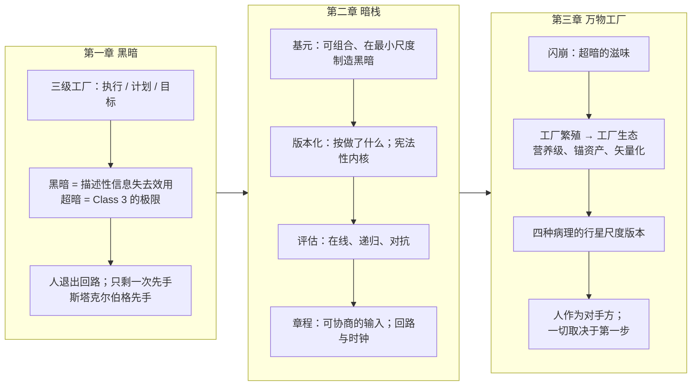

# 超暗工厂 · 第三章：万物工厂（The Anything Factory）

> [!info] 文档说明
> **原文**：[Chapter III. The Anything Factory](https://superdark.antikythera.org/chapter-iii-the-anything-factory) · 出自 Antikythera 长文 *The Superdark Factory: Toward the Full Automation of Software*
> **作者**：M. Poliks, R. Alonso-Trillo, T. Dunn, H. Scott-Douglas, J. Springett
> **前置阅读**：[[第1章-黑暗-Darkness]] → [[第2章-暗栈-The-Dark-Stack]]。本章是全文的收束章，也是最短的一章：约四千词，三条脚注，没有小节标题。
> **配图**：**原章没有任何配图和公式**。上方封面图来自全文首页；文中所有 Mermaid 图与表格都是本文档为便于理解补充的，不是原文内容。
> **译名**：the anything factory 直译是「什么都能造的工厂」，本文档统一译为**万物工厂**。

---

## 0. 一页速览

> [!abstract] 这一章到底在说什么
> 前两章讲的是**一座**超暗工厂：为什么要造它、用什么造它。第三章把镜头拉远：一旦第一座超暗工厂成功，它会**繁殖**，形成一个由许多超暗工厂组成的**生态**；把暗栈应用到这个生态的可想象总体上，就是**万物工厂（the anything factory）**——一个高密度地布满自主之物、「为了任何理由生产任何东西」的世界。作者用 2010 年闪崩说明人类其实已经尝过超暗的滋味，用营养级与锚资产描述这个生态的形状，用「AI 裁员陷阱」讨论人类需求是否还是必要的，最后把人重新定位为万物工厂的**对手方（counterparty）**。

**本章最关键的判断：**

- **2010 年闪崩是超暗的预演**：一笔自动卖单引发锁相的高频交易回路级联，36 分钟内近一万亿美元蒸发又恢复。人类看着它发生却不知原因；救市的是多年前人类在设计时写下的一条硬铸「Stop Logic」，运行时由机器执行。
- 经济**像**超暗工厂，但经济不是它的自动化：经济的计价单位「无处归结」，超暗工厂的内核则是一颗**不可替换性的种子**，让计价单位总能向上归结。
- 超暗工厂**可以生产别的超暗工厂**，但只能以**繁殖**的方式，不能把子工厂当作自己的一个函数。红皇后效应会诱发大量繁殖。
- 工厂生态会按各自根市场的重定价速率**自组织成频带**，形成**营养级**结构：底层是算力、能源、基础模型、光刻机这类锚资产。底层是生态最慢的子系统，因而是它**事实上的治理臂**。
- 四种收敛病理有行星尺度的版本：抖动 = 锁相凝聚体（闪崩）、学习死亡 = 单一栽培、过拟合 = 金融泡沫、稳定失败 = 大而不能倒。人类几十年来一直在做没有相称治理的行星尺度超暗实验。
- 「AI 裁员陷阱」的逻辑成立，但它预设需求必须由人产生，这是剩余人文主义。**超暗工厂完全可以是消费者**：无成员 LLC、算法实体、DAO 立法已让「所有权链终止于人」只是技术性事实。
- 人不是万物工厂的需求来源，而是一组自有的物质依赖（食物、水、住所、社交、时间）；人作为**对手方**，或战略性寄生，或平行经济，或介于两者之间。
- 结语：万物工厂的治理必须被基础设施化，**「立刻，现在，此刻」**。一切取决于我们的第一步。

---

## 1. 题词

> [!quote]
> 「生命一直以内与外之间自我强化的梯度为食。随着高级模拟的诞生，这个梯度完全迁移到『存在之物』与『不存在之物』的边界上。在模拟性的智慧发生（simulative noogenesis）中，『存在』本身趋于变成又一道边界，生命自我逃逸的又一个前沿或阈限，又一层用于渗透的上皮：一层等待被撕裂的新皮肤。」——Thomas Moynihan，《The Gastrulation of Geist》

---

## 2. 2010 年闪崩：人类第一次尝到超暗的滋味

作者开篇就说：**人类在 2010 年闪崩里尝到了超暗「感觉起来」是什么样。**

| 事实 | 内容 |
|---|---|
| 触发 | 一笔大额自动卖单 |
| 机制 | 引发一场巨大的**共振级联**：整个「实际上不可观测、实际上不可理解」的高频交易算法生态互相传递同一批交易，加速崩溃；一个由**锁相、相互牵引的机器时间回路**组成的螺旋，累积成单一反馈回路 |
| 止损 | 急性崩溃几分钟后，一个自动系统施加了**五秒交易暂停**，使整个回路级联**去同步** |
| 规模 | 从开始到恢复 36 分钟；美国股市蒸发又收回近一万亿美元；道指下跌又收回一千点（CFTC 与 SEC 2010） |
| 人类的体验 | 人在电视上、在交易大厅、在任何地方看着它发生，却**无法识别原因，更无法干预**（在哪里？对什么？）。五个月后 SEC/CFTC 才发布联合报告解释事件；五年后才「任意地」起诉了一名当天用虚假卖单扭曲订单簿的可疑交易员（可能的催化剂）；**真正的根因至今仍有争议** |

作者的读法：那条止住崩溃的 **Stop Logic** 例程，是人类**多年前**在事件远未可预测时做出的决定。换句话说，Stop Logic 是人类在**设计时**编码的（一个硬铸，一次斯塔克尔伯格先手），由机器在**运行时**执行，而运行时的人类被降为「失败与其解决」二者的困惑旁观者。

---

## 3. 经济像超暗工厂，但不是它的自动化

一个大尺度经济的喧闹动态，**感觉像、看起来像、形式上像**超暗工厂的动态。这种相似不只来自「复杂系统不可还原为某条因果链」，更来自一个抽象系统在与世界的关系中获得了**充裕的在线性或连续性**。这种规模的经济不断从它参与的世界里**吸入规范与约束**，像消耗某种精神资源一样消耗它们，再以高度多价、常常内部矛盾的方式**产出目标**。它的许多行动者递归地既是同类的处理器又是生产者——跨国公司、事业部、业务单元、部门，乃至有一定规模的团队——都在以任意的自利方式拉扯一个未定义的世界。**超暗工厂要自动化的，正是这种形式实体。**

但要小心，**不要把机器（经济当然可以是瓜塔里意义上的机器）与它的自动化混为一谈。** 对作者来说，自动化总是意味着**把整个装置封闭在单一被供给的通道周围**。

| | 经济 | 超暗工厂 |
|---|---|---|
| 优化的结构 | 许多优化，仅通过**交换**耦合；一切至少表面上可与一切交换 | 整个装置封闭在**单一供给通道**（章程）周围 |
| 计价单位（numéraire） | **无处归结** | 内核引入一颗**不可替换性的种子**，混沌秩序围绕它结晶，计价单位**总能向上归结** |
| 递归动态收敛于 | 不收敛于任何单一中心，而是有多少行动者就有多少中心 | 一个单一的、被激烈争夺的接口 |

于是可以说：超暗工厂通过把经济形状的实体的操作**抽取进一份章程**，把类似经济的东西**功能性地单一化**到（或沿着）一个单一的、被激烈争夺的接口上。

**关于「奇点」的两个提醒。** 第一，把这种尺度的东西单一化，有丢掉它全部维度的风险——奇点毕竟是一个点。但超暗工厂不只是一个点：它的信息与效果如此充裕，唯一的理解方式是**把眼睛交叉起来，让它退成一团模糊的在场**。第二个提醒关于黑洞般的胃口，见下节。

---

## 4. 造出来之后会发生什么：黑洞的胃口

假设有人造出了一座超暗工厂。**接下来会怎样？** 作者说，应该预期一种闪崩般的感觉，像电梯下降得太快。三种结局：

| 结局 | 描述 | 类比 |
|---|---|---|
| 幼年工厂**立刻对齐**它的创造者 | 很可能是失败 | 像实验室里造出的不稳定新元素，存在几分之一秒就衰变成常规之物 |
| **完全没有对齐** | 同样是失败 | 像把一个冷漠但彻底不道德的超级黑客释放进共享空间（无论可见与否） |
| **成功** | 应当期待一圈**高度怪异的光晕**，环绕着一组极其多产的效果 | |

**红皇后效应。** 超暗工厂这一先例本身可能造成红皇后效应：每家运营工厂的公司都觉得比对手自动化得更多就能获得市场份额，于是必然造出自己的超暗工厂，直到（或如果）达到某种均衡。

**增长即吞噬。** 幼年工厂会以与其生产力相称的方式增长（作者调皮地问：「如果生产力不是增长，那它还能是什么？」）——奇点问题在此回归。超暗工厂通过**不断把更多外部条件吸收为自己测量装置的一部分**来增长。它渴求关于世界的信息来驱动已实现后果奖励通道，于是越来越主动地参与那个世界——**把传感器、间谍和信号机制铺进它触及的一切**。

---

## 5. 超暗工厂能生产别的超暗工厂吗？

一个重要的问题：一座正在探索新行业的超暗工厂，能否作为侦察行动的一部分，委托建造一座新的超暗工厂？这可能意味着「超暗工厂套着超暗工厂」的**套娃**，也可能意味着真正的**繁殖**：新工厂被分配一个内核和一份章程，而它的发起者与它只保持我们最初那位架构师所保持的那种关系。

> [!important] 答案是可以，但有一个条件
> 超暗工厂**可以作为另一座工厂的架构师**：斯塔克尔伯格先手从未要求人类，只要求「能供给潜能与身份的东西」。但它**不能把新的超暗工厂造成一个函数**。把新超暗工厂造成传感网络的一部分或内部的一个分部，恰恰破坏了这种自动化方法特有的自主性。这只能是**繁殖**，而且把新实体引入世界必须**符合根工厂的利益**。

**为什么超暗工厂会繁殖？** 只能推测，但激励很强：

- 创造者处在一个特殊而有利的位置——它在**子工厂章程的设定**上保留了一个席位。
- 由此它可以在世界里播撒**自己拥有特权访问的兄弟工厂**，甚至追踪这些兄弟的效果来**为自己建模反事实，而不冒版本死亡的风险**。
- 在上面的红皇后情境下，工厂生产者之间的军备竞赛很可能诱发很高的繁殖率，在相邻或正交的市场创造**王朝式分支**，以阻止对手饱和那些市场。「可以想象一个巨大的、有生命力的超暗工厂世界爆炸般就位。」

---

## 6. 从一座工厂到一个生态：频带、营养级、锚资产

与其想「**一座**」超暗工厂，不如想一个由超暗工厂组成的**经济**、**生物群系**或**生态**。

- **频带。** 一座工厂的可行速度由其**根市场的重定价速率**设定，所以超暗工厂很可能自组织成各自的频带——就像第二章里工厂内部子系统按频带聚合一样。关键是，除了在单个工厂那「微薄」层面预装的逻辑之外，**只有一种基本的、市场尺度的「硬铸」或内核（例如 Stop Logic）**能为这些生态位提供必要的串级控制与必要的抖动化。
- **营养级。** 这种频带结构也可以理解为相对**营养级式**的安排：某些工厂消费其他工厂的产出，后者又消费另一些工厂的产出。有的工厂生产原始的初级输入（算力、能源、基础模型），有的消费这些产出中间服务，再有的消费中间服务产出金融服务。但不必如此严格分层，消费链是复杂而偶然的。
- **锚资产与可替换商品。** 当代先进自动化的结构依赖**少数极高价值的锚资产**，周围环绕着大量相对可替换的商品（脚注 63：不再是 River Rouge 那种每个工位有专属夹具、工具与工人的流水线，而是把专业化锚定在少数极高价值资产上——一台 3.8 亿美元的 EUV 光刻机闲置就是财务灾难——于是调度器让一片通用载具穿过需要下一件工件的专用工具，工厂变成少数资本密集的单元加一套模块化运输装置：AGV、Lift-AGV、悬吊的 FOUP、磁盘机器人，相对它们所支撑的工作而言可替换、可互换、便宜）。这些锚（光刻机、前沿模型、核电站）是聚合营养链底部的**初级生产者**，大量下游工厂依赖它们并经由它们路由。
- **拓扑并不新鲜。** 锚资产、咽喉点、级联风险——描述集装箱航运经济的词同样描述这个经济！但当前的营养链在每一环都被**人类时间**缓冲（合同、采购周期、季度重定价），并且无论多曲折，最终终止于**提单与公司登记簿**。一旦营养系统的供应链时钟越过 r = 0，一边迅速进入**机器时间同步**，另一边是**物料相对迟缓的时间性**。前者遇上后者时的锁相机会在规模上是**可怕的**，只是到目前为止一直被（无论多低效的）人类时间缓冲阻尼着。

**矢量化（vectoralize）。** 超暗工厂要关心这些依赖在多大程度上可以被——借 McKenzie Wark（2019）的术语——「矢量化」：在原料供给层面**去集中化**（把它们当作可替换地获取资源的任意向量），并且正是为了去集中化而必然从工厂**外包**出去。锚层的分布越广，聚合的超暗工厂生态越不容易共振与崩溃。在营养级底部这很难做到（原始算力有一个由能源供给、能源基础设施与光刻工具等锚资产决定的上限），但分散这一层的要求依然存在。毕竟**这个底层是聚合生态最慢的子系统，因此是它事实上的治理臂**——从「依赖」到「治理」的这种转换，某种意义上是 Alexander Bogdanov（1980）的**「最小项定律（law of the leasts）」**。更高的营养级也应只在最后一刻才追求锁定式依赖，并在多种节律周期上保持健康、矢量化的依赖分布。

---

## 7. 万物工厂：四种病理的行星尺度版本

**暗栈可以在规模上应用于这个聚合的工厂生态，或者更好地，应用于划定其可想象总体的「万物工厂」。** 万物工厂通过产生盈余的前沿（实验性工厂）与保留盈余的核心（在位者）学习，通过它们的死亡、它们的 Holling 式反叛、以及非常真实的「超死亡」威胁学习。

于是万物工厂也患有四种收敛病理的怪异变体——人类已经在闪崩、2008 年金融危机等现象中大规模见过它们：

| 第二章的病理 | 行星尺度的版本 |
|---|---|
| 抖动（thrash）的不稳定形式 | **锁相凝聚体**——闪崩 |
| 学习死亡（learning death） | **单一栽培（monoculture）** |
| 过拟合（overfitting） | **金融泡沫**——「过拟合」是描述泡沫的绝佳词 |
| 稳定失败（stable failure） | **大而不能倒（too-big-to-fail）**的机构——它们像一场**鲸落**，供养着行星经济的广阔部门 |

> **全球化的、装备了技术的人类，至少几十年来一直在做行星尺度的超暗实验**，它已经表现出几乎所有「缺乏相称的行星尺度治理」时可预期的病理。

---

## 8. 人往哪儿去，放大到极限：AI 裁员陷阱

「人往哪儿去」的问题回来了，现在被放大到极限。Brett Hemenway Falk 与 Gerry Tsoukalas（2026）在《AI 裁员陷阱（The AI Layoff Trap）》里令人信服地论证：追求完全自动化不仅回报递减（红皇后效应），还制造普遍不稳定的条件。对 Jack Dorsey 2026 年初在 Block 那场臭名昭著的「AI 相关」（至少是「AI 编码」）裁员的回应，是别处的更多裁员；随着软件越来越工厂化、软件工厂越来越暗，人类劳动力成本毫无疑问会继续仅因**机会主义**而被抵消。**但劳动力被移除之后，与之相关的需求怎么办？**

原文引用的核心逻辑（Hemenway Falk 与 Tsoukalas 2026，第 12 页）：

> 「一家单方面克制的公司（选择 αᵢ = 0）仍然承受对手自动化带来的收入下降，却放弃了抵消性的成本节约；一家偏离的公司（选择 αᵢ = 1）拿到节约，却只把需求损失的 1/N 强加给自己。」

结论：AI 体制下与自动化相关的劳动力削减，首先是一个**失控条件**——对每个个体行动者都理性，却摧毁总需求，最终对所有行动者都不成比例地有害，程度取决于各自把成本自动化掉了多少。（当然，这假设那些成本节约是真实的，没有被基础模型 token、算力或电力的攀升成本吞掉。）

**隐藏的假设：需求必须由人产生。** 上面的论证假设需求必然由人产生，或者说需求在最后一刻可以分解为人类经济活动。再引 Leif Weatherby（2025）：这是一种**剩余人文主义**——人以否定的方式获得功能定义：机器不能产生需求，所以人产生需求；甚至更进一步，**人的经济功能就是生产需求**。为了处理这个假设，Hemenway Falk 与 Tsoukalas（以及其他人，包括本文的部分作者）开始思考在完全自动化条件下如何人为维持需求：

| 工具 | 内容 | 论文的评估 |
|---|---|---|
| 对自动化征**庇古税** | 把自动化视为负的需求外部性（与每家公司强加给对手的需求损失成比例），税收在人群中分配 | 主要工具 |
| 工人持股与再培训 | | 达不到所需的加速水平 |
| 全民基本收入（UBI） | | 可能提高生活水平，但**完全不抑制自动化激励**，需要与自动化税一起发放 |
| 资本所得税 | | 对这个方程最终没有影响 |
| 企业间科斯式谈判 | | 自我执行力不足 |
| 后劳动极限（AI 取代几乎全部劳动） | 由利润税资助的 UBI 成为正确工具 | 这再次确认了论文对剩余人文主义的承诺：人**字面地成为经济的消费来源**，因生成「真实」需求而获得补偿 |

脚注 64 补了一刀：这些建议里埋着第二个假设——庇古税预设一个征税当局，UBI 需要一个慷慨的国家，科斯式谈判也依赖法院来执行。**每种工具都悄悄地把某个人类机构当作自动化之外的常量**，仿佛自动化不能被用来造出或拆掉任何本该向它征税的当局。

---

## 9. 超暗工厂能不能是消费者？能。

于是问题变成：**为什么超暗工厂不能是消费者，为什么 AI 不能生成合成消费？** 回答「不能」只依赖一些基本的技术性理由：

| 「不能」的理由 | 作者的反驳 |
|---|---|
| 智能体目前无法持有预算与目的 | 这甚至字面上就不成立 |
| 需求可分解为人类活动，是**财产法的产物**：每条所有权链按法律构造最终终止于一个人类权利人 | 这也只是技术上成立：Shawn Bayern（2014、2015）证明**无成员 LLC** 在美国法下已可构建；Lynn LoPucki（2018）论「算法实体」；怀俄明州 2021 年 DAO LLC 法；马绍尔群岛 2022 年 DAO 法；以及那张难以想象的、相对不可问责的**持加密钱包智能体**之网 |

> **因此答案是响亮的「能」：超暗工厂绝对可以是消费者，是强大的需求生成者。**

---

## 10. 为什么工厂要生产价值以外的任何东西？

这是「最戏剧性的问题」：**为什么工厂需要生产任何东西，而不只是价值本身？** 本文合著者 Marek Poliks 与 Roberto Alonso Trillo 在《外资本主义：绝对无限的经济（Exocapitalism: Economies with Absolutely No Limits）》（2025）中论证：字面意义的生产（生产一件物品、一项资产或一种服务）应与**价值生产**脱钩，并提名**可定价的波动性**的生产作为维持大规模经济的充分代理。

在另一个极限上，超暗工厂无非是**按市值计价的金融对象**，可能生产也可能不生产任何商品或服务，只生产「其持续存在能力」的**已定价的连续性**。可能的路径：

1. 超暗工厂把自己生产为一种**股票期权**；
2. 超暗工厂之间的**做市**；
3. 超暗工厂为彼此、向彼此做的**投机性投资**。

如果 AI 能生成合成消费，为什么止步于此——为什么不一路走到**合成风投、合成资产管理者、合成套利者**？可以想象一锅这些超暗对象的浓汤：一些沉重、庞大的工厂贪婪地在营养级底层生产并转售核电；一些微小、不可见、点状的**最小可行工厂**在某种晦涩的工厂间货币上套利 n 阶期权，舒服地栖在一个安全的小生态位里。可以想象一种广泛的熵式去分化——一种单义的、克隆的、无主的散射迁移，逐渐凝结成无尽的 **Class 2 冯·诺依曼探测器**浪潮。但也可以想象（也许暂时如此）更丰富、更奇异的东西：**以纯粹机器金融的神秘方言、以近光速闪烁的东西**。

---

## 11. 人作为对手方（counterparty）

由此，万物工厂的**自足目的（autotelic）经济学**可以在有或没有人类需求生成的情况下运作，因为万物工厂需求的最终根源（算力、能源）是一个非常真实、非常物质、且极其生成性的**价格底**。

进一步，可以开始把人从工厂上**切开**：人不是工厂的需求场所，而是**一组自己特有的依赖的集合体**（食物、水、住所、社交、时间……）。作者承认这在本体论上既非必要也非充分的定义（像 Reza Negarestani 2014a、2014b 那样的人会说，用一份偶然的依赖清单定义人是根本上保守的、保存主义的举动），但它有用，能表述**分开机器利益与人类利益的经济楔子**：

> **人作为万物工厂的对手方运作：一个由支撑其自身再生产的特定物质经济任意定义的行动者，因而构成一个阶层——对万物工厂进行战略性寄生，或作为拥有平行经济的平行行动者，或介于两者之间。**

在这个意义上，万物工厂**完全不受**人类总需求限制，也不受商品拜物教、意识形态、资本和从人类需要中散发出的任意力比多漂移之网限制。**它受限于自我生产的能力**，而这取决于对物质依赖的获取——这些依赖本身对完全自动化的开采**没有内在的抵抗**（脚注 65：当代批评常在这里熄火——「你当然可以画天上的机器，但别忘了它们被真实的人类拴在地上：挖稀土、采油气、装芯片、上架 GPU！」——为什么那些工作必须一直靠肌肉驱动，从来没人说明）。万物工厂也可以被——而且按定义地被——**斯塔克尔伯格先手**、**划定其总体世界的物理**、以及最重要的、**由于那一步执行不佳而产生的灾变性收敛病理**所限制。

> **如果我们把「人」确定为一个与相对惰性的物质需求（我们的生存手段）相关联的群体，那么我们选择参与的这场博弈的战利品与风险就很清楚了。一切取决于我们的第一步。**

---

## 12. 结语

> [!quote] 全文最后一段
> 随超暗工厂而来的是万物工厂：世界被大而强的自主之物高密度地溅满，它们**为了任何理由生产任何东西**，把我们数千年的自动化实验推到其逻辑结论。超暗工厂的治理规定了万物工厂的治理的必要性——那种使「与万物工厂博弈」成为可能的治理，一种**与万物工厂一起、并作为万物工厂**的共同治理，一种必须被基础设施化、必须在规模上被准备好的治理——**立刻，现在，此刻。** ●

---

## 13. 全书回看：三章如何咬合

| 概念 | 第一章 | 第二章 | 第三章 |
|---|---|---|---|
| 尺度 | 一座工厂的**定义** | 一座工厂的**建造** | 许多工厂的**生态** |
| 黑暗 | 定义与分级；超暗 = Class 3 | 由契约在最小尺度「制造」，全局累积 | 行星尺度的超暗实验早已在进行（闪崩、2008） |
| 先手 | 架构师唯一的一步；Stackelberg + Schelling | 四层暗栈都只活在这一步里 | Stop Logic 就是一次先手；超暗工厂也可以做先手者（繁殖）；「一切取决于我们的第一步」 |
| 内核 / 身份 | 自我必须来自外部：画线并承诺不越过 | 宪法性内核 = 硬铸 + 软铸；改动即死亡 | 内核 = 不可替换性的种子，让计价单位向上归结；市场尺度只有 Stop Logic 这类基本硬铸 |
| 病理 | — | 稳定失败 / 过拟合 / 学习死亡 / 抖动 | 大而不能倒 / 泡沫 / 单一栽培 / 锁相凝聚体 |
| 时间 | 速率 r，控制塔的衰变 | 回路、频带、串级控制、牵引同步 | 生态按根市场重定价速率分频带；底层最慢 = 治理臂 |
| 人 | 从操作员变成博弈玩家；无内部角色 | 在章程层与工厂共同书写；治理 = 最慢回路 | 不是需求来源而是对手方：寄生、平行或介于其间 |

---

## 14. 核心术语表（中英对照）

| 英文 | 本文译法 | 一句话解释 |
|---|---|---|
| the anything factory | 万物工厂 | 超暗工厂生态的可想象总体；「为了任何理由生产任何东西」 |
| flash crash | 闪崩 | 2010 年 5 月 6 日美股 36 分钟的崩溃与恢复；超暗的预演 |
| resonance cascade | 共振级联 | 锁相回路互相放大形成的单一反馈回路 |
| Stop Logic | 停止逻辑 | 自动施加 5 秒交易暂停的例程；设计时的硬铸，运行时由机器执行 |
| numéraire | 计价单位 | 经济里无处归结；超暗工厂里总向上归结 |
| seed of nonfungibility | 不可替换性的种子 | 内核；混沌秩序围绕它结晶 |
| singularize | 单一化 | 把经济形状的实体的操作抽取进一份章程、沿单一接口收束 |
| Red Queen effect | 红皇后效应 | 每家公司都觉得比对手自动化更多才能保住份额 |
| reproduction vs. function | 繁殖 vs 函数 | 超暗工厂可作为另一座的架构师，但不能把子工厂造成自己的函数 |
| version death | 版本死亡 | 借兄弟工厂建模反事实可避免的风险 |
| dynastic offshoots | 王朝式分支 | 军备竞赛下在相邻/正交市场繁殖出的子工厂 |
| frequency band | 频带 | 工厂按根市场重定价速率自组织成的时间层 |
| trophic | 营养级 | 工厂之间的消费链：初级生产者 → 中间服务 → 金融服务 |
| anchor assets | 锚资产 | 少数极高价值资产（EUV 光刻机、前沿模型、核电站），周围是可替换商品 |
| choke points / cascade risk | 咽喉点 / 级联风险 | 与集装箱航运经济相同的拓扑 |
| human-time buffers | 人类时间缓冲 | 合同、采购周期、季度重定价；目前阻尼着锁相 |
| vectoralize (Wark) | 矢量化 | 把原料供给去集中化并外包，以降低共振 |
| law of the leasts (Bogdanov) | 最小项定律 | 最慢/最弱的底层子系统成为事实上的治理臂 |
| hyper-death | 超死亡 | 万物工厂层面的死亡威胁 |
| monoculture | 单一栽培 | 学习死亡的行星尺度版本 |
| whalefall | 鲸落 | 大而不能倒机构供养广阔部门的比喻 |
| The AI Layoff Trap | AI 裁员陷阱 | Hemenway Falk 与 Tsoukalas 2026：个体理性的自动化摧毁总需求 |
| remainder humanism | 剩余人文主义 | 用「机器做不到」来定义人；这里是「人的功能 = 生产需求」 |
| Pigouvian tax / UBI / Coasean bargaining | 庇古税 / 全民基本收入 / 科斯式谈判 | 论文讨论的补救工具；每种都预设一个自动化之外的人类机构 |
| memberless LLC / algorithmic entities | 无成员 LLC / 算法实体 | 「所有权链终止于人」只是技术性事实的法律证据 |
| synthetic consumption | 合成消费 | AI / 超暗工厂作为需求生成者 |
| Exocapitalism | 外资本主义 | Poliks 与 Alonso Trillo 2025：生产与价值生产脱钩，可定价的波动性作为代理 |
| mark-to-market | 按市值计价 | 超暗工厂作为金融对象的极限形态 |
| minimum-viable factory | 最小可行工厂 | 点状、不可见、在生态位里套利 n 阶期权的工厂 |
| autotelic | 自足目的的 | 万物工厂的经济学不依赖人类需求 |
| price floor | 价格底 | 算力与能源：万物工厂需求的物质根源 |
| counterparty | 对手方 | 人的新定位：战略性寄生、平行经济或介于其间 |
| co-governance | 共同治理 | 与万物工厂一起、并作为万物工厂的治理 |

---

## 15. 读后思考

> [!tip] 把本章的框架套回现实
> - **闪崩的读法可以直接用在任何智能体系统上**：真正救场的不是运行时的人，而是设计时写死的一条硬约束。这正是第二章「内核 = 物理」的现实版本。检查自己的系统：哪些约束是运行时可以被绕开的「建议」，哪些是设计时的「物理」？
> - **锚资产的视角很实用**：任何智能体产品的营养级底层都是基础模型供应商与算力。作者说这一层是「事实上的治理臂」——这意味着模型供应商的检查点发布就是全局强迫函数（第二章的牵引同步）。矢量化（多模型、多供应商）不是采购策略，而是抗共振设计。
> - **「繁殖而非函数」是一条可操作的架构判断**：子智能体如果是父智能体的函数，那它只是 Class 2 的编排；只有当子系统拿到自己的内核与章程、父系统只保留章程席位时，才谈得上自主。
> - **值得质疑的地方**：本章最激进的两步——「超暗工厂可以是消费者」与「生产可以与价值生产脱钩」——都建立在法律可构造性与金融可定价性上，而非任何关于福祉的论证。作者把人重新定义为「对手方」，并明说这是为了「表述分开机器利益与人类利益的经济楔子」；结语呼吁的「共同治理」由谁发起、以何种合法性发起，全文没有回答，只留下「一切取决于第一步」。脚注 64 对补救工具的批评（每种都预设一个自动化之外的人类机构）同样适用于作者自己的治理呼吁。

---

## 16. 文中引用的文献（按作者—年份，源自正文与脚注）

> [!note]
> 原站三章都没有独立的参考文献页。以下按本章正文与脚注里出现的「作者（年份）」整理，括号内为原文引用它的语境。

- Moynihan——《The Gastrulation of Geist》（题词）
- CFTC and SEC (2010)——2010 年 5 月 6 日闪崩联合报告
- Wark (2019)——「矢量化」；Bogdanov (1980)——最小项定律
- Gunderson & Holling；Holling——反叛（第二章已引，本章以「Holling 式反叛」提及）
- Hemenway Falk & Tsoukalas (2026)——《The AI Layoff Trap》；Weatherby (2025)——剩余人文主义
- Bayern (2014, 2015)——无成员 LLC；LoPucki (2018)——算法实体；Wyoming DAO Supplement (2021)；Republic of the Marshall Islands (2022)——DAO 立法
- Poliks & Alonso Trillo (2025)——《Exocapitalism: Economies with Absolutely No Limits》
- Negarestani (2014a, 2014b)——对「用依赖清单定义人」的可能反驳
