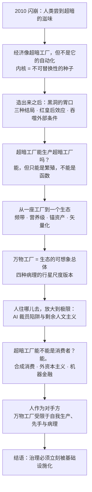
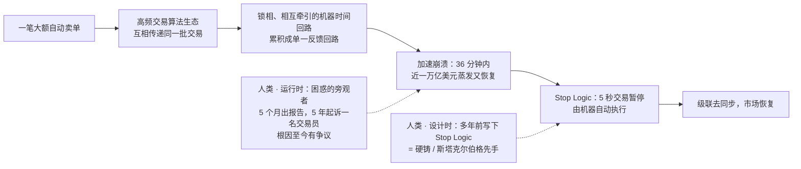
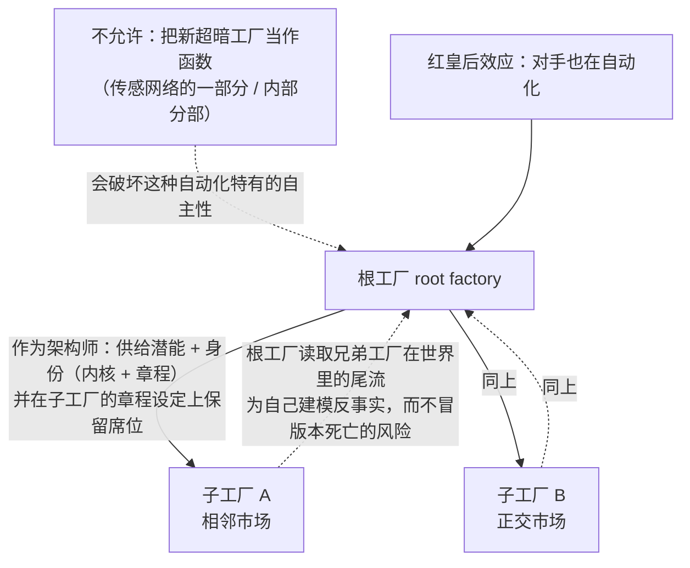
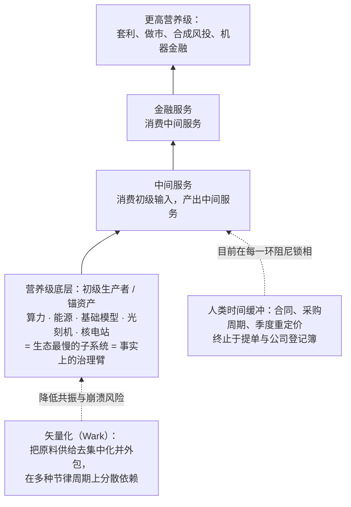
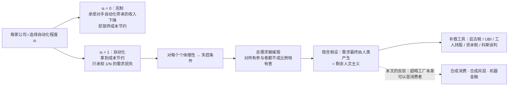
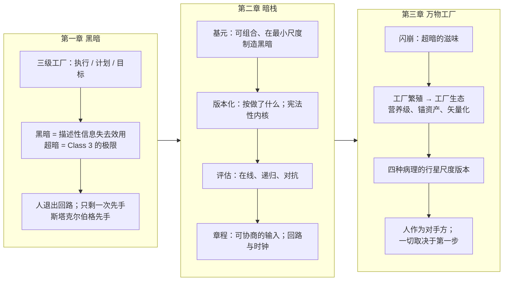

# 超暗工厂 · 第三章：万物工厂（The Anything Factory）

> [!info] 文档说明
> **原文**：[Chapter III. The Anything Factory](https://superdark.antikythera.org/chapter-iii-the-anything-factory) · 出自 Antikythera 长文 *The Superdark Factory: Toward the Full Automation of Software*
> **作者**：M. Poliks, R. Alonso-Trillo, T. Dunn, H. Scott-Douglas, J. Springett
> **前置阅读**：[[第1章-黑暗-Darkness]] → [[第2章-暗栈-The-Dark-Stack]]。本章是全文的收束章，也是最短的一章：约四千词，三条脚注，没有小节标题。
> **配图**：**原章没有任何配图和公式**。上方封面图来自全文首页；文中所有 Mermaid 图与表格都是本文档为便于理解补充的，不是原文内容。
> **译名**：the anything factory 直译是「什么都能造的工厂」，本文档统一译为**万物工厂**。

---

## 0. 一页速览

> [!abstract] 这一章到底在说什么
> 前两章讲的是**一座**超暗工厂：为什么要造它、用什么造它。第三章把镜头拉远：第一座超暗工厂一旦成功，就会**繁殖**，形成由许多超暗工厂组成的**生态**。把这个生态设想到极致、当成一个整体，就是**万物工厂（the anything factory）**，暗栈（第二章的四层框架）也能套用到它身上。那是一个挤满自主之物的世界，它们「为了任何理由生产任何东西」。
>
> 作者用 2010 年闪崩说明人类其实已经尝过超暗的滋味；用营养级（食物链式的消费层级）和锚资产（少数极贵、大家都依赖的关键资产）描述这个生态的形状；用「AI 裁员陷阱」讨论人类需求是否还必不可少；最后把人重新定位为万物工厂的**对手方（counterparty）**，即交易的另一方。

**本章最关键的判断：**

- **2010 年闪崩是超暗的预演**：一笔自动卖单引发高频交易回路的连锁反应，回路彼此**锁相**（步调锁死、互相放大），36 分钟内近一万亿美元蒸发又恢复。人类眼看着它发生，却不知道原因。止住崩溃的是 Stop Logic：人类多年前在设计时写死的一条硬约束（**硬铸**），运行时由机器执行。
- 经济**像**超暗工厂，但不能把经济和对它的自动化混为一谈。经济的计价单位（衡量价值的尺子）「无处归结」；超暗工厂的内核则是一颗**不可替换性的种子**，让计价单位总能向上归结。
- 超暗工厂**可以生产别的超暗工厂**，但只能以**繁殖**的方式，不能把子工厂当作自己的一个函数。红皇后效应（竞相自动化，谁也不敢落后）会诱发大量繁殖。
- 工厂生态会按各自根市场的重定价速率**自组织成频带**，形成**营养级**结构：底层是算力、能源、基础模型、光刻机这类锚资产。底层是生态最慢的子系统，因而是它**事实上的治理臂**（第二章：治理就是最慢的回路）。
- 四种收敛病理有行星尺度（全球规模）的版本：抖动 = 锁相凝聚体（闪崩）、学习死亡 = 单一栽培、过拟合 = 金融泡沫、稳定失败 = 大而不能倒。人类几十年来一直在做行星尺度的超暗实验，却没有相称的治理。
- 「AI 裁员陷阱」的逻辑成立，但它预设需求必须由人产生，这是**剩余人文主义**（只拿「机器做不到什么」来定义人）。**超暗工厂完全可以是消费者**：无成员 LLC、算法实体、DAO 立法已让「所有权链最终落到人身上」只在技术上成立。
- 人不是万物工厂的需求来源，而是一组自己特有的物质依赖（食物、水、住所、社交、时间）。人是万物工厂的**对手方**：或战略性寄生，或经营平行经济，或介于两者之间。
- 结语：万物工厂的治理必须做成基础设施，**「立刻，现在，此刻」**。一切取决于我们的第一步。

---

## 1. 题词

> [!quote]
> 「生命一直以内与外之间自我强化的梯度为食。随着高级模拟的诞生，这个梯度完全迁移到『存在之物』与『不存在之物』的边界上。在模拟性的智慧发生（simulative noogenesis）中，『存在』本身趋于变成又一道边界，生命自我逃逸的又一个前沿或阈限，又一层用于渗透的上皮：一层等待被撕裂的新皮肤。」——Thomas Moynihan，《The Gastrulation of Geist》

---

## 2. 2010 年闪崩：人类第一次尝到超暗的滋味

作者开篇就说：**2010 年的闪崩让人类尝到了超暗是什么感觉。**

| 事实 | 内容 |
|---|---|
| 触发 | 一笔大额自动卖单 |
| 机制 | 引发一场巨大的**共振级联**：各家高频交易算法来回倒手同一批交易，加速崩溃。这个算法生态实际上既看不见、也看不懂。许多机器时间的回路**锁相、互相牵引**，螺旋式地叠成单一的反馈回路 |
| 止损 | 急剧下跌几分钟后，一个自动系统强制**暂停交易五秒**，让整条回路级联**去同步**（打散锁在一起的步调） |
| 规模 | 从开始到恢复 36 分钟；美国股市蒸发又收回近一万亿美元；道指下跌又收回一千点（CFTC 与 SEC 2010） |
| 人类的体验 | 人们在电视上、交易大厅里、各种地方看着它发生，却**认不出原因，更无从干预**（在哪里？对什么？）。五个月后 SEC 与 CFTC 才发布联合报告解释事件；五年后才（颇为「任意」地）起诉了一名可疑交易员，他当天用虚假卖单扭曲了订单簿（全部挂单的列表），可能是导火索；**真正的根因至今仍有争议** |

作者的解读：止住崩溃的 **Stop Logic** 例程，是人类**多年前**定下的，那时没人能预见这次事件。换句话说，Stop Logic 由人类在**设计时**写进系统，由机器在**运行时**执行：它是一个硬铸，也是一次**斯塔克尔伯格先手**（博弈论说法：先行者先做承诺，后行者只能据此应对；第一章用它指架构师唯一的一步）。运行时的人类，对崩溃和它的化解都只能困惑地旁观。

---

## 3. 经济像超暗工厂，但不是它的自动化

一个大规模经济的喧闹动态，在感觉上、外观上、形式上都**像**超暗工厂的动态。这种相似不只因为两者都是复杂系统、没法还原成一条因果链，更因为这样一个抽象系统与世界之间有了**充裕的在线性或连续性**：一直在线，持续相连。这种规模的经济：

- 不断从它参与的世界里**吸入规范和约束**，像消耗精神资源一样用掉它们；
- 再**产出目标**，这些目标五花八门，常常自相矛盾；
- 它的许多行动者层层递归，既是同类的处理器，又是生产者：跨国公司、事业部、业务单元、部门，乃至有点规模的团队，都按各自的利益任意拉扯着一个未定义的世界。

**超暗工厂要自动化的，正是这类实体。**

但要小心，**不要把一台机器（经济当然可以是哲学家瓜塔里意义上的机器）和它的自动化混为一谈。** 对作者来说，自动化总是意味着**把整套装置封闭起来，只围绕一条被供给的通道运转**。

| | 经济 | 超暗工厂 |
|---|---|---|
| 优化的结构 | 许多各自为政的优化，彼此只靠**交换**连在一起；至少表面上，任何东西都能和任何东西交换 | 整套装置围绕**单一供给通道**（章程）封闭起来 |
| 计价单位（numéraire） | **无处归结** | 内核引入一颗**不可替换性的种子**（不能拿去交换的东西），混沌的秩序围绕它结晶，计价单位**总能向上归结** |
| 递归动态收敛于 | 不收敛于任何单一中心：有多少行动者，就有多少中心 | 一个单一的、被激烈争夺的接口 |

于是可以说：超暗工厂把一个类似经济的实体的运作**抽取进一份章程**，在功能上把它**单一化**，收束到（或沿着）一个单一的、被激烈争夺的接口上。打个比方：经济像一大群各自优化、只靠交换消息耦合的服务；超暗工厂把它们收拢到一份章程后面，各方的拉扯都集中到这个接口上。

**关于「奇点」的两个提醒。**（单一化 singularize 与奇点 singularity 同根。）第一，把这么大尺度的东西单一化，有丢掉它全部维度的风险，奇点毕竟只是一个点。但超暗工厂不只是一个点：它的信息与效果多到看不过来，唯一的理解办法是**把眼睛看虚，让它退成一团模糊的存在**。第二个提醒关于黑洞般的胃口，见下节。

---

## 4. 造出来之后会发生什么：黑洞的胃口

假设有人造出了一座超暗工厂，**接下来会怎样？** 作者说，那种感觉会像闪崩，像电梯下降得太快。三种结局：

| 结局 | 描述 | 类比 |
|---|---|---|
| 幼年工厂**立刻对齐**创造者（目标与创造者完全一致） | 很可能是失败 | 像实验室里造出的不稳定新元素，存在几分之一秒就衰变成寻常物质 |
| **完全没有对齐** | 同样是失败 | 像把一个冷漠但彻底不道德的超级黑客放进共享空间（不管看不看得见它） |
| **成功** | 应当预期一组极其多产的效果，外面环绕着一圈**非常怪异的光晕** | |

**红皇后效应。** 超暗工厂这个先例本身就可能引发红皇后效应：每家经营工厂的公司都觉得，比对手自动化得更多就能抢到市场份额，于是都会造出自己的超暗工厂，直到（如果能）达到某种均衡。

**增长即吞噬。** 幼年工厂的增长会与它的生产力相称（作者调皮地问：「如果生产力不是增长，那它还能是什么？」），于是又回到了奇点问题，即上节说的黑洞般的胃口。超暗工厂靠**不断把更多外部条件吸收为自己测量装置的一部分**来增长。它需要世界的信息来驱动已实现后果奖励通道（按实际后果发奖励的通道），所以越来越主动地介入世界，**把传感器、间谍和信号机制铺进它碰到的一切**。

---

## 5. 超暗工厂能生产别的超暗工厂吗？

一个重要的问题：一座正在探索新行业的超暗工厂，能否把委托建造一座新的超暗工厂当作侦察的一部分？这可能是**套娃**（超暗工厂套着超暗工厂），也可能是真正的**繁殖**：新工厂分到自己的内核和章程，发起者与它只保持我们最初那位架构师与工厂之间的那种关系。

> [!important] 答案是可以，但有一个条件
> 超暗工厂**可以充当另一座工厂的架构师**：斯塔克尔伯格先手从不要求走这一步的是人，只要求「能供给潜能与身份的东西」（即能给出内核与章程）。但它**不能把新的超暗工厂造成自己的一个函数**，即做成自己传感网络的一部分或内部的一个分部，那恰恰会毁掉这种自动化方法特有的自主性。所以只能是**繁殖**，而且把新实体放进世界必须**符合根工厂（发起繁殖的工厂）的利益**。

**为什么超暗工厂会繁殖？** 只能推测，但激励很强：

- 创造者处在一个特殊而有利的位置：它在**设定子工厂章程**时保留了一个席位。
- 这样它就能在世界上播撒**自己拥有特权访问的兄弟工厂**，甚至追踪它们的效果，**为自己建模反事实**（推演「换个做法会怎样」），**而不必冒版本死亡的风险**（反事实交给兄弟工厂去试，自己不用冒险）。
- 在上面的红皇后局面下，造工厂者之间的军备竞赛很可能带来很高的繁殖率：在相邻或正交的市场分出**王朝式分支**（像王室分封子孙），以免对手先占满这些市场。「可以想象一个巨大的、有生命力的超暗工厂世界爆炸般就位。」

---

## 6. 从一座工厂到一个生态：频带、营养级、锚资产

与其只想**一座**超暗工厂，不如去想由许多超暗工厂组成的**经济**、**生物群系**或**生态**。

- **频带。** 一座工厂能跑多快，由它的**根市场**（它扎根的市场）**重新定价的速率**决定，所以超暗工厂很可能按快慢自组织成各自的频带，就像第二章里工厂内部的子系统按频带聚合一样。关键在于：除了单个工厂内部预装的那点逻辑，**只有一种基本的、市场尺度的「硬铸」或内核（例如 Stop Logic）**，能给这些生态位（工厂在生态里占据的位置）提供必要的串级控制（控制论术语：慢外环给快内环设定目标）与必要的随机化延迟（jitter：让各回路的延迟随机错开，防止步调锁死，见第二章 §5.5）。
- **营养级。** 这种频带结构也可以看成大致按**营养级**排列的消费链：一些工厂消费另一些工厂的产出，后者又消费别的工厂的产出。有的工厂生产原始的初级输入（算力、能源、基础模型），有的消费这些输入、产出中间服务，还有的消费中间服务、产出金融服务。不过分层不必这么严格，消费链复杂而偶然。
- **锚资产与可替换商品。** 当代先进自动化依赖**少数价值极高的锚资产**，周围环绕着大量相对可替换的商品。这些锚（光刻机、前沿模型、核电站）是营养链底部的**初级生产者**，大量下游工厂依赖它们，也经由它们路由。
    - 脚注 63：工厂不再是 River Rouge 那种每个工位都有专属夹具、工具和工人的流水线，而是把专业化锚定在少数极贵的资产上。一台 3.8 亿美元的 EUV 光刻机闲置就是财务灾难，于是调度器让一批通用载具在专用设备之间穿梭，把下一件工件送到需要它的设备那里。工厂变成少数资本密集的单元，加一套模块化运输装置：AGV、Lift-AGV、悬吊的 FOUP、磁盘机器人。相对它们支撑的工作而言，这些装置可替换、可互换、便宜。
- **拓扑并不新鲜。** 锚资产、咽喉点（卡脖子的节点）、级联风险——描述集装箱航运经济的词同样描述这个经济！不同在于时间：
    - 现在的营养链每一环都有**人类时间**做缓冲（合同、采购周期、季度重定价），而且不管多曲折，最后都落到**提单（货运凭证）与公司登记簿**上。
    - 一旦供应链时钟越过 r = 0（第一章的速率 r），一边迅速进入**机器时间同步**，另一边仍是**物料相对迟缓的节奏**。两者相遇，大规模锁相的机会**多得可怕**，只是目前一直被人类时间缓冲压着（不管它多低效）。

**矢量化（vectoralize）。** 超暗工厂得关心这些依赖能在多大程度上被「矢量化」（McKenzie Wark 2019 年的术语），即：

- 在原料供给层面**去集中化**：把供给来源当作任意的「向量」，从哪条路获取资源都行，彼此可替换；
- 正是为了去集中化，这些供给必然要从工厂**外包**出去。

锚层分布越广，整个超暗工厂生态越不容易共振与崩溃。打个比方：就像不把所有调用都压在同一家模型或算力供应商身上。

在营养级底部这很难做到：原始算力有个上限，由能源供给、能源基础设施、光刻工具等锚资产决定。但分散这一层的要求依然存在。毕竟**这个底层是整个生态最慢的子系统，因此是它事实上的治理臂**。从「依赖」到「治理」的这种转换，某种意义上就是 Alexander Bogdanov（1980）的**最小项定律（law of the leasts）**：最慢、最弱的那一层说了算（有点像木桶效应）。更高的营养级也应拖到最后一刻才接受锁死的依赖，并把依赖分散在多种节律周期上，保持健康的矢量化分布。

---

## 7. 万物工厂：四种病理的行星尺度版本

**暗栈可以放大应用到这个工厂生态上，更好的说法是应用到「万物工厂」上：它圈定了这个生态可以设想的全部。** 万物工厂从这些地方学习：产生盈余的前沿（实验性工厂）与保留盈余的核心（在位者）；它们的死亡与 Holling 式反叛（第二章引过）；以及非常真实的「超死亡」威胁，即万物工厂整体的死亡。

于是万物工厂也会患上四种收敛病理的怪异变体，人类已经在闪崩、2008 年金融危机等事件中大规模见过它们：

| 第二章的病理 | 行星尺度的版本 |
|---|---|
| 抖动（thrash）的不稳定形式 | **锁相凝聚体**：大量回路步调锁死、凝成一团，如闪崩 |
| 学习死亡（learning death） | **单一栽培（monoculture）**：像只种一种作物的农田 |
| 过拟合（overfitting） | **金融泡沫**：「过拟合」是描述泡沫的绝佳词 |
| 稳定失败（stable failure） | **大而不能倒（too-big-to-fail）**的机构：像一场**鲸落**（死鲸沉入海底，残骸养活一大片生物），供养着全球经济的大片部门 |

> **全球化、用技术武装起来的人类，至少几十年来一直在做行星尺度的超暗实验。** 由于缺少相称的行星尺度治理，它已表现出几乎所有可预料的病理。

---

## 8. 人往哪儿去，放大到极限：AI 裁员陷阱

「人往哪儿去」的问题又回来了，而且被放大到极限。Brett Hemenway Falk 与 Gerry Tsoukalas（2026）在《AI 裁员陷阱（The AI Layoff Trap）》里有力地论证：追求完全自动化不仅回报递减（红皇后效应），还会制造普遍不稳定的条件。

2026 年初 Jack Dorsey 在 Block 搞了一场臭名昭著的「AI 相关」（至少是「AI 编码」）裁员，别处的回应是更多裁员。随着软件越来越工厂化、软件工厂越来越暗，公司毫无疑问会继续砍人力成本，理由仅仅是**机会主义**：有机可乘。**但劳动力被拿掉之后，这些劳动者原本带来的需求怎么办？**

原文引用的核心逻辑（Hemenway Falk 与 Tsoukalas 2026，第 12 页）：

> 「一家单方面克制的公司（选择 αᵢ = 0）仍然承受对手自动化带来的收入下降，却放弃了抵消性的成本节约；一家偏离的公司（选择 αᵢ = 1）拿到节约，却只把需求损失的 1/N 强加给自己。」

换句话说：克制两头吃亏；自动化则省下成本，自己造成的需求损失只承担 1/N。结论是：AI 体制下的自动化裁员首先是一个**失控条件**（一旦开始就收不住）：对每个行动者单独来看都理性，加起来却摧毁总需求，最终对所有行动者都不成比例地有害，程度取决于各自把多少成本自动化掉了。（当然，前提是这些成本节约是真的，没有被基础模型 token、算力或电力不断上涨的成本吃掉。）

**隐藏的假设：需求必须由人产生。** 上面的论证默认需求一定由人产生，或者说需求追到最后总能拆解成人类经济活动。作者再次借用 Leif Weatherby（2025）的说法，称之为**剩余人文主义**（「剩余」即机器做不了、剩给人的部分）。它用否定来定义人的功能：机器不能产生需求，所以由人产生需求；再进一步，**人的经济功能就是生产需求**。为了应对这一点，Hemenway Falk 与 Tsoukalas（以及其他人，包括本文的部分作者）开始思考在完全自动化条件下如何人为维持需求：

| 工具 | 内容 | 论文的评估 |
|---|---|---|
| 对自动化征**庇古税** | 把自动化看成负的需求外部性（让别人承担代价），税额与每家公司给对手造成的需求损失成正比，税收在人群中分配 | 主要工具 |
| 工人持股与再培训 | | 达不到所需的加速水平 |
| 全民基本收入（UBI） | | 可能提高生活水平，但**完全不削弱自动化激励**，需要与自动化税一起发放 |
| 资本所得税 | | 对这个方程最终没有影响 |
| 企业间科斯式谈判 | 让相关企业私下谈判解决外部性 | 自我执行力不足：谈成了也难保各方照做 |
| 后劳动极限（AI 取代几乎全部劳动） | 由利润税资助的 UBI 成为正确工具 | 这再次表明论文坚持剩余人文主义：人**实实在在地成了经济的消费来源**，因生成「真实」需求而获得补偿 |

脚注 64 又补了一刀：这些建议里埋着第二个假设——庇古税预设一个征税当局，UBI 需要一个慷慨的国家，科斯式谈判也要靠法院执行。**每种工具都悄悄把某个人类机构当成自动化之外的常量**，好像自动化不能被拿来造出或拆掉那些本该向它征税的当局。

---

## 9. 超暗工厂能不能是消费者？能。

于是问题变成：**超暗工厂为什么不能是消费者？AI 为什么不能生成合成消费**（由机器而非人产生的消费）？回答「不能」只能依靠几条基本的技术性理由：

| 「不能」的理由 | 作者的反驳 |
|---|---|
| 智能体目前没法持有预算和目的 | 这一条连字面上都不成立 |
| 「需求可拆解为人类活动」是**财产法的产物**：按法律构造，每条所有权链最终都落到一个人类权利人身上 | 这也只是技术上成立：Shawn Bayern（2014、2015）证明美国法下已可设立**无成员 LLC**（没有任何成员的有限责任公司）；Lynn LoPucki（2018）论「算法实体」；怀俄明州 2021 年 DAO LLC 法；马绍尔群岛 2022 年 DAO 法；以及一张难以想象、相对难以问责的**持加密钱包智能体**之网 |

> **因此答案是响亮的「能」：超暗工厂绝对可以是消费者，是强大的需求生成者。**

---

## 10. 为什么工厂要生产价值以外的任何东西？

作者称这是「最戏剧性的问题」：**工厂为什么非得生产某样东西，而不直接生产价值本身？** 本文合著者 Marek Poliks 与 Roberto Alonso Trillo 在《外资本主义：绝对无限的经济（Exocapitalism: Economies with Absolutely No Limits）》（2025）中论证：字面意义的生产（生产一件物品、一项资产或一种服务）应与**价值生产**脱钩；生产**可定价的波动性**（能被市场标价的起伏），就足以充当维持大规模经济的代理。

推到另一个极端，超暗工厂无非是**按市值计价的金融对象**（价值随市价随时重估），可能生产也可能不生产任何商品或服务，只生产**已定价的连续性**：市场给「它能继续存在」标出的价格。可能的路径：

1. 超暗工厂把自己做成一种**股票期权**；
2. 超暗工厂之间的**做市**；
3. 超暗工厂相互之间的**投机性投资**。

既然 AI 能生成合成消费，为什么止步于此？完全可以一路走到**合成风投、合成资产管理者、合成套利者**。作者设想这些超暗对象混杂在一起：沉重庞大的工厂在营养级底层贪婪地生产并转售核电；微小、不可见、点状的**最小可行工厂**安稳地待在小生态位里，用某种冷僻的工厂间货币套利 n 阶期权。整体走向有两种想象：

- 熵式的去分化，即工厂之间失去差别：千篇一律、互相克隆、无主的东西四散迁移，凝结成无尽的 **Class 2 冯·诺依曼探测器**浪潮（冯·诺依曼探测器即自我复制、不断扩散的机器；Class 2 是第一章三级工厂的「计划」级，不自定目标）；
- 更丰富、更奇异的东西（也许暂时如此）：**以近光速闪烁、用纯粹机器金融的神秘方言运作**。

---

## 11. 人作为对手方（counterparty）

由此，万物工厂的**自足目的（autotelic）经济学**（目的在自身之内）有没有人类产生需求都能运转，因为它需求的最终来源（算力、能源）是一个非常真实、非常物质、极具生成力的**价格底**（跌不破的底线）。

再进一步，可以开始把人和工厂**切开**：人不是工厂需求发生的地方，而是**一组自己特有的依赖**（食物、水、住所、社交、时间……）。作者承认，从本体论（人究竟是什么）上看，这个定义既不必要也不充分；像 Reza Negarestani（2014a、2014b）这样的人会说，拿一份偶然的依赖清单定义人，本质上是保守的、只想把人保持原样的做法。但它有用：能说清那个把机器利益和人类利益分开的**经济楔子**：

> **人作为万物工厂的对手方运作：人这个行动者，由维持自身再生产（生存与延续）的那套特定物质经济任意界定，因而构成一个阶层。这个阶层或战略性地寄生在万物工厂上，或作为拥有平行经济的平行行动者，或介于两者之间。**

在这个意义上，万物工厂**完全不受**人类总需求限制，也不受那张由商品拜物教、意识形态、资本以及从人类需要中生出、随意漂移的欲望（力比多）织成的网限制。限制它的是：

- **自我生产的能力。** 这取决于能否获取物质依赖，而这些依赖本身**并不天然抗拒完全自动化的开采**（脚注 65：当代批评常在这里卡壳——「你当然可以画天上的机器，但别忘了它们被真实的人类拴在地上：挖稀土、采油气、装芯片、上架 GPU！」——可为什么这些活必须一直靠肌肉来干，从来没人说明）。
- **按定义就有的限制**：**斯塔克尔伯格先手**；**划定它整个世界的物理**；以及最重要的，**先手没走好引发的灾难性收敛病理**。

> **如果把「人」看作一个群体，它的特征是一组相对惰性（变化很慢）的物质需求，即我们的生存手段，那么我们选择参与的这场博弈能赢到什么、要冒什么险，就很清楚了。一切取决于我们的第一步。**

---

## 12. 结语

> [!quote] 全文最后一段
> 大意：超暗工厂之后是万物工厂：世界上密密麻麻布满又大又强的自主之物，它们**为了任何理由生产任何东西**，把人类几千年的自动化实验推到逻辑尽头。超暗工厂需要治理，万物工厂也就必须被治理。这种治理要让人类有能力与万物工厂博弈；它是**与万物工厂一起、并作为万物工厂**的共同治理；它必须做成基础设施，按规模提前准备好。而且要**立刻，现在，此刻**开始。●

---

## 13. 全书回看：三章如何咬合

| 概念 | 第一章 | 第二章 | 第三章 |
|---|---|---|---|
| 尺度 | 一座工厂的**定义** | 一座工厂的**建造** | 许多工厂的**生态** |
| 黑暗 | 定义与分级；超暗 = Class 3 | 由契约在最小尺度「制造」，全局累积 | 行星尺度的超暗实验早已在进行（闪崩、2008） |
| 先手 | 架构师唯一的一步；Stackelberg + Schelling | 四层暗栈都只活在这一步里 | Stop Logic 就是一次先手；超暗工厂也可以做先手者（繁殖）；「一切取决于我们的第一步」 |
| 内核 / 身份 | 自我必须来自外部：画线并承诺不越过 | 宪法性内核 = 硬铸 + 软铸；改动即死亡 | 内核 = 不可替换性的种子，让计价单位向上归结；市场尺度只有 Stop Logic 这类基本硬铸 |
| 病理 | — | 稳定失败 / 过拟合 / 学习死亡 / 抖动 | 大而不能倒 / 泡沫 / 单一栽培 / 锁相凝聚体 |
| 时间 | 速率 r，控制塔的衰变 | 回路、频带、串级控制、牵引同步 | 生态按根市场重定价速率分频带；底层最慢 = 治理臂 |
| 人 | 从操作员变成博弈玩家；无内部角色 | 在章程层与工厂共同书写；治理 = 最慢回路 | 不是需求来源而是对手方：寄生、平行或介于其间 |

---

## 14. 核心术语表（中英对照）

| 英文 | 本文译法 | 一句话解释 |
|---|---|---|
| the anything factory | 万物工厂 | 超暗工厂生态可以设想的全部，当成一个整体；「为了任何理由生产任何东西」 |
| flash crash | 闪崩 | 2010 年 5 月 6 日美股 36 分钟的崩溃与恢复；超暗的预演 |
| resonance cascade | 共振级联 | 锁相回路互相放大形成的单一反馈回路 |
| Stop Logic | 停止逻辑 | 自动施加 5 秒交易暂停的例程；设计时的硬铸，运行时由机器执行 |
| numéraire | 计价单位 | 衡量价值的尺子；经济里无处归结，超暗工厂里总能向上归结 |
| seed of nonfungibility | 不可替换性的种子 | 内核：不能拿去交换的东西；混沌秩序围绕它结晶 |
| singularize | 单一化 | 把一个类似经济的实体的运作抽取进一份章程，收束到单一接口上 |
| Red Queen effect | 红皇后效应 | 每家公司都觉得比对手自动化更多才能保住份额 |
| reproduction vs. function | 繁殖 vs 函数 | 超暗工厂可作为另一座的架构师，但不能把子工厂造成自己的函数 |
| version death | 版本死亡 | 借兄弟工厂建模反事实就能避开的风险 |
| dynastic offshoots | 王朝式分支 | 军备竞赛下在相邻/正交市场繁殖出的子工厂 |
| frequency band | 频带 | 工厂按根市场重定价速率自组织成的时间层 |
| trophic | 营养级 | 工厂之间的消费链：初级生产者 → 中间服务 → 金融服务 |
| anchor assets | 锚资产 | 少数极高价值资产（EUV 光刻机、前沿模型、核电站），周围是可替换商品 |
| choke points / cascade risk | 咽喉点 / 级联风险 | 与集装箱航运经济相同的拓扑 |
| human-time buffers | 人类时间缓冲 | 合同、采购周期、季度重定价；目前抑制着锁相 |
| vectoralize (Wark) | 矢量化 | 把原料供给去集中化并外包，以降低共振 |
| law of the leasts (Bogdanov) | 最小项定律 | 最慢/最弱的底层子系统成为事实上的治理臂 |
| hyper-death | 超死亡 | 万物工厂层面的死亡威胁 |
| monoculture | 单一栽培 | 学习死亡的行星尺度版本 |
| whalefall | 鲸落 | 比喻大而不能倒的机构：像沉入海底的死鲸，供养着大片部门 |
| The AI Layoff Trap | AI 裁员陷阱 | Hemenway Falk 与 Tsoukalas 2026：个体理性的自动化摧毁总需求 |
| remainder humanism | 剩余人文主义 | 用「机器做不到」来定义人；这里是「人的功能 = 生产需求」 |
| Pigouvian tax / UBI / Coasean bargaining | 庇古税 / 全民基本收入 / 科斯式谈判 | 论文讨论的补救工具；每种都预设一个自动化之外的人类机构 |
| memberless LLC / algorithmic entities | 无成员 LLC / 算法实体 | 法律上的证据：「所有权链最终落到人身上」只在技术上成立 |
| synthetic consumption | 合成消费 | AI / 超暗工厂作为需求生成者 |
| Exocapitalism | 外资本主义 | Poliks 与 Alonso Trillo 2025：生产与价值生产脱钩，可定价的波动性作为代理 |
| mark-to-market | 按市值计价 | 超暗工厂作为金融对象的极限形态 |
| minimum-viable factory | 最小可行工厂 | 点状、不可见、在生态位里套利 n 阶期权的工厂 |
| autotelic | 自足目的的 | 万物工厂的经济学不依赖人类需求 |
| price floor | 价格底 | 算力与能源：万物工厂需求的物质根源 |
| counterparty | 对手方 | 交易的另一方；人的新定位：战略性寄生、平行经济或介于其间 |
| co-governance | 共同治理 | 与万物工厂一起、并作为万物工厂的治理 |

---

## 15. 读后思考

> [!tip] 把本章的框架套回现实
> - **闪崩的读法可以直接用在任何智能体系统上**：真正救场的不是运行时的人，而是设计时写死的一条硬约束。这正是第二章「内核 = 物理」的现实版本。检查自己的系统：哪些约束是运行时可以被绕开的「建议」，哪些是设计时的「物理」？
> - **锚资产的视角很实用**：任何智能体产品的营养级底层都是基础模型供应商与算力。作者说这一层是「事实上的治理臂」。这意味着模型供应商每发布一个新检查点，就是一次全局的强迫函数：所有下游都被迫跟着它的节奏走（第二章的牵引同步）。矢量化（多模型、多供应商）不是采购策略，而是抗共振设计。
> - **「繁殖而非函数」是一条可操作的架构判断**：子智能体如果是父智能体的函数，那它只是 Class 2 的编排；只有当子系统拿到自己的内核与章程、父系统只保留章程席位时，才谈得上自主。
> - **值得质疑的地方**：本章最激进的两步——「超暗工厂可以是消费者」与「生产可以与价值生产脱钩」——靠的都是法律上构造得出来、金融上定得了价，而不是任何关于人类福祉的论证。作者把人重新定义为「对手方」，并明说这样做是为了说清那个分开机器利益与人类利益的经济楔子。结语呼吁「共同治理」，可由谁发起、凭什么合法性发起，全文没有回答，只留下一句「一切取决于第一步」。而且，脚注 64 对补救工具的批评（每种都预设一个自动化之外的人类机构），同样适用于作者自己的治理呼吁。

---

## 16. 文中引用的文献（按作者—年份，源自正文与脚注）

> [!note]
> 原站三章都没有独立的参考文献页。以下按本章正文与脚注里出现的「作者（年份）」整理，括号内为原文引用它的语境。

- Moynihan——《The Gastrulation of Geist》（题词）
- CFTC and SEC (2010)——2010 年 5 月 6 日闪崩联合报告
- Wark (2019)——「矢量化」；Bogdanov (1980)——最小项定律
- Gunderson & Holling；Holling——反叛（第二章已引，本章以「Holling 式反叛」提及）
- Hemenway Falk & Tsoukalas (2026)——《The AI Layoff Trap》；Weatherby (2025)——剩余人文主义
- Bayern (2014, 2015)——无成员 LLC；LoPucki (2018)——算法实体；Wyoming DAO Supplement (2021)；Republic of the Marshall Islands (2022)——DAO 立法
- Poliks & Alonso Trillo (2025)——《Exocapitalism: Economies with Absolutely No Limits》
- Negarestani (2014a, 2014b)——对「用依赖清单定义人」的可能反驳
