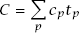
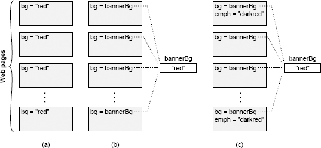
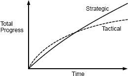

# 软件设计的哲学（第二版）

> **A Philosophy of Software Design, 2nd Edition** — John Ousterhout
>
> 中文译本来源：[yingang/aposd2e-zh](https://github.com/yingang/aposd2e-zh) ｜ 在线阅读：<https://yingang.github.io/aposd2e-zh/>
> 译本许可：**CC-BY-4.0**（署名即可自由使用、分发、改编）
> 原书版权归 John Ousterhout 所有，建议购买正版支持作者：<https://www.amazon.com/dp/173210221X>

---


## 目录

- [前言](#前言)
- [第 1 章 介绍](#第-1-章-介绍)
- [第 2 章 复杂性的本质](#第-2-章-复杂性的本质)
- [第 3 章 能工作的代码是不够的](#第-3-章-能工作的代码是不够的)
- [第 4 章 模块应该是深的](#第-4-章-模块应该是深的)
- [第 5 章 信息隐藏和信息泄露](#第-5-章-信息隐藏和信息泄露)
- [第 6 章 通用的模块是更深的](#第-6-章-通用的模块是更深的)
- [第 7 章 不同的层级，不同的抽象](#第-7-章-不同的层级不同的抽象)
- [第 8 章 下沉复杂性](#第-8-章-下沉复杂性)
- [第 9 章 在一起更好还是分开更好？](#第-9-章-在一起更好还是分开更好)
- [第 10 章 通过定义来规避错误](#第-10-章-通过定义来规避错误)
- [第 11 章 设计两次](#第-11-章-设计两次)
- [第 12 章 不写注释的四个借口](#第-12-章-不写注释的四个借口)
- [第 13 章 注释应该描述代码中难以理解的内容](#第-13-章-注释应该描述代码中难以理解的内容)
- [第 14 章 选取名称](#第-14-章-选取名称)
- [第 15 章 先写注释](#第-15-章-先写注释)
- [第 16 章 修改现有的代码](#第-16-章-修改现有的代码)
- [第 17 章 一致性](#第-17-章-一致性)
- [第 18 章 代码应该是易理解的](#第-18-章-代码应该是易理解的)
- [第 19 章 软件发展趋势](#第-19-章-软件发展趋势)
- [第 20 章 性能设计](#第-20-章-性能设计)
- [第 21 章 决定什么是重要的](#第-21-章-决定什么是重要的)
- [第 22 章 结论](#第-22-章-结论)
- [总结](#总结)
- [附录：译名说明与术语表](#附录译名说明与术语表)

> 阅读提示：本文件为全书单文件版。分章 Markdown 见 `A-Philosophy-of-Software-Design-2nd-zh/`，在 Obsidian / VSCode 中分章打开导航更稳。


<!-- 源文件: preface.md -->

# 前言

80 多年来，人们一直在为电子计算机编写程序，但令人惊讶的是，关于如何设计这些程序或什么是好的程序的讨论却很少。关于软件开发过程（如敏捷开发）和开发工具（如调试器、版本控制系统和测试覆盖工具）已经有了相当多的讨论。针对编程技术的分析也已经相当广泛，如面向对象编程和函数式编程，以及设计模式和算法。所有这些讨论都是有价值的，但是软件设计的核心问题在很大程度上仍然没有触及。David Parnas 的经典论文“关于将系统分解成模块的标准”发表于 1971 年，但是在随后的 45 年里，软件设计的技术水平并没有超过这篇论文。

计算机科学中最基本的问题是 *问题分解*：如何将一个复杂的问题分解为可以独立解决的部分。问题分解是程序员每天都要面对的首要设计任务，但是，除了这本书里描述的工作之外，我还没有在任何一所大学里找到一门以问题分解为中心的课程。我们讲授 `for` 循环和面向对象的程序设计，而不是软件设计。

此外，不同的程序员在产出质量和效率上存在巨大差异，但是我们几乎没有尝试去了解什么能使最好的程序员变得更好，也没有在我们的课堂上讲授这些技能。我曾与几位我认为是优秀的程序员的人进行过交谈，但是他们中的大多数人都难以阐明赋予他们优势的特定技术。许多人认为软件设计技能是天生的天赋，无法讲授。但是，有相当多的科学证据表明，许多领域的杰出表现更多地与高质量的实践有关，而不是与先天能力有关（例如，参阅 Geoff Colvin 的《*哪来的天才？练习中的平凡与伟大*》）。

多年来，这些问题使我感到困惑和沮丧。我想知道软件设计是否是可以被讲授的，并且我假设设计技巧是区分优秀程序员和普通程序员的原因。我最终决定，回答这些问题的唯一方法是尝试讲授软件设计课程。结果就是斯坦福大学的 CS 190 课程。在这个课程中，我提出了一套软件设计原则。然后，学生将通过一系列项目来学习和实践这些原则。该课程的授课方式类似于传统的英语写作课。在英语课堂上，学生使用迭代的过程，在过程中编写草稿、获取反馈、然后重写以进行改进。在 CS 190 中，学生从头开始开发大量软件。然后，我们将进行大量的代码审查以识别设计问题，然后学生修改其项目以解决这些问题。这使学生可以了解如何通过应用设计原则来改进其代码。

到现在，我已经教过几次该软件设计课程，并且本书是基于该课程中出现的设计原则编写的。这些原则立足于比较高的层级，类似于哲学概念（比如“通过定义来规避错误”），因此学生很难以抽象的方式理解这些思想。通过编写代码、犯错误、然后查看他们的错误以及后续的修正与这些原则之间的关系，学生将学得最好。

在这一点上，你可能会想知道：是什么让我认为我知道有关软件设计的所有答案？老实说，我并不知道。当我学会编程时，也没有关于软件设计的课程，而且从来没有导师来教我设计原则。在我学习编程时，代码审查还不存在。我对软件设计的想法来自于编写和阅读代码的个人经验。在我的职业生涯中，我已经用多种语言编写了大约 25 万行代码。我曾在一些团队中工作过，这些团队从零开始创建了三个操作系统、多个文件和存储系统、基础架构工具（例如调试器、构建系统和图像界面工具包）、一种脚本语言以及用于文本、图形、演示文稿和集成电路的交互式编辑器。一路上，我亲身经历了大型系统的问题，并尝试了各种设计技术。另外，我阅读了很多其他人编写的代码，这使我接触到了很多方法，无论是好是坏。

从所有这些经验中，我尝试提取通用线索，包括需要避免的错误和使用的技巧。本书反映了我的经验：这里描述的每个问题都是我亲身经历的，每种建议的技术都是我在自己的编码中成功使用过的。

我不希望这本书成为软件设计的定论。我敢肯定，我错过了一些有价值的技术，从长远来看，我的一些建议可能会变成坏主意。但是，我希望本书能开启有关软件设计的对话。将本书中的想法与你自己的经验进行比较，以确定此处介绍的方法是否确实降低了你的软件复杂性。这是一本呈现我个人观点的书，所以有些读者会不同意我的一些建议。如果你不同意，请尝试理解原因在哪。我有兴趣了解对你有用的东西、不起作用的东西以及你可能对软件设计有的任何其他想法。我希望随后的对话将增进我们对软件设计的集体理解。

与我交流这本书的最好方法是将电子邮件发送到以下地址：

[software-design-book@googlegroups.com](mailto:software-design-book@googlegroups.com)

我有兴趣听到有关本书的反馈，例如缺陷或改进建议，以及与软件设计相关的通用思想和经验。我对可以在本书未来版本中使用的好的示例特别感兴趣。最好的示例能说明重要的设计原则，并且足够简单，可以在一两个段落中进行解释。如果你想在电子邮件地址上看到其他人在说什么并参与讨论，可以加入 Google Group `software-design-book`。

如果出于某种原因 Google Group `software-design-book` 将来会消失，请在互联网上搜索我的主页，它将包含有关如何与这本书进行交流的更新说明。请不要将与图书相关的电子邮件发送到我的个人电子邮件地址。

我建议你使用本书建议时持保留态度。总体目标是降低复杂性，这比你在此处阅读的任何特定原则或想法更为重要。如果你尝试从本书中获得一个想法并发现它实际上并没有降低复杂性，那么你就不必继续使用它（但是，请让我知道你的经历，不管方法有效还是无效，我都想获得相关的反馈意见）。

许多人提出了批评或建议，以提高本书的质量。以下人员对本书的各种草稿提供了有用的意见：Abutalib Aghayev，Jeff Dean，Will Duquette，Sanjay Ghemawat，John Hartman，Brian Kernighan，James Koppel，Amy Ousterhout，Kay Ousterhout，Rob Pike，Partha Ranganathan，Daniel Rey，Keith Schwartz 和 Alex Snaps。Christos Kozyrakis 为类和接口建议了术语“深”和“浅”，代替了之前有点模糊的术语“厚”和“薄”。我很感激 CS 190 中的学生，阅读他们的代码并与他们讨论的过程有助于明确我对设计的想法。


---

<!-- 源文件: ch01.md -->

# 第 1 章 介绍

编写计算机软件是人类历史上最纯粹的创作活动之一。程序员不受诸如物理定律等实际限制的约束。我们可以用现实世界中永远不会存在的行为创建令人兴奋的虚拟世界。编程不需要很高的身体技能或协调能力，例如芭蕾或篮球。所有编程都需要具有创造力的头脑和组织思想的能力。如果你能够将一个系统具象化，就可以在计算机程序中将它实现。

这意味着编写软件的最大限制是我们理解所创建系统的能力。随着程序的演进和更多功能的加入，它变得越来越复杂，其组件之间会具有微妙的依赖性。随着时间的流逝，复杂性不断累积，程序员在修改系统时将所有相关因素牢记在心中变得越来越难。这会减慢开发速度并导致代码缺陷，从而进一步拖慢开发速度并增加成本。在任何程序的生命周期中，复杂性都会不可避免地增加。程序越大，工作的人越多，管理复杂性就越困难。

好的开发工具可以帮助我们应对复杂性，许多出色的工具已经在过去的几十年中被创建出来。但是，仅凭工具我们能做的事情仍然有限制。如果我们想简化编写软件的过程，从而可以用更低的成本构建功能更强大的系统，则必须找到简化软件的方法。尽管我们尽了最大努力，复杂性仍会随着时间的推移而增加，但是更简单的设计使我们能够在复杂性取得压倒性优势之前构建出更大、功能也更强大的系统。

有两种解决复杂性的通用方法，这两种方法都将在本书中进行讨论。第一种方法是通过使代码更简单和更易理解来消除复杂性。例如，可以通过消除特殊情况或以一致的方式使用标识符来降低复杂性。

解决复杂性的第二种方法是封装它，以便程序员可以在系统上工作而不会立即暴露在所有复杂性的面前。这种方法称为模块化设计。在模块化设计中，软件系统分为模块，例如面向对象语言中的类。这些模块被设计为彼此相对独立（低耦合），以便程序员可以在一个模块上工作而不必了解其他模块的细节。

由于软件具有很好的延展性，软件设计是一个贯穿软件系统整个生命周期的连续过程。这使得软件设计与诸如建筑物、船舶或桥梁的物理系统的设计不同。但是，软件设计并非总是以这种方式被看待。在编程历史的早期阶段，设计往往都集中在项目的开始，就像其他工程学科一样。这种方法的极端称为瀑布式模型，该模型将项目划分为离散的阶段，例如需求定义、设计、编码、测试和维护。在瀑布式模型中，每个阶段都在下一阶段开始之前完成；在许多情况下，每个阶段都由不同的人负责。在设计阶段，立即设计整个系统。在设计阶段结束时冻结设计，而后续阶段的作用是充实和实现这个设计。

不幸的是，瀑布式模型很少适用于软件。软件系统本质上比物理系统更为复杂。在构建任何东西之前，不可能充分具象化出大型软件系统的设计，以了解其所有含义。结果，初始设计将有许多问题。在实现到一定程度之前，问题不会变得明显。但是，瀑布式模型此时无法适应主要的设计变更（例如，设计师可能已转移到其他项目）。因此，开发人员尝试在不改变整体设计的情况下解决问题。这导致了复杂性的爆炸式增长。

由于这些问题，当今大多数软件开发项目都使用诸如敏捷开发之类的增量方法，其中初始设计仅着重于整体功能的一小部分。这一小部分将被设计、实现和评估，然后发现和纠正原始设计中的问题，然后再设计、实现和评估更多功能。每次迭代都会暴露现有设计的问题，这些问题在设计下一组功能之前就已得到解决。通过以这种方式扩展设计，可以在系统仍然很小的情况下解决掉初始设计的问题。较新的功能受益于较早的功能在实现过程中获得的经验，因此问题也会较少。

增量方法适用于软件，因为软件具有足够的延展性，可以在实施过程中进行重大的设计变更。相比之下，对物理系统而言，主要的设计变更更具挑战性：例如，在建筑过程中更改支撑桥梁的塔架数量是不切实际的。

增量开发意味着永远不会完成软件设计。设计在系统的整个生命周期中不断发生：开发人员应始终在思考设计问题。增量开发还意味着不断的重新设计。系统或组件的初始设计几乎从来都不是最好的。随着经验累积，不可避免地会产生更好的做事方式。作为软件开发人员，你应该始终在寻找机会来改进正在开发的系统的设计，并且应该计划将部分时间花费在设计改进上。

如果软件开发人员应始终考虑设计问题，而降低复杂性是软件设计中最重要的要素，则软件开发人员应始终考虑复杂性。这本书就是关于如何使用复杂性来指导软件设计的整个生命周期。

这本书有两个总体目标。首先是描述软件复杂性的本质：“复杂性”是什么意思、为什么它很重要、以及当程序具有不必要的复杂性时如何识别？本书的第二个也是更具挑战性的目标是介绍可在软件开发过程中使用的技术，以最大程度地减少复杂性。不幸的是，没有简单的方法可以保证出色的软件设计。取而代之的是，我将提出一些与哲学相关的更高层级的概念，例如“类应该是深的”或“通过定义来规避错误”。这些概念可能不会立即确定最佳设计，但你可以使用它们来比较设计备选方案并引导你探索设计空间。

## 1.1 如何使用这本书

这里描述的许多设计原则有些抽象，因此如果不看实际的代码，可能很难理解它们。找到足够小的示例以包含在书中，但是又足够大以说明真实系统的问题是一个挑战（如果遇到好的示例，请发给我）。因此，这本书可能不足以让你学习如何应用这些原则。

使用本书的最佳方法是与代码审查结合使用。阅读其他人的代码时，请考虑它是否符合此处讨论的概念，以及它与代码的复杂性之间的关系。在别人的代码中比在你的代码中更容易看到设计问题。你可以使用书里描述的危险信号来发现问题并提出改进建议。审查代码还将使你接触到新的设计方法和编程技术。

改善设计技能的最好方法之一就是学会识别危险信号：危险信号表明一段代码可能比需要的复杂。在本书的过程中，我将指出一些危险信号，这些危险信号与一些主要的设计问题相关，其中最重要的内容总结在本书的最后。你可以在编码时使用它们：当看到危险信号时，停下来寻找可消除问题的替代设计。当你第一次尝试这种方法时，你可能必须尝试几种设计替代方案，然后才能找到消除危险信号的方案。不要轻易放弃：解决问题之前尝试的替代方法越多，你就会学到更多。随着时间的流逝，你会发现代码中的危险信号越来越少，并且你的设计越来越清晰。你自己的经验可能也涉及到一些其它的可用于识别设计问题的危险信号（我很乐意听到这些）。

在应用本书中的思想时，务必要节制和谨慎。每条规则都有例外，每条原则都有其局限性。如果你将任何设计创意都发挥到极致，那么你可能会陷入困境。精美的设计反映了相互竞争的思想和方法之间的平衡。有几个章节的标题为“做过头了”，它们描述了如何识别自己是否正在把事情做得过头了。

本书中几乎所有示例都是使用 Java 或 C++ 语言编写的，并且大部分讨论都是针对以面向对象的语言设计类的。但是，这些想法也适用于其他领域。几乎所有与方法有关的思想也可以应用于没有面向对象特性的语言中的功能，例如 C 语言。设计思想还适用于除类之外的模块，例如子系统或网络服务。

在这种背景下，让我们详细讨论导致复杂性的原因以及如何简化软件系统。


---

<!-- 源文件: ch02.md -->

# 第 2 章 复杂性的本质

这本书是关于如何设计软件系统以最小化其复杂性。第一步是了解敌人。究竟什么是“复杂性”？你如何判断系统是否过于复杂？是什么导致系统变得复杂？本章将在较高的层级上解决这些问题。后续章节将向你展示如何从较低的层级上根据特定的结构特征来识别复杂性。

识别复杂性的能力是至关重要的设计技能。它使你可以先找出问题，然后再付出大量努力，并可以在不同的选择中做出正确的选择。判断一个设计是否简单比创建一个简单的设计要容易得多，但是一旦你能认识到一个系统过于复杂，就可以使用该能力指导你的设计哲学走向简单。如果设计看起来很复杂，请尝试其他方法，看看是否更简单。随着时间的流逝，你会注意到某些技术往往会导致设计更简单，而其他技术则与复杂性相关。这将使你更快地产出更简单的设计。

本章还列出了一些基本假设，这些基本假设为本书的其余部分奠定了基础。后面的章节将采用本章的内容，并用其论证各种改进和结论。

## 2.1 复杂性的定义

出于本书的目的，我以实用的方式定义“复杂性”。**复杂性是指那些与软件系统相关的而且让系统难以理解和修改的任何事物。** 复杂性可以采取多种形式。例如，可能很难理解一段代码是如何工作的，可能需要花费很多精力才能实现较小的改进，或者可能不清楚必须修改系统的哪些部分才能进行改进，也可能是在不引入额外问题的情况下很难修复一个代码缺陷。如果一个软件系统难以理解和修改，那它就是复杂的。如果很容易理解和修改，那它就是简单的。

你还可以从成本和收益的角度来评估复杂性。在复杂的系统中，即使实施很小的改进都需要大量的工作。而在一个简单的系统中，可以用更少的精力实现更大的改进。

复杂性是开发人员在尝试实现特定目标时在特定时间点所经历的。它不一定与系统的整体大小或功能有关。人们通常使用“复杂”一词来描述具有复杂功能的大型系统，但是如果这样的系统易于使用，那么就本书而言，它并不复杂。当然，实际上几乎所有大型复杂的软件系统都很难使用，因此它们也符合我对复杂性的定义，但这不一定是事实。小型的功能不复杂的系统也可能非常复杂。

复杂性取决于最常见的活动。如果系统中有一些非常复杂的部分，但是几乎不需要触摸这些部分，那么它们对系统的整体复杂性不会有太大影响。为了用粗略的数学方法来表征：

  

系统的总体复杂性（C）由每个部分的复杂性（cp）乘以开发人员在该部分上花费的时间（tp）加权。将复杂性隔离在一个永远不会被看到的地方几乎和完全消除复杂性一样好。

读者比作者更容易理解复杂性。如果你编写了一段代码，对你来说似乎很简单，但是其他人认为它很复杂，那么它就是复杂的。当你遇到这种情况时，有必要对其他开发人员进行调查，以找出为什么这段代码对他们而言似乎很复杂；从你的观点与他们的观点之间的脱节中可能可以学到一些有趣的教训。作为开发人员，你的工作不仅是创建你自己可以轻松使用的代码，而且还要创建其他人也可以轻松使用的代码。

## 2.2 复杂性的症状

复杂性通过以下段落中描述的三种一般方式表现出来。这些表现形式中的每一种都使执行开发任务变得更加困难。

**变更放大**：复杂性的第一个征兆是，看似简单的变更需要在许多不同地方进行代码修改。例如，考虑一个包含几个页面的网站，每个页面都显示一个带有背景色的横幅。在许多早期的网站中，颜色是在每个页面上明确指定的，如图 2.1（a）所示。为了更改此类网站的背景，开发人员可能必须手动修改每个现有页面；对于拥有数千个页面的大型网站而言，这几乎是不可能的。幸运的是，现代网站使用的方法类似于图 2.1（b），其中横幅颜色一次在中心位置指定，并且所有各个页面均引用该共享值。使用这种方法，可以通过一次修改来更改整个网站的标题颜色。

**认知负荷**：复杂性的第二个症状是认知负荷，这是指开发人员需要多少知识才能完成一项任务。较高的认知负荷意味着开发人员必须花更多的时间来学习所需的信息，并且由于错过了重要的东西而导致错误的风险也更大。例如，假设 C 语言中的一个函数分配了内存，返回了指向该内存的指针，并假定调用者将释放该内存。这增加了使用该功能的开发人员的认知负荷。如果开发人员无法释放内存，则会发生内存泄漏。如果可以对系统进行重组，以使调用者不必担心释放内存（分配内存的同一模块也负责释放内存），它将减少认知负荷。（认知负荷出现在很多方面，例如有很多方法的API、全局变量、不一致和模块间的依赖）

系统设计人员有时会假设可以通过代码行来衡量复杂性。他们认为，如果一个实现比另一个实现短，那么它必须更简单；如果只需要几行代码就可以进行更改，那么更改必须很容易。但是，这种观点忽略了与认知负荷相关的成本。我已经看到了只需要几行代码就能编写应用程序的框架，但是要弄清楚这些行是什么极其困难。**有时，需要更多代码行的方法实际上更简单，因为它减少了认知负荷。**



图 2.1：网站中的每个页面都显示一个彩色横幅。在（a）中，横幅的背景色在每个页面中都明确指定。在（b）中，共享变量保存背景色，并且每个页面都引用该变量。在（c）中，某些页面会显示其他用于强调的颜色，即横幅背景颜色的暗色；如果背景颜色改变，则强调颜色也必须改变。

**未知的未知**：复杂性的第三个症状是，必须修改哪些代码才能完成任务，或者开发人员必须获得哪些信息才能成功地执行任务，这些都是不明显的。图 2.1(c)说明了这个问题。网站使用一个中心变量来确定横幅的背景颜色，所以它看起来很容易改变。但是，一些网页使用较暗的背景色来强调，并且在各个页面中明确指定了较暗的颜色。如果背景颜色改变，那么强调的颜色必须改变以匹配。不幸的是，开发人员不太可能意识到这一点，所以他们可能会更改中心变量 `bannerBg` 而不更新强调颜色。即使开发人员意识到这个问题，也不清楚哪些页面使用了强调色，因此开发人员可能必须搜索网站中的每个页面。

在复杂性的三种表现形式中，未知的未知是最糟糕的。未知的未知意味着你需要知道一些事情，但是你没有办法找到它是什么，甚至不知道是否存在问题。直到你的修改导致了代码缺陷之前，你都不会发现它。变更放大是令人恼火的，但是只要清楚哪些代码需要修改，一旦更改完成，系统就会工作。同样，高的认知负荷会增加变更的成本，但如果明确要阅读哪些信息，变更仍然可能是正确的。对于未知的未知，不清楚该做什么，或者提出的解决方案是否有效。唯一确定的方法是读取系统中的每一行代码，这对于任何大小的系统都是不可能的。这甚至可能还不够，因为更改还可能依赖于一个从未记录的细微设计决策。

良好设计的最重要目标之一就是使系统容易理解，这与高认知负荷和未知的未知相反。在这样的系统中，开发人员可以快速了解现有代码的工作方式以及进行更改所需的内容，并可以在不费力思考的情况下快速猜测要做什么，同时又可以确信该猜测是正确的。[第 18 章](ch18.md)讨论了使代码更容易理解的技术。

## 2.3 复杂性的原因

既然你已经了解了复杂性在较高层级的症状以及为什么复杂性会使软件开发变得困难，那么下一步就是了解导致复杂性的原因，以便我们能设计系统来避免这些问题。复杂性是由两件事引起的：依赖性和模糊性。本节从较高层级讨论这些因素。随后的章节将讨论它们与较低层级的设计决策之间的关系。

就本书而言，当无法孤立地理解和修改给定的一段代码时，便存在依赖关系。该代码以某种方式与其他代码相关，如果更改了给定代码，则必须考虑和/或修改其他代码。在图 2.1（a）的网站示例中，背景色在所有页面之间创建了依赖关系。所有页面都必须具有相同的背景，因此，如果更改一页的背景，则必须更改所有背景。依赖关系的另一个示例发生在网络协议中。通常，协议的发送方和接收方有单独的代码，但是它们必须分别符合协议。更改发送方的代码几乎总是需要在接收方进行相应的更改，反之亦然。方法的签名创建了方法实现方和方法调用方之间的依赖关系：如果向方法添加了一个新参数，则必须修改调用该方法的代码以指定该参数。

依赖关系是软件的基本组成部分，不能完全消除。实际上，我们在软件设计过程中有意引入了依赖性。每次编写新类时，都会围绕该类的 API 创建依赖关系。但是，软件设计的目标之一是减少依赖关系的数量，并使依赖关系保持尽可能简单和明显。

考虑网站示例。在每个页面分别指定背景的旧网站中，所有网页都是相互依赖的。新的网站通过在中心位置指定背景色并提供一个 API，供各个页面在呈现它们时检索该颜色，从而解决了该问题。新的网站消除了页面之间的依赖关系，但是它围绕 API 创建了一个新的依赖关系以检索背景色。幸运的是，新的依赖性更加明显：很显然，每个单独的网页都取决于 `bannerBg` 颜色，并且开发人员可以通过搜索其名称轻松找到使用该变量的所有位置。此外，编译器还有助于管理 API 依赖性：如果共享变量的名称发生变化，任何仍使用旧名称的代码都将发生编译错误。新的网站用一种更简单、更明显的方式代替了一种不明显且难以管理的依赖性。

复杂性的第二个原因是模糊性。当重要的信息不明显时，就会产生模糊性。一个简单的例子是一个变量名，它是如此的通用，以至于它没有携带太多有用的信息(例如，时间)。或者，一个变量的文档可能没有指定它的单位，所以找到它的惟一方法是扫描代码，查找使用该变量的位置。模糊性常常与依赖项相关联，在这种情况下，依赖项的存在并不明显。例如，如果向系统添加了一个新的错误状态，可能需要向一个包含每个状态的字符串消息的表添加一个条目，但是对于查看状态声明的程序员来说，消息表的存在可能并不明显。不一致性也是造成模糊性的一个主要原因：如果同一个变量名用于两个不同的目的，那么开发人员就无法清楚地知道某个特定变量的目的是什么。

在许多情况下，模糊性来源于文档的不足。[第 13 章](ch13.md)讨论了这个主题。但是，模糊性也是设计问题。如果系统设计简洁明了，则所需的文档将更少。对大量文档的需求通常是表明设计不正确的危险信号。减少模糊性的最佳方法是简化系统设计。

依赖性和模糊性共同构成了第 2.2 节中描述的三种复杂性表现。依赖性导致变更放大和高认知负荷。模糊性会产生未知的未知，还会增加认知负荷。如果我们找到最小化依赖性和模糊性的设计技术，那么我们就可以降低软件的复杂性。

## 2.4 复杂性是增量产生的

复杂性不是由单个灾难性错误引起的；它堆积自许多小块。单个依赖项或模糊项本身不太可能显著影响软件系统的可维护性。之所以会出现复杂性，是因为随着时间的流逝，成千上万的小依赖项和模糊项逐渐形成。最终，这些小问题太多了，以至于对系统的每次更改都会受到其中几个问题的影响。

复杂性的增量本质使其难以控制。可以很容易地说服自己，当前更改所带来的一点点复杂性没什么大不了的。但是，如果每个开发人员对每种更改都采用这种方法，那么复杂性就会迅速累积。一旦积累了复杂性，就很难消除它，因为修复单个依赖项或模糊项本身不会产生很大的变化。为了减缓复杂性的增长，你必须采用[第 3 章](ch03.md)中讨论的“零容忍”理念。

## 2.5 结论

复杂性来自于依赖性和模糊性的积累。随着复杂性的增加，它会导致变更放大、高认知负荷和未知的未知。结果，需要更多的代码修改才能实现每个新功能。此外，开发人员花费更多时间获取足够的信息以安全地进行更改，在最坏的情况下，他们甚至找不到所需的所有信息。最重要的是，复杂性使得修改现有代码库变得困难且危险。


---

<!-- 源文件: ch03.md -->

# 第 3 章 能工作的代码是不够的
（战略式编程与战术式编程）

好的软件设计中最重要的元素之一是你在执行编程任务时所采用的思维方式。许多组织都鼓励采取战术式（Tactical）的思维方式，着眼于使功能尽快运行。但是，如果你想要一个好的设计，则必须采取更战略式（Strategic）的方法，花费时间来制作整洁的设计并解决问题。本章讨论了从长远来看，为什么战略式的方法可以产生更好的设计，而实际上却比战术式的方法成本更低。

## 3.1 战术式编程

大多数程序员以我称为战术式编程的思维方式来进行软件开发。在战术式方法中，你的主要重点是使某些功能正常工作，例如新功能或错误修复。乍一看，这似乎是完全合理的：还有什么比编写能工作的代码更重要的呢？但是，战术式编程几乎不可能产生出良好的系统设计。

战术式编程的问题在于它是短视的。如果你是战术式编程人员，那么你将尝试尽快完成任务。也许你有一个艰难的完成期限，因此为未来做计划不是优先事项。你不会花费太多时间来寻找最佳设计。你只想尽快让代码能工作起来。你告诉自己，可以增加一些复杂性或引入一两处蹩脚的小实现，如果这样可以使当前任务更快地完成，那就没什么大不了的。

这就是系统变得复杂的方式。如上一章所述，复杂性是增量产生的。不是某个特定的事物会让系统变复杂，而是几十或数百个小事物的积累而导致的。如果你在编码时总是使用战术式思维方式，则每个编程任务都会带来一些此类复杂性。为了快速完成当前任务，这些复杂性中的每一个似乎都是合理的折衷方案。但是，复杂性迅速累积，尤其是每个人都使用战术式编程的时候。

不久之后，某些复杂性将开始引起问题，并且你将开始希望你没有采用这些早期的捷径。但是，你会告诉自己，使下一个功能正常工作比返回去重构现有代码更为重要。从长远来看，重构可能会有所帮助，但是肯定会减慢当前的任务。因此，你需要快速修补程序来解决遇到的任何问题。这只会增加更多的复杂性，然后需要更多的补丁。很快代码变得一团糟，而且到现在为止，情况已经很糟糕了，清理它需要花费数月的时间。你的日程安排无法容忍这种延迟，解决一个或两个问题似乎并没有太大的区别，因此你就只能继续保持这种战术式的编程方式。

如果你从事大型软件项目的时间很长，我怀疑你在工作中已经看到了战术式编程，并且遇到了其所导致的问题。一旦你沿着战术式编程的路线走，就很难改变。

几乎每个软件开发组织都有至少一个将战术式编程发挥到极致的开发人员：战术龙卷风。战术龙卷风是一位多产的程序员，他产出代码的速度比其他人快得多，但完全以战术方式工作。实现紧急功能时，没有人能比战术龙卷风更快地完成任务。在某些组织中，管理层将战术龙卷风视为英雄。但是，战术龙卷风留下了毁灭的痕迹。他们很少被将来必须使用其代码的工程师视为英雄。通常，其他工程师必须清理战术龙卷风留下的混乱局面，这使得那些工程师（他们才是真正的英雄）的进度似乎比战术龙卷风慢。

## 3.2 战略式编程

成为一名优秀的软件设计师的第一步是要意识到 **能工作的代码是不够的**。引入不必要的复杂性以更快地完成当前任务是不可接受的。最重要的是系统的长期结构。任何系统中的大多数代码都是通过扩展现有代码库编写的，因此，作为开发人员，最重要的工作就是促进这些将来的扩展。因此，尽管你的代码当然必须能工作，但你不应将“能工作的代码”视为主要目标。你的主要目标必须是产生出色的设计，并且这种设计也能很好地工作。这就是 *战略式编程*。

战略式编程需要一种投资的思维方式。你必须花费时间来改进系统的设计，而不是采取最快的方式来完成当前的项目。这些投资会在短期内让你放慢脚步，但从长远来看会加快你的速度，如图 3.1 所示。

一些投资将是主动的。例如，值得花一些时间为每个新类找到一个简单的设计，而不是直接去实现第一个想到的办法。请尝试几种替代设计并选择最简洁的设计。设想一下将来可能需要更改系统的几种方式，并确保你的设计会让这些更改更为容易。编写好的文档是主动投资的另一个例子。

其他投资将是被动的。无论你预先投入多少，设计决策中都不可避免地会出现错误。随着时间的流逝，这些错误将变得显而易见。发现设计问题时，不要忽略它或只是对其进行简单的修补。花一些额外的时间来真正修复它。如果你进行战略式编程，则将不断对系统设计进行小幅改进。这与战术式编程相反，在战术式编程中，你不断增加一些复杂性，这些复杂性将来会引起问题。

## 3.3 该投资多少？

那么，正确的投资额是多少？大量的前期投资（例如尝试一次性设计整个系统）将不会有效。这是瀑布式方法，我们知道它不起作用。随着你对系统的理解不断深入，理想的设计会逐渐涌现出来。因此，最好的方法是连续进行大量的小额投资 ​​。我建议你将总开发时间的 10% 到 20% 用于投资。该额度足够小，不会对你的日程安排产生重大影响，但又足够大，可以随着时间的推移产生重大收益。因此，你的初始项目将比纯战术式方法多花费 10% 到 20% 的时间。额外的时间将带来更好的软件设计，并且你将在几个月内开始体验到这些好处。不久之后，你的开发速度将比战术式编程快至少 10 到 20%。到这个时候，你的投资将是免费的了：你过去投资的收益将节省足够的时间来支付未来投资的费用。你将迅速收回初始投资的成本。图 3.1 说明了这种现象。



图 3.1：一开始，战术式的编程方法将比战略式方法更快地取得进展。但是，在战术式方法下，复杂性积累得更快，从而降低了生产率。随着时间的流逝，战略式方法的进展会更加地快。注意：此图仅用于定性说明，我没有了解到任何关于曲线精确形状的实证数据。

相反，如果你进行战术式编程，则可以将初始项目的完成速度提高 10% 到 20%，但是随着时间的推移，复杂性的累积会降低开发速度。不久之后，你的编程速度至少会降低 10% 到 20%。你将很快失去在开始时节省的所有时间，并且在系统的整个生命周期中，与采用战略式方法相比，你的开发速度将更加缓慢。如果你从未碰到过质量非常糟糕的代码库，请与有经验的人谈一谈。他们会告诉你糟糕的代码质量会使开发速度至少降低 20%。

术语 *技术债* 经常被用来描述战术式编程所导致的问题。通过战术式编程，你将从未来借用时间：现在的开发会变得更快，但以后会更慢。就像金融债务一样，你偿还的金额将超过你借用的金额。与金融债务不同，大多数技术债务永远不会完全偿还：你将不断偿还，直到永远。

图 3.1 提出了一个重要的问题：战略式曲线和战术式曲线的交叉点在哪里？换句话说，战略式方法要多久才能收回成本？不幸的是，我不知道是否有任何关于这个问题的数据，而且很难以一种有说服力的方式进行某种受控实验来回答这个问题。我的个人意见是，偿还的时间在 6 到 18 个月之间。这很大程度上与开发人员的记忆力有关：当一段代码存在了几个月之后，开发人员很可能已经忘记他们当时写这些代码的时候在想什么，所以如果代码很复杂，开发速度会显著下降。这些额外的成本很快就会超出战略式编程的初始投入。同样，这只是我的个人意见，我没有任何数据来支持它。

## 3.4 初创公司与投资

在某些环境中，强大的力量与战略式方法背道而驰。例如，早期的初创公司感到巨大的压力，需要尽快发布其早期版本。在这些公司中，10% 至 20% 的投资似乎也负担不起。结果，许多初创公司采取了战术式的方法，在设计上花费的精力很少，而在问题出现时则花费了更少的精力进行清理。他们认为，只要他们成功了，他们将有足够的钱聘请额外的工程师来清理问题，从而使其合理化。

如果你正在一家朝着这个方向发展的公司工作，则应该意识到，一旦代码库变成了意大利面条，几乎是不可能修复的。你可能会在产品的生命周期内付出高昂的开发成本。此外，好的（或坏的）设计的回报很快就会到来，因此战术式方法甚至很有可能不会加快你的首个产品发布的速度。

另一件要考虑的事情是，公司成功的最重要因素之一就是工程师的素质。降低开发成本的最佳方法是聘请优秀的工程师：他们的成本不会比普通工程师高很多，但生产率却高得多。但是，最好的工程师对良好的设计深感兴趣。如果你的代码库很糟糕，这个消息总是会传出去，这将使你的招聘更加难以进行。最终可能还是只能使用普通的工程师。这将增加你的未来成本，并可能导致系统结构进一步退化。

Facebook 是一个鼓励战术式编程的创业公司的例子。多年来，公司的座右铭是“快速行动，不怕犯错”。公司鼓励刚大学毕业的新工程师立即深入公司的代码库；工程师在工作的第一周就将代码提交到生产库也是正常的。从积极的一面来看，Facebook 作为一家赋能员工的公司而享有声誉。工程师拥有极大的自由度，并且几乎没有任何规则和限制来阻挡他们。

Facebook 作为一家公司已经取得了令人瞩目的成功，但是由于该公司的战术式方法，其代码库受到了影响。许多代码不稳定且难以理解，几乎没有注释或测试，并且使用起来很痛苦。随着时间的流逝，该公司意识到其文化是不可持续的。最终，Facebook 改变了座右铭，即“在坚实的基础架构上快速行动”，以鼓励其工程师在良好的设计上进行更多的投资。但 Facebook 是否能够成功清除其多年来在战术式编程中积累的问题还有待观察。

为了公平起见，我应该指出，Facebook 的代码可能并不比初创公司的平均水平差很多。战术式编程在初创公司中司空见惯，Facebook 只是一个特别明显的例子。

幸运的是，使用战略式方法也有可能在硅谷取得成功。Google 和 VMware 与 Facebook 差不多同时成长，但是这两家公司都采用了更具战略式的方法。两家公司都非常重视高质量的代码和良好的设计，并且两家公司都开发了复杂的产品，这些产品通过可靠的软件系统解决了复杂的问题。公司的强大技术文化在硅谷广为人知。很少有其他公司可以与他们竞争聘请顶级技术人才。

这些例子表明，使用任何一种方法公司都有可能成功。但是，在一家关心软件设计并拥有整洁代码库的公司中工作会有趣得多。

## 3.5 结论

好的设计不是免费的。它必须是你持续投资的东西，这样小问题才不会累积成大问题。幸运的是，好的设计最终会收回成本，而且比你想象的要早。

始终如一地运用战略式方法并将投资视为今天而不是明天要做的事情至关重要。当你在一个紧要的关头，很容易推迟清理，直到危机结束之后。但是，这是一个滑坡谬误（slippery slope）。在当前的危机过去之后，几乎肯定还会出现下一次。一旦开始延迟设计改进，就很容易使延迟永久化，并使你的文化陷入战术式方法中。你等待解决设计问题的时间越长，问题就会变得越大；解决方案也会变得更加令人生畏，这使得轻松推迟解决方案变得更加容易。最有效的方法是，每位工程师都对良好的设计进行持续的小额投资。


---

<!-- 源文件: ch04.md -->

# 第 4 章 模块应该是深的

管理软件复杂性最重要的技术之一就是将系统设计成开发人员在任何给定时间只需要面对整体复杂性的一小部分。这种方法称为 *模块化设计*，本章介绍其基本原则。

## 4.1 模块化设计

在模块化设计中，软件系统被分解为相对独立的 *模块* 集合。模块可以采用多种形式，例如类、子系统或服务。在理想的世界中，每个模块都将完全独立于其他模块：开发人员可以在任何模块中工作，而无需了解任何其他模块。在这个世界里，系统的复杂性就是其中最糟糕的模块的复杂性。

不幸的是，这种理想是无法实现的。模块必须通过调用彼此的函数或方法来协同工作。结果，模块必须相互了解。模块之间将存在 *依赖关系*：如果一个模块发生更改，则可能需要更改其他模块以进行匹配。例如，方法的参数在方法本身与调用该方法的任何代码之间创建了依赖关系。如果更改了要求的参数，则必须修改该方法的所有调用以符合新的签名。依赖关系可以采用许多其他形式，并且它们可能非常微妙。比如，除非先调用一个方法，否则另外一个方法就不会正常工作。模块化设计的目标是最大程度地减少模块之间的依赖性。

为了识别和管理依赖关系，我们将每个模块分为两个部分：*接口* 和 *实现*。接口包含了开发人员在使用这个模块时必须知道的所有内容。通常，接口描述模块做什么，而不描述模块如何做；而实现则包含了接口如何做的代码。在特定模块中工作的开发人员必须了解该模块的接口和实现，以及由该模块调用的任何其他模块的接口。除了该模块以外，开发人员应该无需了解其他模块的实现。

考虑一个实现平衡树的模块。该模块可能包含复杂的代码，以确保树保持平衡。但是，此复杂性对于模块用户而言是不可见的。用户可以看到一个相对简单的接口，用于调用在树中插入、删除和获取节点的操作。要调用插入操作，调用者只需提供新节点的键和值即可，而遍历树和拆分节点的机制在接口中不可见。

就本书而言，模块是具有接口和实现的任何代码单元。面向对象编程语言中的每个类都是一个模块。类中的方法或非面向对象语言中的函数也可以视为模块：每个模块都有一个接口和一个实现，并且可以将模块化设计技术应用于它们。更高层级的子系统和服务也是模块。它们的接口可能采用不同的形式，例如内核调用或 HTTP 请求。本书中有关模块化设计的许多讨论都集中在类的设计上，但是这些技术和概念也适用于其他种类的模块。

最好的模块通常其接口比其实现简单得多。这样的模块具有两个优点。首先，简单的接口可以将模块强加于系统其余部分的复杂性降至最低。其次，如果以不更改其接口的方式修改了一个模块，则该修改不会影响其他模块。如果模块的接口比其实现简单得多，则可以在不影响其他模块的情况下更改模块的许多方面。

## 4.2 接口中有什么？

模块的接口包含两种信息：形式化信息和非形式化信息。接口的形式化部分在代码中明确指定，并且其中一些可以通过编程语言检查其正确性。例如，方法的形式化接口是其签名，其中包括参数的名称和类型、返回值的类型以及有关该方法引发的异常的信息。大多数编程语言都确保对方法的每次调用都提供了正确数量和类型的参数以匹配其签名。类的形式化接口包括其所有公有方法的签名以及任何公有变量的名称和类型。

每个接口还包括了非形式化的元素。这些元素无法以编程语言可以理解或执行的方式进行指定。接口的非正形式化部分包括其高层级的行为，例如函数可能被设计为会删除由其参数之一所命名的文件。如果对类的使用存在限制（也许必须先调用一个方法才能调用另一个），则这些约束也是类接口的一部分。通常，如果开发人员需要了解特定信息才能使用模块，则该信息是模块接口的一部分。接口的非形式化方面只能使用注释来描述，而编程语言并不能确保描述是完整或准确的 [1]。对于大多数接口，非形式化的部分要比形式化的部分更大和更复杂。

明确指定接口的好处之一是，它可以准确指示开发人员使用关联模块所需要知道的内容。这有助于消除[第 2.2 节](ch02.md)中描述的“未知的未知”问题。

## 4.3 抽象

*抽象* 这个术语与模块化设计的思想紧密相关。**抽象是实体的简化视图，其中省略了不重要的细节。** 抽象是有用的，因为它们使我们更容易思考和操纵复杂的事物。

在模块化编程中，每个模块以其接口的形式提供抽象。该接口提供了模块功能的简化视图；从模块抽象的角度来看，实现的细节并不重要，因此在接口中将其省略。

在抽象的定义中，“不重要”一词至关重要。从抽象中忽略的不重要的细节越多越好。但是，只能在细节确实不重要的情况下才可以将其从抽象中省略。抽象可能通过两种方式出错。首先，它可能包含了并非真正重要的细节。当这种情况发生时，它会使抽象变得不必要的复杂，从而增加了使用抽象的开发人员的认知负荷。第二个错误是抽象忽略了真正重要的细节。这导致了模糊性：仅查看抽象的开发人员将不会获得正确使用抽象所需的全部信息。忽略重要细节的抽象是 *错误的抽象*：它可能看起来很简单，但实际上并非如此。设计抽象的关键就是要识别什么是重要的，并在设计过程中将重要的信息最小化。

例如，考虑一个文件系统。文件系统提供的抽象省略了许多细节，例如用于选择存储设备上的哪些块用于存储给定文件中的数据的机制。这些详细信息对于文件系统的用户而言并不重要（只要系统提供足够的性能即可）。但是，文件系统实现的一些细节对用户很重要。大多数文件系统将数据缓存在主内存中，并且它们可能会延迟将新数据写入存储设备以提高性能。一些应用程序（例如数据库）需要确切地知道何时将数据写入存储设备，以便它们可以确保在系统崩溃后数据仍将保留。因此，将数据刷新到辅助存储的规则必须在文件系统的接口中可见。

我们不仅依靠抽象来管理编程中的复杂性，抽象在日常生活中也无处不在。微波炉包含复杂的电子设备，可将交流电转换为微波辐射并将该辐射分布到整个烹饪腔中。幸运的是，用户看到的是一个简单得多的抽象，它由几个按钮控制微波的定时和强度。汽车提供了一种简单的抽象概念，使我们可以在不了解电动机、电池电源管理、防抱死制动、巡航控制等机制的情况下驾驶它们。

## 4.4 深模块

最好的模块是那些提供强大功能但具有简单接口的模块。我用“深”一词来描述这样的模块。为了形象化深度的概念，假设每个模块都由一个矩形表示，如图 4.1 所示。每个矩形的面积与模块实现的功能成比例。矩形的顶部边缘代表模块的接口；边缘的长度表示接口的复杂性。最好的模块很深：它们在简单的接口后隐藏了许多功能。深模块是一个很好的抽象，因为其内部复杂性的很小一部分对其用户可见。


图 4.1：深浅模块。最好的模块很深：它们允许通过简单的接口访问许多功能。浅层模块是具有相对复杂的接口的模块，但功能不多：它不会掩盖太多的复杂性。

模块的深度是一种考虑成本与收益的方式。模块提供的好处是其功能。模块的成本（就系统复杂性而言）是其接口。模块的接口代表了模块强加给系统其余部分的复杂性：接口越小越简单，引入的复杂性就越小。最好的模块是那些收益最大、成本最低的模块。接口是个好东西，但更多或更大的接口不一定更好！

Unix 操作系统及其后代（例如 Linux）提供的文件 I/O 机制是深层接口的一个很好的例子。I/O 只有五个基本系统调用，带有简单签名：

```c
int open(const char* path, int flags, mode_t permissions);
ssize_t read(int fd, void* buffer, size_t count);
ssize_t write(int fd, const void* buffer, size_t count);
off_t lseek(int fd, off_t offset, int referencePosition);
int close(int fd);
```

其中的 `open` 系统调用采用层次化的文件名，例如 `/a/b/c`，并返回一个整型的 *文件描述符*，该描述符用于引用打开的文件。`open` 的其他参数提供可选信息，例如打开文件后是否进行读取或写入、如果不存在现有文件则是否应创建新文件，以及如果创建新文件则文件的访问权限。`read` 和 `write` 系统调用在应用程序内存和文件的缓冲区之间传输信息。`close` 结束对文件的访问。大多数文件是按顺序访问的，因此这是默认设置。但是，可以通过 `lseek` 系统调用来更改当前访问位置以实现随机访问。

Unix I/O 接口的现代实现需要成千上万行代码，这些代码可以解决诸如以下的复杂问题：

- 如何在磁盘上表示文件以支持高效率的访问？
- 如何存储目录，以及如何处理层次化的路径名以查找它们所引用的文件？
- 如何进行权限管控，以使一个用户无法修改或删除另一用户的文件？
- 如何实现文件访问？例如，如何在中断处理程序和后台代码之间划分功能，以及这两个元素如何安全通信？
- 在同时访问多个文件时使用什么调度策略？
- 如何将最近访问的文件数据缓存在内存中以减少磁盘访问次数？
- 如何将各种不同的辅助存储设备（例如磁盘和闪存驱动器）合并到单个文件系统中？

所有这些问题，以及更多的问题，都被 Unix 文件系统的实现解决了。对于使用这些系统调用的程序员来说，它们是不可见的。多年来，Unix I/O 接口的实现已经发生了根本性的发展，但是五个基本的内核调用并没有改变。

深模块的另一个示例是诸如 Go 或 Java 之类的语言中的垃圾收集器。这个模块根本没有接口。它在后台进行隐形操作以回收未使用的内存。由于垃圾收集消除了用于释放对象的接口，因此向系统中添加垃圾回收实际上会缩小其总体接口。垃圾收集器的实现非常复杂，但这种复杂性对程序员是隐藏的。

诸如 Unix I/O 和垃圾收集器之类的深模块提供了强大的抽象，因为它们易于使用，隐藏了巨大的实现复杂性。

## 4.5 浅模块

另一方面，浅模块是其接口与其提供的功能相比相对复杂的模块。例如，实现链表的类很浅。操作链表不需要太多代码（插入或删除元素仅需几行代码），因此链表抽象不会隐藏很多细节。链表接口的复杂性几乎与其实现的复杂性一样高。类似于链表的浅类有时是不可避免的，它们也是有用的，但是它们在管理复杂性方面没有提供太多帮助。

这是一个浅方法的极端示例，该浅层方法来自软件设计的课程项目：

```java
private void addNullValueForAttribute(String attribute) {
    data.put(attribute, null);
}
```

从管理复杂性的角度来看，此方法会使情况变得更糟，而不是更好。该方法不提供任何抽象，因为其所有功能都可以通过其接口看到。例如，调用者可能需要知道该属性将存储在 `data` 变量中。考虑接口并不比考虑完整实现简单。如果正确地文档化了这个方法，则文档将比该方法的代码长。与调用方直接操作数据变量相比，调用该方法所花费的键盘敲击数量甚至更多。该方法增加了复杂性（以供开发人员学习的新接口的形式），但没有提供任何补偿收益。

 危险信号：浅模块 

> 浅模块是一个接口相对于其提供的功能而言较为复杂的模块。浅模块在对抗复杂性方面无济于事，因为它们提供的好处（不必了解它们在内部如何工作）被学习和使用其接口的成本所抵消。小模块往往很浅。

## 4.6 多类症

不幸的是，深类的价值在今天并未得到广泛认可。编程中的传统观点是，类应该 *小* 而不是深。学生们经常被教导说，类的设计中最重要的事情是将较大的类分成较小的类。对于方法，通常会给出相同的建议：“任何长于 N 行的方法都应分为多种方法”（N 可以低至 10）。这种方法导致了大量的浅类和方法，这增加了整体的系统复杂性。

“类应该小”的极端做法是我称之为 *多类症* 的综合症，这是由于错误地认为“类是好的，所以类越多越好”所导致的。在遭受多类症的系统中，鼓励开发人员最小化每个新类的功能：如果你想要更多的功能，请引入更多的类。多类症可能导致每个类自身都很简单，但是却增加了整个系统的复杂性。小类不会贡献太多功能，因此必须有很多小类，但每个小类都有自己的接口。这些接口的累积会在系统层级产生巨大的复杂性。由于每个类都需要样板代码，小类也容易导致冗长的编程风格。

## 4.7 示例：Java 和 Unix I/O

如今，最常见的多类症案例之一是 Java 类库。Java 语言本身并不意味着大量的小类，但是多类症的文化似乎已在 Java 编程社区中扎根。例如，多年以来，Java 程序员要打开文件以便从文件中读取序列化的对象，必须创建三个不同的对象：

```java
FileInputStream fileStream = new FileInputStream(fileName);

BufferedInputStream bufferedStream = new BufferedInputStream(fileStream);

ObjectInputStream objectStream = new ObjectInputStream(bufferedStream);
```

`FileInputStream` 对象仅提供基本的 I/O：它不能执行缓冲的 I/O，也不能读取或写入序列化的对象。`BufferedInputStream` 对象将缓冲功能添加到 `FileInputStream`，而 `ObjectInputStream` 添加了读取和写入序列化对象的功能。一旦文件被打开，上面代码中的前两个对象 `fileStream` 和 `bufferedStream` 将永远不会被使用，以后的所有操作都使用 `objectStream`。

特别令人烦恼（并且容易出错）的是，必须通过创建一个单独的 `BufferedInputStream` 对象来显式请求缓冲功能。如果开发人员忘记创建该对象，将没有缓冲，并且 I/O 将变慢。也许 Java 开发人员会争辩说，并不是每个人都希望对文件 I/O 使用缓冲，因此不应将其内置到基本机制中。他们也可能会争辩说，最好单独提供缓冲能力，以便人们可以选择是否使用它。提供选择是好的，但是 **设计接口时应该使常见情况尽可能简单** （请参阅[第 2.1 节](ch02.md)的公式）。几乎每个文件 I/O 用户都希望缓冲，因此默认情况下应提供缓冲。对于不需要缓冲的少数情况，该库可以提供一种禁用它的机制。禁用缓冲的机制的任何机制都应该在接口中清晰地分离（例如，通过提供不同的 `FileInputStream` 构造函数，或者通过提供禁用或替换缓冲机制的方法），这样大多数开发人员甚至不需要知道其存在。

相反，Unix 系统调用的设计者使常见情况变得简单。例如，他们认识到顺序 I/O 是最常见的，因此他们将其作为默认行为。通过使用 `lseek` 系统调用，随机访问仍然相对容易实现，但是仅执行顺序访问的开发人员无需了解该机制。如果一个接口具有许多功能，但是大多数开发人员只需要了解其中的一些功能，那么该接口的有效复杂性就是常用功能的复杂性。

## 4.8 结论

通过将模块的接口与其实现分开，我们可以将实现的复杂性对系统的其余部分隐藏起来。模块的用户只需要了解模块接口提供的抽象。在设计类和其他模块时，最重要的事情是使它们足够深，以使它们具有适用于常见用例的简单接口，但仍提供重要的功能。这样就能够最大化地隐藏掉复杂性。

[1] 当前存在一些编程语言（主要是在研究社区中），可以在其中使用某种规范语言来对方法或功能的整体行为进行形式化的描述，也可以自动地检查该规范以确保它与实现相匹配。一个有趣的问题是，这样的形式化规范是否可以代替接口的非形式化部分。我目前的观点是，用英语描述的接口比使用形式化的规范语言编写的接口对开发人员来说更直观和易于理解。


---

<!-- 源文件: ch05.md -->

# 第 5 章 信息隐藏和信息泄露

[第 4 章](ch04.md)认为模块应该是深的。本章及随后的几个章节讨论了创建深模块的技术。

## 5.1 信息隐藏

实现深模块最重要的技术之一是 *信息隐藏*。该想法最早是由 David Parnas 在一篇经典的论文 [1] 中提出的。基本思想是每个模块应封装一些知识 [2]，这些知识代表设计决策。该知识嵌入在模块的实现中，但不会出现在其接口中，因此其他模块不可见。

隐藏在模块中的信息通常包含有关如何实现某种机制的详细信息。以下是一些信息可能隐藏在模块中的示例：

- 如何在 B 树中存储信息，以及如何高效地访问它。
- 如何识别文件中每个逻辑块相对应的物理磁盘块。
- 如何实现 TCP 网络协议。
- 如何在多核处理器上调度线程。
- 如何解析 JSON 文档。

隐藏的信息包括与该机制相关的数据结构和算法。它也可以包含较低层级的详细信息（例如页面大小），还可以包含更抽象的较高层级的概念，例如假设大多数文件是较小的。

信息隐藏从两个方面降低了复杂性。首先，它简化了模块的接口。接口以更简单、更抽象的方式反映了模块的功能，并隐藏了细节。这减少了使用该模块的开发人员的认知负荷。例如，使用 B 树类的开发人员不需要考虑树节点的理想扇出（fanout: 指的是每个节点允许的最大子节点数），也不需要考虑如何保持树的平衡。其次，信息隐藏使系统更容易扩展。如果隐藏了一段信息，那么在包含该信息的模块之外就不存在对该信息的依赖，因此与该信息相关的设计变更将只影响一个模块。例如，如果 TCP 协议发生了变化（例如引入一种新的拥塞控制机制），协议的实现就必须进行修改，但是在使用 TCP 发送和接收数据的更高层级的代码中不需要进行任何修改。

设计新模块时，应仔细考虑可以在该模块中隐藏哪些信息。如果可以隐藏更多信息，你就应该能够简化模块的接口，这会使模块更深。

注意：通过声明私有变量和私有方法来隐藏类中的变量和方法与信息隐藏不是同一回事。私有元素可以帮助隐藏信息，因为它们无法从类外部直接被访问。但是，私有属性仍可以通过公共方法（如 getter 和 setter 方法）公开。在这种情况下，私有属性的性质和用法就如同公有属性一样是公开的。

信息隐藏的最佳形式是将信息完全隐藏在模块中，从而使该信息对模块的用户无关且不可见。但是，隐藏部分信息也是有价值的。例如，如果某特性或信息只被少数类使用，并且只通过单独的方法访问，那么在最常见的场景中这些信息是不可见的，所以它们在大部分情况下也是隐藏的。与将信息暴露给所有类使用者相比, 这种方式产生的依赖更少。

## 5.2 信息泄露

信息隐藏的反面是信息泄露。当一个设计决策反映在多个模块中时，就会发生 *信息泄露*。这在模块之间创建了依赖关系：对该设计决策的任何更改都将要求对所有涉及的模块进行更改。如果一条信息反映在模块的接口中，根据定义，该信息已经泄露；因此，更简单的接口往往会隐藏更多的信息。但是，即使信息未出现在模块的接口中，也可能会泄露信息。假设两个类都具有特定文件格式的知识（也许一个类读取该格式的文件，而另一个类写入它们），即使两个类都不在其接口中公开该信息，但它们都依赖于文件格式：如果文件格式被更改，则两个类都将需要修改。像这样的后门泄露比通过接口泄露更为严重，因为它的隐蔽性更强。

信息泄露是软件设计中最重要的危险信号之一。作为一个软件设计师，你能学到的最好的技能之一就是对信息泄露的高度敏感性。如果你在类之间发现信息泄露，请自问“我如何才能重新组织这些类，使这些特定的知识只包含在一个类中呢？”如果受影响的类相对较少，并且它们与泄露的信息紧密相关，那么将它们合并到一个类中可能是有意义的；另一种方法是将信息从所有受影响的类中提取出来，并创建一个新类来封装这些信息。但是，这种方法只有在你能找到一个能够抽象掉所有细节的简单接口时才有效。如果新类通过其接口公开了大部分知识，那么这么做的价值也不大（你只不过是用接口泄露取代了后门泄露）。

 危险信号：信息泄露 

> 当在多个地方使用相同的知识时，就会发生信息泄露，例如上文中提到的两个都依赖特定文件格式类型的类。

## 5.3 时间顺序分解

一种我称之为 *时间顺序分解* 的设计风格是导致信息泄露的常见原因。在时间顺序分解中，系统的结构对应于操作发生的时间顺序。考虑一个应用程序：它读取特定格式的文件，修改文件内容，然后再次将文件写入。通过时间顺序分解，该应用程序可能被分解为三个类：一个类用于读取文件，另一个类用于执行修改操作，还有一个类用于写入新版本的文件。文件读取和文件写入步骤都有文件格式相关的知识，这会导致信息泄露。解决方案是将用于读写文件的核心机制合并到一个类中，该类将在应用程序的读取和写入阶段使用。因为在编写代码时通常会想到操作的执行顺序, 所以很容易陷入时间顺序分解的陷阱。然而，大多数设计决策会在应用程序生命周期内的多个不同时间点显现；因此，时间顺序分解经常会导致信息泄露。

顺序固然很重要，所以它会在应用程序中有所体现。但是，除非该结构与信息隐藏保持一致（不同执行阶段使用完全不同的信息），否则不应将其反映在模块结构中。**在设计模块时，应专注于执行每个任务所需的知识，而不是任务的执行顺序**。

 危险信号：时间分解 

> 在时间顺序分解中，执行顺序反映在代码结构中：在不同时间发生的操作在不同的方法或类中。如果相同的知识在不同的执行点使用，它会在多个位置被编码，从而导致信息泄露。

## 5.4 示例：HTTP 服务器

为了阐述信息隐藏中的问题，我们可以参考在软件设计课程中，学生在实现 HTTP 协议时所做出的设计决策。分析他们做得好的方面以及遇到困难的地方是非常有帮助的。

HTTP 是 Web 浏览器用来与 Web 服务器通信的机制。当用户单击 Web 浏览器中的链接或提交表单时，浏览器使用 HTTP 通过网络将请求发送到 Web 服务器。服务器处理完请求后，会将响应发送回浏览器。该响应通常包含要显示的新网页。HTTP 协议指定了请求和响应的格式，两者均以文本形式表示。图 5.1 显示了描述表单提交的 HTTP 请求示例。在该课程中，学生们被要求实现一个或多个类，以使 Web 服务器可以轻松地接收传入的 HTTP 请求并发送响应。


图 5.1：HTTP 协议中的 POST 请求包含通过 TCP 套接字发送的文本。每个请求都包含一个初始行、一个由空行终止的标头（Header）集合以及一个可选的请求体（Body）。初始行包含请求类型（POST 用于提交表单数据），指示操作（`/comments/create`）和可选参数（`photo_id` 的值为 246）的 URL，以及发送方使用的 HTTP 协议版本。每个标头行由一个名称（例如 `Content-Length`）及其后的值组成。对于此请求，请求体包含了其他的参数（备注和优先级）。

## 5.5 示例：太多的类

学生们最常犯的错误是将他们的代码分成大量的浅类，这导致了类之间的信息泄露。有一个小组使用了两个不同的类来接收 HTTP 请求：第一个类将来自网络连接的请求读取为字符串，第二个类解析该字符串。这是时间顺序分解的一个示例（“首先读取请求，然后解析它”）。发生信息泄露是因为不解析消息就无法读取 HTTP 请求。例如，`Content-Length` 标头指定了请求体的长度，因此必须对标头进行解析才能计算总的请求长度。结果，这两个类都需要了解 HTTP 请求的大部分结构，并且解析代码在两个类中都是重复的。这种方法也给调用方带来了额外的复杂性，他们在接收请求时必须以特定的顺序调用不同类中的两个方法。

由于这些类共享大量信息，因此最好将它们合并为一个同时处理请求读取和解析的类。这样便将请求格式的所有知识隔离在一个类中，提供了更好的信息隐藏，并且还为调用者提供了一个更简单的接口（只需要调用一个方法）。

此示例说明了一个软件设计中的通用主题：**通常可以通过使类稍大一些来改善信息隐藏**。这样做的一个原因是将与特定功能相关的所有代码（例如解析 HTTP 请求）组合在一起，以便生成的类包含与该功能相关的所有内容。增加类大小的第二个原因是提高接口的级别。例如，与其为计算的三个步骤中的每一个步骤使用单独的方法，不如使用一个方法来执行整个计算。这样可以简化接口。这两个好处都适用于上一段的示例：组合类将与解析 HTTP 请求相关的所有代码组合在一起，并且用一个方法替换了原来的两个外部可见的方法。组合后的类比原有的类都更深。

当然，过度地扩大了类的范围也是可能的（例如整个应用程序都包在一个类里）。[第 9 章](ch09.md)将讨论把代码分成多个较小的类的合理条件。

## 5.6 示例：HTTP 参数处理

服务器收到 HTTP 请求后，服务器需要访问该请求中的某些信息。处理图 5.1 中的请求的代码可能需要知道 `photo_id` 参数的值。参数可以在请求的第一行中指定（图 5.1 中的 `photo_id`），有时也可以在请求体中指定（图 5.1 中的 `comment` 和 `priority`）。每个参数都有一个名称和一个值。参数的值使用一种称为 URL 编码的特殊编码。例如，在图 5.1 中的备注值中，`+` 代表空格字符，`%21` 代表 `!`。为了处理请求，服务器需要某些参数值的解码形式。

关于参数处理，大多数学生项目都做出了两个不错的选择。首先，他们认识到服务器应用程序不在乎是否在标头行或请求体指定了参数，因此他们对调用者隐藏了这种区别，并将两个位置的参数合并在一起。其次，他们隐藏了 URL 编码的知识：HTTP 解析器在将参数值返回到 Web 服务器之前先对其进行解码，以便图 5.1 中的 `comment` 参数的值将返回 `What a cute baby!`，而不是 `What+a+cute+baby%21`。在这两种情况下，信息隐藏都使得 HTTP 模块的 API 更加简单。

但是，大多数学生使用的返回参数的接口太浅，这导致丢失了 *信息隐藏* 的机会。大多数项目使用 `HTTPRequest` 类型的对象来保存已解析的 HTTP 请求，并且 `HTTPRequest` 类提供了类似如下的方法来返回参数：

```java
public Map<String, String> getParams() {
    return this.params;
}
```

该方法不是返回单个参数，而是返回了内部用于存储所有参数的映射（Map）的引用。这个方法是浅的，它公开了 `HTTPRequest` 类用来存储参数的内部实现。对该实现的任何更改都将导致接口的更改，这将需要对所有调用者进行修改。在修改实现时，更改通常涉及关键数据结构表示的更改（例如为了提高性能）。因此，尽量避免暴露内部数据结构是很重要的。这种方法还导致了调用者的更多工作：调用者必须首先调用 `getParams`，然后必须调用另一个方法来从映射中检索特定的参数。最后，调用者必须意识到他们不应该修改 `getParams` 返回的映射，因为这会影响 `HTTPRequest` 的内部状态。

这是一个用于检索参数值的更好的接口：

```java
public String getParameter(String name) { ... }

public int getIntParameter(String name) { ... }
```

`getParameter` 以字符串形式返回参数值。它提供了一个比上面的 `getParams` 更深的接口。更重要的是，它隐藏了参数的内部实现。`getIntParameter` 将参数的值从 HTTP 请求中的字符串形式转换为整数（例如，图 5.1 中的 `photo_id` 参数）。这使调用者不必单独请求字符串到整数的转换，并且对调用者隐藏了该机制。如果需要，可以定义更多其他数据类型的方法，例如 `getDoubleParameter`。（如果所需的参数不存在，或者无法将其转换为所请求的类型，则所有这些方法都将抛出异常；上面的代码中省略了异常声明）。

## 5.7 示例：HTTP 响应中的默认值

HTTP 项目还必须提供对生成 HTTP 响应的支持。学生在该领域中最常见的错误是默认值不足。每个 HTTP 响应必须指定一个 HTTP 协议版本。有一个小组要求调用者在创建响应对象时明确指定此版本。但是，响应版本必须与请求对象中的版本相对应，并且在发送响应时一定已经将请求作为参数传递（它指示将响应发送到何处）。因此，HTTP 类自动提供响应版本更有意义。调用者不太可能知道要指定哪个版本，并且如果调用者确实指定了一个值，则可能导致 HTTP 库和调用者之间的信息泄露。HTTP 响应还包括一个日期标头，用于指定发送响应的时间，HTTP 库也应该为此提供一个合理的默认值。

默认值体现了设计接口时应使常见情况尽可能简单的原则。它们还是隐藏部分信息的一个示例：在正常情况下，调用者无需知道默认值的存在。在极少数情况下，调用方需要覆盖默认值，它才需要知道该值，并且可以调用特殊方法来对其进行修改。

只要有可能，类就应该“做正确的事”，而无需明确要求。默认值就是一个例子。[第 4.7 节](ch04.md)的 Java I/O 示例以负面方式说明了这一点。大家都希望在文件 I/O 中缓冲，以至于没有人需要明确要求它，甚至不知道它的存在。I/O 类应该做正确的事情并自动提供它。最好的功能是那些你甚至不知道它们存在的功能。

 危险信号：过度暴露 

> 如果一个常用特性的 API 迫使用户了解其他很少使用的特性，这将增加不需要使用这些特性的用户的认知负荷。

## 5.8 类内部的信息隐藏

本章中的信息隐藏示例着重于类的外部可见 API，但是信息隐藏也可以应用于系统中的其他层级，比如类的内部。可以尝试在类中设计私有方法，使得每个方法都封装一些信息或能力，并将其对类的其余部分隐藏。此外，请尽量减少每个实例变量的使用位置数量。有些变量可能需要在整个类中广泛使用，但是其他变量可能只需要在少数地方使用；如果可以减少使用变量的位置数量，则将消除类内的依赖关系并降低其复杂性。

## 5.9 做过头了

信息隐藏只有在被隐藏的信息在模块外部不需要时才有意义。如果模块外部需要该信息，则不得隐藏它。假设模块的性能受某些配置参数的影响，并且模块的不同用途将需要对参数进行不同的设置。在这种情况下，将参数暴露在模块的接口中很重要，以便可以对其进行适当的调整。作为软件设计师，你的目标应该是最大程度地减少模块外部所需的信息量。例如，如果模块可以自动调整其配置，那将比公开配置参数更好。但是，重要的是要识别模块外部需要哪些信息，并确保将其公开。

## 5.10 结论

信息隐藏和深模块密切相关。如果模块隐藏了很多信息，则往往会增加模块提供的功能，同时还会减少其对外接口数量。这使得模块更深。相反，如果一个模块没有隐藏太多信息，则它要么功能不多，要么接口复杂。无论哪种方式，模块都是浅的。

将系统分解为模块时，请尽量不要受运行时操作顺序的影响，否则你将沿着时间顺序分解的错误道路前进，这将导致信息泄露和浅模块。相反，请考虑执行应用程序的任务所需的不同知识，并在设计每个模块时封装这些知识中的一个或几个。这样将产生一个整洁和简单的深模块设计。

[1] David Parnas，“关于将系统分解为模块的标准”，ACM 通讯，1972 年 12 月。

[2] 译者注：关于知识（knowledge）可以了解“最少知识原则”的设计原则。


---

<!-- 源文件: ch06.md -->

# 第 6 章 通用的模块是更深的

在我讲授软件设计课程的过程中，我一直试图找出学生代码中导致复杂性的原因。在这个过程中，我对软件设计的思考方式已经发生了几次变化。其中最重要的想法是对通用化与专用化的权衡。我不断地发现，专用化会导致复杂性；我现在认为，过于专用化可能是软件中最大的复杂性来源。相反，通用的代码更简单、更整洁，也更容易理解。

这个原则在软件设计的不同层级上都适用。在设计类或方法等模块时，产生一个深 API 的最佳方法是使其通用化（通用 API 能更好地进行信息隐藏）。在编写详细代码时，消除特殊情况是简化代码的最有效方法，这样通用代码也能处理边界情况。消除特殊情况还可以使代码更高效，正如我们在将在[第 20 章](ch20.md)中看到的。

这个章节讨论了专用化带来的问题以及通用化的好处。因为专用化不能完全消除，本章还提供了关于如何将专用代码与通用代码分离开来的指南。

## 6.1 使类的接口足够通用

设计新的类时，你将面临的最常见的决定之一就是以通用还是专用方式实现它。有人可能会争辩说，你应该采用通用方式，在这种方式中，你将实现一种可用于解决广泛问题的机制，而不仅是当前重要的问题。在这种情况下，该机制可能会在将来发现意外用途，从而节省时间。通用方式似乎与[第 3 章](ch03.md)中讨论的投资思维一致，你花了更多时间在前面，以节省以后的时间。

另一方面，我们知道很难预测软件系统的未来需求，因此通用解决方案可能包含从未真正需要的功能。此外，如果你实现的东西过于通用，那么可能无法很好地解决你目前遇到的特定问题。结果，有些人可能会争辩说，最好只关注目前的需求，构建你所需要的东西，并针对你目前打算使用的方式进行专用化处理。如果你采用专用的方式并在以后发现要支持其他用途，你总是可以对其进行重构以使其通用。专用方式似乎与增量软件开发的理念相符。

当我开始讲授我的软件设计课程时，我倾向于第二种方法（首先使其专用），但经过几次课程讲授后，我改变了主意。在审查学生项目时，我注意到通用类几乎总是优于专用类。令我惊讶的是，通用接口比专用接口更简单、更深，实现的代码量更少。事实证明，即使你以专用方式使用某个类，以通用方式构建这个类也更容易。而且，通用方法在你将该类重用于其他目的时可以为你节省更多未来的时间。即便你不重用该类，通用方法仍然更好。

以我的经验，最有效的办法是以有点通用的方式实现新模块。这里的短语“有点通用”表示该模块的功能应反映你当前的需求，但其接口则不应该。相反，该接口应该足够通用以支持多种用途。该接口应该能够轻松满足当前的需求，而不必专门与它们绑在一起。“有点”这个词很重要：不要忘乎所以，建立一些太过通用的东西，以至于很难满足你当前的需求。

## 6.2 示例：为编辑器存储文本

让我们考虑一个软件设计课程的示例，其中要求学生构建一个简单的图形界面文本编辑器。该编辑器必须能显示一个文件，并允许用户指向、点击并输入以编辑该文件。编辑器必须支持同一文件在不同窗口中的多个并行视图，它还必须支持文件修改的多级撤销和重做。

每个学生项目都包括一个管理文件内的文本的类。文本类通常提供以下方法：将文件加载到内存、读取和修改文件的文本以及将修改后的文本写回到文件。

许多学生团队为文本类实现了专用的 API。他们知道该类将在交互式编辑器中使用，因此他们考虑了编辑器必须提供的功能，并针对这些特定功能定制了文本类的 API。例如，如果编辑器的用户输入了退格键，则编辑器会立即删除光标左侧的字符；如果用户键入了删除键，则编辑器会立即删除光标右侧的字符。知道这一点后，一些团队在文本类中针对每个特定功能都创建了一个方法：

```java
void backspace(Cursor cursor);

void delete(Cursor cursor);
```

这些方法中的每一个都以光标位置作为参数，并用专用的类型 `Cursor` 来表示。编辑器还必须支持复制或删除一个选择的区域。学生通过定义 `Selection` 类并在删除过程中将该类的对象传递给文本类来解决此问题：

```java
void deleteSelection(Selection selection);
```

学生们可能认为，如果文本类的方法与用户可见的功能相对应，则将更易于实现用户界面。但是，实际上，这种专业化对用户界面代码几乎没有好处，并且为用户界面或文本类的开发人员带来了很高的认知负荷。文本类最终包含了大量的浅方法，每个浅方法仅适用于一个用户界面操作。许多方法（例如 `delete`）仅在单个位置被调用。结果，用户界面的开发人员必须学习文本类的大量方法。

这种方式在用户界面和文本类之间造成了信息泄露。与用户界面有关的抽象（例如区域选择或退格键）反映在文本类中；这增加了文本类的开发人员的认知负荷。每个新的用户界面操作都需要在文本类中定义一个新方法，因此该用户界面的开发人员最终可能也要处理这个文本类。类设计的目标之一是允许每个类独立开发，但是专用方式将用户界面和文本类绑定在了一起。

## 6.3 更通用的 API

更好的方法是使文本类更通用。其 API 应仅根据基本的文本功能进行定义，而不应反映用其实现的更高层级的操作。例如，只需提供两个方法即可修改文本：

```java
void insert(Position position, String newText);

void delete(Position start, Position end);
```

前一个方法在文本内的任意位置插入任意字符串，后一个方法删除大于或等于开始位置但小于结束位置的所有字符。此 API 还使用了更通用的 `Position` 类型来代替 `Cursor`，后者则是特别针对用户界面的。文本类还应该提供用于操纵文本中位置的通用方法，例如：

```java
Position changePosition(Position position, int numChars);
```

此方法返回一个新位置，该位置与给定位置相距给定的字符数。如果 `numChars` 参数为正，则新位置在文件中给定位置的后面；如果 `numChars` 为负，则新位置在给定位置之前。必要时，该方法会自动跳到下一行或上一行。使用这些方法，可以使用以下代码来实现删除键（假定 `cursor` 变量保存了当前光标的位置）：

```java
text.delete(cursor, text.changePosition(cursor, 1));
```

类似的，可以按以下方式实现退格键：

```java
text.delete(text.changePosition(cursor, -1), cursor);
```

使用通用文本 API，实现用户界面功能（如删除和退格）的代码比使用专用文本 API 的原始方法要长一些。但是，新代码比旧代码更易理解。用户界面模块的开发人员可能会关心退格键会删除哪些字符。使用新代码，这是显而易见的。使用旧代码，开发人员必须去文本类中阅读退格方法的文档或代码以验证该行为。此外，通用方法总体上比专用方法具有更少的代码，因为它用较少数量的通用方法代替了文本类中的大量专用方法。

使用通用接口实现的文本类除交互式编辑器外，还可以用于其他目的。作为一个示例，假设你正在构建一个应用程序，该应用程序通过将所有出现的特定字符串替换为另一个字符串来修改指定文件。专用文本类中的方法（例如 `backspace` 和 `delete`）对于此应用程序几乎没有价值。但是，通用文本类已经具有新应用程序所需的大多数功能。缺少的只是一个搜索给定字符串的下一个匹配项的方法，例如：

```java
Position findNext(Position start, String string);
```

当然，交互式文本编辑器可能具有搜索和替换的机制，在这种情况下，文本类已经包含此方法。

## 6.4 通用性可以更好地隐藏信息

通用方法在文本类和用户界面类之间提供了更清晰的分隔，从而可以更好地隐藏信息。文本类不需要知道用户界面的详细信息，例如如何处理退格键。这些细节现在封装在用户界面类中。在添加新的用户界面功能时，也无需在文本类中创建新的支持方法。通用接口还减轻了认知负荷：用户界面的开发人员只需要学习几个简单的方法，就可以将其复用于各种目的。

文本类原始版本中的 `backspace` 方法是错误的抽象。它旨在隐藏有关删除哪些字符的信息，但是用户界面模块确实需要知道这一点。用户界面开发人员可能会需要阅读 `backspace` 方法的代码以确认其精确的行为。将方法放在文本类中只会使用户界面开发人员更难获得所需的信息。软件设计最重要的元素之一就是确定谁需要知道什么以及何时需要知道。当细节很重要时，最好使它们明确且尽可能明显，例如修订的退格键操作实现。将这些信息隐藏在接口后面只会产生模糊性。

## 6.5 问自己一些问题

识别整洁的通用类设计要比创建它更简单。你可以问自己一些问题，这将帮助你在接口的通用和专用之间找到适当的平衡。

**满足当前所有需求的最简单的接口是什么？** 如果能减少 API 中的方法数量而不降低其整体功能，那你可能正在创建更通用的方法。专用的文本 API 至少具有三个删除文本的方法：`backspace`、`delete` 和 `deleteSelection`。而更通用的 API 只有一个删除文本的方法，它可以同时满足所有三个目的。仅在每个方法的 API 都保持简单的前提下，减少方法的数量才有意义。如果你必须引入许多额外的参数才能减少方法数量，那么你可能并没有真正简化接口。

**这个方法会在多少种情况下被使用？** 如果一个方法是为特定用途而设计的，例如 `backspace` 方法，那就是一个表明它可能过于专用的危险信号。看看是否可以用一个通用方法替换几个专用方法。

**这个 API 对于当前的需求来说是否易于使用？** 这个问题可以帮你确定在让一个 API 变得简单和通用时是否走得太远了。如果你必须编写许多其他代码才能将类用于当前的用途，那么这是一个接口没有提供正确功能的危险信号。例如，针对文本类的一种方式是围绕单字符操作进行设计：用于插入单个字符的 `insert` 方法和用于删除单个字符的 `delete` 方法。该 API 既简单又通用。但是，对于文本编辑器来说并不是特别容易使用：更高层级的代码将包含许多用于插入或删除字符范围的循环，而单字符方法对于大型操作是低效的。因此，文本类最好内置对字符范围操作的支持。

## 6.6 将专用代码上移（或下移！）

大部分软件系统不可避免地必须有一些专用的代码。例如，应用程序为用户提供了特定的功能，这些功能通常非常专用化。因此，通常不可能完全消除专用的代码。然而，专用的代码应该与通用的代码清晰地分离，这可以通过将专用代码在软件栈中上移或下移来实现。

一种分离专用代码的方式是将其往上移。应用程序的顶层类提供各种专用的功能，自然用于承接这些专用代码。但这种专用代码不需要渗透到实现这些功能的底层类中。我们在前面的编辑器例子中已经看到过这种情况。学生的原始实现将专用的用户界面细节（比如退格键的行为）泄露到了文本类的实现中。改进后的文本 API 将所有的专用代码上移到了用户界面代码中，文本类中只留下了通用的代码。

有时分离专用代码的最好方式是将其往下移。一个例子是设备驱动程序。操作系统通常必须支持数百或数千种不同类型的设备，例如不同类型的辅助存储设备。每种类型的设备都有自己的专用命令集。为了防止专用的设备特征泄露到主操作系统代码中，操作系统定义了任何辅助存储设备都必须实现通用操作的接口，例如“读取块”和“写入块”。对于每种不同的设备，设备驱动程序模块使用该设备的专用功能来实现这些通用接口。这种方式将专用代码下移到设备驱动程序，因此在写操作系统的核心代码时不需要了解任何特定的设备特征。这种方式使得可以轻松地添加新设备：只要设备完整地实现了设备驱动程序接口，就可以在不修改任何主操作系统代码的情况下将其添加到系统中。

## 6.7 示例：编辑器撤销机制

在图像界面编辑器项目中，要求之一是支持多级的撤消/重做，不仅是文本的改动，还有区域选择、插入光标、和视图的改动。例如，如果用户选择了一些文本，将其删除，滚动到文件中的其他位置，然后使用撤消操作，则编辑器必须将其状态恢复为删除前的状态。这包括还原已删除的文本、再次选择它、并使所选的文本在窗口中可见。

一些学生项目将整个撤消机制实现为文本类的一部分。文本类维护所有可撤消更改的列表。每次更改文本时，它都会自动将条目添加到此列表中。对于区域选择、插入光标和视图的更改，用户界面代码将调用文本类中的相应方法，以将这些更改的条目添加到撤消列表中。当用户请求撤消或重做时，用户界面代码将调用文本类中的方法，然后该方法处理撤消列表中的条目。对于与文本相关的条目，它直接更新文本类的内部状态。对于与其他事物（例如区域选择）相关的条目，文本类反过来调用用户界面代码来执行撤销或重做。

这种方法导致了文本类中的一系列尴尬特性。撤消/重做的核心功能由通用机制组成，用于管理已执行的动作列表，并在撤消和重做操作期间逐个执行这些动作。核心功能与对诸如文本和区域选择实现了撤消和重做的专用处理程序一起位于文本类中。用于区域选择和插入光标的专用撤消处理程序与文本类中的任何其他内容均无关。它们导致了文本类和用户界面之间的信息泄露，以及每个模块中来回传递撤消信息的额外方法。如果未来将新的可撤消实体添加到系统中，则将需要更改文本类，包括特定于该实体的新方法。此外，通用的撤销核心功能与文本类中的通用文本功能也几乎没有关系。

通过提取撤消/重做机制的通用核心功能并将其放在单独的类中，可以解决这些问题：

```java
public class History {
    public interface Action {
        public void redo();
        public void undo();
    }

    History() {...}

    void addAction(Action action) {...}
    void addFence() {...}
    void undo() {...}
    void redo() {...}
}
```

在此设计中，`History` 类用来管理实现了接口 `History.Action` 的对象的集合。每个 `History.Action` 描述一个操作，例如插入文本或更改光标位置，并且它提供了可以撤消或重做该操作的方法。`History` 类对操作中存储的信息或它们如何实现其撤消和重做方法一无所知。`History` 类维护一个历史记录列表，该列表描述了应用程序生命周期内执行的所有操作，它还提供了撤消和重做方法，这些方法响应用户请求的撤消和重做，在 `History.Actions` 中调用撤消和重做方法。

`History.Actions` 都是专用的对象：每个对象都了解一种特殊的可撤销操作。它们在 `History` 类之外的模块中实现，这些模块可以理解特定类型的可撤销操作。文本类可能实现 `UndoableInsert` 和 `UndoableDelete` 对象，以描述文本的插入和删除。每当插入文本时，文本类都会创建一个描述该插入操作的新 `UndoableInsert` 对象，并调用 `History.addAction` 将其添加到历史列表中。编辑器的用户界面代码可能会创建 `UndoableSelection` 和 `UndoableCursor` 对象，这些对象描述对选择和插入光标的更改。

`History` 类还允许对操作进行分组，例如，来自用户的单个撤消请求可以恢复已删除的文本、重新选择已删除的文本以及重新放置插入光标。`History` 类使用了栅栏来对操作进行分组，栅栏是放置在历史列表中的标记，用于分隔相关操作的组。每次对 `History.redo` 的调用都会向后遍历历史记录列表，撤消操作，直到到达下一个栅栏。栅栏的位置由更高层级的代码通过调用 `History.addFence` 来决定。

这种方法将撤消操作的功能分为三个类别，每个类别都在不同的地方实现：

- 一个用于管理和分组操作以及调用撤消和重做操作的通用机制（由 `History` 类实现）。
- 特定操作的细节（由多个类实现，每个类都理解少量的操作类型）。
- 分组操作的策略（由高层级用户界面代码实现，以提供正确的整体应用程序行为）。

这些类别中的每一个都可以在不了解其他类别的情况下被实现。`History` 类不知道要撤消哪种操作；它可以在多种应用中被使用。每个操作类仅理解一种操作，并且 `History` 类和操作类都不需要知道将操作分组的策略。

关键的设计决策是将撤消机制的通用部分与专用部分分开，为通用部分创建单独的类并将专用的部分下沉到 `History.Action` 的子类中。一旦完成，其余的设计就自然而然的出现了。

注意：将通用代码与专用代码分开的建议是指与特定机制相关的代码。例如，特殊用途的撤消代码（例如撤消文本插入的代码）应该与通用用途的撤消代码（例如管理历史记录列表的代码）分开。然而，将一种机制的专用代码与另一种机制的通用代码组合起来可能也是有意义的。文本类就是这样一个例子：它实现了管理文本的通用机制，但是它包含了与撤销相关的专用代码。这些撤消代码是专用的，因为它只处理文本修改的撤消操作。将这段代码与 `History` 类中通用的撤销代码组合在一起没有意义，但是将它放在文本类中是有意义的，因为它与其他文本函数密切相关。

## 6.8 消除代码里的特殊情况

到目前为止的讨论都是针对类和方法设计里的专用化。另一种形式的专用化发生在方法的实现体里，以特殊情况的形态出现。特殊情况会导致代码中充斥着 `if` 语句，这使代码难以理解并容易导致缺陷。因此，应尽可能地消除特殊情况。做到这一点的最好方法是以一种无需任何额外代码就能自动处理边界情况的方式来设计正常情况。

在文本编辑器项目中，学生必须实现一种选择文本以及复制或删除所选内容的机制。大多数学生在他们的选择实现中引入了状态变量，以表明选择是否存在。他们之所以使用这种方法，是因为有时屏幕上看不到任何选择，因此在实现中似乎很自然地代表了这一概念。但是，这种方法导致了大量的检查，以检测“没有选择”的情况，并专门处理它。

通过消除“没有选择”的特殊情况，可以简化选择处理代码，从而使选择始终存在。当屏幕上没有可见的选择时，可以在内部用空的选择表示，其开始和结束位置相同。使用这种方法，管理选择的代码无需对“没有选择”进行任何检查。复制所选内容时，如果所选内容为空，则将在新位置插入 0 字节。如果正确实现，无需将 0 字节作为特殊情况来处理。同样，对于删除选择的代码，应该也能设计成无需任何对特殊情况的检查就可以处理选择为空的情况。考虑选择一整行的情况。要删除选择，提取选择之前的行的一部分，并将其与选择之后的行的部分连接起来以形成新行。如果选择为空，则此方法将重新生成原始行。

[第 10 章](ch10.md)将讨论异常（它们导致了更多的特殊情况）以及如何减少必须处理异常的地方的数量。

## 6.9 结论

不管是专用的类或方法还是代码里的特殊情况，都是软件复杂性的主要来源。专用代码无法完全消除，但通过好的设计能够显著减少专用代码，并将专用代码与通用代码分开。这能使类更深、做到更好的信息隐藏以及让代码更简单、更清晰。


---

<!-- 源文件: ch07.md -->

# 第 7 章 不同的层级，不同的抽象

软件系统由不同的层级组成，其中较高的层级使用较低的层级提供的功能。在设计良好的系统中，每一层级都提供与其上下两个层级不同的抽象。如果你通过方法调用来跟踪一个在层级中上下移动的操作，那么抽象会随着每次方法调用而改变。例如：

- 在文件系统中，最上面的层级实现了文件抽象。文件由可变长度的字节数组组成，可以通过读写可变长度的字节范围来更新该文件。文件系统的下一层级在内存中实现了固定大小的磁盘块的高速缓存。调用者可以假定经常使用的块将保留在内存中，以便可以快速访问它们。最底部的层级由设备驱动程序组成，它们在辅助存储设备和内存之间移动数据块。
- 在诸如 TCP 的网络传输协议中，最顶部的层级提供的抽象是从一台机器可靠地传递字节流到另一台机器。这个层级建立在一个更低的层级上，它在机器之间尽最大努力传输有限大小的数据包：大多数数据包会成功传递，但有些数据包可能会丢失或以错误的顺序被传递。

如果系统中包含的相邻层级具有相似的抽象，则这是一个危险信号，表明类的分解存在问题。本章讨论了发生这种情况的场景、导致的问题以及如何重构以消除该问题。

## 7.1 透传方法

当相邻的层级具有相似的抽象时，问题通常以透传方法的形式表现出来。透传方法是一种除了调用有类似或相同签名的另一个方法之外几乎不做任何操作的方法。例如，一个实现图形界面文本编辑器的学生项目包含一个几乎完全由透传方法组成的类。这是该类的摘录：

```java
public class TextDocument ... {
    private TextArea textArea;
    
    private TextDocumentListener listener;
    ...
    public Character getLastTypedCharacter() {
        return textArea.getLastTypedCharacter();
    }
    public int getCursorOffset() {
        return textArea.getCursorOffset();
    }
    public void insertString(String textToInsert, int offset) {
        textArea.insertString(textToInsert, offset);
    }
    public void willInsertString(String stringToInsert, int offset) {
        if (listener != null) {
            listener.willInsertString(this, stringToInsert, offset);
        }
    }
    ...
}
```

该类的 15 个公有方法中，有 13 个是透传方法。

 危险信号：透传方法 

> 透传方法除了将参数传递给另外一个与其有相同 API 的方法外，不执行任何操作。这通常表示相关的类之间没有明确的职责划分。

透传方法使类变得更浅：它们增加了类的接口复杂性，使系统复杂性增加，但是并没有增加系统的整体功能。在上述四个方法中，只有最后一个具有一点功能，虽然也微乎其微：该方法检查了一个变量的有效性。透传方法还会在类之间创建依赖关系：如果 `TextArea` 的 `insertString` 方法更改了签名，则必须更改 `TextDocument` 中的 `insertString` 方法以进行匹配。

透传方法表明类之间的责任划分存在混淆。在上面的示例中，`TextDocument` 类提供了 `insertString` 方法，但是用于插入文本的功能完全在 `TextArea` 中实现。这通常是一个坏主意：某个功能的接口应该在实现该功能的同一个类中。当你看到从一个类到另一个类的透传方法时，请考虑这两个类，并问自己：这些类分别负责哪些功能和抽象？你将可能会注意到这些类之间的职责重叠。

解决方案是重构这些类，以使每个类都有各自不同且连贯的职责。图 7.1 说明了几种方法。一种方法，如图 7.1（b）所示，是将较低层级的类直接暴露给较高层级的类的调用者，而从较高层级的类中移除对该功能的所有责任。另一种方法是在类之间重新分配功能，如图 7.1（c）所示。最后，如果无法解开这些类，最好的解决方案可能是如图 7.1（d）所示合并它们。


图 7.1：透传方法。在（a）中，类 C1 包含三个透传方法，这些方法只调用 C2 中具有相同签名的方法（每个符号代表一个特定的方法签名）。可以像在（b）中那样使 C1 的调用方直接调用 C2，或者像在 (c) 中那样在 C1 和 C2 之间重新分配功能以避免这两个类之间的调用，或者像在 (d) 中那样将这两个类组合起来，以消除透传方法。

在上面的示例中，职责交织的三个类为：TextDocument、TextArea 和 TextDocumentListener。这次学生通过在类之间移动方法并将三个类缩减为两个类来消除透传方法，而这两个类的职责也变得更加明确。

## 7.2 什么时候可以有重复的接口？

具有相同签名的方法并不总是不好的。重要的是，每种新方法都应贡献重要的功能。透传方法很糟糕是因为它们不提供任何新功能。

一个方法调用另一个具有相同签名的方法的有用的例子是分发器（Dispatcher）。分发器也是一个方法，它基于自己接收到的参数从其他几个方法中选择一个来调用，并将其大部分或全部参数传递给选定的方法。分发器的签名通常与其调用的方法的签名相同。尽管如此，分发器还是提供了有用的功能：它从其他几个方法中选择了一个来执行任务。

例如，当 Web 服务器从 Web 浏览器接收到传入的 HTTP 请求时，它将调用一个分发器来检查传入请求中的 URL 并选择一种特定的方法来处理该请求。某些 URL 可以通过返回磁盘上文件的内容来处理；其他的则可能通过调用诸如 PHP 或 JavaScript 之类的语言的程序来处理。分发过程可能非常复杂，通常由与传入 URL 匹配的一组规则来驱动。

只要每个方法都提供了有用且独特的功能，几个方法都具有相同的签名是可以接受的。分发器调用的方法就具有此属性。另一个示例是具有多种实现的接口，例如操作系统中的磁盘驱动程序。每个驱动程序都支持不同类型的磁盘，但是它们都有相同的接口。当几个方法提供了同一接口的不同实现时，它将减少认知负荷。只要使用过其中一个方法，也就更容易使用其他的方法，因为你无需学习新的接口。像这样的方法通常位于同一层级，并且它们不会相互调用。

## 7.3 装饰器

装饰器设计模式（也称为“包装器”）是一种鼓励跨层级 API 复制的模式。装饰对象接受一个现有对象并扩展其功能，它提供了一个与底层对象相似或相同的 API，它的方法会调用底层对象的方法。在[第 4 章](ch04.md)的 Java I/O 示例中，`BufferedInputStream` 类就是一个装饰器：给定一个 `InputStream` 对象，它提供了相同的 API，但是引入了缓冲。例如，当它的 `read` 方法被调用来读取单个字符时，它会调用底层 `InputStream` 上的 `read` 来读取更大的块，并保存额外的字符来满足未来的 `read` 调用。另一个例子出现在窗口系统中：`Window` 类实现了一个不能滚动的窗口的简单形式，而 `ScrollableWindow` 类通过添加水平和垂直滚动条来装饰窗口类。

装饰器的动机是将类的专用扩展与更通用的核心功能分开。但是，装饰器类往往很浅：它们引入了大量的样板以实现少量的新功能。装饰器类通常包含许多透传方法。过度使用装饰器模式很容易，只要为每个小的新功能都创建一个新的类。这将导致诸如 Java I/O 示例的浅类激增。

创建装饰器类之前，请考虑以下替代方法：

- 你能否将新功能直接添加到基础类，而不是创建装饰器类？如果新功能是相对通用的，或者在逻辑上与基础类相关，或者如果使用基础类的大多数时候也将使用新功能，则这是有意义的。例如，几乎每个创建 Java `InputStream` 的人都会创建一个 `BufferedInputStream`，并且缓冲是 I/O 的自然组成部分，因此应该合并这些类。
- 如果新功能专用于特定用例，将其与用例合并而不是创建单独的类是否更有意义？
- 你可以将新功能与现有的装饰器合并，而不是创建新的装饰器吗？这将产生一个更深的装饰器类，而不是多个浅的装饰器类。
- 最后，问问自己新功能是否真的需要包装现有功能：是否可以将其实现为独立于基础类的独立类？在窗口示例中，滚动条可能可以与主窗口分开实现，而无需包装其所有的现有功能。

包装器有时是有意义的。一个例子是，当系统使用了一个外部类，并且该类的接口不能被修改，但该类必须符合使用它的应用程序中的不同接口。在这种情况下，可以使用包装器类来翻译接口。然而，这种情况很少发生，通常会有比使用包装器类更好的选择。

## 7.4 接口与实现

“不同的层级，不同的抽象”规则的另一个应用是，类的接口通常应与其实现不同：内部使用的表示形式应与接口中出现的抽象形式不同。如果两者具有相似的抽象，则该类可能不是很深。例如，在[第 6 章](ch06.md)讨论的文本编辑器项目中，大多数团队都以文本行的形式实现了文本模块，每行分别存储。一些团队还使用 getLine 和 putLine 之类的方法围绕行设计了文本类的 API。但是，这使文本类使用起来较浅且笨拙。在较高层级的用户界面代码中，在行中间插入文本（例如，当用户键入内容时）或删除跨行的文本范围都是很常见的。基于文本类的面向行的 API，调用者被迫拆分和连接行以实现用户界面操作。这些代码并不简单，并且会在用户界面的实现中被到处复制和散布。

当文本类提供的是面向字符的接口时，使用起来要容易得多，例如，insert 方法可在文本的任意位置插入任意文本字符串（可能包括换行符），而 delete 方法则可以在文本中的两个任意位置之间删除文本。在内部，文本仍以行表示。面向字符的接口封装了文本类内部的行拆分和连接的复杂性，这使文本类更深，并简化了使用该类的高层级代码。通过这种方法，文本 API 与面向行的存储机制大不相同，这个差异也表示该类提供了有价值的功能。

## 7.5 透传变量

跨层级 API 重复的另一种形式是透传变量，该变量是通过一长串方法向下传递的变量。图 7.2（a）显示了一个数据中心服务的示例。命令行参数描述用于安全通信的证书。只有底层方法 `m3` 才需要此信息，该方法调用一个库方法来打开套接字，但是该信息会通过 `main` 和 `m3` 之间路径上的所有方法向下传递。`cert` 变量出现在每个中间方法的签名中。

透传变量增加了复杂性，因为它们强迫所有中间方法知道它们的存在，即使这些变量对这些中间方法没有用处。此外，如果存在一个新变量（例如，最初构建的系统不支持证书，但是你后来决定添加该支持），则可能必须修改大量的接口和方法才能将变量传递给所有相关路径。

消除透传变量可能是有挑战性的。一种方法是查看最顶层和最底层方法之间是否已共享对象。在图 7.2 的数据中心服务示例中，也许存在一个对象，其中包含有关网络通信的其他信息，并且对于 `main` 和 `m3` 都是可用的。如果是这样，`main` 可以将证书信息存储在该对象中，因此不必通过通往 `m3` 的路径上的所有中间方法来传递证书（请参见图 7.2（b））。但是，如果存在这样的对象，则它本身可能是传递变量（否则 `m3` 如何能访问到它？）。

另一种方法是将信息存储在全局变量中，如图 7.2（c）所示。这避免了将信息从一个方法传递到另一个方法的需要，但是全局变量几乎总是会产生其他问题。例如，全局变量使得不可能在同一个进程中创建同一系统的两个独立实例，因为对全局变量的访问会发生冲突。虽然在生产中似乎不太可能需要多个实例，但是它们通常在测试中很有用。

我最常使用的解决方案是引入一个上下文（Context）对象，如图 7.2（d）所示。上下文存储应用程序的所有全局状态（否则将只能是透传变量或全局变量的任何状态）。大多数应用程序在其全局状态下具有多个变量，这些变量表示诸如配置选项、共享的子系统和性能计数器之类的内容。每个系统实例只有一个上下文对象。上下文允许系统的多个实例在单个进程中共存，每个实例都有自己的上下文。


图 7.2：处理透传变量的可能技术。在（a）中，证书通过方法 `m1` 和 `m2` 传递，即使它们并不使用它。在（b）中，`main` 和 `m3` 具有对一个对象的共享访问权，因此可以将变量存储在此处，而不用将其传递给 `m1` 和 `m2`。在（c）中，证书存储为全局变量。在（d）中，证书与其他系统范围的信息（例如超时值和性能计数器）一起存储在上下文对象中；对上下文的引用存储在其方法需要访问它的所有对象中。

不幸的是，在许多地方可能都需要上下文，因此它有可能成为透传变量。为了减少必须知道上下文存在的方法数量，可以将上下文的引用保存在系统的大多数主要对象中。在图 7.2（d）的示例中，包含 `m3` 的类将对上下文的引用作为实例变量存储在其对象中。创建新对象时，创建方法将从其对象中取得上下文的引用，并将其传递给新对象的构造函数。使用这种方法，上下文随处可用，但仅在构造函数中作为显式参数出现。

上下文对象统一了所有系统全局信息的处理，并且不需要透传变量。如果需要添加新变量，则可以将其添加到上下文对象中；除了上下文的构造函数和析构函数外，现有代码均不受影响。由于上下文全部存储在一个位置，因此可以轻松识别和管理系统的全局状态。上下文也便于测试：测试代码可以通过修改上下文中的字段来更改应用程序的全局配置。如果系统使用透传变量，则实施此类更改将更加困难。

上下文远非理想的解决方案。存储在上下文中的变量具有全局变量的大多数缺点。例如，为什么存在特定变量或在何处使用特定变量可能并不明显。如果不加以必要的管理，上下文会变成巨大的数据混杂包，从而在整个系统中创建不明显的依赖关系。上下文也可能产生线程安全问题；避免问题的最佳方法是使上下文中的变量不可变。不幸的是，我没有找到比上下文更好的解决方案。

## 7.6 结论

添加到系统中的每一个设计元素，如接口、参数、函数、类或定义，都会增加复杂性，因为开发人员必须了解这个元素。为了使一个设计元素在对抗复杂性时产生净收益，它必须消除那些在没有该设计元素时出现的复杂性 。否则，你最好在没有该特定元素的情况下实现你的系统。例如，一个类可以通过封装功能来降低复杂性，这样该类的用户就不必知道这些具体的功能实现了。

“不同的层级，不同的抽象”规则只是一种思想的应用：如果不同的层级具有相同的抽象，例如透传方法或装饰器，则很有可能它们没有提供足够的收益来弥补它们所增加的元素。类似地，透传参数要求所有相关方法都知道它们的存在（这增加了复杂性），而又没有贡献额外的功能。


---

<!-- 源文件: ch08.md -->

# 第 8 章 下沉复杂性

本章介绍了有关如何创建更深的类的另一种思考方式。假设你正在开发一个新模块，并且发现了一个不可避免的复杂性。那么，是应该让模块的使用者处理复杂性，还是应该在模块内部处理复杂性？如果复杂性与模块提供的功能有关，则第二个答案通常是正确的答案。大多数模块的使用者会多于其开发人员，因此麻烦开发人员比麻烦使用者更好。作为模块开发人员，你应该努力使模块使用者的生活尽可能轻松，即使这对你来说意味着额外的工作。表达此想法的另一种方式是，**让模块的接口简单比让其实现简单更为重要**。

作为开发人员，很容易以相反的方式行事：解决简单的问题，然后将困难的问题推给其他人。如果出现不确定如何处理的情况，最简单的方法是抛出异常并让调用者处理它。如果不确定要实施什么策略，则可以定义一些配置参数来控制该策略，然后由系统管理员自行确定最佳策略。

这样的方法短期内会使你的生活更轻松，但它们会加剧复杂性，因为许多人都必须处理一个问题，而不仅仅是一个人。例如，如果一个类抛出异常，则该类的每个调用者都必须处理该异常。如果一个类暴露配置参数，则每个系统管理员在每次安装中都必须学习如何设置它们。

## 8.1 示例：编辑器文本类

考虑为图像界面文本编辑器管理文件文本的类，这在 [第 6 章](ch06.md) 和 [第 7 章](ch07.md) 中讨论过。该类提供了将文件从磁盘读入内存、查询和修改文件在内存中的副本以及将修改后的版本写回磁盘的方法。当学生们要实现这个类时，许多人选择了面向行的接口，该接口具有读取、插入和删除整行文本的方法。这导致了类实现起来很简单，但也为更高层级的软件带来了复杂性。在用户界面的层级，很少涉及整行操作。例如，击键会导致在现有行中插入单个字符；复制或删除选择的区域可能同时修改几个不同的行。使用面向行的文本接口，更高层级的用户界面在实现时必须自行拆分和连接行。

面向字符的界面（如 [第 6.3 节](ch06.md) 中所述）下沉了复杂性。用户界面软件现在可以插入和删除任意范围的文本，而无需拆分和连接行，因此变得更加简单。但是文本类的实现可能会变得更加复杂：如果内部将文本表示为行的集合，则必须拆分和连接行以实现面向字符的操作。但这种方法更好，因为它在文本类中封装了拆分和连接的复杂性，从而降低了系统的整体复杂性。

## 8.2 示例：配置参数

配置参数是上升复杂性而不是下沉复杂性的一个示例。类可以暴露一些控制其行为的参数，而不是在内部确定特定的行为，例如高速缓存的大小或在放弃之前重试请求的次数。该类的使用者必须为参数指定适当的值。在当今的系统中，配置参数已变得非常流行，有些系统有数百个配置参数。

配置参数的拥护者认为配置参数不错，因为它们允许用户根据他们的特定要求和工作负载来调整系统。在某些情况下，低层级的基础结构代码很难知道要应用的最佳策略，而用户则对其领域更加熟悉。例如，用户可能知道某些请求比其他请求更紧迫，因此用户为这些请求指定更高的优先级是有意义的。在这种情况下，配置参数可以在更广泛的领域中带来更好的性能。

但是，暴露配置参数还提供了“偷懒的机会”：将参数该如何配置的重要问题传递给它的使用者。在多数情况下，用户或管理员很难或无法确定正确的参数值。在其他情况下，可以通过在系统实现中进行一些额外的工作来自动确定正确的值。设想一个必须处理丢失数据包的网络协议。如果它发送了请求但在一定时间内未收到响应，则重新发送该请求。确定重试间隔的一种方法是引入配置参数。但是，传输协议可以通过测量成功请求的响应时间，并将该响应时间的倍数用于重试间隔，自己计算出一个合理的值。这种方法下沉了复杂性，使其用户不必自行找出合适的重试间隔。它还具有动态计算重试间隔的优点，那么，当操作条件发生变化时，它将自动调整参数值。相反，配置参数很容易就过时了。

因此，你应尽可能避免使用配置参数。在暴露配置参数之前，请问自己：“用户（或更高层级的模块）能比我们确定一个更好的参数值吗？” 当你创建配置参数时，请确认是否可以提供合理的默认值，以便用户仅需在特殊情况下提供这个值。理想情况下，每个模块都应当彻底地解决问题，而配置参数使得解决方案不完整，从而增加了系统复杂性。

## 8.3 做过头了

下沉复杂性时要谨慎处理；这个想法很容易做过头。一种极端的方法是将整个应用程序的所有功能归为一个类，这显然没有意义。如果（a）被下沉的复杂性与该类的现有功能密切相关，（b）下沉复杂性将导致应用程序中其他地方的简化，(c) 下沉复杂性将简化类的接口，则下沉复杂性最有意义。请记住，目标是最大程度地降低整体的系统复杂性。

[第 6 章](ch06.md)介绍了学生们如何在文本类中定义一些反映用户界面的方法，例如实现退格键功能的方法。这似乎很好，因为它可以下沉复杂性。但是，将用户界面的知识添加到文本类中并不会大大简化高层级的代码，并且用户界面的知识与文本类的核心功能无关。在这种情况下，下沉复杂性只会导致信息泄露。

## 8.4 结论

在开发模块时，为了减少用户的痛苦，要找机会给自己多吃一点苦。


---

<!-- 源文件: ch09.md -->

# 第 9 章 在一起更好还是分开更好？

软件设计中最基本的问题之一是：给定两个功能，它们应该在同一个地方一起实现，还是应该分开实现？这个问题适用于系统中的所有层级，例如功能、方法、类和服务。例如，应该在提供面向流的文件 I/O 的类中包括缓冲，还是应该在单独的类中提供？HTTP 请求的解析应该完全在一个方法中实现，还是应该在多个方法（甚至多个类）之间划分？本章讨论做出这些决定时要考虑的因素。这些因素中的一些已经在前面的章节中进行了讨论，但是为了完整起见，这里将再次对其进行讨论。

在决定是组合还是分开时，目标是降低整个系统的复杂性并改善其模块化。可能看起来实现此目标的最佳方法是将系统划分为大量的小组件：每个单独的组件越小，组件可能就越简单。但是，细分的行为会带来额外的复杂性，而这在细分之前是不存在的：

- 一部分复杂性就来自组件的数量：组件越多，就越难以追踪所有组件，也就越难在大的组件集合中找到所需的组件。细分通常会导致更多接口，而每个新接口都会增加复杂性。
- 细分可能会导致需要附加的代码来管理组件。例如，在细分之前使用单个对象的一段代码现在可能必须管理多个对象。
- 细分会产生分离：细分后的组件将比细分前的组件距离更远。例如，在细分之前位于单个类中的方法可能在细分之后位于不同的类中，并且可能在不同的文件中。分离使开发人员更难于同时查看这些组件，甚至很难知道它们的存在。如果组件真正独立，那么分离是好的：它使开发人员可以一次专注于单个组件，而不会被其他组件分散注意力。另一方面，如果组件之间存在依赖性，则分离是不好的：开发人员最终将在组件之间来回跳转。更糟糕的是，他们可能不了解这些依赖关系，这可能导致代码缺陷。
- 细分可能导致重复：细分之前的单例代码可能需要存在于每个细分的组件中。

如果代码段紧密相关，则将它们组合在一起是最有益的。如果代码段互相无关，则最好分开。以下是判断两个代码段是否相关的一些信号：

- 它们共享信息；例如，这两段代码都可能依赖于一个特定类型文档的语法。
- 它们总是一起被使用：任何使用其中一段代码的人都可能同时使用另一段代码。这种关系形式仅在其是双向关系时才值得注意。作为反例，磁盘块的高速缓存几乎总是会涉及到哈希表，但是哈希表可以在许多不涉及磁盘块高速缓存的情况下被使用。因此，这些模块应该分开。
- 它们在概念上重叠，因为存在一个更高层级的简单类别可以涵盖这两段代码。例如，搜索子字符串和大小写转换都属于字符串操作的范畴，而流量控制和可靠的信息传递都属于网络通信的范畴。
- 不看其中的一段代码就很难理解另一段。

本章的其余部分使用更具体的规则以及示例来说明何时将代码段组合在一起以及何时将它们分开是有意义的。

## 9.1 如果有信息共享则组合到一起

[第 5.4 节](ch05.md) 在实现 HTTP 服务器的项目时介绍了此原则。在其第一个实现中，该项目使用了两个不同的类里的方法来读取和解析 HTTP 请求。第一个方法从网络套接字读取传入请求的文本，并将其放置在字符串对象中。第二个方法解析字符串以提取请求的各个组成部分。经过这种分解，这两个方法最终都对 HTTP 请求的格式有了相当的了解：第一个方法只是尝试读取请求，而不是解析请求，但是如果不执行大部分的解析操作，就无法确定请求的结束位置（例如，它必须解析标头行才能识别包含整个请求长度的标头）。由于此共享信息，最好在同一位置读取和解析请求；当两个类合而为一时，代码变得更短，更简单。

## 9.2 如果可以简化接口则组合到一起

当两个或多个模块组合成一个模块时，可以为新模块定义一个比原始接口更简单或更易于使用的接口。当原始模块各自实现问题解决方案的一部分时，通常会发生这种情况。在上一部分的 HTTP 服务器示例中，原始方法需要一个接口来从第一个方法返回 HTTP 请求字符串并将其传递给第二个方法。当这些方法结合在一起时，这些接口就不需要了。

另外，将两个或更多类的功能组合在一起时，就有可能自动执行某些功能，以至于大多数用户都无需了解它们。Java I/O 库就是展示这种机会的例子，如果将 `FileInputStream` 和 `BufferedInputStream` 类组合在一起，并且在默认情况下提供缓冲，则绝大多数用户甚至都不需要知道缓冲的存在。组合后的 `FileInputStream` 类可以提供禁用或替换默认缓冲机制的方法，但是大多数用户不需要了解它们。

## 9.3 通过组合来消除重复

如果发现反复重复的代码模式，请查看是否可以重新组织代码以消除重复。一种方法是将重复的代码提取为一个单独的方法，并用对该方法的调用替换重复的代码段。如果重复的代码段很长并且替换方法具有简单的签名，则此方法最有效。如果代码段只有一两行，那么用方法调用替换它可能不会有太多好处。如果代码段与其环境以复杂的方式进行交互（例如，通过访问多个局部变量），则替换方法可能需要复杂的签名（例如，许多“按引用传递”的参数），这将会降低其价值。

消除重复的另一种方法是重构代码，使相关代码段仅需要在一个地方执行。假设你正在编写一种方法，该方法需要在几个不同的执行点返回错误，并且在返回之前需要在每个执行点执行相同的清理操作（示例请参见图 9.1）。如果编程语言支持 `goto`，则可以将清除代码移到方法的最后，然后在需要返回错误的每个点处转到该片段，如图 9.2 所示。Goto 语句通常被认为是一个坏主意，如果不加选择地使用它们，可能会导致无法维护的代码，但是在诸如此类的情况下，它们可用于摆脱嵌套代码，因此也是有用的。

```cpp
switch (common->opcode) {
    case DATA: {
        DataHeader* header = received->getStart<DataHeader>();
        if (header == NULL) {
            LOG(WARNING, "%s packet from %s too short (%u bytes)",
                    opcodeSymbol(common->opcode),
                    received->sender->toString(),
                    received->len);
            return;
        }
        ...
    case GRANT: {
        GrantHeader* header = received->getStart<GrantHeader>();
        if (header == NULL) {
            LOG(WARNING, "%s packet from %s too short (%u bytes)",
                    opcodeSymbol(common->opcode),
                    received->sender->toString(),
                    received->len);
            return;
        }
        ...
    case RESEND: {
        ResendHeader* header = received->getStart<ResendHeader>();
        if (header == NULL) {
            LOG(WARNING, "%s packet from %s too short (%u bytes)",
                    opcodeSymbol(common->opcode),
                    received->sender->toString(),
                    received->len);
            return;
        }
        ...
}
```

图 9.1：此代码处理不同类型的传入网络数据包。对于每种类型，如果数据包对于该类型而言太短，则会记录一条消息。在此版本的代码中，LOG 语句对于几种不同的数据包类型是重复的。

```cpp
switch (common->opcode) {
    case DATA: {
        DataHeader* header = received->getStart<DataHeader>();
        if (header == NULL) 
            goto packetTooShort;
        ...
    case GRANT: {
        GrantHeader* header = received->getStart<GrantHeader>();
        if (header == NULL) 
            goto packetTooShort;
        ...
    case RESEND: {
        ResendHeader* header = received->getStart<ResendHeader>();
        if (header == NULL) 
            goto packetTooShort;
        ...
}
...
packetTooShort:
LOG(WARNING, "%s packet from %s too short (%u bytes)",
        opcodeSymbol(common->opcode),
        received->sender->toString(),
        received->len);
return;
```

图 9.2：对图 9.1 中的代码进行了重新组织，因此只有 LOG 语句的一个副本。

## 9.4 分离通用代码和专用代码

如果模块包含了可用于多种不同目的的机制，则它应仅提供一种通用机制。它不应包含专门针对特定用途的机制的代码，也不应包含其他通用机制。与通用机制关联的专用代码通常应放在不同的模块中（通常是与特定用途关联的模块）。[第 6 章](ch06.md) 中的图形界面编辑器讨论阐明了这一原则：最佳设计是文本类提供通用文本操作，而特定于用户界面的操作（例如删除所选的区域）则在用户界面模块中实现。这种方法消除了早期设计中存在的信息泄露和额外的接口，而在早期设计中，专门的用户界面操作是在文本类中实现的。

 危险信号：重复 

> 如果相同的代码（或几乎相同的代码）一遍又一遍地出现，那是一个危险信号，说明你没有找到正确的抽象。

## 9.5 示例：插入光标和区域选择

接下来的章节将通过两个示例说明上述原则。在第一个示例中，最好的方法是分开相关的代码段。而在第二个示例中，最好将它们组合到一起。

第一个示例由[第 6 章](ch06.md)的图像界面编辑器项目中的插入光标和区域选择组成。编辑器会显示一个闪烁的垂直线，用来指示用户键入的文本将出现在文档中的何处。它还会显示一个高亮的字符范围，称之为选择的区域，用于复制或删除文本。插入光标始终可见，但是有时可能没有选择文本。如果存在选择的区域，则插入光标始终位于其某一端。

区域选择和插入光标在某些方面是相关的。例如，光标始终位于所选区域的一端，并且倾向于将插入光标和区域选择一起操作：单击并拖动鼠标同时修改两者，然后插入文本时会首先删除所选的文本（如果有），然后在光标位置插入新的文本。因此，使用单个对象来管理区域选择和插入光标似乎是合乎逻辑的，并且有一个项目团队就采用了这种方法。该对象在文件中存储了两个位置，以及两个布尔值，用来指示光标位于所选区域的哪一端以及是否存在区域选择。

但是，组合的对象有点尴尬。它对较高层级的代码没有任何好处，因为较高层级的代码仍然需要将区域选择和插入光标视为不同的实体，并且对它们进行单独操作（在插入文本期间，它首先在组合对象上调用一个方法来删除选定的文本；然后调用另一个方法来检索光标位置，以插入新的文本）。实际上，组合对象比分离的对象实现起来要复杂得多。它避免了将光标位置存储为单独的实体，但又不得不存储一个布尔值，以表示光标位于所选区域的哪一端。为了检索光标位置，组合对象必须首先检查布尔值，然后再检查所选区域对应的起始或结束位置。

在这种情况下，区域选择和插入光标之间的关联度不足以将它们组合在一起。当修改代码以分开区域选择和插入光标时，用法和实现都变得更加简单。与必须从中提取所选区域和插入光标信息的组合对象相比，分开的对象提供了更简单的接口。插入光标的实现也变得更加简单，因为插入光标的位置是直接表示的，而不是通过所选区域和一个布尔值间接表示的。实际上，在修订的版本中，没有专门的类用于区域选择或插入光标。相反，引入了一个新的 `Position` 类来表示文件中的位置（行号和行内的字符数）。所选区域用两个 `Position` 表示，光标用一个 `Position` 表示。`Position` 类还在项目中找到了其他用途。这个例子也展示了[第 6 章](ch06.md)讨论过的更低层级但更通用的接口的好处。

 危险信号：通用专用混合体 

> 当通用机制还包含专门用于该机制的特定用途的代码时，就会出现此危险信号。这使该机制更加复杂，并在该机制与特定用例之间造成了信息泄露：未来对用例的修改可能也需要对底层机制进行更改。

## 9.6 示例：单独的日志记录类

第二个示例涉及一个学生项目中的错误日志记录。有一个类中包含几个如下所示的代码序列：

```java
try {
    rpcConn = connectionPool.getConnection(dest);
} catch (IOException e) {
    NetworkErrorLogger.logRpcOpenError(req, dest, e);
    return null;
}
```

不是直接在检测到错误时记录错误日志，而是调用专门的错误日志记录类中的方法。错误日志记录类是在同一源文件的末尾定义的：

```java
private static class NetworkErrorLogger {
    /**
    *  Output information relevant to an error that occurs when trying
    *  to open a connection to send an RPC.
    *
    *  @param req
    *       The RPC request that would have been sent through the connection
    *  @param dest
    *       The destination of the RPC
    *  @param e
    *       The caught error
    */
    public static void logRpcOpenError(RpcRequest req, AddrPortTuple dest, Exception e) {
        logger.log(Level.WARNING, "Cannot send message: " + req + ". \n" +
            "Unable to find or open connection to " + dest + " :" + e);
    }
...
}
```

`NetworkErrorLogger` 类包含几个方法，例如 `logRpcSendError` 和 `logRpcReceiveError`，每个方法都记录了不同类型的错误。

这种分离除了增加了复杂性，没有任何好处。日志记录方法很浅：大多数只包含一行代码，但是它们需要大量的文档。每个方法仅在单个位置调用。日志记录方法高度依赖于它们的调用方：读取调用方代码的人很可能会切换到日志记录方法，以确保记录了正确的信息。同样，阅读日志记录方法代码的人很可能会转到调用方以了解该方法的目的。

在此示例中，最好移除日志记录方法，并将日志记录语句放置在检测到错误的位置。这将使代码更易于阅读，并消除了日志记录方法所需的接口。

## 9.7 拆分和组合方法

何时细分的问题不仅适用于类，而且还适用于方法：是否最好将现有方法分为多个较小的方法？还是应该将两种较小的方法组合为一种较大的方法？长方法比短方法更难于理解，因此许多人认为方法长度就是拆分方法的一个很好的理由。课堂上的学生通常会获得严格的标准，例如“拆分超过 20 行的任何方法！”

但是，长度本身很少是拆分方法的一个很好的理由。通常，开发人员倾向于过多地拆分方法。拆分方法会引入额外的接口，从而增加了复杂性。它还将原始方法的各个部分分开，如果这些部分实际上是相关的，会使得代码更难阅读。你只应该在会使整个系统更加简单的情况下拆分一个方法，我将在下面讨论这种情况。

长方法并不总是坏的。例如，假设一个方法包含按顺序执行的五个 20 行的代码块。如果这些块是相对独立的，则可以一次阅读并理解该方法的一个块。将每个块移动到单独的方法中并没有太大的好处。如果这些块之间具有复杂的交互，则将它们保持在一起就显得更为重要，这样读者就可以一次看到所有代码。如果每个块使用单独的方法，则读者将不得不在这些分散开的方法之间来回切换，以了解它们如何协同工作。如果方法具有简单的签名并且易于阅读，则包含数百行代码的方法是可以接受的。这些方法很深（功能多，接口简单），很好。

设计方法时，最重要的目标是提供整洁的抽象。每个方法都应该做一件事并且完整地做这件事。该方法应该具有简单的接口，以便用户无需费神就可以正确使用它。该方法应该是深的：其接口应该比其实现简单得多。如果一个方法具有所有这些属性，那么它的长短与否就无关紧要了。

总体而言，拆分一个方法只有在会产生更清晰的抽象时才有意义。有两种方式可以做到这一点，如图 9.3 所示。最佳方法是将子任务分解为单独的方法，如图 9.3（b）所示。该细分产生一个包含该子任务的子方法和一个包含原始方法其余部分的父方法；父方法调用子方法。新的父方法的接口与原始方法的接口相同。如果存在一个与原始方法的其余部分完全可分离的子任务，则这种细分形式是有意义的，这意味着阅读子方法的人不需要了解有关父方法的任何信息，以及在阅读父方法时不需要了解子方法的实现。通常，这意味着子方法是相对通用的：可以想象除父方法外，其他方法也可以使用它。如果你进行了这种形式的拆分，然后发现自己在父方法和子方法之间来回跳转以了解它们如何一起工作，那是一个危险信号（“连体方法”），表明拆分可能不是一个好主意。


图 9.3：方法（a）可以通过提取子任务（b）或将其功能划分为两个单独的方法（c）进行拆分。但如果会导致浅方法，则不应进行方法拆分，如（d）所示。

拆分方法的第二种方法是将其拆分为两个独立的方法，每个方法都对原始方法的调用者可见，如图 9.3（c）所示。如果原始方法的接口过于复杂，这是有意义的，因为该接口试图执行多个并不密切相关的操作。在这种情况下，可以将方法的功能划分为两个或更多个较小的方法，每个方法仅具有原始方法功能的一部分。如果进行这样的拆分，则每个子方法的接口应该比原始方法的接口更简单。理想情况下，大多数调用者只需要调用两个新方法之一即可；如果调用者必须同时调用这两个新方法，则将增加复杂性，这可能表明这样的拆分不是一个好主意。新方法将更加专注于它们自己的工作。如果新方法比原始方法更具通用性，那么这是一个好兆头（例如，你可以想象在其他情况下单独使用它们）。

图 9.3（c）所示形式的拆分并不是很有意义，因为它们导致调用者不得不处理多个方法而不是一个方法。当你以这种方式拆分时，你可能会遇到变成多个浅方法的风险，如图 9.3（d）所示。如果调用者必须调用每个单独的方法，并在它们之间来回传递状态，则拆分不是一个好主意。如果你正在考虑像图 9.3（c）所示的拆分，则应基于它是否简化了调用者的使用情况来进行判断。

在某些情况下，通过将方法组合在一起可以简化系统。例如，组合方法可以用一个更深的方法代替两个浅的方法。它可以消除重复的代码；它可以消除原始方法或中间数据结构之间的依赖关系；它可以产生更好的封装，从而使以前存在于多个位置的知识现在被隔离在一个位置；它也可以产生更简单的接口，如 9.2 节所述。

 危险信号：连体方法 

> 应该可以独立地理解每一个方法。如果你只能在理解一个方法的实现的前提下才能理解另一个方法的实现，那就是一个危险信号。该危险信号也可以在其他情况下发生：如果两段代码在物理上是分开的，但是只有通过查看另一段代码才能理解它们，这就是危险信号。

## 9.8 不同的观点：整洁的代码

在《整洁代码之道》一书中 [1]，Robert Martin 认为函数应该仅根据长度进行拆分。他说，函数应该非常短，甚至 10 行都太长了：

> 函数的第一规则是要短小，第二条规则是还要更短小... if 语句、else 语句、while 等语句块中的代码应该只有一行，该行大抵是一个函数调用语句... 这也意味着函数不应该大到足以容纳嵌套结构。所以，函数的缩进层级不应多于一层或两层。当然，这样的函数易于阅读和理解。

我同意短的函数一般来说比长的函数更容易理解。然而，一旦函数的代码行数少到几十行，进一步的减少行数不太可能对可读性产生太大的影响。更重要的是，函数的分解是否降低了系统的整体复杂性？换句话说，阅读几个短函数并理解它们是如何协同工作的比阅读一个较大的函数更容易吗？更多的函数意味着更多的接口需要文档化和学习。如果函数太小了，它们就失去了独立性，导致必须一起阅读和理解的连体函数。当这种情况发生时，最好还是保留较大的函数，以便所有相关的代码都在一个地方。深度比长度更重要：首先使函数变深，然后尝试使它们足够短，以便易于阅读。不要为了长度而牺牲深度。

## 9.9 结论

拆分或组合模块的决定应基于复杂性。请选择一种可以提供最好的信息隐藏、最少的依赖关系和最深的接口的结构。

[1] 整洁代码之道, Robert C. Martin, Pearson Education, Inc., Boston, MA 2009


---

<!-- 源文件: ch10.md -->

# 第 10 章 通过定义来规避错误

异常处理是软件系统中最糟糕的复杂性来源之一。处理特殊情况的代码在本质上比处理正常情况的代码更难编写，并且开发人员经常在定义异常时不考虑异常的处理方式。本章讨论了异常为何会不成比例地增加复杂性，然后展示了如何简化异常处理。本章主要的教训是应该减少必须处理异常的地方的数量。在一些情况下，可以修改操作的语义，以便正常行为可以处理所有情况，从而无需报告任何异常情况（这也就是本章的主题）。

## 10.1 为什么异常会增加复杂性

我使用“异常”一词来指代任何会改变程序中正常控制流程的不常见条件。许多编程语言都包含某种形式化的异常机制，该机制允许异常由较低层级的代码抛出并由更高层级的代码捕获。但是，即使不使用形式化的异常报告机制，异常也可能发生，例如当某个方法返回一个特殊值指示其未完成其正常行为时。所有这些形式的异常都会增加复杂性。

一段特定的代码可能会以几种不同的方式遇到异常：

- 调用方可能会提供错误的参数或配置信息。
- 调用的方法可能无法完成请求的操作。例如，I/O 操作可能失败，或者所需的资源可能不可用。
- 在分布式系统中，网络数据包可能会丢失或延迟，服务器可能无法及时响应，或者节点间可能会以意想不到的方式进行通信。
- 该代码可能会检测到缺陷（bug）、内部不一致或未准备处理的情况。

大型系统必须应对许多特殊情况，特别是在它们是分布式的或需要容错的情况下。异常处理可以占系统中所有代码的很大一部分。

异常处理代码天生就比正常情况下的代码更难写。异常中断了正常的代码流，它通常意味着有些事情没有像预期的那样工作以及操作无法按计划完成。当异常发生时，程序员可以用两种方法处理它，每种方法都很复杂。第一种方法是尽管有错误但仍然向前推进并完成正在进行的工作。例如，如果一个网络数据包丢失，它可以被重发；如果数据损坏了，也许可以从冗余副本中恢复数据。第二种方法是中止正在进行的操作，向上报告异常。但是，中止可能很复杂，因为异常可能发生在系统状态不一致的地方（某个数据结构可能已经部分初始化）；异常处理代码必须恢复一致性，例如通过撤销发生异常之前所做的任何更改。

此外，异常处理代码还可能导致更多的异常。考虑重新发送丢失的网络数据包的情况。也许该数据包实际上并没有丢失，但是只是被延迟了。在这种情况下，重新发送数据包将导致重复的数据包到达对节点；这引入了节点必须处理的新的例外条件。或者，考虑从冗余副本恢复丢失的数据的情况：如果冗余副本也丢失了怎么办？在恢复期间发生的次要异常通常比主要异常更加微妙和复杂。如果通过中止正在进行的操作来处理异常，则必须将此异常作为另一个异常报告给调用方。为了防止无休止的异常级联，开发人员最终必须找到一种在不引入更多异常的情况下处理异常的方法。

语言对异常的支持往往是冗长而笨拙的，这使得异常处理代码难以阅读。例如，考虑以下代码，该代码使用 Java 对对象序列化和反序列化的支持从文件中读取 `tweet` 的集合：

```java
try (
    FileInputStream fileStream = new FileInputStream(fileName);
    BufferedInputStream bufferedStream = new BufferedInputStream(fileStream);
    ObjectInputStream objectStream = new ObjectInputStream(bufferedStream);
) {
    for (int i = 0; i < tweetsPerFile; i++) {
        tweets.add((Tweet) objectStream.readObject());
    }
}
catch (FileNotFoundException e) {
    ...
}
catch (ClassNotFoundException e) {
    ...
}
catch (EOFException e) {
    // Not a problem: not all tweet files have full
    // set of tweets.
}
catch (IOException e) {
    ...
}
catch (ClassCastException e) {
    ...
}
```

在没有考虑实际处理异常的代码的情况下，只是基本的 `try-catch` 样板代码就比正常情况下的操作代码所占的代码行更多。很难将异常处理代码与普通情况代码相关联：例如，每个异常的生成位置都不明显。另一种方法是将代码分解为许多不同的 `try` 块。在极端情况下，每行可能产生异常的代码都需要单独的 `try` 块。这样可以清楚地说明异常发生的位置，但是 `try` 块本身会破坏代码流，并使代码难以阅读。此外，某些异常处理代码可能最终会在多个 `try` 块中重复。

确保异常处理代码是否会真正起作用是困难的。某些异常（例如 I/O 错误）在测试环境中不易生成，因此很难测试处理它们的代码。异常在运行的系统中很少发生，因此异常处理代码很少执行。代码缺陷可能会长时间未被发现，并且当最终需要异常处理代码时，它很有可能无法正常工作（我最喜欢的一句话是：“从未执行过的代码默认是无法工作的”） 。最近的一项研究发现，分布式数据密集型系统中超过 90% 的灾难性故障是由不正确的错误处理引起的 [1]。当异常处理代码失败时，很难调试该问题，因为它很少发生。

## 10.2 异常过多

程序员通过定义不必要的异常加剧了与异常处理有关的问题。大多数程序员被教导检测和报告错误很重要。他们通常将其解释为“检测到的错误越多越好”。这导致了一种过度防御的风格，任何看起来有点可疑的东西都会被异常拒绝，从而导致不必要的异常激增，增加了系统的复杂性。

在设计 Tcl 脚本语言时，我自己就犯了这个错误。Tcl 包含一个 `unset` 命令，可用于删除变量。我定义的 `unset` 会在变量不存在时抛出错误。当时我认为，如果有人试图删除一个不存在的变量，那么它一定是一个代码缺陷，所以 Tcl 应该报告它。然而，`unset` 最常见的用途之一是清理以前操作创建的临时状态。通常很难准确预测创建了什么状态，尤其是在操作中途被中止的场景里。因此，最简单的方法是删除所有可能已经创建的变量。`unset` 的定义使得这种情况很尴尬：开发人员最终会用 `catch` 语句捕获并忽略 `unset` 抛出的错误。回顾过去，`unset` 命令的设计是我在 Tcl 设计中犯下的最大错误之一。

使用异常来避免处理困难的情况是很诱人的：与其想出一种整洁的方法来处理它，不如抛出一个异常并将问题转移给调用者。有人可能会争辩说，这种方法可以赋予调用者权力，因为它允许每个调用者以不同的方式处理异常。然而，如果你不知道做什么去处理特殊情况，调用者也很有可能不知道该做什么。在这种情况下生成异常只会将问题传递给其他人，并增加系统的复杂性。

类抛出的异常是其接口的一部分：**具有大量异常的类具有复杂的接口，并且比具有较少异常的类浅**。异常是接口中特别复杂的元素。它可以在被捕获之前通过多个堆栈层级向上传播，因此它不仅影响方法的调用者，而且还可能影响更高级别的调用者（及其接口）。

抛出异常很容易，处理它们很困难。因此，异常的复杂性来自异常处理代码。减少由异常处理引起的复杂性破坏的最佳方法是 **减少必须处理异常的位置的数量**。本章的其余部分将讨论减少异常处理程序数量的四种技术。

## 10.3 通过定义来规避错误

消除异常处理复杂性的最好方法是设计好你的 API，使其没有异常要处理：这就是 **通过定义来规避错误**。这看似亵渎神灵，但在实践中非常有效。考虑上面讨论的 Tcl `unset` 命令。与其让 `unset` 在被要求删除未知变量抛出错误，不如让它简单地不做任何事情而直接返回。我应该稍微修改一下 `unset` 的定义：与其用来删除一个变量，不如用来确保一个变量不再存在。根据第一个定义，如果变量不存在，则 `unset` 不能执行其工作，因此生成异常是说得通的。使用第二个定义，对不存在的变量名调用 `unset` 是很自然的。在这种情况下，它的工作已经完成，因此可以简单地返回。不再有错误需要上报。

## 10.4 示例：Windows 中的文件删除

文件删除提供了如何通过定义来规避错误的另一个示例。Windows 操作系统不允许删除已在进程中打开的文件。对于开发人员和用户来说，这是一个长期存在的槽点。为了删除一个正在使用的文件，用户必须在系统中搜索以找到已打开这个文件的进程，并终止该进程。有时用户会直接放弃这么做并重新启动系统，只是为了删除文件。

Unix 操作系统更优雅地定义了文件删除。在 Unix 中，如果在删除文件时打开了文件，则 Unix 不会立即删除该文件。而是将文件标记为删除，然后删除操作就成功返回了。该文件名已从其目录中删除，因此其他进程无法再打开该旧文件，并且可以创建具有相同名称的新文件，但现有文件数据将保留。已经打开该文件的进程可以继续读取和正常写入文件。一旦所有访问进程都关闭了文件，便最终释放其数据。

Unix 删除文件的方式规避了两种不同的错误。首先，如果文件当前正在使用中，则删除操作不再返回错误而是成功返回，该文件最终也将被删除。其次，删除正在使用的文件不会使正在使用该文件的进程抛出异常。解决此问题的一种可能方法是立即删除文件并将所有已打开的文件句柄标记为禁用，其他进程对已删除文件的任何读取或写入尝试均将失败。但是，此方法将产生新的需要那些进程处理的错误。相反，Unix 允许他们继续正常访问文件，延迟文件删除通过定义规避了这个错误。

Unix 允许进程继续读取和写入已删除的文件可能看起来很奇怪，但是我从未遇到过因此引起严重问题的情况。对于开发人员和用户，Unix 删除文件的设计比 Windows 的设计要容易相处得多。

## 10.5 示例：Java 中的 substring 方法

作为最后一个示例，请考虑 Java 的 `String` 类及其 `substring` 方法。给定一个字符串中的两个索引，`substring` 方法返回从第一个索引给定的字符开始并以第二个索引之前的字符结束的子字符串。但是，如果两个索引中的任何一个超出字符串的范围，`substring` 方法将抛出 `IndexOutOfBoundsException`。此异常是不必要的，并且会使此方法的使用复杂化。我经常发现自己处于一个或两个索引可能不在字符串范围内的情况，并且我想提取字符串中与指定范围重叠的所有字符。不幸的是，这要求我检查每个索引并将它们向上舍入为零或向下舍入到字符串的末尾，导致本来单行的方法调用变成了 5 到 10 行代码。

如果 Java 子字符串方法自动执行此调整，则将更易于使用，因此它实现了以下 API：“返回索引大于或等于 `beginIndex` 且小于 `endIndex` 的字符串的字符（如果有）。” 这是一个简单自然的 API，它规避了 `IndexOutOfBoundsException` 异常。现在，即使一个或两个索引均为负，或者 `beginIndex` 大于 `endIndex`，该方法的行为也已明确定义。这种方法简化了方法的 API，同时增加了其功能，因此使方法更深。许多其他语言都采用了这种无错误的方式。例如，Python 对于超出范围的列表切片返回空结果。

当我主张通过定义来规避错误时，人们有时会反驳说抛出错误会捕捉到代码缺陷。如果错误都被定义规避了，那会不会导致有更多缺陷的软件出现？也许这就是 Java 开发人员决定 `substring` 方法应该抛出异常的原因。尽量抛出错误的方式可能会捕获一些代码缺陷，但也会增加复杂性，从而导致其他代码缺陷。在尽量抛出错误的方式中，开发人员必须编写额外的代码来避免或忽略错误，这增加了出现代码缺陷的可能性。或者，他们可能会忘记编写额外的代码，在这种情况下，运行时可能会抛出意外的错误。相比之下，通过定义来规避错误将简化 API，并减少必须编写的代码量。

**总体而言，减少代码缺陷的最好方法是简化软件。**

## 10.6 屏蔽异常

减少必须处理异常的地方数量的第二种技术是异常屏蔽。使用这种方法，可以在系统的较低级别上检测和处理异常情况，因此，更高级别的软件无需知道该情况。异常屏蔽在分布式系统中尤其常见。例如，在诸如 TCP 的网络传输协议中，由于各种原因（例如损坏和拥塞），可能会丢弃数据包。TCP 在其实现中通过重新发送丢失的数据包来屏蔽数据包的丢失，因此所有数据最终都将送达，并且客户端不会察觉到丢失的数据包。

NFS 网络文件系统中出现了一个更具争议性的屏蔽异常的示例。如果 NFS 文件服务器由于任何原因崩溃或无法响应，客户端将一遍又一遍地向服务器发出请求，直到问题最终得到解决。客户端上的底层文件系统代码不会向调用应用程序报告任何异常。正在执行的这个操作（及应用程序）只是挂起，直到操作可以成功完成。如果挂起持续的时间超过一小段时间，则 NFS 客户端将在用户控制台上输出 “NFS 服务器 xyzzy 无法响应仍在尝试访问” 之类的消息。

NFS 用户经常抱怨他们的应用程序在等待 NFS 服务器恢复正常运行时会被挂起。许多人建议 NFS 应该终止操作并抛出异常而不是挂起。但是，报告异常会使情况更糟而不是更好。应用程序在无法访问其文件的情况下也没什么好做的。一种可能性是应用程序重试文件操作，但这仍然会使应用程序挂起，并且在 NFS 层级中的一个位置执行重试会比在每个应用程序中的每个文件系统调用处执行重试更容易（编译器应不必为此担心！）。另一种选择是让应用程序中止并将错误返回给调用者。调用者不太可能知道该怎么做，因此他们也将中止，导致用户工作环境崩溃。用户在文件服务器关闭时仍然无法完成任何工作，并且一旦文件服务器恢复工作，他们将不得不重新启动所有应用程序。

因此，最好的替代方法是让 NFS 屏蔽错误并挂起应用程序。通过这种方法，应用程序不需要任何代码来处理服务器问题，并且一旦服务器恢复运行，它们就可以无缝恢复。如果用户厌倦了等待，他们总是可以手动中止应用程序。

异常屏蔽并非在所有情况下都有效，但是在它起作用的情况下它是一个强大的工具。它导致了更深的类，因为它减少了类的接口（用户需要注意的异常更少）并以屏蔽异常的代码形式添加了功能。异常屏蔽是下沉复杂性的一个例子。

## 10.7 异常聚合

减少与异常相关的复杂性的第三种技术是异常聚合。异常聚合的思想是用一个代码段处理多个异常。与其为多个单独的异常编写不同的处理程序，不如用一个处理程序在一个地方将它们全部处理。

考虑如何处理 Web 服务器中的参数缺失的情况。Web 服务器实现 URL 的集合。服务器收到传入的 URL 时，会分派到特定的服务方法来处理该 URL 并生成响应。该 URL 包含用于生成响应的各种参数。每个服务方法都将调用一个较底层的方法（将其称为 `getParameter`）以从 URL 中提取所需的参数。如果 URL 不包含所需的参数，则 `getParameter` 会抛出异常。

当参加软件设计课程的学生实现这样的服务器时，他们中的许多人将对 `getParameter` 的每个不同调用包装在单独的异常处理程序中以捕获 `NoSuchParameter` 异常，如图 10.1 所示。这导致大量的处理程序，所有这些处理程序基本上都执行相同的操作（生成错误响应）。


图 10.1：顶部的代码将请求分派给 Web 服务器中的几种方法之一，每种方法都处理一个特定的 URL。每个方法（底部）都使用传入 HTTP 请求中的参数。在此图中，每个对 `getParameter` 的调用都有一个单独的异常处理程序。这导致了重复的代码。

更好的方法是聚合异常。让它们传播到 Web 服务器的顶层调度方法，而不是在单个服务方法中捕获异常，如图 10.2 所示。此方法中的单个处理程序可以捕获所有异常，并为缺失的参数生成适当的错误响应。


图 10.2：此代码在功能上等效于图 10.1，但是异常处理已聚合：分派器中的单个异常处理程序从所有特定于 URL 的方法中捕获所有 NoSuchParameter 异常。

聚合异常的方式可以在 Web 示例中更进一步。处理网页时，除了缺少参数外，还有许多其他错误。例如，参数可能没有正确的类型（服务方法期望的参数是整数，但值为 “xyz”），或者用户可能无权执行所请求的操作。在每种情况下，错误都应导致错误响应，仅在响应中包含的具体错误消息有所不同（“URL 中不存在参数 'quantity'”，或者，“'quantity' 参数的值 'xyz' 不正确；必须为正整数”）。因此，所有导致错误响应的条件都可以使用单个顶层的异常处理程序进行处理。错误消息可以在引发异常时生成，并作为变量包含在异常记录中。例如，`getParameter` 将生成 “URL 中不存在参数 'quantity'” 消息。顶层处理程序从异常中提取消息，并将其合并到错误响应中。

从封装和信息隐藏的角度来看，上一段中描述的异常聚合具有良好的属性。顶层的异常处理程序封装了有关如何生成错误响应的知识，但对特定错误一无所知。它仅使用异常中提供的错误消息。`getParameter` 方法封装了有关如何从 URL 提取参数的知识，并且还知道如何以人类可读的形式描述提取的错误。这两个信息密切相关，因此将它们放在同一位置是说得通的。但是，`getParameter` 对 HTTP 错误响应的语法一无所知。随着向 Web 服务器中添加了新功能，可能会创建类似 `getParameter` 有自己的异常的新方法。如果新方法抛出异常的方式和 `getParameter` 一样（继承自同一基类并且包含错误信息），现存系统不用做任何更改就可以集成新的方法：顶层的异常处理程序会自动为新方法生成相应的错误响应。

此示例说明了一种用于异常处理的通用设计模式。如果系统要处理一系列的请求，则定义一个异常以中止当前请求、清除系统状态并继续下一个请求是有用的。异常被捕获在系统请求处理循环顶部附近的单个位置。该异常可以在处理请求过程中的任何时候被抛出以将请求终止。可以在不同的条件下定义该异常的不同子类。这种类型的异常应该与对整个系统有致命影响的异常区分开来。

如果异常在被处理之前在堆栈中传播到了多个层级，则异常聚合最有效，这允许在同一个地方处理来自更多方法的更多异常。这与异常屏蔽相反：异常屏蔽通常在异常被底层代码处理的情况下效果最好。对于异常屏蔽，底层方法通常是被许多其他方法使用的库方法，因此，允许传播异常会增加需要处理该异常的位置数量。异常屏蔽和异常聚合的相似之处在于，这两种方式都将异常处理程序置于可以捕获最多异常的位置，从而消除了许多本来需要创建的异常处理程序。

异常聚合的另一个例子是 RAMCloud 存储系统的崩溃恢复。RAMCloud 系统由一组存储服务器组成，这些存储服务器保留每个对象的多个副本，因此系统可以从各种故障中恢复。例如，如果一台服务器崩溃并丢失其所有数据，RAMCloud 会使用存储在其他服务器上的副本来重建丢失的数据。错误也可能在较小的范围内发生。例如，服务器可能发现单个对象已损坏。

对于每种不同类型的错误，RAMCloud 没有单独的恢复机制。相反，RAMCloud 将许多较小的错误“升级”为较大的错误。原则上，RAMCloud 可以通过从备份副本中恢复一个损坏的对象来处理这个损坏的对象。然而，它并不这样做。相反，如果它发现一个损坏的对象，它会使包含该对象的服务器崩溃。RAMCloud 使用这种方法是因为崩溃恢复非常复杂，而且这种方法最小化了必须创建的不同恢复机制的数量。为崩溃的服务器创建恢复机制是不可避免的，因此 RAMCloud 对其他类型的恢复也使用相同的机制。这减少了必须编写的代码量，而且这还意味着服务器崩溃恢复将更频繁地被调用。因此，恢复机制中的代码缺陷更有可能被发现和修复。

将损坏的对象升级为服务器崩溃的一个缺点是它大大增加了恢复成本。这在 RAMCloud 中不是问题，因为对象损坏非常罕见。但是，错误升级对于经常发生的错误可能没有意义。举一个例子，在服务器的任何网络数据包丢失时使服务器崩溃是不切实际的。

考虑异常聚合的一种方式是，它用可以处理多种情况的单个通用机制替换了几种针对特定情况而量身定制的专用机制。这再次说明了通用机制的好处。

## 10.8 让程序崩溃？

减少与异常处理相关的复杂性的第四种技术是使应用程序崩溃。在大多数应用程序中，有些错误是不值得去处理的。通常，这些错误很难或不可能处理，而且很少发生。针对这些错误的最简单的操作是打印诊断信息，然后中止应用程序。

一个示例是在存储分配期间发生的“内存不足”错误。考虑一下 C 语言中的 `malloc` 函数，如果它无法分配所需的内存块，则该函数将返回 `NULL`。这是一个不合适的行为，因为它假定 `malloc` 的每个调用者都将检查返回值并在内存不足的情况下采取适当的措施。应用程序包含许多对 `malloc` 的调用，因此在每次调用后都检查结果将增加相当大的复杂性。如果程序员忘记了检查（这很有可能），那么当内存用完时应用程序将解引用空指针并导致崩溃，从而掩盖了实际问题。

此外，当应用程序发现内存已用完时，它也没什么好做的了。原则上，应用程序可以寻找不需要的内存以释放它，但是，如果应用程序有不需要的内存，它可能已经释放了它，这将首先防止内存不足的错误。当今的系统具有如此大的内存，以至于内存几乎永远不会耗尽。如果是这样，通常表明应用程序中存在代码缺陷。因此，尝试处理内存不足错误几乎没有道理。这会带来太多的复杂性，而带来的收益却太少。

更好的方式是定义一个新的 `ckalloc` 方法，该方法调用 `malloc`、检查结果、并在内存耗尽时中止应用程序和输出错误消息。应用程序从不直接调用 `malloc`，它总是调用 `ckalloc`。

在较新的语言（例如 C++ 和 Java）中，如果内存耗尽，则 `new` 运算符将引发异常。捕获此异常没有什么意义，因为异常处理程序很有可能还会尝试分配内存，这也会失败。动态分配的内存是任何现代应用程序中的基本元素，如果内存耗尽，则继续应用程序是没有意义的。最好在检测到错误后立即崩溃。

还有许多其他错误的示例，当这些错误出现时使应用程序崩溃是说得通的。对于大多数程序，如果在读取或写入打开的文件时发生 I/O 错误（例如磁盘硬错误），或者无法打开网络套接字，则应用程序没有什么办法从在错误中恢复，因此中止程序并输出清晰的错误信息是明智之举。这些错误很少发生，因此它们不太可能影响应用程序的整体可用性。如果应用程序遇到内部错误（如数据结构不一致），中止程序并输出清晰的错误信息也是合适的。这样的情况可能表明程序中存在代码缺陷。

当特定错误出现时是否可以接受应用程序崩溃取决于具体的应用程序。对于复制存储系统，因 I/O 错误而中止是不适合的，相反，系统必须使用复制的数据来恢复丢失的任何信息。恢复机制将给程序增加相当大的复杂性，但是恢复丢失的数据是该系统为用户提供的价值的重要组成部分。

## 10.9 做过头了

通过定义来规避错误或将其屏蔽在模块内部，仅在模块外部不需要该异常信息时才有意义。对于本章中的示例，例如 Tcl 的 `unset` 命令和 Java 的 `substring` 方法，都是如此。在极少数情况下，调用者关心异常检测到的特殊情况，还有其他方法可以获取此信息。

但是，有时候会做得过头。在用于网络通信的模块中，一个学生团队屏蔽了所有网络异常：如果发生网络错误，则模块将其捕获、丢弃并继续进行，就好像问题没发生一样。这意味着使用该模块的应用程序无法确定消息是否丢失或节点服务器是否发生故障，而没有这些信息，就不可能构建健壮的应用程序。在这种情况下，模块必须暴露异常，即使它们增加了模块接口的复杂性。

异常与软件设计中的许多其他领域一样，你必须确定哪些是重要的，以及哪些是不重要的。不重要的事物应该被隐藏起来，它们越多越好。但是，当某件事很重要时，必须将其暴露出来（[第 21 章](ch21.md)将更详细地讨论这个主题）。

## 10.10 结论

任何形式的特殊情况都使代码更难以理解，并增加了发生代码缺陷的可能性。本章重点讨论异常，异常是特殊情况代码的最重要来源之一，并讨论了如何减少必须处理异常的地方的数量。做到这一点的最佳方法是重新定义语义以消除错误条件。对于无法通过定义规避的异常，你应该寻找机会将它们在底层屏蔽，以使其影响有限，或者将多个特殊情况的处理程序聚合到一个更通用的处理程序中。总之，这些技术会对整个系统的复杂性产生重大影响。

[1] 丁元 等人，“简单的测试可以防止最关键的故障：对分布式数据密集型系统中的生产故障的分析”，2014 USENIX 操作系统设计和实施大会。


---

<!-- 源文件: ch11.md -->

# 第 11 章 设计两次

设计软件非常困难，因此你对如何构造模块或系统的初步思考不太可能会产生最佳的设计。如果为每个主要设计决策考虑多个选项，最终将获得更好的结果：设计两次。

假设你正在设计用于管理图形界面文本编辑器的文件文本的类。第一步是定义这个类将要呈现给编辑器其余部分的接口。与其选择想到的第一个想法，不如考虑几种可能性。一种选择是面向行的接口，该接口支持插入、修改和删除整行文本的操作。另一个选择是基于单个字符插入和删除的接口。第三种选择是面向字符串的接口，该接口能对可能跨越行边界的任意范围的字符进行操作。你无需确定每个替代方案的每个功能；在这个时间点，勾勒出一些最重要的方法就足够了。

尝试选择彼此差异较大的方法；这样你将学到更多。即使你确定只有一种合理的方法，无论如何也要考虑第二种设计，不管你认为它有多糟糕。考虑该设计的弱点并将它们与其他设计的特性进行对比将很有启发性。

在你粗略地设计出可供选择的方案后，列出每个方案的优缺点。对较高层级软件的易用性是接口最重要的考虑因素。在上面的示例中，面向行的接口和面向字符的接口都需要在使用文本类的软件代码中做一些额外的工作。面向行的接口将需要更高层级的软件在部分行和多行操作（例如剪切和粘贴所选内容）期间拆分和合并行。面向字符的接口将需要循环操作来实现多个字符的修改。还有其他值得考虑的因素：

- 一种选择是否具有比另一种有更简单的接口？在文本示例中，所有文本接口都相对简单。
- 一种接口是否比另一种接口更通用？
- 一种接口的实现是否比另一种接口的实现更有效率？在文本示例中，面向字符的方法可能比其他方法慢得多，因为它需要为每个字符单独调用文本模块。

比较了备选设计之后，你将可以更好地确定最佳设计。最佳选择可能是这些选择之一，或者你可能会发现，你可以将多种选择的特性组合到一个新的设计中，这个新的设计比任何一个原始的设计都要更好。

有时所有的备选设计都没有特别的吸引力。发生这种情况时，看看是否可以提出其他方案。使用你在备选设计中发现的问题来驱动新的设计。如果你在设计文本类并且仅考虑面向行和面向字符的方法，则可能会注意到两个方法都比较尴尬，因为它们都需要更高层级的软件来执行额外的文本操作。那是一个危险信号：如果要有一个文本类，它应该处理所有文本操作。为了消除其他额外的文本操作，文本接口需要更紧密地匹配更高层级软件中发生的操作。这些操作并不总是对应于单个字符或单个行。这种推理方式应该会让你找到一个面向范围的文本 API，它消除了早期设计的问题。

设计两次的原则可以应用在系统的不同层级上。对于模块，你可以首先使用此方法来设计接口，如上所述。然后，你可以在设计实现时再次应用它：对于文本类，你可以考虑的实现方式包括基于行的链表、固定大小的字符块或“间隙缓冲区（Gap Buffer）”。设计实现的目标与设计接口的目标是不同的：对于实现，最重要的是简单性和性能。在系统的更高层级上探索多种设计也很有用，例如在为用户界面选择特性或将系统分解为主要模块时。在每种情况下，如果你可以比较几种选择，则更容易确定最佳方法。

设计两次不需要花费很多额外的时间。对于较小的模块比如类，你可能只需要一两个小时去思考备选设计。与你将花费数天或数周时间来实现该类相比，这是很少的时间。一开始的设计实验很可能产生明显更好的设计，其收益将超过两次设计所花的时间。对于较大的模块，你将花费更多的时间进行初始的设计探索，但是它的实现也将花费更长的时间，并且更好的设计所带来的好处也会更高。

我已经注意到，真正聪明的人有时很难接受设计两次的原则。聪明的人会发现，在他们长大的过程中，他们对任何问题的第一个快速构想就足以取得良好的成绩，而无需考虑第二种或第三种可能性。这容易导致不良的工作习惯。但是，随着这些人变老，他们将被提升到越来越困难的环境中。最终，每个人都进入了第一个想法不再足够好的境地。如果你想获得非常好的结果，那么无论你多么聪明，都必须考虑第二种可能性，或者第三种可能性。大型软件系统的设计也是这样：没有人足够优秀到总是能够第一次就做好。

不幸的是，我经常看到聪明的人坚持要实现第一个想到的想法，这会使他们无法发挥其真正的潜力（这也使得与他们一起工作会让人沮丧）。也许他们下意识地相信“聪明的人第一次就能做到”，因此，如果他们尝试多种设计，那将意味着他们并不聪明。其实不是这样的。不是说你不聪明，而是问题真的很难解决！此外，这其中是一件好事：处理一个必须认真思考的难题比处理一个根本不需要思考的难题更有趣。

设计两次的方法不仅可以改善你的设计，而且可以提高你的设计能力。设计和比较多种方法的过程将教会你使设计变得更好或更差的因素。这将使你更容易排除不好的设计，并钻研真正伟大的设计。


---

<!-- 源文件: ch12.md -->

# 第 12 章 不写注释的四个借口

代码内的文档在软件设计中起着至关重要的作用。注释对于帮助开发人员理解系统和高效工作至关重要，但是注释的作用不止于此。文档在抽象中也起着重要作用。没有注释，你就无法隐藏复杂性。最后，**编写注释的过程（如果正确完成）实际上会改善系统的设计。** 相反，如果没有很好的文档记录，那么好的软件设计会失去很多价值。

不幸的是，这种观点并未得到普遍认同。大部分的生产代码基本上不包含任何注释。许多开发人员认为注释是浪费时间。其他人则看到了注释中的价值，但不知何故从不动手编写它们。幸运的是，许多开发团队认识到了文档的价值，并且感觉这样的团队越来越普及了。但是，即使在鼓励文档的团队中，注释也经常被视为繁琐的工作，而且许多开发人员也不了解如何编写注释，因此生成的文档通常是平庸的。文档不足会给软件开发带来巨大且不必要的拖累。

在本章中，我将讨论开发人员用来避免写注释的借口，以及注释真正重要的原因。然后，[第 13 章](ch13.md)将描述如何编写好的注释，其后的几章将讨论相关问题，例如如何选择变量名以及如何使用文档来改进系统的设计。我希望这些章节能使你相信三件事：好的注释可以对软件的整体质量产生很大的影响；写好注释并不难；并且（可能很难相信）写注释实际上很有趣。

当开发人员不写注释时，他们通常会以以下一种或多种借口为自己的行为辩护：

- “好的代码是自解释的。”
- “我没有时间写注释。”
- “注释很容易过时，并会产生误导。”
- “我所看到的注释都是毫无价值的，何必呢？” 

在后续的章节中，我将依次讨论这些借口。

## 12.1 好的代码是自解释的

有人认为，如果代码编写得当，则代码逻辑是清晰的，不需要注释。这是一个“诱人的谬误”，就像谣言说冰淇淋对你的健康有益：我们真的很想相信！不幸的是，事实并非如此。可以肯定的是，在编写代码时可以做一些事情来减少对注释的需求，例如选择好的变量名（请参阅[第 14 章](ch14.md)）。尽管如此，仍有大量设计信息无法用代码表示。例如，只能在代码中对类接口的一小部分进行形式化的指定，例如其方法的签名。接口的非形式化部分，例如对每个方法的作用或其结果的含义的高层级描述，只能在注释中进行描述。还有许多代码中无法描述的东西，比如特定设计决策背后的考量，或者调用特定方法的前提条件。

一些开发人员认为，如果其他人想知道某个方法的作用，那么他们应该只需要阅读该方法的代码：这将比任何注释都更准确。读者确实可能会通过阅读其代码来推断该方法的抽象接口，但这既费时又痛苦。另外，如果你在编写代码时期望用户会阅读方法的实现，那你将尝试使每个方法尽可能短，以便于阅读。如果该方法做的事情不简单，你会将其分解为几个较小的方法。这将导致大量的浅方法。此外，这并没有真正使代码更易于阅读：为了理解顶层方法的行为，读者可能需要了解其内嵌的方法的行为。对于大型系统，让用户通过阅读代码来了解其行为是不切实际的。

此外，注释是抽象的基础。回顾[第 4 章](ch04.md)，抽象的目的是隐藏复杂性：抽象是实体的简化视图，它保留了必要的信息，但省略了可以安全忽略的细节。**如果用户必须阅读方法的代码才能使用它，那就没有任何抽象可言**：方法的所有复杂性都将暴露出来。没有注释，方法的唯一抽象就是其声明，该声明指定其名称以及其参数和返回结果的名称和类型。该声明缺少太多基本信息，无法单独提供有用的抽象。例如，提取子字符串的方法可能有两个参数，起始和结束，表示要提取的字符范围。仅凭声明，无法确定提取的子字符串是否将包含结束位置所指向的字符，或者如果起始位置在结束位置的后面时会发生什么。注释使我们能够得到调用者所需的额外信息，从而在隐藏实现细节的同时得到简化的视图。用人类语言（例如英语）写注释也很重要，虽然这会使它们不如代码精确，但也提供了更好的表达能力，因此我们可以创建简单直观的描述。如果要使用抽象来隐藏复杂性，则注释必不可少。

## 12.2 我没有时间写注释

与其他开发任务相比，将注释的优先级降低是很诱人的。如果要在添加新功能和为现有功能写注释之间做出选择的话，选择新功能似乎合乎逻辑。但是，软件项目几乎总是处于时间压力之下，并且总会有比编写注释优先级更高的事情。因此，如果你允许取消文档的优先级，则最终将没有文档。

反驳该借口的是[第 3.2 节](ch03.md)讨论过的投资思维。如果你想要一个整洁的软件结构，以允许你长期有效地工作，那么你必须花一些额外的时间才能创建该结构。好的注释对软件的可维护性有很大的影响，因此花费在它们上面的精力将很快收回成本。此外，编写注释不需要花费很多时间。问问你自己，假设你不需要写任何注释，那么你花费了多少开发时间来写代码（与设计、编译、测试等相比）。我怀疑答案是否超过 10%。现在假设你花在写注释上的时间与写代码所花费的时间一样多，这应该是一个安全的上限。基于这些假设，编写好的注释最多也只会增加你约 10% 的开发时间。拥有良好文档的好处将迅速抵消这一成本。

此外，许多最重要的注释是与抽象有关的，例如类和方法的顶层文档。[第 15 章](ch15.md)认为，这些注释应该是设计过程的一部分，并且写文档的行为是用来改进整体设计的一个重要工具。这些注释很快就会物有所值。

## 12.3 注释很容易过时，并会产生误导

注释有时确实会过时，但这在实践中并不是主要问题。使文档保持最新状态并不需要付出巨大的努力。仅当对代码进行了较大的更改时才需要对文档进行大的更改，并且代码更改将比文档的更改花费更多的时间。[第 16 章](ch16.md)讨论了如何组织文档，以便在修改代码后尽可能容易地对其进行更新（关键的思想是避免重复的文档，并保持文档靠近相应的代码）。代码审查提供了一种检测和修复陈旧注释的有效机制。

## 12.4 我所看到的所有注释都是毫无价值的

在这四个借口中，这可能是最有价值的借口。每个软件开发人员都看到过没有提供有用信息的注释，并且大多数现有文档充其量都是这样。幸运的是，这个问题是可以解决的。一旦你知道怎么做，写出有效的文档并不难。接下来的几章将为如何编写良好的文档并持续进行维护提供一个框架。

## 12.5 良好注释的好处

既然我已经讨论了（并希望揭穿了这些）反对编写注释的论点，让我们考虑一下从良好注释中将获得的好处。**注释背后的总体思想是捕获设计者所想的但不能在代码中表示的信息。** 这些信息包括从低层级的详细信息（例如，导致了复杂代码的硬件奇葩行为）到高层级的概念（例如，类的基本原理）的所有内容。当其他开发人员后续对代码进行修改时，这些注释将使他们能够更快、更准确地工作。没有文档，未来的开发人员将不得不重新研究或猜测开发人员的原始想法，这将花费额外的时间，并且如果新开发者误解了原始设计者的意图，则存在导致代码缺陷的风险。即使是原作者在修改代码时注释也是有价值的：如果距离你最后一次在一段代码中工作已经有几个星期了，你会忘记许多最初的设计细节。

[第 2 章](ch02.md)介绍了复杂性在软件系统中表现出来的三种方式：

- **变更放大**：看似简单的变更需要在许多地方进行代码修改。
- **认知负荷**：为了进行更改，开发人员必须累积大量信息。
- **未知的未知**：尚不清楚需要修改哪些代码，或必须考虑哪些信息才能进行这些修改。

好的文档可以帮助解决后两个问题。通过为开发人员提供他们进行更改所需的信息，并使开发人员可以忽略不相关的信息，文档可以减轻认知负荷。没有足够的文档，开发人员可能必须阅读大量代码才能重新构建出设计人员的想法。文档还可以通过阐明系统的结构来减少“未知的未知”，从而可以清楚地了解与任何给定的变更相关的信息和代码。

[第 2 章](ch02.md)指出，导致复杂性的主要原因是依赖性和模糊性。好的文档可以阐明依赖关系，并且可以填补空白以消除模糊性。

接下来的几章将向你展示如何编写好的文档。还将讨论如何将文档编写集成到设计过程中，从而改善软件设计。

## 12.6 不同的观点：注释是一种失败

Robert Martin 在其所著的《代码整洁之道》一书中对注释持一种更加消极的观点：

> ... 注释最多也就是一种必须的恶。若编程语言有足够的表达力，或者我们长于用这些语言来表达意图，就不那么需要注释——也许根本不需要。

> 注释的恰当用法是弥补我们在代码中未能表达清楚的内容... 注释总是代表着失败，我们总有不用注释便很难表达代码意图的时候，所以总要有注释，这并不值得庆贺。

我同意好的软件设计可以减少对注释的需求（特别是方法体中的注释）。但注释并不代表失败。它们提供的信息与代码提供的信息完全不同，而且当前还无法用代码来表示这些信息。代码和注释各自擅长表达它们所代表的信息，它们各自也提供了重要的好处。即使注释中的信息可以在代码中得到某种程度的体现，这是否是一个改进也并不明晰。

注释的目的之一是可以避免不必要的代码阅读：例如，与其阅读方法体中的整个代码块，开发人员只需要阅读一个简短的接口注释来获得调用该方法所需的所有信息。Martin 采取了相反的方法：他提倡用代码替换注释。与其通过写注释来解释方法代码块中发生了什么，Martin 建议将该代码块提取到单独的方法中（不加注释）并使用方法名来代替注释。这会导致很长的名称，例如 `isLeastRelevantMultipleOfNextLargerPrimeFactor`。即使有了所有这些单词，这种名称也晦涩难懂，提供的信息还不如一个好的注释。而且，通过这种方式，开发人员每次调用该方法时都相当于在重新输入方法的文档！

我担心 Martin 的设计哲学会鼓励程序员有一种不好的态度，他们会避免写注释，以免看起来像是一种失败。这甚至可能导致好的设计师受到错误的批评：“你这些还需要注释的代码是有什么问题吗？”

良好的注释不是失败。它们增加了代码的价值，并发挥着定义抽象和管理系统复杂性的基本作用。


---

<!-- 源文件: ch13.md -->

# 第 13 章 注释应该描述代码中难以理解的内容

编写注释的原因是，使用编程语言编写的语句无法表达编写代码时开发人员想到的所有重要信息。注释记录了这些信息，以便后来的开发人员可以轻松地理解和修改代码。注释的指导原则是，**注释应该描述代码中难以理解的内容**。

从代码来看，有许多事情并不容易理解。有时，是底层细节不容易理解。例如，当用一对索引描述一个范围时，由索引给出的元素是在范围之内还是之外并不明显。有时不清楚为什么需要一些代码，或者为什么要以特定方式实现代码。有时，开发人员遵循一些规则，例如 “总是在 b 之前调用 a”。你可能可以通过查看所有代码来猜测出规则，但这很痛苦且容易出错。注释可以使规则清晰明了。

写注释的最重要原因之一是抽象，其中包括许多从代码中看不到的信息。抽象的思想是提供一种思考问题的简单方法，但是代码是如此详细，以至于很难仅通过阅读代码就看到抽象。注释可以提供一个更简单、更高层级的视图（比如：调用此方法后，网络流量将被限制为每秒 `maxBandwidth` 字节）。即使可以通过阅读代码推断出此信息，我们也不想强迫模块用户这样做：阅读代码很耗时，并且会迫使他们考虑很多使用该模块不需要的信息。**开发人员无需阅读除其外部可见声明以外的任何代码就应该能够理解模块提供的抽象。** 唯一的方法是用注释来补充声明。

本章讨论需要在注释中描述哪些信息以及如何编写良好的注释。就像你将看到的那样，好的注释通常以与代码不同的详细程度来解释事物，在某些情况下，注释会更详细，而在某些情况下，会不那么详细（更抽象）。

## 13.1 选择约定

编写注释的第一步是确定注释的约定，例如你要注释的内容和注释的格式。如果你正在使用已经有文档编译工具的语言进行编程，例如 Java 的 Javadoc， C++ 的 Doxygen 或 Go！的 godoc，请遵循这些工具的约定。这些约定都不是完美的，但是这些工具可提供足够的好处来弥补这一缺点。如果在没有现有约定可遵循的环境中进行编程，请尝试采用其他类似的语言或项目中的约定，这将使其他开发人员更容易理解和遵守你的约定。

约定有两个目的。首先，它们确保一致性，这使得注释更易于阅读和理解。其次，它们有助于确保你实际编写注释。如果你不清楚要注释的内容以及写注释的方式，那么最终很容易根本不写注释。

大多数注释属于以下类别之一：

**接口**：在模块声明（例如类、数据结构、函数或方法）之前的注释块。该注释描述模块的接口。对于一个类，注释描述了该类提供的整体抽象。对于方法或函数，注释描述其整体行为、其参数和返回值（如果有）、其产生的任何副作用或异常、以及调用者在调用该方法之前必须满足的任何其他要求。

**数据结构成员**：数据结构中字段声明旁边的注释，例如类的实例变量或静态变量。

**实现注释**：方法或函数代码内部的注释，它描述代码在内部的工作方式。

**跨模块注释**：描述跨模块边界的依赖项的注释。

最重要的注释是前两个类别中的注释。每个类都应有一个接口注释，每个类变量应有一个注释，每个方法都应有一个接口注释。有时，变量或方法的声明是如此明显，以至于在注释中添加任何内容都没有实际帮助（`getter` 和 `setter` 有时都属于此类），但这很少见。注释所有这些内容要比花精力担心是否需要注释容易得多。具体实现的注释通常是不必要的（请参阅下面的第 13.6 节）。跨模块注释是最罕见的，而且编写起来很成问题，但是当需要它们时，它们就很重要。第 13.7 节将更详细地讨论它们。

## 13.2 不要重复代码

不幸的是，许多注释并不是特别有用。最常见的原因是注释重复了代码：可以轻松地从注释旁边的代码中推断出注释中的所有信息。这是最近研究论文中出现的代码示例：

```python
ptr_copy = get_copy(obj)            # Get pointer copy
if is_unlocked(ptr_copy):           # Is obj free?
    return obj                      # return current obj
if is_copy(ptr_copy):               # Already a copy?
    return obj                      # return obj
thread_id = get_thread_id(ptr_copy)
if thread_id == ctx.thread_id:      # Locked by current ctx
    return ptr_copy                 # Return copy
```

这些注释中几乎没有任何有用的信息，除了 `Locked by`，该注释暗示了某些线程相关的信息可能在代码中并不明显。请注意，这些注释的详细程度与代码大致相同：每行代码有一个注释，用于描述该行。这样的注释基本没用。

以下是注释重复了代码的更多示例：

```java
// Add a horizontal scroll bar
hScrollBar = new JScrollBar(JScrollBar.HORIZONTAL);
add(hScrollBar, BorderLayout.SOUTH);

// Add a vertical scroll bar
vScrollBar = new JScrollBar(JScrollBar.VERTICAL);
add(vScrollBar, BorderLayout.EAST);

// Initialize the caret-position related values
caretX     = 0;
caretY     = 0;
caretMemX  = null;
```

这些注释均未提供任何价值。对于前两个注释，代码已经很清楚了，它实际上不需要注释。第三个注释可能有用，但是当前注释没有提供足够的细节来提供帮助。

编写注释后，请问自己以下问题：从未看过代码的人能否仅通过查看注释旁边的代码来写出这样的注释？如果答案是肯定的（如上述示例所示），则注释不会使代码更易于理解。像这样的注释是为什么有些人认为注释毫无价值的原因。

另一个常见的错误是在注释中使用与被注释实体相同名称的词：

```java
/*
 * Obtain a normalized resource name from REQ.
 */
private static String[] getNormalizedResourceNames(HTTPRequest req) ...
/*
 * Downcast PARAMETER to TYPE.
 */
private static Object downCastParameter(String parameter, String type) ...
/*
 * The horizontal padding of each line in the text.
 */
private static final int textHorizontalPadding = 4;
```

 危险信号：注释重复了代码 

> 如果注释中的信息可以很明显的从旁边的代码中看出，则注释是没有帮助的。这样的一个例子是，当注释使用与所描述事物名称相同的单词时。

这些注释只是从方法或变量名中提取单词，或者从参数名称和类型中添加几个单词，然后将它们组成一个句子。例如，第二个注释中唯一不在代码中的是单词 `to`！再一次，这些注释可以仅通过查看声明来编写，无需对变量的方法有任何了解，所以它们没有价值。

同时，注释中缺少一些重要信息：例如，什么是规范化的资源名称（normalized resource name）？`getNormalizedResourceNames` 返回的数组的元素是什么？“downcast” 是什么意思？填充（padding）的单位是什么，是仅在每行的一边填充还是两边都填充？在注释中描述这些内容将很有帮助。

编写良好注释的第一步是 **在注释中使用与被描述实体名称不同的词**。为注释选择单词，以提供有关实体含义的更多信息，而不仅仅是重复其名称。例如，以下是针对 textHorizontalPadding 的更好注释：

```java
/*
 * The amount of blank space to leave on the left and
 * right sides of each line of text, in pixels.
 */
private static final int textHorizontalPadding = 4;
```

该注释提供了从声明本身看不出来的额外信息，例如单位（像素）以及填充适用于每行两边的事实。考虑到读者可能不熟悉术语“填充”，注释没有直接使用这个术语，而是解释了什么是填充。

## 13.3 更低层级的注释可提高精确度

现在你知道了不应该做的事情，让我们讨论应该在注释中添加哪些信息。**注释通过提供不同详细程度的信息来增强代码。** 一些注释提供了比代码更低层级、更详细的信息。这些注释通过阐明代码的确切含义来增加精确度。其他注释提供了比代码更高层级、更抽象的信息。这些注释反映了直觉，例如代码背后的考量，或者更简单、更抽象的代码思考方式。与代码处于同一层级的注释可能会重复该代码。本节将详细地讨论更低层级的方式，而下一节将讨论更高层级的方式。

在注释变量声明（例如类实例变量、方法参数和返回值）时，精确度最有用。变量声明中的名称和类型通常不是很精确。注释可以填写缺少的详细信息，例如：

- 此变量的单位是什么？
- 边界条件是包含还是排除？
- 如果允许使用空值，那么它意味着什么？
- 如果变量引用了最终必须释放或关闭的资源，那么谁负责释放或关闭该资源？
- 是否存在某些对于变量始终不变的属性（不变量），例如“此列表始终包含至少一个条目”？

这部分信息可以通过检查使用该变量的所有代码推断出来。但是，这很耗时且容易出错。声明的注释应清晰和完整，使读者没必要通过检查使用该变量的所有代码来了解这些信息。另外，当我说声明的注释应描述代码中难以理解的内容时，这里的“代码”是指注释旁边的代码（即声明），而不是“应用程序中的所有代码”。

变量注释最常见的问题是注释太模糊。这是两个不够精确的注释示例：

```java
// Current offset in resp Buffer
uint32_t offset;

// Contains all line-widths inside the document and
// number of appearances.
private TreeMap<Integer, Integer> lineWidths;
```

在第一个示例中，`Current` 的含义不清晰。在第二个示例中，不清楚 `TreeMap` 中的键是不是线宽、值是不是出现次数。另外，宽度是以像素或字符为单位吗？以下修订后的注释提供了更多详细信息：

```java
//  Position in this buffer of the first object that hasn't
//  been returned to the client.
uint32_t offset;

//  Holds statistics about line lengths of the form <length, count>
//  where length is the number of characters in a line (including
//  the newline), and count is the number of lines with
//  exactly that many characters. If there are no lines with
//  a particular length, then there is no entry for that length.
private TreeMap<Integer, Integer> numLinesWithLength;
```

第二个声明使用一个较长的名称 `numLinesWithLength` 来传达更多信息。它还将“宽度（Width）”更改为“长度（Length）”，因为该术语更可能使人们认为单位是字符而不是像素。请注意，第二条注释不仅记录了每个条目的详细信息，还记录了缺失条目的含义。

在为变量添加注释时，请考虑使用名词而不是动词。换句话说，关注变量代表什么，而不是如何被操纵。考虑以下注释：

```java
/* FOLLOWER VARIABLE: indicator variable that allows the Receiver and the
 * PeriodicTasks thread to communicate about whether a heartbeat has been
 * received within the follower's election timeout window.
 * Toggled to TRUE when a valid heartbeat is received.
 * Toggled to FALSE when the election timeout window is reset.
 */
private boolean receivedValidHeartbeat;
```

该文档描述了如何通过类中的几段代码来修改变量。如果注释描述变量代表什么而不是重复代码逻辑，则注释将更短且更有用：

```java
/* True means that a heartbeat has been received since the last time
 * the election timer was reset. Used for communication between the
 * Receiver and PeriodicTasks threads.
 */
private boolean receivedValidHeartbeat;
```

基于该文档，很容易推断出，当接收到心跳信号时，变量必须设置为真；而当重置选举计时器时，则必须将变量设置为假。

## 13.4 更高层级的注释可增强直觉

注释可以增加代码可读性的第二种方式是提供直觉。这些注释是在比代码更高的层级上编写的。它们忽略了细节，并帮助读者理解了代码的整体意图和结构。这种方式通常用于方法内部的注释以及接口注释。例如，考虑以下代码：

```java
// If there is a LOADING readRpc using the same session
// as PKHash pointed to by assignPos, and the last PKHash
// in that readRPC is smaller than current assigning
// PKHash, then we put assigning PKHash into that readRPC.
int readActiveRpcId = RPC_ID_NOT_ASSIGNED;
for (int i = 0; i < NUM_READ_RPC; i++) {
    if (session == readRpc[i].session
            && readRpc[i].status == LOADING
            && readRpc[i].maxPos < assignPos
            && readRpc[i].numHashes < MAX_PKHASHES_PERRPC) {
        readActiveRpcId = i;
        break;
    }
}
```

该注释太底层也太详细。一方面，它部分重复了代码：比如 `if there is a LOADING readRPC` 只是重复了 `readRpc[i].status == LOADING`。另一方面，注释没能解释代码的总体目的，也不能解释其在包含它的代码中的作用。如此一来，这个注释不能帮助读者理解代码。

这是一个更好的注释：

```java
// Try to append the current key hash onto an existing
// RPC to the desired server that hasn't been sent yet.
```

此注释不包含任何详细信息。相反，它在更高层级上描述了代码的整体功能。有了这些高层级的信息，读者就可以解释代码中发生的几乎所有事情：循环一定是在遍历所有已经存在的远程过程调用（RPC）；会话测试可能用于查看特定的 RPC 是否发往正确的服务器；`LOADING` 测试表明 RPC 可以具有多个状态，在某些状态下添加更多的哈希值是不安全的；`MAX_PKHASHES_PERRPC` 测试表明在单个 RPC 中可以发送多少个哈希值是有限制的。注释中唯一没有解释的是 `maxPos` 测试。此外，新注释为读者评估代码提供了基础：它可以完成将哈希密钥添加到一个现有 RPC 所需的一切吗？而原始的注释并未描述代码的整体意图，因此，读者很难确定代码是否行为正确。

更高层级的注释比更低层级的注释更难编写，因为你必须以不同的方式考虑代码。问问自己：这段代码要做什么？你能以哪种最简单的方式来解释代码中的所有内容？这段代码最重要的是什么？

工程师往往非常注重细节。我们喜欢细节，善于管理其中的许多细节，这对于成为一名优秀的工程师至关重要。但是，优秀的软件设计师也可以从细节退后一步，从更高的层级考虑系统。这意味着要确定系统的哪些方面最重要，并且能够忽略底层细节，仅根据系统的最基本特征来考虑系统。这是抽象的本质（找到一种思考复杂实体的简单方法），这也是你在编写更高层级注释时必须要做的。一个好的更高层级注释表达了一个或几个简单的想法，这些想法提供了一个概念框架，例如“追加到现有的 RPC”。使用该框架，可以很容易地看到特定的代码语句与总体目标之间的关系。

这是另一个代码示例，具有更高层级的注释：

```java
if (numProcessedPKHashes < readRpc[i].numHashes) {
    // Some of the key hashes couldn't be looked up in
    // this request (either because they aren't stored
    // on the server, the server crashed, or there
    // wasn't enough space in the response message).
    // Mark the unprocessed hashes so they will get
    // reassigned to new RPCs.
    for (size_t p = removePos; p < insertPos; p++) {
        if (activeRpcId[p] == i) {
            if (numProcessedPKHashes > 0) {
                numProcessedPKHashes--;
            } else {
                if (p < assignPos)
                    assignPos = p;
                activeRpcId[p] = RPC_ID_NOT_ASSIGNED;
            }
        }
    }
}
```

此注释做了两件事。第二句话提供了代码功能的抽象描述。而第一句话是不同的：它以高层级的方式解释了为什么要执行这些代码。类似于“我们是如何到达这里的”的注释对于帮助人们理解代码非常有用。例如，在为方法添加注释时，描述最有可能在什么情况下调用该方法（特别是仅在非正常场景下才需要调用该方法的时候）会非常有帮助。

## 13.5 接口文档

注释最重要的作用之一就是定义抽象。回想一下[第 4 章](ch04.md)，抽象是实体的简化视图，它保留了基本信息，但省略了可以安全忽略的细节。代码不适合描述抽象，它的层级太低，它包含了不应该在抽象中看到的实现细节。描述抽象的唯一方法是使用注释。**如果你想要呈现良好抽象的代码，则必须用注释记录这些抽象。**

文档化抽象的第一步是将接口注释与实现注释分开。接口注释提供了使用类或方法时需要知道的信息，它们定义了抽象。实现注释则描述了类或方法如何在内部工作以实现抽象。区分这两种注释很重要，这样就不会对接口的用户暴露实现细节。此外，这两种形式最好有所不同。**如果接口注释也必须描述实现，则该类或方法是浅的。** 这意味着编写注释的行为可以提供有关设计质量的线索，[第 15 章](ch15.md)将回到这个想法。

类的接口注释提供了该类提供的抽象的高层级描述，例如：

```java
/**
 * This class implements a simple server-side interface to the HTTP
 * protocol: by using this class, an application can receive HTTP
 * requests, process them, and return responses. Each instance of
 * this class corresponds to a particular socket used to receive
 * requests. The current implementation is single-threaded and
 * processes one request at a time.
 */
public class Http {...}
```

该注释描述了类的整体功能，没有任何实现细节，甚至没有特定方法的细节。它还描述了该类的每个实例代表什么。最后，注释描述了该类的限制（它不支持从多个线程的并发访问），这对于考虑是否使用它的开发人员可能很重要。

方法的接口注释既包括用于抽象的高层级信息，又包括用于精确度的低层级细节：

- 注释通常以一两个句子开头，描述调用者能感知到的方法的行为。这是更高层级的抽象。
- 注释必须描述每个参数和返回值（如果有）。这些注释必须非常精确，并且必须描述对参数值的任何约束以及参数之间的依赖关系。
- 如果该方法有任何副作用，则必须在接口注释中记录这些副作用。副作用是该方法对系统的未来行为的影响，但又不是结果的一部分。例如，如果该方法将一个值添加到内部数据结构中，可以通过将来的方法调用来检索该值，则这是副作用。写入文件系统也是一种副作用。
- 方法的接口注释必须描述该方法可能产生的任何异常。
- 如果有任何在调用方法之前必须满足的前提条件，则必须对其进行描述（也许必须先调用其他方法；对于二分查找方法，被查找的列表必须是已排序的）。尽量减少前提条件是一个好主意，但是任何留下来的都必须记录在案。

这是一个从 `Buffer` 对象复制数据的方法的接口注释：

```cpp
/**
 * Copy a range of bytes from a buffer to an external location.
 *
 * \param offset
 *        Index within the buffer of the first byte to copy.
 * \param length
 *        Number of bytes to copy.
 * \param dest
 *        Where to copy the bytes: must have room for at least
 *        length bytes.
 *
 * \return
 *        The return value is the actual number of bytes copied,
 *        which may be less than length if the requested range of
 *        bytes extends past the end of the buffer. 0 is returned
 *        if there is no overlap between the requested range and
 *        the actual buffer.
 */

uint32_t
Buffer::copy(uint32_t offset, uint32_t length, void* dest)
...
```

此注释的语法（例如 `\return`）遵循 Doxygen 的约定，该程序从 C / C++ 代码中提取注释并将其编译为 Web 页面。注释的目的是提供开发人员调用该方法所需的所有信息，包括特殊情况的处理方式（请注意此方法是如何遵循[第 10 章](ch10.md)的建议并通过定义来规避与范围指定相关的任何错误的）。开发人员不必为了调用它而阅读方法的主体，并且接口注释也没有提供关于如何实现该方法的任何信息，比如它是如何扫描其内部数据结构以查找所需的数据。

接下来是一个更全面的示例，让我们考虑一个称为 `IndexLookup` 的类，该类是分布式存储系统的一部分。存储系统拥有一个表集合，每个表包含许多对象。另外，每个表可以具有一个或多个索引；每个索引都基于对象的特定字段提供对表中对象的高效访问。例如，一个索引可以用于根据对象的名称字段查找对象，而另一个索引可以用于根据对象的年龄字段查找对象。使用这些索引，应用程序可以快速提取具有特定名称或者具有给定范围内的年龄的所有对象。

`IndexLookup` 类为执行索引查找提供了一个方便的接口。这是一个如何在应用程序中使用它的示例：

```cpp
query = new IndexLookup(table, index, key1, key2);
while (true) {
    object = query.getNext();
    if (object == NULL) {
        break;
    }
    ... process object ...
}
```

应用程序首先构造一个 `IndexLookup` 类型的对象，并提供用于选择表、索引和索引范围的参数（例如，如果索引基于年龄字段，则 `key1` 和 `key2` 可以指定为 21 和 65 选择年龄介于这些值之间的所有对象）。然后，应用程序重复调用 `getNext` 方法。每次调用都返回一个位于所需范围内的对象。一旦返回所有匹配的对象，`getNext` 将返回 `NULL`。因为存储系统是分布式的，所以此类的实现有些复杂。表中的对象可以分布在多个服务器上，每个索引也可以分布在一组不同的服务器上。`IndexLookup` 类中的代码必须首先与所有相关的索引服务器通信，以收集指定范围内对象的信息，然后必须与实际存储对象的服务器通信，以检索它们的值。

现在，让我们考虑该类的接口注释中需要包含哪些信息。对于下面给出的每条信息，问问自己，开发人员是否需要知道该信息才能使用该类（我对这些问题的回答在本章的结尾）：

1. `IndexLookup` 类发送给索引服务器和对象服务器的消息格式。
2. 用于确定特定对象是否在所需范围内的比较功能（比较是使用整数、浮点数还是字符串来完成的？）。
3. 用于在服务器上存储索引的数据结构。
4. `IndexLookup` 是否同时向多个服务器发出多个请求。
5. 处理服务器崩溃的机制。

这是 `IndexLookup` 类的接口注释的原始版本；摘录还包括了类定义里的几行内容，将在注释中被引用到：

```cpp
/*
 * This class implements the client side framework for index range
 * lookups. It manages a single LookupIndexKeys RPC and multiple
 * IndexedRead RPCs. Client side just includes "IndexLookup.h" in
 * its header to use IndexLookup class. Several parameters can be set
 * in the config below:
 * - The number of concurrent indexedRead RPCs
 * - The max number of PKHashes a indexedRead RPC can hold at a time
 * - The size of the active PKHashes
 *
 * To use IndexLookup, the client creates an object of this class by
 * providing all necessary information. After construction of
 * IndexLookup, client can call getNext() function to move to next
 * available object. If getNext() returns NULL, it means we reached
 * the last object. Client can use getKey, getKeyLength, getValue,
 * and getValueLength to get object data of current object.
 */
class IndexLookup {
    ...
private:
    /// Max number of concurrent indexedRead RPCs
    static const uint8_t NUM_READ_RPC = 10;
    /// Max number of PKHashes that can be sent in one
    /// indexedRead RPC
    static const uint32_t MAX_PKHASHES_PERRPC = 256;
    /// Max number of PKHashes that activeHashes can
    /// hold at once.
    static const size_t MAX_NUM_PK = (1 << LG_BUFFER_SIZE);
 }
```

在进一步阅读之前，看看你是否能找出这个注释的问题。这些是我发现的问题：

- 第一段的大部分与实现有关，而不是接口。举一个例子，用户不需要知道用于与服务器通信的特定远程过程调用的名称。在第一段的后半部分中提到的配置参数都是私有变量，它们仅与类的维护者相关，而与类的用户无关。所有这些实现信息都应从注释中省略。
- 该注释还包括一些显而易见的事情。例如，不需要告诉用户包括 `IndexLookup.h`：任何编写 C++ 代码的人都可以猜测这是必要的。另外，“通过提供所有必要的信息（by providing all necessary information）”实际上什么也没说，因此也可以省略。

一个更简短的注释对这个类就足够了（并且更可取）：

```cpp
/*
 * This class is used by client applications to make range queries
 * using indexes. Each instance represents a single range query.
 *
 * To start a range query, a client creates an instance of this
 * class. The client can then call getNext() to retrieve the objects
 * in the desired range. For each object returned by getNext(), the
 * caller can invoke getKey(), getKeyLength(), getValue(), and
 * getValueLength() to get information about that object.
 */
```

此注释的最后一段不是严格必需的，因为它主要是对几个方法的注释的重复。但是，在类文档中提供示例来说明其方法如何协同工作可能会有所帮助，特别是对于使用模式不明显的深类尤其如此。注意，新的注释未提及 `getNext` 的 `NULL` 返回值。此注释无意记录每个方法的每个细节；它只是提供高层级的信息，以帮助读者了解这些方法如何协同工作以及何时可以调用每个方法。读者可以参考各个方法的接口注释来了解更多细节。此注释也没有提到服务器崩溃；这是因为服务器崩溃对于该类的用户是不可见的（系统会自动从中恢复）。

 危险信号：实现文档污染了接口 

> 当接口文档（例如方法的文档）记录了使用过程中不需要知道的详细实现信息时，就会出现此危险信号。

现在考虑以下代码，该代码显示了 `IndexLookup` 类中 `isReady` 方法的文档的第一版：

```cpp
/**
 * Check if the next object is RESULT_READY. This function is
 * implemented in a DCFT module, each execution of isReady() tries
 * to make small progress, and getNext() invokes isReady() in a
 * while loop, until isReady() returns true.
 *
 * isReady() is implemented in a rule-based approach. We check
 * different rules by following a particular order, and perform
 * certain actions if some rule is satisfied.
 *
 * \return
 *         True means the next Object is available. Otherwise, return
 *         false.
 */
bool IndexLookup::isReady() { ... }
```

同样的问题，本文档中的大多数内容，例如对 `DCFT` 的引用以及整个第二段，都与实现有关，因此不应该放在这里，这是接口注释中最常见的错误之一。某些实现文档很有用，但应放在方法内部，应将其与接口文档明确分开。此外，文档的第一句话是含糊的（`RESULT_READY` 是什么意思？），并且缺少一些重要信息。最后，无需在此处描述 `getNext` 的实现。这是该注释的更好版本：

```cpp
/*
 * Indicates whether an indexed read has made enough progress for
 * getNext to return immediately without blocking. In addition, this
 * method does most of the real work for indexed reads, so it must
 * be invoked (either directly, or indirectly by calling getNext) in
 * order for the indexed read to make progress.
 *
 * \return
 *         True means that the next invocation of getNext will not block
 *         (at least one object is available to return, or the end of the
 *         lookup has been reached); false means getNext may block.
 */
```

此注释版本提供了更精确的关于“就绪（ready）”的信息，还提供了一个重要信息：如果要继续进行索引检索，则最终必须调用此方法。

## 13.6 实现注释：做什么以及为什么这么做，而不是如何做

实现注释是出现在方法内部的注释，用来帮助读者了解它们在内部的工作方式。大多数方法是如此简短，简单，以至于它们不需要任何实现注释：有了代码和接口注释，就很容易弄清楚方法的工作原理。

**实现注释的主要目的是帮助读者理解代码在做什么**（而不是代码如何工作）。一旦读者知道了代码要做什么，通常就很容易理解代码的工作原理。对于简短的方法，代码只做一件事，既然已经在其接口注释中进行了描述，就不需要实现注释了。较长的方法具有多个代码块，这些代码块作为方法的整体任务的一部分执行不同的操作。在每个主要块之前添加注释，以提供对该块的作用的高层级（更抽象）描述。这是一个例子：

```java
// Phase 1: Scan active RPCs to see if any have completed.
```

这样的注释可以帮助读者在代码中找到他们关心的部分。对于循环语句，在循环前加一个注释来描述每次迭代中发生的事情是有帮助的：

```java
// Each iteration of the following loop extracts one request from
// the request message, increments the corresponding object, and
// appends a response to the response message.
```

请注意此注释如何更抽象和直观地描述循环。它没有详细介绍如何从请求消息中提取请求或对象如何递增。仅对于更长或更复杂的循环才需要循环注释，在这种情况下，循环的作用可能并不明显。许多循环足够短且简单，以至于其行为已经很明显。

除了描述代码在做什么之外，实现注释还有助于解释为什么这么做。如果代码中有些复杂的地方很难直接从代码中看出来，则应将它们记录下来。例如，如果一个缺陷修复需要添加目的不是很明显的代码，请添加注释以说明为什么需要该代码。对于缺陷修复，如果已经有缺陷报告很好地描述了这个问题，该注释可以引用缺陷跟踪数据库中的问题编号，而不是重复其所有详细信息（比如“修复 RAM-436，与 Linux 2.4.x 中的设备驱动程序崩溃有关。）。开发人员可以在缺陷数据库中查找更多详细信息（这是一个避免注释重复的示例，这将在[第 16 章](ch16.md)中进行讨论）。

对于更长的方法，为一些最重要的局部变量写注释会有帮助。但是，如果大多数局部变量都有比较好的名称，也不需要文档。如果变量的所有用法在几行代码之内都是可见的，则通常无需注释即可轻松理解变量的用途。在这种情况下，可以让读者阅读代码来弄清楚变量的含义。但是，如果在大量代码中使用了该变量，则应考虑添加注释以描述该变量。在对变量进行文档化时，应关注变量表示的内容，而不是代码中如何对其进行操作。

## 13.7 跨模块设计决策

在理想环境中，每个重要的设计决策都将封装在一个类中。不幸的是，真实系统中的设计决策不可避免地最终会影响到多个类。例如，网络协议的设计将影响发送方和接收方，并且它们可以在不同的地方实现。跨模块决策通常是复杂而微妙的，并且容易导致代码缺陷，因此，为它们提供良好的文档至关重要。

跨模块文档的最大挑战是找到一个放置它的位置，以便开发人员能自然地发现它。有时，会有一个明显的中心位置用于放置此类文档。例如，RAMCloud 存储系统定义了一个状态值，每个请求均返回该状态值以指示成功或失败。为新的错误状况添加状态需要修改许多不同的文件（一个文件将状态值映射到异常，另一个文件为每个状态提供人类可读的消息，等等）。幸运的是，在添加新的状态值时，有一个显而易见的地方是开发人员必须去的，那就是状态枚举的声明。我们利用了这一点，在该枚举中添加了注释，以标识所有其他必须同步修改的地方。

```cpp
typedef enum Status {
    STATUS_OK = 0,
    STATUS_UNKNOWN_TABLET                = 1,
    STATUS_WRONG_VERSION                 = 2,
    ...
    STATUS_INDEX_DOESNT_EXIST            = 29,
    STATUS_INVALID_PARAMETER             = 30,
    STATUS_MAX_VALUE                     = 30,
    // Note: if you add a new status value you must make the following
    // additional updates:
    // (1)  Modify STATUS_MAX_VALUE to have a value equal to the
    //      largest defined status value, and make sure its definition
    //      is the last one in the list. STATUS_MAX_VALUE is used
    //      primarily for testing.
    // (2)  Add new entries in the tables "messages" and "symbols" in
    //      Status.cc.
    // (3)  Add a new exception class to ClientException.h
    // (4)  Add a new "case" to ClientException::throwException to map
    //      from the status value to a status-specific ClientException
    //      subclass.
    // (5)  In the Java bindings, add a static class for the exception
    //      to ClientException.java
    // (6)  Add a case for the status of the exception to throw the
    //      exception in ClientException.java
    // (7)  Add the exception to the Status enum in Status.java, making
    //      sure the status is in the correct position corresponding to
    //      its status code.
}
```

新的状态值将添加到现有列表的末尾，因此注释也放在了最有可能被看到的末尾。

不幸的是，在许多情况下，并没有一个明显的中心位置用来放置跨模块文档。RAMCloud 存储系统中的一个例子是处理僵尸服务器的代码，僵尸服务器是系统认为已经崩溃但实际上仍在运行的服务器。使僵尸服务器无效需要几个不同模块中的代码，这些代码都相互依赖。没有一段代码是明显的放置文档的中心位置。一种可能性是在每个依赖文档的位置复制部分的文档。然而，这是不合适的，并且随着系统的演进，很难使这样的文档保持最新。或者，文档可以位于需要它的位置之一，但是在这种情况下，开发人员不太可能看到文档或者知道在哪里查找它。

我最近一直在尝试一种方法，该方法将跨模块问题记录在一个名为 `designNotes` 的中央文件中。该文件分为几个清晰标识的部分，每个部分针对一个主题。例如，以下是该文件的摘录：

```
...
Zombies
-------
A zombie is a server that is considered dead by the rest of the
cluster; any data stored on the server has been recovered and will
be managed by other servers. However, if a zombie is not actually
dead (e.g., it was just disconnected from the other servers for a
while) two forms of inconsistency can arise:
* A zombie server must not serve read requests once replacement
   servers have taken over; otherwise it may return stale data that
   does not reflect writes accepted by the replacement servers.
* The zombie server must not accept write requests once replacement
   servers have begun replaying its log during recovery; if it does,
   these writes may be lost (the new values may not be stored on the
   replacement servers and thus will not be returned by reads).

RAMCloud uses two techniques to neutralize zombies. First,
...
```

然后，在与这些问题之一相关的任何代码段中，都有一条简短的注释引用了 `designNotes` 文件：

```c
// See "Zombies" in designNotes.
```

使用这种方法，文档只有一个副本，因此开发人员在需要时可以相对容易地找到它。但是，这样做的缺点是，文档离依赖它的任何代码段都不近，因此随着系统的演进，可能难以保持最新。

## 13.8 结论

注释的目的是确保系统的结构和行为对读者来说是易理解的，因此他们可以快速找到所需的信息，也有信心对系统进行修改，并且确信这些修改能够正常工作。某些信息可以通过代码本身直观地展现给读者，但是还有大量信息无法从代码中轻易推断出来。注释将补充这些信息。

当遵循注释应描述代码中难以理解的内容的规则时，是否“难以理解”是从第一次阅读你代码的人（而不是你自己）的角度出发的。在编写注释时，请尝试使自己进入读者的心态，并问自己他或她需要知道哪些关键事项。如果你的代码正在接受审核，并且审核者告诉你某些内容难以理解，请不要与他们争论。如果读者认为它难以理解，那么它就是难以理解的。与其争论，不如尝试了解他们发现的令人困惑的地方，并看看是否可以通过更好的注释或更好的代码来澄清它们。

## 13.9 回答第 13.5 节中的问题

开发人员是否需要了解以下每条信息才能使用 `IndexLookup` 类？

1. `IndexLookup` 类发送给索引服务器和对象服务器的消息格式。否：这是应该隐藏在类中的实现细节。
2. 用于确定特定对象是否在所需范围内的比较功能（比较是使用整数、浮点数还是字符串来完成的？）。是：该类的用户需要了解此信息。
3. 用于在服务器上存储索引的数据结构。否：此信息应封装在服务器上；甚至 `IndexLookup` 的实现都不需要知道这一点。
4. `IndexLookup` 是否同时向多个服务器发出多个请求。有可能：如果 `IndexLookup` 使用特殊技术来提高性能，则文档应提供相关的一些高层级信息，因为用户可能会在意性能。
5. 处理服务器崩溃的机制。否：RAMCloud 可从服务器崩溃中自动恢复，因此崩溃对于应用程序级软件不可见；因此，在 `IndexLookup` 的接口文档中无需提及崩溃。如果崩溃反映到应用程序中，则接口文档将需要描述它们会如何表现出来（而不是崩溃恢复如何工作的详细信息）。


---

<!-- 源文件: ch14.md -->

# 第 14 章 选取名称

为变量、方法和其他实体选择名称是软件设计中最被低估的方面之一。好的名称是一种形式的文档：它们使代码更易于理解。它们减少了对其他文档的需求，并使检测错误更加容易。相反，名称选择不当会增加代码的复杂性，造成的歧义和误解可能会导致代码缺陷。名称选择是复杂性逐步累积的原因之一。为特定变量选择一个平庸的名称，而不是最好的名称，可能不会对系统的整体复杂性产生太大影响。但是，软件系统具有成千上万个变量，为所有这些选择好的名称将对复杂性和可管理性产生重大影响。

## 14.1 示例：坏名称会导致代码缺陷

有时，即使是一个取名不当的变量也会产生严重的后果。我曾经修复过的最具挑战性的代码缺陷就是由于名称选取不当造成的。在 1980 年代末和 1990 年代初，我的研究生和我创建了一个名为 Sprite 的分布式操作系统。在某个时候，我们注意到文件偶尔会丢失数据：即使用户未修改文件，数据块之一也会突然变为全零。该问题并不经常发生，因此很难追踪。一些研究生试图找到该错误，但他们未能取得进展，最终放弃了。但是，我认为任何未解决的代码缺陷都是无法忍受的，因此我决定对其进行跟踪。

结果花了六个月的时间，但我最终找到并修复了该缺陷。这个问题实际上很简单（就像大多数缺陷一样，一旦你找出原因之后）。文件系统代码将变量名 `block` 用于两个不同的目的。在某些情况下，`block` 是指磁盘上的物理块号；在其它情况下，`block` 是指文件中的逻辑块号。不幸的是，在代码的某处有一个包含逻辑块号的块变量，但是在某个需要物理块号的情况下意外地使用了它。结果，磁盘上无关的块被重置为零了。

在跟踪该错误时，包括我自己在内的几个人都阅读了有问题的代码，但我们从未注意到问题所在。当我们看到变量 `block` 用作物理块号时，我们本能地假设它确实拥有物理块号。经过很长时间的排查，最终表明损坏一定发生在特定的语句中，然后我才能越过该名称所创建的思维障碍，并检查它的值究竟来自何处。如果对不同类型的块使用不同的变量名（例如 `fileBlock` 和 `diskBlock`），则错误很可能不会发生；程序员会知道在哪种情况下不能使用 `fileBlock`。甚至更好的是给这两种不同的块定义不同的类型，这样它们就不可能互换。

不幸的是，大多数开发人员没有花太多时间在思考名称上面。他们倾向于使用想到的第一个名称，只要它的含义与被命名的事物合理相近即可。例如，块与磁盘上的物理块和文件内的逻辑块都非常接近，这肯定不是一个可怕的名称。即使如此，它还是导致花费了大量时间来追踪一个细微的错误。因此，你不应该只选择“合理相近”的名称。花一些额外的时间来选择准确、明确且直观的好名称。额外的时间花费将很快收回成本，随着时间的流逝，你将学会快速选择好名称。

## 14.2 创造画面

选择名称时，目标是能在读者的脑海中创造出关于被命名事物的本质的画面。一个好的名称传达了很多有关底层实体是什么以及（同样重要的）不是什么的信息。在考虑一个特定的名称时，请问自己：“如果有人孤立地看到这个名称，而没有看到其声明、文档或使用该名称的任何代码，他们是否能够猜到该名称指的是什么？还有其他名称可以让这个画面更清晰吗？” 当然，一个名称可以包含多少信息是有限制的。如果名称包含两个或三个以上的单词，则会变得笨拙。因此，挑战是仅通过几个单词就能捕获到实体的最重要的方面。

名称是一种抽象形式：名称提供了一种简化的方式来思考更复杂的底层实体。与其他抽象形式一样，最好的名称会突出底层实体最重要的东西，而忽略那些次要的细节。

## 14.3 名称应该是精确的

良好的名称具有两个属性：精确性和一致性。让我们从精确性开始。名称最常见的问题是太笼统或含糊不清。因此，读者很难说出这个名称指的是什么。读者可能会认为该名称所指的是与现实不符的事物，如上面的 `block` 缺陷所示。考虑以下方法声明：

```java
/**
 * Returns the total number of indexlets this object is managing.
 */
int IndexletManager::getCount() {...}
```

术语 `count` 太笼统了：对什么计数？如果有人看到此方法的调用，除非他们阅读了它的文档，否则他们不太可能知道它的作用。像 `numActiveIndexlets` 这样的更精确的名称会更好：很多读者可能无需查看其文档就能猜测该方法返回的内容。

 危险信号：模糊的名称 

> 如果变量或方法的名称足够广泛，可以指代许多不同的事物，那么它不会向开发人员传递太多信息，因此其底层的实体很可能会被误用。

以下是其他一些来自学生项目的名称不够精确的示例：

- 构建图像界面文本编辑器的项目使用名称 `x` 和 `y` 来表示字符在文件中的位置。这些名称太笼统了。他们可能意味着很多事情。例如，它们也可能代表屏幕上字符的坐标（以像素为单位）。单独看到名称 `x` 的人不太可能会认为它是指字符在一行文本中的位置。如果使用诸如 `charIndex` 和 `lineIndex` 之类的名称来反映代码实现的特定抽象，该代码将更加清晰。

- 另一个编辑器项目包含以下代码：

  ```java
  // Blink state: true when cursor visible.
  private boolean blinkStatus = true;
  ```

  `blinkStatus` 这个名称无法传达足够的信息。`status` 一词对于布尔值来说太含糊了：它不提供关于真值或假值含义的任何线索。`blink` 一词也含糊不清，因为它并没有将其含义表述清楚。以下是更好的选择：

  ```java
  // Controls cursor blinking: true means the cursor is visible,
  // false means the cursor is not displayed.
  private boolean cursorVisible = true;
  ```

  名称 `cursorVisible` 传达了更多信息；例如，它允许读者猜测真值的含义（通常，布尔变量的名称应始终为谓词）。名称中也不再包含 `blink` 一词，因此，如果读者想知道为什么光标不总是可见，则必须查阅文档，此信息不那么重要。

- 一个实现共识协议的项目包含以下代码：

  ```java
  // Value representing that the server has not voted (yet) for
  // anyone for the current election term.
  private static final String VOTED_FOR_SENTINEL_VALUE = "null";
  ```

  此值的名称表示它是特殊的，但没有说明特殊含义是什么。使用更具体的名称（例如 `NOT_YET_VOTED`）会更好。

- 在没有返回值的方法中使用了名为 `result` 的变量。这个名称有多个问题。首先，它会产生误导，让人以为它将成为方法的返回值。其次，它除了是某种计算值外，实际上没有提供关于持有内容的任何信息。它的名称应提供有关 `result` 实际是什么的信息，例如 `mergedLine` 或 `totalChars`。在实际上确实具有返回值的方法中，使用 `result` 名称是合理的。该名称仍然有点通用，但是读者可以查看方法的文档以了解其含义，这有助于知道什么值最终将成为返回值。

- Linux 内核包含两个描述网络套接字结构的结构：`struct socket` 和 `struct sock`。`struct sock` 包含一个 `struct socket` 作为其第一个元素，它实际上是 `struct socket` 的子类。这些名称如此相似，以至于很难记住哪个是哪个。选择易于区分的并阐明了这两个类型之间的关系的名称会更好，例如 `struct sock_base` 和 `struct inet_sock`。

像所有规则一样，有关选择精确名称的规则也有一些例外。例如，如果循环仅包含几行代码，也可以将通用名称（如 `i` 和 `j`）用作循环迭代变量。如果你可以直接看到一个变量的完整使用范围，那么该变量的含义可能在代码中就很明显了，因此你不需要长名称。例如以下代码：

```java
for  (i = 0; i < numLines; i++) {
    ...
}
```

从这段代码中可以很明显地看到 `i` 正被用来迭代某个实体中的每一行。如果循环太长，以至于你无法一次看到全部内容，或者如果很难从代码中找出迭代变量的含义，那么应该使用更具描述性的名称。

名称也可能太具体，例如这个用来删除文本范围的方法的申明：

```java
void delete(Range selection) {...}
```

`selection` 参数的名称过于具体，因为它暗示要删除的文本是当前在用户界面中选取的。但是，可以在任意范围的文本上调用此方法，无论是否选取。因此，这个参数名称应选取更通用的，例如 `range`。

如果你发现很难为特定变量想出一个精确、直观且不太长的名称，那么这是一个危险信号。这表明该变量可能没有清晰的定义或目的。发生这种情况时，请考虑其它因素。例如，也许你正在尝试使用单个变量来表示多个事物；如果是这样，将这种表示分成多个变量可能会让每个变量的定义更简单。选取好名称的过程可以通过识别弱点来改善你的设计。

 危险信号：难以选取名称 

> 如果很难为变量或方法找到一个简单的名称，该名称能够清晰地描述底层对象，那么这暗示底层对象的设计可能不够简洁。

## 14.4 命名要确保一致性

好的名称的第二个重要属性是一致性。在任何程序中，都会反复使用某些变量。例如，文件系统反复操作块号。对于每种常见用途，请选择一个用于该目的的名称，并在各处使用相同的名称。例如，文件系统可能总是使用 `fileBlock` 来保存文件中的块索引。一致的命名方式与复用一个通用的类一样，可以减轻认知负荷：一旦读者在一个上下文中看到了该名称，当他们在不同上下文中看到该名称时，就可以重用其知识并立即做出假设。

一致性具有三个要求：首先，始终将通用名称用于给定目的；其次，除了给定目的外，切勿使用通用名称；第三，确保给定的目的足够窄，以使所有具有该名称的变量都具有相同的行为。在本章开头的文件系统缺陷案例中违反了第三项要求。文件系统使用 `block` 来表示具有两种不同行为的变量（文件块和磁盘块），这导致对变量含义的错误假设，进而导致代码缺陷。

有时你将需要多个变量来引用相同的事物。例如，一个复制文件数据的方法将需要两个块号，一个为源，一个为目标。发生这种情况时，请对每个变量使用通用名称，但要添加一个可区分的前缀，例如 `srcFileBlock` 和 `dstFileBlock`。

循环是一致性命名可以提供帮助的另一个领域。如果将诸如 `i` 和 `j` 之类的名称用于循环变量，则始终在最外层循环中使用 `i`，而在嵌套的循环中始终使用 `j`。这使读者可以在看到给定名称时对代码中发生的事情做出即时的（安全的）假设。

## 14.5 避免多余的单词

名称中的每一个单词都应该提供有用的信息，没有帮助澄清变量含义的单词只会增加混乱（例如，它们可能会导致更多的行要换行）。一个常见的错误是向名称中添加通用的名词，例如 `field` 或 `object`，例如 `fileObject`。在这种情况下，单词 `Object` 可能不会提供有用的信息（还有不是对象的文件吗？），因此应该从名称中省略。

一些编码风格会在名称中包含类型信息，例如 `filePtr` 表示一个指向文件对象的指针变量。一个极端的例子是在微软的 C 编程中使用的匈牙利命名法。在匈牙利命名法中，每个变量名称都有一个前缀，表示其完整的类型。例如，名称 `arru8NumberList` 表示该变量是一个无符号 8 位整数的数组。尽管我过去也会在变量名称中包含类型信息，但不再推荐这样做。随着现代 IDE 的出现，很容易从变量名称跳转到其声明（或者 IDE 甚至可以自动显示类型信息），因此不需要在变量名称中包含此信息。

另一个多余单词的例子是当一个类的实例变量重复了类的名称时，例如在名为 File 的类中有一个名为 fileBlock 的实例变量。该变量是 File 类的组成部分在上下文中很明显，因此将类名包含在变量名称中没有提供任何有用的信息，只需将变量命名为 `block`（除非该类包含多个不同类型的块）。

## 14.6 不同的观点：Go 样式指南

并非所有人都同意我对命名的看法。一些使用 Go 语言的开发人员认为，名称应该非常简短，通常只能是一个字符。在关于 Go 的名称选择的演示中，Andrew Gerrand 指出“长名称模糊了代码的作用。” [1] 他介绍了此代码示例，该示例使用单字母变量名：

```go
func RuneCount(b []byte) int {
    i, n := 0, 0
    for i < len(b) {
        if b[i] < RuneSelf {
            i++
        } else {
            _, size := DecodeRune(b[i:])
            i += size
        }
        n++
    }
    return n
}
```

并认为它比以下使用更长名称的版本更具可读性：

```go
func RuneCount(buffer []byte) int {
    index, count := 0, 0
    for index < len(buffer) {
        if buffer[index] < RuneSelf {
            index++
        } else {
            _, size := DecodeRune(buffer[index:])
            index += size
        }
        count++
    }
    return count
}
```

就个人而言，我不觉得第二版比第一版更难读。比如，与 `n` 相比，名称 `count` 为变量的行为提供了更好的线索。在第一个版本中，我最终通读了代码，才弄清楚 `n` 的含义，而第二个版本中我并没有这种需要。但是，如果在整个系统中一致地使用 `n` 来表示计数（而不表示任何其它内容），那么其他开发人员可能会清楚知道该短名称。

Go 文化鼓励在多个不同的事物上使用相同的短名称：`ch` 用于字符或通道，`d` 用于数据、差异或距离，等等。对我来说，像这样的模棱两可的名称很可能导致混乱和错误，就像在文件块的示例中一样。

总的来说，我认为可读性必须由读者而不是作者来决定。如果你使用简短的变量名编写代码，并且阅读该代码的人很容易理解，那么很好。如果你开始抱怨代码很含糊，那么你应该考虑使用更长的名称（在网络上搜索 `go language short name` 会发现一些这样的抱怨）。同样，如果我开始抱怨长变量名使我的代码难以阅读，那么我会考虑使用较短的变量名。

Gerrand 发表了一个我同意的评论：“名称声明与其使用之间的距离越大，名称就应该越长。” 前面关于使用名为 `i` 和 `j` 的循环变量的讨论是此规则的示例。

## 14.7 结论

精心选取的名称能让代码更容易理解。当有人第一次遇到该变量时，他们对行为的第一次猜测就是正确的，而不需要太多的思考。选取好名称是[第 3 章](ch03.md)讨论的投资思维的一个示例：如果你花一些额外的时间来选取好名称，将来你将更容易处理代码。此外，你引入代码缺陷的可能性更小。培养命名技巧也是一项投资。当你第一次决定不再满足于平庸的名称时，你会发现想出好名称的过程既令人沮丧又耗时。但是，随着你获得更多的经验，你会发现命名变得更加容易。最终，你将几乎不需要花费额外的时间来选取好名称，因此你几乎可以毫不费力地获得它的好处。

[1] https://talks.golang.org/2014/names.slide#1


---

<!-- 源文件: ch15.md -->

# 第 15 章 先写注释
（把注释变成设计过程的一部分）

许多开发人员会将编写文档推迟到开发过程的最后阶段，即在编码和单元测试完成之后。 这是产生低质量文档的最可靠方法之一。编写注释的最佳时间是在过程开始时。首先编写注释使文档成为设计过程的一部分。这不仅可以产生更好的文档，还可以产生更好的设计，并使编写文档的过程更加愉快。

## 15.1 迟到的注释不是好注释

我见过的几乎每个开发人员都会推迟编写注释。当被问及为什么不更早编写文档时，他们说代码仍在更改。他们说，如果他们尽早编写文档，则必须在代码更改时重新编写文档，所以最好等到代码稳定下来。但是，我怀疑还有另一个原因，那就是他们将文档视为苦差事。因此，他们尽可能地推迟了。

不幸的是，这种方法有几个负面影响。首先，延迟文档通常意味着根本无法完成文档的编写。一旦开始延迟，就很容易再延迟一些，毕竟代码将在几周后变得更加稳定。到了代码毫无疑问地稳定下来的时候，代码已经很多了，这意味着编写文档的任务变得越来越庞大，甚至没有了吸引力。从来没有一个合适的时间可以停下来几天并填写所有缺失的注释，并且很容易以对项目最好的事情是继续迭代、修复缺陷或编写下一个新功能为理由而对其进行合理化。这将导致更多没有注释的代码。

即使你有足够的自制力回去写注释（但说实话：你可能并没有），注释也不会很好。此时，你已经心不在焉了。在你的脑海中，这段代码已经完成了，你急于开始下一个项目。你知道写注释是正确的事情，但它没有乐趣。你只想尽快地处理掉它。因此，你快速地浏览代码，添加足够的注释以使其看起来差不多就行。到目前为止，距离你设计代码已经有一段时间了，所以你对设计过程的记忆变得模糊了。你一边查看代码一边完成注释，因此注释很容易就重复了代码。即使你试图重新构建代码中不明显的设计思想，也会有你不记得的事情。因此，这些注释遗漏了它们应该描述的一些最重要的事情。

## 15.2 先写注释

我使用一种不同的方法来编写注释，在最开始时就写：

- 对于新类，我首先编写类接口注释。
- 接下来，我为最重要的公有方法编写接口注释和签名，但将方法主体保留为空。
- 我对这些注释进行了迭代，直到基本结构感觉正确为止。
- 此时我为类中最重要的类实例变量编写了声明和注释。
- 最后，我填写方法的主体，并根据需要添加实现注释。
- 在编写方法主体时，我通常会发现需要更多的方法和实例变量。对于每个新方法，我在方法主体之前编写接口注释。对于每个变量，我在编写其声明的同时填写了注释。

当代码完成时，注释也已经完成。从来没有积压的待编写注释。

注释优先的方法具有三个好处。首先，它会产生更好的注释。如果你在设计类时写注释，那么关键的设计问题将在你的脑海中浮现，因此很容易记录下来。最好在编写每个方法的主体之前编写接口注释，这样你就可以专注于方法的抽象和接口，而不会因其实现而分心。在编码和测试过程中，你会注意到并修复注释中的问题。结果，注释在开发过程中也得到了持续的改善。

## 15.3 注释是一种设计工具

在开始时编写注释的第二个也是最重要的好处是可以改善系统设计。注释提供了完全捕获抽象的唯一方法，好的抽象是好的系统设计的基础。如果你在一开始就缩写了描述抽象的注释，就可以在编写实现代码之前对其进行检查和调整。要写一个好的注释，你必须确定一个变量或一段代码的本质：这件事最重要的方面是什么？在设计过程的早期进行此操作很重要，否则，你只就是个编代码的。

注释就像复杂性煤矿中的金丝雀。如果方法或变量需要较长的注释，那它是一个危险信号，表明你没有很好的抽象。请记住，在[第 4 章](ch04.md)中提到类应该是深的：最好的类具有非常简单的接口，但可以实现强大的功能。判断接口复杂性的最佳方法是查看描述接口的注释。如果某个方法的接口注释提供了使用该方法所需的所有信息，并且既简短又简单，则表明该方法具有简单的接口。相反，如果没有冗长而复杂的注释就无法完全描述一个方法，则该方法具有复杂的接口。你可以将方法的接口注释与实现进行比较，以了解该方法有多深：如果接口注释必须描述实现的所有主要特性，则该方法是浅的。同样的想法也适用于变量：如果要花很长的注释来完整描述一个变量，那是一个危险信号，表明你可能没有进行正确的变量分解。总体而言，编写注释的行为使你可以及早评估设计决策，以便发现并解决问题。

 危险信号：难以描述 

> 描述方法或变量的注释应该简单而完整。如果你发现很难写这样的注释，则表明你对所描述事物的设计可能存在问题。

当然，仅在注释是完整而清晰的情况下，它们才是复杂性良好的一个指标。如果编写的方法接口注释未提供调用该方法所需的全部信息，或者编写的注释太过晦涩难懂，那么该注释也不能很好地衡量该方法的深度。

## 15.4 先写注释很有趣

尽早编写注释的第三个也是最后一个好处是，它使编写注释更加有趣。对我来说，编程中最有趣的部分之一是新类的早期设计阶段，我在这个阶段充实类的抽象和结构。我的大部分注释都是在此阶段编写的，这些注释是我记录和测试设计决策质量的方式。我将寻找可以用最少的词来完整而清晰地表达的设计。注释越简单，我对设计的感觉就越好，因此找到简单的注释也会让人有自豪感。如果你采取的是战略式的编程方式，你的主要目标是一个出色的设计，而不仅仅是编写能工作的代码，那么编写注释应该很有趣，因为这是你确定最佳设计的方法。

## 15.5 先写注释是否很昂贵？

现在，让我们重新审视推迟注释的论点，它避免了在代码演变时重新处理注释的成本。一个简单的粗略计算会表明这并没有节省多少。首先，估算你编写代码和注释所花费的开发时间的总和，包括修改代码和注释的时间；这不太可能超过所有开发时间的 10%。即使你的全部代码行中有一半是注释，编写注释也可能不会占开发总时间的 5% 以上。将注释推迟到最后只会节省其中的一小部分，这个时间并不多。

而如果先写注释将意味着在开始编写代码之前，抽象将更加稳定，这很可能会节省编码时间。相反，如果你首先编写代码，则抽象可能会随代码的发展而变化，与先写注释的方法相比，将需要更多的代码修改。当你考虑所有这些因素时，先写注释可能总体上还更快。

## 15.6 结论

如果你从未试过先写注释，请尝试一下。坚持足够长的时间来习惯它。然后思考它如何影响了你的注释质量、设计质量以及软件开发的整体乐趣。在尝试了一段时间之后，让我知道你的经历是否与我的相符，以及为什么或者为什么不是这样。


---

<!-- 源文件: ch16.md -->

# 第 16 章 修改现有的代码

[第 1 章](ch01.md)介绍了软件开发是如何迭代和增量的。大型软件系统是通过一系列演化阶段开发的，其中每个阶段都添加了新功能并修改了现有模块。这意味着系统的设计在不断演进。不可能从一开始就为系统构思出正确的设计。一个成熟系统的设计更多地取决于系统演化过程中所做的更改，而不是初始的概念。前面的章节描述了如何在初始设计和实现过程中降低复杂性。本章讨论如何防止复杂性随着系统的演进而蔓延。

## 16.1 保持战略式的思考

[第 3 章](ch03.md)介绍了战术式编程和战略式编程之间的区别：在战术式编程中，主要目标是使某些事物快速工作，即使这会导致额外的复杂性；而在战略式编程中，最重要的目标是进行出色的系统设计。战术式的方法很快会导致系统设计混乱。如果你想要一个易于维护和扩展的系统，那么“能工作的”并不是一个足够高的标准。你必须优先考虑设计并从战略角度进行思考。当你修改现有的代码时，此想法也是适用的。

不幸的是，当开发人员对现有代码进行更改（例如缺陷修复或加入新功能）时，他们通常不会从战略角度进行思考。一种典型的心态是“实现该功能，我能做出的最小改变是什么？” 有时开发人员认为这是合理的，因为他们对修改的代码不放心。他们担心较大的更改会带来更大的风险，会引入新的缺陷。然而，这导致了战术式的编程。每一个最小的变化都会引入一些特殊情况、依赖性或其他形式的复杂性。结果，系统设计变得更糟了一点，并且问题随着系统演进的每一步而累积。

如果要保持系统的简洁设计，则在修改现有代码时必须采取战略式的方法。**理想情况下，当你完成每次更改时，系统的结构将像是在最开始的设计中就考虑了这个更改。** 为了实现此目标，你必须抵制快速解决问题的诱惑。相反，请根据所需的更改来考虑当前的系统设计是否仍然是最佳的。如果不是，请重构系统，以便最终获得最佳设计。通过这种方法，每次修改都会持续改善系统设计。

这也是[第 3.2 节](ch03.md)介绍的投资思维的一个示例：如果你花费一些额外的时间来重构和改善系统设计，你将得到一个更整洁的系统。这将加快开发速度，你将收回在重构方面投入的精力。即使你的特定更改不需要重构，你仍然应该注意在代码中可以修复的设计缺陷。每当你修改任何代码时，都尝试在该过程中至少找到一些改进系统设计的地方。**如果你没有使设计变得更好，则你有可能会使它变得更糟。**

如[第 3 章](ch03.md)所述，投资思维有时与商业软件开发的现实相冲突。如果以“正确的方式”重构系统需要三个月，而快速且不整洁的修复仅需两个小时，则你可能必须采取快速而不整洁的方法，尤其是当你被要求在紧张的期限内完成工作时。或者，如果重构系统会造成不兼容，从而影响许多其他的人员和团队，则这个重构可能有些不切实际。

尽管如此，你应尽可能抵制这些妥协。问问自己：“考虑到我目前的限制，这是否是我能做的最好的工作来创建一个整洁的系统设计？” 也许有一种替代方法几乎可以像 3 个月的重构一样整洁，但是可以在几天内完成？或者，如果你现在没有能力做大规模的重构，请让你的老板为你分配时间，让你在当前的截止日期之后再来做。每个开发组织都应计划将其全部工作的一小部分用于清理和重构；从长远来看，这项工作一定是物有所值的。

## 16.2 维护注释：将注释保留在代码附近

当你更改现有代码时，更改很有可能会使某些现有的注释失效。修改代码时，也很容易忘记更新注释，从而导致注释不再准确。陈旧的注释使读者感到沮丧，如果有很多这样的注释，读者就会开始不信任所有注释。幸运的是，只要有一点纪律和一些指导规则，就可以在不需要大投入的情况下使注释保持更新。本节及随后的部分提出了一些具体的技巧。

**确保注释更新的最佳方法是将注释放置在它们所描述的代码附近**，以便开发人员在更改代码时可以看到它们。注释离其关联的代码越远，被正确更新的可能性就越小。例如，方法的接口注释的最佳位置是在代码文件中，紧靠该方法主体的位置。对方法的任何更改都将涉及此代码，因此开发人员很可能会看到接口注释，并在需要时进行更新。

对于 C 和 C++ 等具有单独的代码和头文件的语言，一种替代方法是将接口注释放在 `.h` 文件中方法声明的旁边。但是，这距离代码还有很长的路要走。开发人员在修改方法的主体时将看不到这些注释，因此需要打开其他文件并查找接口注释来更新它们，这需要额外的工作。有人可能会争辩说接口注释应该放在头文件中，以便用户在不查看代码的情况下就能了解如何使用这个抽象层。然而，用户应该不需要阅读代码和头文件；他们应该从由 Doxygen 或 Javadoc 等工具编译的文档中获取信息。此外，许多 IDE 都会提取文档并将其呈现给用户，例如在键入方法名称时显示方法的文档。鉴于已经有这样的工具，文档应位于对开发人员进行代码开发最方便的位置。

在编写实现注释时，不要将整个方法的所有注释放在方法的顶部。把他们分解开来，将每个注释向下写到最合适的范围，即包括该注释所引用的所有代码的范围。例如，如果一种方法具有三个主要阶段，则不要在方法的顶部写一个详细描述所有阶段的注释。而是为每个阶段编写一个单独的注释，并将该注释放置在相应阶段的第一行代码的正上方。另一方面，在方法实现的顶部添加注释描述总体的策略也可能会有所帮助，例如：

```java
//  We proceed in three phases:
//  Phase 1: Find feasible candidates
//  Phase 2: Assign each candidate a score
//  Phase 3: Choose the best, and remove it
```

更多的细节可以在各个阶段代码的正上方记录。

通常，离描述的代码越远，注释应该越抽象（这减少了注释因代码更改而无效的可能性）。

## 16.3 注释属于代码，而不是提交日志

修改代码时，常见的错误是将有关更改的详细信息放入源代码存储库的提交消息中，而不是将其记录在代码中。尽管将来可以通过扫描存储库的日志来浏览提交消息，但是需要该信息的开发人员不太可能知道要查看存储库的日志。即使他们确实查看了日志，找到正确日志的过程也会很乏味。

在编写提交消息时，请问问自己：未来的开发人员是否需要使用该信息？如果是，则应该在代码中记录此信息。以一个描述了微妙问题导致代码变更的提交消息为例，如果代码中未对此进行记录，那么开发人员可能会稍后撤消这个更改，而没有意识到他们已经重新引入了一个缺陷。如果你也想在提交消息中包含此信息的副本，那也可以，但是最重要的事情是把它放在代码中。这说明了将文档放置在开发人员最有可能看到它的地方的原则，而提交日志可不是这样的地方。

## 16.4 维护注释：避免重复

确保注释更新的第二种技术是避免重复。如果文档重复，那么开发人员将很难找到并更新所有相关副本。因此尽量将每个设计决策精确的记录一次。如果代码中有多个地方受某个特定决策的影响，请不要在所有这些地方重复注释。而应该找到放置注释最明显的位置。例如，假设存在与某个变量相关的棘手行为，这会影响使用变量的几个不同地方，你可以在变量声明旁边的注释中记录该行为。如果开发人员在理解使用该变量的代码时遇到麻烦，他们自然会在这里进行检查。

如果没有一个“明显的”地方来将特定的文档放在开发人员可以找到的地方，那么可以创建一个 `designNotes` 文件，如[第 13.7 节](ch13.md)所述；或者在现有的地方中选择一个最好的地方，并把文档放在那里。此外，可以在其它地方添加简短的注释以指向中心位置，比如：“查看 `xyz` 中的注释以理解下面的代码。”如果引用因为主注释被移动或删除而变得过时，这种不一致性将是很明显的，因为开发人员将无法在指定的位置找到注释，他们可以使用版本控制历史记录来确认注释发生了什么事情，并相应地更新引用。相反，如果文档是重复的，而一些副本没有得到更新，那么开发人员就不会知道他们使用的是陈旧的信息。

不要将一个模块的设计决策记录在另一个模块中。例如，不要在方法调用前添加注释，以解释被调用方法中发生的事情。如果读者想知道，他们应该查看该方法的接口注释。好的开发工具通常会自动提供此信息，例如，如果你选择了方法的名称或将鼠标悬停在该方法的名称上，则将显示该方法的接口注释。尽量让开发人员容易找到合适的文档，但是不要通过重复文档来做到这一点。

**如果信息已经在程序之外的某个地方记录了，不要在程序内部重复记录，只需引用外部文档。** 例如，如果你编写一个实现 HTTP 协议的类，那么就不需要在代码中描述 HTTP 协议。在网上已经有很多关于这个文档的来源，只需在你的代码中添加一个简短的注释，并附上其中一个来源的 URL 即可。另一个例子是已经在用户手册中记录的特性。假设你正在编写一个实现命令集合的程序，其中每个命令都有一个负责实现的方法。如果有描述这些命令的用户手册，就不需要在代码中重复这些信息。相反，在每个命令方法的接口注释中包含如下简短说明即可：

```java
// Implements the Foo command; see the user manual for details.
```

让读者能轻松找到理解代码所需的所有文档是很重要的，但这并不意味着你必须编写所有这些文档。

## 16.5 维护注释：检查待提交的变更

确保文档保持最新状态还有一个好方法，在将变更提交到版本控制系统之前，花费几分钟以检查该提交的所有变更，并确保文档正确反映了每个变更。这些提交前的检查还有可能检测到其他问题，例如意外地将调试代码留在系统中，或者尚未完成的 TODO 项目。

## 16.6 更高层级的注释更易于维护

关于文档维护的最后一个想法：如果注释比代码更高层级和更抽象，则注释更易于维护。这些注释不会反映代码的详细信息，因此它们不会受到次要的代码更改的影响，只有整体行为的变化才会影响这些注释。当然，正如[第 13 章](ch13.md)所讨论的那样，某些注释的确需要详细和精确。但总的来说，最有用的注释（它们不是简单地重复代码）也最容易维护。


---

<!-- 源文件: ch17.md -->

# 第 17 章 一致性

一致性是一个强大的工具，可以降低系统复杂性并使其行为更容易理解。如果系统是一致的，则意味着相似的事情以相似的方式完成，而不同的事情则以不同的方式完成。一致性创造了认知杠杆：一旦你了解了某个地方的工作方式，就可以使用该知识立即了解其他使用相同方式的地方。如果系统没有以一致的风格实现，则开发人员必须分别了解每种情况，这将花费更多的时间。

一致性减少了失误。如果系统不是一致的，两种实际上不相同的情况可能看起来是一样的。开发人员可能会看到一个看起来很熟悉的模式，并根据以前遇到的模式做出错误的假设。另一方面，如果系统是一致的，则基于看起来很熟悉的情况所做的假设就会很安全。一致性允许开发人员更快速的工作，还能减少失误。

## 17.1 一致性示例

一致性可以应用于系统中的许多层级，这里是一些例子。

**名称。** [第 14 章](ch14.md)已经讨论了以一致的方式使用名称的好处。

**编码风格。** 如今，开发组织通常会制定编码风格指南，在编译器所强制执行的规则之外对程序进行额外的结构限制。现代的风格指南解决了一系列问题，例如缩进、花括号放置、声明顺序、命名、注释以及对认为危险的语言特性的限制。风格指南使代码更易于阅读，并且可以减少某些类型的错误。

**接口。** 具有多种实现的接口是一致性的另一个示例。一旦了解了接口的其中一种实现，其他的实现都将变得更易于理解，因为你已经知道它将会提供的特性。

**设计模式。** 设计模式是某些常见问题的普遍接受的解决方案，例如用于用户界面设计的模型-视图-控制器（MVC）方法。如果你可以使用现有的设计模式来解决问题，则实现会更快地进行，也更有可能奏效，并且你的代码对读者来说也会更容易理解。设计模式将在[第 19.5 节](ch19.md)中详细讨论。

**不变量。** 不变量是参数值或结构的属性，它总是不变的。例如，存储文本行的数据结构可能会强制要求每行始终以换行符终止。不变量减少了代码中必须考虑的特殊情况，并且更容易推断代码的行为。

## 17.2 确保一致性

一致性很难保持，尤其是当许多人长时间从事一个项目时。一个小组的人可能不了解另一小组中建立的约定。新来的人不了解约定，因此他们无意间违反了约定，并创建了与现有约定冲突的新约定。以下是建立和保持一致性的一些技巧：

**文档。** 创建一个文档，并列出最重要的总体约定，例如编码风格指南。将文档放置在开发人员容易会看到的位置，例如项目维基（Wiki）的显要位置。鼓励新加入小组的成员来阅读这些文档，并鼓励现有的团队人员时不时对文档进行审查。一些来自不同组织的风格指南已经在网上发布；考虑从其中之一开始。

对于那些更加局部的约定，例如不变量，请在代码中找到合适的位置进行记录。如果你不把这些约定写下来，那么其他人也不太可能会遵循它们。

**强制执行。** 即使有好的文档，开发人员也很难记住所有约定。强制执行约定的最佳方法是编写一个检查违规的工具，并确保代码在通过检查之前不能提交到存储库。自动检查对于低层级的语法约定特别有用。

我最近的一个项目有行终止符的问题。一些开发人员在 Unix 上工作，行由换行符终止；其他的人工作在 Windows 上，行通常由回车符加上换行符来终止。如果某个系统上的开发人员对先前在另一个系统上编辑过的文件进行了编辑，那么编辑器有时会将所有行终止符替换为适合该系统的行终止符。这给人的感觉是文件的每一行都被修改了，也就让人很难追踪有意义的变化。我们建立了一个约定，即文件应该只包含换行符，但是很难确保每个开发人员使用的每个工具都遵循这个约定。每当一个新的开发人员加入这个项目，我们都会遇到大量的行终止符问题，直到开发人员适应了这个约定。

我们最终通过编写了一个简短的脚本解决了这个问题，该脚本会在变更提交到源代码存储库之前自动执行。该脚本检查所有已修改的文件，如果其中任何一行包含回车符，则中止提交。该脚本也可以手动运行，通过用换行符替换回车符加换行符来修复损坏的文件。这一下子就消除了问题，并且还有助于培训新的开发人员。

代码审查为强制执行约定和向新的开发人员培训这些约定提供了另一个契机。代码审阅者越挑剔，团队中的每个人学习约定的速度就越快，并且代码越清晰。

**入乡随俗。** 所有约定中最重要的约定是每个开发人员都应遵循古老的格言：“到了罗马，就按罗马人那样做。” 在编写新代码时，请先看看现有的代码是如何组织的。是否在私有变量和方法之前声明了所有的公有变量和方法？方法是否按字母顺序排列？变量是像 `firstServerName` 那样使用驼峰命名法，还是像 `first_server_name` 中那样使用蛇形命名法？当你看到任何看起来可能是约定的内容时，请遵循该约定。在做出设计决策时，请问自己是否有可能在项目的其它地方做出了类似的决策；如果是这样，请找到一个现有示例，并在新代码中使用相同的方式。

**不要改变现有约定。** 抵制“改善”现有约定的冲动。**有一个“更好的想法”并不是引入不一致的充分借口。** 你的新想法可能确实更好，但是一致性胜过不一致的价值几乎总是大于一种方法胜过另一种方法的价值。在引入不一致的行为之前，请问自己两个问题。首先，你是否拥有在建立旧约定时还不存在的全新信息来支持使用新的方法？其次，新的方法是否好到值得花时间去更新所有旧的用法？如果你的组织同意这两个问题的回答均为“是”，那么就去进行更新；当你完成后，应该不会有任何旧约定的痕迹留下来。然而，你仍然面临着其他开发人员不了解新约定的风险，因此他们将来可能会重新引入旧的方法。总体而言，重新考虑已建立的约定很少会是对开发人员时间的良好利用。

## 17.3 做过头了

一致性不仅意味着相似的事情应该以相似的方式完成，而且不同的事情也应该以不同的方式完成。如果你对一致性过于热衷，并试图对不同的事物强制采用相同的方法，例如对确实不同的事物使用相同的变量名，或者对不适合该模式的任务使用现有的设计模式，那只会造成复杂性和混乱。一致性只有在开发人员确信“如果它看起来像 `x`，它确实是 `x`”时才会带来好处。

## 17.4 结论

一致性是投资思维的另一个例子。确保一致性的工作将需要一些额外的工作：决定使用什么约定、创建自动检查程序、寻找旧代码中的类似情况以在新代码中模仿、在代码审查中培训团队成员。这项投资的回报是你的代码将更容易理解。开发人员将能够更快和更准确地了解代码的行为，这将使他们能够更快地工作，并引入更少的缺陷。


---

<!-- 源文件: ch18.md -->

# 第 18 章 代码应该是易理解的

模糊性是[第 2.3 节](ch02.md)中描述的造成复杂性的两个主要原因之一。当系统的重要信息对于新开发人员而言并不明显时，就会产生模糊性。解决模糊性的方法是以容易理解的方式编写代码。本章讨论了一些使代码更易理解或更难理解的因素。

如果代码是易理解的，则意味着人们可以快速阅读其代码，无需多想，他们对代码行为或含义的猜测也将是正确的。如果代码是易理解的，那么读者就不需要花费太多时间或精力来收集他们使用代码所需的所有信息。如果代码是难理解的，那么读者必须花费大量时间和精力来弄懂它。这不仅会降低他们的效率，而且还增加了误解和引入缺陷的可能性。易理解的代码比难理解的代码需要的注释更少。

这里说的“易理解”是对读者而言的：注意到别人代码里难以理解的地方比发现自己的代码有问题要容易得多。因此，确定代码是否易理解的最佳方法是通过代码审查。如果阅读你代码的人说它不是易理解的，那么它就不是易理解的，无论它对你来说是多么的清晰。通过尝试理解什么使代码变得难理解，你将学会如何在未来写出更好的代码。

## 18.1 使代码更易理解的事情

在前面的章节中已经讨论了使代码易理解的两种最重要的技术。首先是选取好名称（[第 14 章](ch14.md)）。精确而有意义的名称可以阐明代码的行为，并减少对文档的需求。如果名称含糊不清，那么读者将不得不通读代码，以推论被命名实体的含义，而这既费时又容易出错。第二种技术是一致性（[第 17 章](ch17.md)）。如果总是以相似的方式完成相似的事情，那么读者可以识别出他们以前所见过的模式，并立即得出（安全）结论，而无需详细分析代码。

以下是其它一些使代码更易理解的通用技术：

**明智地使用空格**。代码的格式化方式会影响其被理解的容易程度。考虑以下参数文档，其中空格已被压缩：

```java
/**
 *  ...
 *  @param numThreads The number of threads that this manager should
 *  spin up in order to manage ongoing connections. The MessageManager
 *  spins up at least one thread for every open connection, so this
 *  should be at least equal to the number of connections you expect
 *  to be open at once. This should be a multiple of that number if
 *  you expect to send a lot of messages in a short amount of time.
 *  @param handler Used as a callback in order to handle incoming
 *  messages on this MessageManager's open connections. See
 *  {@code MessageHandler} and {@code handleMessage} for details.
 */
```

很难看到一个参数的文档在哪里结束而下一个参数的文档在哪里开始。甚至不知道有多少个参数或它们的名称是什么。如果添加了一些空格，结构会突然变得清晰，文档也更容易阅读：

```java
/**
 *  @param numThreads
 *           The number of threads that this manager should spin up in
 *           order to manage ongoing connections. The MessageManager spins
 *           up at least one thread for every open connection, so this
 *           should be at least equal to the number of connections you
 *           expect to be open at once. This should be a multiple of that
 *           number if you expect to send a lot of messages in a short
 *           amount of time.
 *  @param handler
 *           Used as a callback in order to handle incoming messages on
 *           this MessageManager's open connections. See
 *           {@code MessageHandler} and {@code handleMessage} for details.
 */
```

空白行也可用于分隔方法中的主要代码块，例如以下示例：

```cpp
void* Buffer::allocAux(size_t numBytes) {
    // Round up the length to a multiple of 8 bytes, to ensure alignment.
    uint32_t numBytes32 =  (downCast<uint32_t>(numBytes) + 7) & ~0x7;
    assert(numBytes32 != 0);

    // If there is enough memory at firstAvailable, use that. Work down
    // from the top, because this memory is guaranteed to be aligned
    // (memory at the bottom may have been used for variable-size chunks).
    if (availableLength >= numBytes32) {
        availableLength -= numBytes32;
        return firstAvailable + availableLength;
    }

    // Next, see if there is extra space at the end of the last chunk.
    if (extraAppendBytes >= numBytes32) {
        extraAppendBytes -= numBytes32;
        return lastChunk->data + lastChunk->length + extraAppendBytes;
    }

    // Must create a new space allocation; allocate space within it.
    uint32_t allocatedLength;
    firstAvailable = getNewAllocation(numBytes32, &allocatedLength);
    availableLength = allocatedLength numBytes32;
    return firstAvailable + availableLength;
}
```

如果每个空白行之后的第一行是描述下一个代码块的注释，则此方法特别有效：空白行使注释更可见。

语句中的空格有助于阐明语句的结构。比较以下两个语句，其中之一具有空格，而另外一个没有空格：

```java
for(int pass=1;pass>=0&&!empty;pass--) {

for (int pass = 1; pass >= 0 && !empty; pass--) {
```

**注释**。有时无法避免难以理解的代码。发生这种情况时，重要的是使用注释来提供缺少的信息以进行弥补。要做好这一点，你必须把自己放在读者的位置上，弄清楚什么可能会使他们感到困惑，以及哪些信息可以消除这种困惑。下一节将介绍几个示例。

## 18.2 使代码难理解的事情

有很多事情可以使代码变得难理解。本节提供了一些示例。其中一些，例如事件驱动编程，在某些情况下很有用，所以你可能最终会使用它们。发生这种情况时，额外的文档有助于最大程度地减少读者的困惑。

**事件驱动编程**。在事件驱动编程中，应用程序对外部事件做出响应，例如网络数据包的到来或鼠标按钮被按下。一个模块负责报告传入的事件，而应用程序的其他部分通过注册感兴趣的事件来要求事件模块在事件发生时调用给定的函数或方法。

事件驱动编程使得控制流程很难被跟踪。事件处理函数从未被直接调用，它们是由事件模块间接调用的，通常使用函数指针或接口。即使你在事件模块中找到了调用点，也仍然无法确定哪个具体的函数会被调用：这将取决于在运行时注册了哪些处理程序。正因为如此，很难对事件驱动的代码进行推理，也很难说服自己它是在有效工作的。

为了弥补这种模糊性，使用每个处理函数的接口注释来表明它何时被调用，如以下示例所示：

```java
/**
 * This method is invoked in the dispatch thread by a transport if a
 * transport-level error prevents an RPC from completing.
 */
void Transport::RpcNotifier::failed() {
    ...
}
```

 危险信号：难理解的代码 

> 如果无法通过快速阅读来理解代码的含义和行为，则它是一个危险信号。通常，这意味着阅读代码的人并不能立即搞清楚某些重要的信息。

**通用容器**。许多语言提供了用于将两个或多个项目组合到一个对象中的通用类，例如 Java 中的 `Pair` 或 C++ 中的 `std::pair`。这些类很诱人，因为它们使得通过单个变量传递多个对象变得容易。最常见的用途之一是从一个方法返回多个值，如以下 Java 示例所示：

```java
return new Pair<Integer, Boolean>(currentTerm, false);
```

不幸的是，通用容器会导致代码不清晰，因为分组后的元素具有含义模糊的通用名称。在上面的示例中，调用者必须使用 `result.getKey()` 和 `result.getValue()` 引用两个返回的值，这并没有提供关于这些值的实际含义的任何线索。

因此，最好不要使用通用容器。如果需要容器，请定义新的专门用于特定用途的类或结构。然后，你可以为元素使用有意义的名称，并且可以在声明中提供额外的文档，而对于通用容器而言这些都是不可能的。

此示例说明了一条通用规则：**软件应被设计成易于阅读的而不是易于编写的**。通用容器对于编写代码的人来说是很方便的，但是它们会给所有后续的读者带来困惑。对于编写代码的人来说，花一些额外的时间来定义特定的容器结构是更好的选择，这样写出来的代码更容易理解。

**在声明和赋值中使用了不同的类型**。考虑以下 Java 示例：

```java
private List<Message> incomingMessageList;
...
incomingMessageList = new ArrayList<Message>();
```

该变量被声明为 `List`，但实际的值类型为 `ArrayList`。这段代码是合法的，因为 `List` 是 `ArrayList` 的超类，但是它会误导只看到声明没看到实际赋值的读者。实际的类型可能会影响变量的使用方式（`ArrayList` 与 `List` 的其他子类相比，具有不同的性能和线程安全属性），因此最好让声明与赋值的类型互相匹配。

**超出读者期望的代码**。考虑以下代码，这是 Java 应用程序的主程序：

```java
public static void main(String[] args) {
    ...
    new RaftClient(myAddress, serverAddresses);
}
```

大多数应用程序在其主程序返回时退出，因此读者可能会认为这里也是一样的。然而，事实并非如此。`RaftClient` 的构造函数创建了额外的线程，即使应用程序的主线程结束了，该线程仍在继续运行。应该在 `RaftClient` 构造函数的接口注释中记录此行为，但是该行为不够明显，因此值得在 `main` 函数的末尾添加简短注释，该注释应描述该应用程序将继续在其他线程中执行。如果代码符合读者期望的约定，那么它是易理解的。如果不是，那么将行为记录下来就很重要，这样读者才不会感到困惑。

## 18.3 结论

关于易理解性的另一种思考方式是从信息的角度出发。如果代码难理解，则通常意味着代码还存在读者不了解的重要信息：在 `RaftClient` 示例中，读者可能不知道 `RaftClient` 构造函数创建了新线程；在 `Pair` 示例中，读者可能不知道 `result.getKey()` 返回当前项的编号。

为了使代码容易理解，你必须确保读者总是拥有理解代码所需的信息。你可以通过三种方式来做到这一点。最好的方法是使用抽象和消除特殊情况等设计技术，以减少需要了解的信息量。其次，你可以利用读者在其他上下文中已经了解到的信息（例如，通过遵循约定并符合期望），这样读者不必为你的代码去了解新的信息。第三，你可以使用诸如好名称和战略式注释之类的技术在代码中向他们提供重要的信息。


---

<!-- 源文件: ch19.md -->

# 第 19 章 软件发展趋势

为了说明本书中讨论的原则，本章考虑了过去几十年来在软件开发中流行的几种趋势和模式。对于每种趋势，我将描述该趋势与本书中的原则之间的关系，并使用这些原则来评估该趋势是否提供了对抗软件复杂性的手段。

## 19.1 面向对象编程和继承

在过去的三四十年间，面向对象编程是软件开发中最重要的新思想之一。它引入了诸如类、继承、私有方法和实例变量之类的概念。如果谨慎使用，这些机制可以帮助产生更好的软件设计。例如，私有方法和变量可用于确保信息隐藏：类外部的任何代码都不能调用私有方法或访问私有变量，所以没有任何对它们的外部依赖。

面向对象编程的关键要素之一是继承。继承有两种形式，它们对软件复杂性有不同的影响。继承的第一种形式是接口继承，其中父类定义一个或多个方法的签名，但不实现这些方法。每个子类都必须实现签名，但是不同的子类可以以不同的方式实现相同的方法。例如，某个接口可能定义用于执行 I/O 的方法。一个子类可能对磁盘文件实现 I/O 操作，而另一个子类可能对网络套接字实现相同的操作。

接口继承通过将同一接口用于多种用途，从而提供了对抗复杂性的手段。它使得从解决一个问题中获得的知识（例如如何使用 I/O 接口读取和写入磁盘文件）可以用于解决其他问题（例如通过网络套接字进行通信）。另一种思考方式是从深浅的角度：某个接口的不同实现越多，这个接口就越深。为了让一个接口可以有很多实现，它必须拥有所有底层实现的本质特性，同时又不会涉及到任何不同实现之间的具体差异。这个概念是抽象的核心所在。

继承的第二种形式是实现继承。以这种形式，父类不仅定义了一个或多个方法的签名，而且还定义了默认实现。子类可以选择继承方法的父类实现，也可以通过定义具有相同签名的新方法来覆盖它。如果没有实现继承，则可能需要在几个子类中重复相同的方法实现，这将在这些子类之间创建依赖关系（需要在方法的所有副本中复制修改）。因此，实现继承减少了随着系统的演进而需要修改的代码量。换句话说，它减少了[第 2 章](ch02.md)中描述的变更放大问题。

但是，实现继承会在父类及其每个子类之间创建依赖关系。父类中的类实例变量经常被父类和子类访问。这导致了继承层次中的类之间的信息泄露，并且使我们在修改继承层次中的一个类时很难不用考虑其他类。例如，对父类进行修改的开发人员可能需要检查所有子类，以确保所做的修改不会破坏任何内容。同样，如果子类覆盖了父类中的方法，则子类的开发人员可能需要检查父类中的实现。在最坏的情况下，程序员将需要完全了解父类下的整个类层次结构，以便对任何类进行更改。广泛使用实现继承的类层次结构往往具有很高的复杂性。

因此，应谨慎使用实现继承。在使用实现继承之前，请考虑基于组合的方法是否可以提供相同的好处。例如，可以使用小型辅助类来实现共享功能。与其从父类中继承功能，原始类可以各自建立在辅助类的功能之上。

如果没有实现继承的可行替代方案，请尝试将父类管理的状态与子类管理的状态分开。一种方法是让某些实例变量完全由父类中的方法管理，子类仅以只读方式或通过父类中的其他方法使用它们。这适用于类层次结构中的信息隐藏，以减少依赖性。

尽管面向对象编程提供的机制可能有助于实现整洁的设计，但是它们本身不能保证良好的设计。例如，如果类很浅，或者具有复杂的接口，或者允许从外部访问其内部状态，那么它们仍将导致很高的复杂性。

## 19.2 敏捷开发

敏捷开发是 20 世纪 90 年代末出现的一种软件开发方法，是关于如何使软件开发更加轻量、灵活和增量的一系列想法。它是在 2001 年的一次从业者会议上正式定义的。敏捷开发主要是关于软件开发的过程（团队组织、进度管理，单元测试的角色、与客户的交互等），而不是软件设计本身。但是，它与本书中的一些设计原则有关。

敏捷开发中最重要的元素之一是开发应该是增量和迭代的概念。在敏捷方法中，软件系统是通过一系列迭代开发的，每个迭代都添加并评估了一些新的功能。每个迭代都包括设计、测试和客户的反馈，这是类似于本书里提倡的增量方法的。如[第 1 章](ch01.md)所述，在项目开始时就不可能对复杂的系统进行充分的具象以决定最佳的设计。最终获得良好设计的最佳方法是增量地开发一个系统，其中每个增量都会添加一些新的抽象，并根据经验重构现有的抽象。这就类似于敏捷的开发方法。

敏捷开发的风险之一是它可能导致战术式的编程。敏捷开发倾向于将开发人员的注意力集中在功能上，而不是在抽象上，它鼓励开发人员推迟设计决策，以便尽快产出可以工作的软件。例如，一些敏捷的实践者认为，你不应该太早实现通用机制；应该先实现一个最小的专用机制，然后在确定需要的时候再重构为更为通用的机制。尽管这些论点在一定程度上是合理的，但他们反对投资思维，并鼓励采用更具战术式的编程风格。这可能会导致复杂性的快速累积。

增量式开发通常是一个好主意，但是 **软件开发的增量应该是抽象而不是功能**。可以推迟对特定抽象的所有想法，直到有功能需要它为止。一旦需要抽象，就要花一些时间进行简洁的设计，遵循[第 6 章](ch06.md)的建议并使其具有通用性。

## 19.3 单元测试

过去，开发人员很少编写测试。就算有测试一般也是由一个独立的 QA 团队编写的。然而，敏捷开发的原则之一是测试应该与开发紧密集成，程序员应该为他们自己的代码编写测试。这种做法现在已经很普遍了。测试通常分为两类：单元测试和系统测试。单元测试是开发人员最常编写的测试。它们很小，而且重点突出：每个测试通常验证单个方法中的一小段代码。单元测试可以独立运行，而不需要为系统设置生产环境。单元测试通常与测试覆盖工具一起运行，以确保应用程序中的每一行代码都经过了测试。每当开发人员编写新代码或修改现有代码时，他们都要负责更新单元测试以保持适当的测试覆盖率。

第二种测试包括系统测试（有时称为集成测试），这些测试可确保应用程序的不同部分能正常协同工作。它们通常涉及在生产等同环境中运行整个应用程序。系统测试更有可能由独立的 QA 或测试小组编写。

测试，尤其是单元测试，在软件设计中起着重要作用，因为它们有助于重构。没有一个好的测试套件，对系统进行重大的结构更改是很危险的。没有简单的方法可以找到代码缺陷，因此在部署新代码之前，很可能将无法检测到这些缺陷，这时再去查找和修复它们的成本要高得多。结果，在没有良好测试套件的系统中，开发人员往往会避免进行重构。他们尽量将每个新功能或缺陷修复的代码变更数量降至最低，这意味着复杂性会累积，而设计错误也得不到纠正。如果有一套很好的测试，开发人员可以在重构时更有信心，因为测试套件将发现大多数新引入的代码缺陷。这鼓励开发人员对系统进行结构改进，从而获得更好的设计。单元测试特别有价值：与系统测试相比，它们提供更高的代码覆盖率，因此它们更有可能发现任何代码缺陷。

例如，在开发 Tcl 脚本语言期间，我们决定通过将 Tcl 的解释器替换为字节码编译器来提高性能。这是一个巨大的变化，几乎影响了核心 Tcl 引擎的每个部分。幸运的是，Tcl 有一个出色的单元测试套件，我们在新的字节码引擎上运行了该套件。现有测试在发现新引擎中的错误方面是如此有效，以至于在字节码编译器的 alpha 版本发布之后仅出现了一个缺陷。

## 19.4 测试驱动开发

测试驱动开发是一种软件开发方法，程序员可以在编写代码之前先编写单元测试。创建一个新的类时，开发人员首先根据其预期行为为该类编写单元测试。因为该类还没有代码，没有一个测试能通过。然后，开发人员一次处理一个测试，编写足够的代码以使该测试通过。所有测试通过后，这个类的功能就完成了。

尽管我是单元测试的坚决拥护者，但我并不热衷测试驱动开发。**测试驱动开发的问题在于，它将注意力集中在让特定功能正常工作，而不是寻找最佳设计。** 这是纯粹的战术式编程，有其所有的弊端。测试驱动开发过于增量：在任何时间点，都在忙于完成一个功能并让测试通过。没有明显的时间来做设计，因此很容易搞得一团糟。

如第 19.2 节所述，增量开发的单元应该是抽象，而不是功能。一旦发现了对某个抽象的需求，就不要零散地去创建它，而应该一次性的完成其设计（或至少能提供一组合理且全面的核心功能）。这样更有可能产生整洁的设计，能使各个部分很好地契合在一起。

有一个地方先编写测试是有意义的，那就是修复代码缺陷的时候。在修复一个缺陷之前，请编写一个会由于该缺陷而失败的单元测试，然后修复该缺陷并确保相应的单元测试可以通过。这是确保你已真正修复该缺陷的最佳方法。如果你在编写测试之前就已修复了该缺陷，则新的单元测试有可能实际上并不会触发该缺陷，在这种情况下，它也无法告诉你是否真的修复了该问题。

## 19.5 设计模式

设计模式是解决特定类型问题（例如迭代器或观察者）的常用方法。设计模式的概念在 Gamma、Helm、Johnson 和 Vlissides 合著的《设计模式：可复用的面向对象软件的基础》一书中提及而普及，现在设计模式已广泛用于面向对象的软件开发中。

设计模式代表了另一种做设计的选择：与其从头设计新机制，不如应用一种众所周知的设计模式。在大多数情况下，这是很好的：设计模式的出现是因为它们解决了常见的问题，并且因为它们被普遍认为提供整洁的解决方案。如果设计模式在特定情况下运作良好，那么你可能很难想出另一种更好的方法。

设计模式的最大风险是过度使用。不是每个问题都可以用现有的设计模式来解决。当自定义的方法更加简洁时，请勿尝试将问题强加到设计模式中。使用设计模式并不能自动改善软件系统，只有在设计模式合适的情况下才会如此。与软件设计中的许多想法一样，设计模式是良好的并不一定意味着使用更多的设计模式也一定会更好。

## 19.6 Getters 和 Setters

在 Java 编程社区中，Getter 和 Setter 方法是一种流行的设计模式。Getter 和 Setter 与一个类的实例变量相关联。它们具有类似 getFoo 和 setFoo 的名称，其中 Foo 是变量的名称。Getter 方法返回变量的当前值，Setter 方法修改该值。

由于实例变量可以是公有的，不一定必须使用 Getter 和 Setter 方法。Getter 和 Setter 的作用是它们允许在获取和设置时执行额外的功能，例如在变量更改时更新相关的值、将变化通知到监听器或者对值实施约束。即使最初不需要这些功能，以后也可以在不更改接口的情况下添加它们。

虽然在你必须公开实例变量的情况下，使用 Getter 和 Setter 方法是有意义的，但最好不要先决定需要公开实例变量。公开的实例变量意味着类的实现的一部分在外部是可见的，这违反了信息隐藏的思想，并增加了类接口的复杂性。Getter 和 Setter 是浅方法（通常只有一行），因此它们在不提供太多功能的情况下使类的接口变得混乱。最好避免使用 Getter 和 Setter（或任何公开的实现层面的数据）。

建立一个设计模式的风险之一是一旦开发人员认为该模式是好的，就会试图尽可能多地使用它。这导致了 Java 中的 Getter 和 Setter 的过度使用。

## 19.7 结论

每当你遇到有关软件开发范式的新提案时，就必须从复杂性的角度对其进行考察：该提案确实有助于最大程度地降低大型软件系统的复杂性吗？许多提案表面上听起来不错，但是如果你深入研究，你会发现其中一些会使复杂性恶化，而不是更好。


---

<!-- 源文件: ch20.md -->

# 第 20 章 性能设计

到目前为止，关于软件设计的讨论都集中在复杂性上。目标是使软件尽可能简单易懂。但是，如果你需要让一个系统运行的更加高效，该怎么办？性能方面的考虑应如何影响设计过程？本章讨论如何在不牺牲简洁设计的情况下实现高性能。最重要的想法仍然是简单性：简单性不仅可以改善系统的设计，而且通常可以使系统更快。

## 20.1 如何考虑性能

要解决的第一个问题是：“在正常的开发过程中，你应该在多大程度上担心性能？” 如果你尝试优化每条语句以获得最大速度，则它将减慢开发速度并产生很多不必要的复杂性。此外，许多“优化”实际上对性能没有帮助。另一方面，如果你完全忽略了性能问题，则很容易导致整个代码中出现大量低效的设计实现，结果系统很容易比所需的速度慢 5–10 倍。在这种“木已成舟”的情况下，再想回来改进性能也很难了，因为没有任何单一的改进会产生很大的影响。

最好的方法是介于这两种极端之间，你可以利用性能相关的基本知识来选择“自然高效”但又整洁和简单的设计方案。关键是要意识到哪些操作从根本上来说是性能开销大的。以下是一些今天仍然相对开销大的操作示例：

- 网络通信：即使在数据中心内，往返消息交换也可能要花费 10 到 50 微秒，相当于数以万计的指令的执行时间。而广域网的消息往返可能需要 10 到 100 毫秒。
- 辅助存储的 I/O：磁盘的 I/O 操作通常需要 5 到 10 毫秒，这是数百万条指令的执行时间。闪存存储需要 10 到 100 微秒。新出现的非易失性存储器的速度可能高达 1 微秒，但这仍然是大约 2000 条指令的执行时间。
- 动态内存分配（C 语言中的 `malloc`， C++ 或 Java 中的 `new`）通常涉及分配、释放和垃圾回收的大量开销。
- 缓存缺失：将数据从内存提取到处理器片上的高速缓存中需要数百条指令的执行时间；在许多程序中，整体性能受缓存缺失的影响程度与受计算开销的影响程度一样大。

了解哪些操作是性能开销大的最好方法是运行微基准测试（单独衡量单个操作成本的小程序）。在 RAMCloud 项目中，我们创建了一个提供微基准测试框架的简单程序。创建该框架花了几天时间，但是该框架使在五到十分钟内添加新的微基准测试成为可能。这使我们积累了几十个微基准测试。我们既可以使用它们来了解 RAMCloud 中使用的现有库的性能，也可以衡量为 RAMCloud 编写的新类的性能。

一旦你对什么是性能开销大的和什么是性能开销小的有了大致的了解，就可以使用该信息尽可能地选择开销小的操作。在许多情况下，更高效的方法将与较慢的方法一样简单。例如，当需要存储使用键值查找的大量对象时，可以使用哈希表或有序映射（ordered map）。两者都通常在库包中提供，并且都简单易用。但是，哈希表可以轻松地快 5 到 10 倍。因此，除非需要映射（map）提供有序属性，否则你应使用哈希表。

作为另一个示例，请考虑使用诸如 C 或 C++ 之类的语言分配的结构数组。有两种方法可以执行此操作。一种方法是让数组存储指向结构的指针，在这种情况下，你必须首先为数组分配空间，然后为每个单独的结构分配空间。而直接将结构存储在数组中效率要高得多，因此你只需为所有内容分配一大块内存。

如果提高效率的唯一方法是增加复杂性，那么选择就更困难了。如果更高效的设计仅增加了少量复杂性，并且复杂性是隐藏的，也就是说它不影响任何接口，那么它可能是值得的（但要注意：复杂性是增量产生的）。如果更快的设计增加了很多实现复杂性，或者导致了更复杂的接口，那么最好还是从更简单的方法开始，并在性能开始成为问题时再进行优化。但是，如果你有明确的证据表明性能在特定情况下很重要，那么你不妨立即实现更高效的方法。

在 RAMCloud 项目中，我们的总体目标之一是为通过数据中心网络访问存储系统的客户端机器提供尽可能低的延迟。结果，我们决定使用特殊的硬件进行联网，从而使 RAMCloud 绕过内核并直接通过网络接口控制器发送和接收数据包。尽管增加了复杂性，但我们还是做出了这个决定，因为我们从先前的测量中知道，基于内核的网络太慢了，无法满足我们的需求。在 RAMCloud 系统的其余部分，我们能够进行简单设计。把这个大问题“正确解决”会让其他事情变得更加容易。

通常来说，简单的代码往往比复杂的代码运行得更快。如果你已经通过定义规避了特殊情况和异常情况，那么就不需要代码来检查这些情况，系统就会运行速度更快。深类比浅类更高效，因为它们为每个方法调用完成了更多工作。浅类会导致更多的层级交叉，并且每个层级交叉都会增加运行开销。

## 20.2 修改前（和修改后）的测量

但是假设你的系统仍然太慢，即使你已经按照上面描述的方式设计了它。根据你对什么导致了性能问题的直觉，很容易匆忙进行性能调整。不要这样做！程序员对性能的直觉是不可靠的。即使对于有经验的开发人员也是如此。如果你开始根据直觉进行修改，你会把时间浪费在实际上无法提高性能的事情上，并且在这个过程中可能会使系统变得更加复杂。

进行任何更改之前，请测量系统的现有行为。这有两个目的。首先，这些测量将找到性能调整能产生最大影响的地方。仅仅测量顶层的系统性能是不够的，这可能会告诉你系统速度太慢，但不会告诉你原因。你需要进行更深入的测量，以详细确定影响整体性能的因素。目标是找到系统中当前花费了大量时间的、少量非常具体的、以及你有改进想法的地方。测量的第二个目的是提供基线，以便你可以在进行更改后重新测量性能，以确保性能确实得到改善。如果更改并未在性能上产生可测量的差异，则将它们撤销（除非它们使系统更简单）。保留复杂性是没有意义的，除非它提供了显著的速度提升。

## 20.3 围绕关键路径进行设计

到这一步，假设你已经仔细分析了性能并确定了一段速度缓慢到足以影响整个系统的性能的代码。改善其性能的最佳方法是进行“根本性的”更改，例如引入缓存，或使用其他算法（例如，平衡树还是列表）。我们决定绕过内核进行 RAMCloud 中的网络通信的决定是一个根本性修正的示例。如果你找到了一个根本性的修正，则可以使用前面各章中讨论的设计技术来实现它。

不幸的是，有时会出现一些没有根本解决办法的情况。这就把我们带到本章的核心问题，即如何重新设计现有代码，使其运行更快。这应该是你不得已才采取的方法，并且不应该经常发生，但是在某些情况下它可能会带来很大的不同。关键思想是围绕关键路径设计代码。

首先，问你自己在通常情况下执行所需任务必须执行的最少代码量是多少。忽略任何现有的代码结构。想象一下你正在编写一个仅实现关键路径的新方法，这是在最常见的情况下必须执行的最少代码量。当前的代码可能充满特殊情况，但在此练习中，请忽略它们。当前的代码可能会在关键路径上涉及多个方法调用，想象一下你可以将所有相关代码放在一个方法中。当前代码可能还使用了各种变量和数据结构，请只考虑关键路径所需的数据，并假定一些最适合关键路径的数据结构。例如，将多个变量合并为一个值可能是有意义的。假设你可以完全重新设计系统，以最大程度地减少执行关键路径所必须包含的代码。我们把这段代码称为“理想的代码”。

理想的代码可能会与你现有的类结构冲突，并且可能不切实际，但它提供了一个很好的目标：这代表了可能是最简单和最快的代码。下一步是寻找一种新设计，使其尽可能接近理想状态，同时又要保持整洁的结构。你可以应用本书前面各章中的所有设计思想，但要保持（大部分）理想代码的完整性。你可能需要在理想代码上添加一些额外的代码，以便实现整洁的抽象。例如，如果代码涉及哈希表查找，引入一个额外的方法调用到一个通用的哈希表类是可以的。根据我的经验，几乎总是能找到一种简洁明了但是又非常接近理想状态的设计。

在此过程中发生的最重要的事情之一是从关键路径中移除特殊情况。当代码运行缓慢时，通常是因为它必须处理各种不同的情况，并且代码的结构也是为简化所有不同情况的处理而设计的。每个特殊情况都以额外的条件语句和/或方法调用的形式向关键路径添加了一些代码。每一个这种添加都会使代码变慢。重新设计性能时，请尝试减少必须检查的特殊情况的数量。理想情况下，开头应该有一个 `if` 语句，该语句可以通过一个测试检测所有特殊情况。在正常情况下，只需要进行这一项测试，之后就可以执行关键路径，而无需对于特殊情况进行其他测试。如果初始测试失败（这意味着发生了特殊情况），则代码可以分叉到关键路径之外的位置以进行处理。对于特殊情况来说，性能并不是那么重要，因此你可以将特殊情况下的代码设计得更简单而不用太追求性能。

## 20.4 示例：RAMCloud 缓冲区

让我们考虑一个例子，在这个例子中对 RAMCloud 存储系统的 `Buffer` 类进行了优化，在最常见的操作中实现了约两倍的性能提升。

RAMCloud 使用 `Buffer` 对象管理可变长度的内存数组，例如远程过程调用的请求和响应消息。`Buffer` 的设计旨在减少内存复制和动态存储分配的开销。`Buffer` 中看上去存储的是一个线性的字节数组，但为了提高效率，它允许底层存储将其划分为多个不连续的内存块，如图 20.1 所示。`Buffer` 是通过追加数据块创建的。每个块要么是外部的，要么是内部的。如果块是外部的，则其存储空间由调用方拥有，`Buffer` 中保存对此存储的引用。外部块通常用于大型块，以避免内存复制。如果块是内部的，则 `Buffer` 拥有该块的存储，调用者提供的数据将被复制到 `Buffer` 的内部存储中。


图 20.1：`Buffer` 对象使用内存块的集合来存储线性字节数组。内部块为 `Buffer` 拥有，并在 `Buffer` 销毁时释放；外部块不为 `Buffer` 所有。

每个 `Buffer` 内置一个小的分配器，这是一个可用于存储内部块的内存块。如果此空间已用完，则 `Buffer` 需要额外分配内存，这些分配的内存必须在 `Buffer` 销毁时进行释放。内部块对于小块来说是很方便的，因为其内存复制的成本可以忽略不计。图 20.1 显示了一个具有 5 个块的 `Buffer`：第一个块是内部的，接下来的两个块是外部的，最后两个块是内部的。

`Buffer` 类本身代表一个“根本性的修复”，因为它消除了开销大的内存拷贝，而如果没有它的话，就需要进行拷贝。例如，在 RAMCloud 存储系统中组装包含短标头和大的对象内容的响应消息时，RAMCloud 使用带有两个块的 `Buffer`。第一个块是包含标头的内部块；第二个块是一个外部块，它引用 RAMCloud 存储系统中的对象内容。这样就可以在不复制大对象的情况下将响应收集到 `Buffer` 中。

除了允许不连续块的基本设计外，在最初的实现中，我们并没有尝试优化 `Buffer` 类的代码。然而，随着时间的流逝，我们注意到 `Buffer` 越来越多地被使用。例如，在执行每个远程过程调用的期间，至少会创建四个 `Buffer` 对象。最终，我们发现优化 `Buffer` 的实现可能会对整体系统性能产生显著影响。我们决定看看是否可以提高 `Buffer` 类的性能。

`Buffer` 最常见的操作是使用内部块为少量新数据分配空间。例如，在为请求和响应消息创建标头时就会发生这种情况。我们决定使用将此操作作为优化的关键路径。在最简单的情况下，可以通过扩大 `Buffer` 中最后一个现有块来分配空间。但是，只有在最后一个现有块是内部块，并且在其分配中仍有足够的空间来容纳新数据时才有可能。理想的代码将执行一次检查，以确认简单方法是否可行，然后将调整现有块的大小。

图 20.2 展示了关键路径的原始代码，该代码以 `Buffer::alloc` 方法开头。在最快的使用场景下，`Buffer::alloc` 调用 `Buffer::allocateAppend`，后者再调用 `Buffer::Allocation::allocateAppend`。从性能的角度来看，此代码有两个问题。第一个问题是要单独检查多个特殊情况，并且有些还是重复的。首先，`Buffer::allocateAppend` 检查了 `Buffer` 当前是否有任何分配。然后代码检查了两次以查看当前分配是否有足够的空间容纳新数据：一次在 `Buffer::Allocation::allocateAppend` 中，一次在其返回值被 `Buffer::allocateAppend` 测试时。此外，该代码没有尝试直接扩展最后一个块，而是在不考虑最后一个块的情况下分配了新空间。然后，`Buffer::alloc` 检查该空间是否恰好与最后一块相邻，在这种情况下，它将新空间与现有块合并，这也导致了额外的检查。总体而言，该代码在关键路径上测试了 6 个不同的条件。

```cpp
char* Buffer::alloc(int numBytes)
{
    char* data = allocateAppend(numBytes);
    Buffer::Chunk* lastChunk = this->chunksTail;
    if ((lastChunk != NULL && lastChunk->isInternal()) &&
            (data - lastChunk->length == lastChunk->data)) {
        // Fast path: grow the existing Chunk.
        lastChunk->length += numBytes;
        this->totalLength += numBytes;
    } else {
        // Creates a new Chunk out of the allocated data.
        append(data, numBytes);
    }
    return data;
}

// Allocates new space at the end of the Buffer; uses space at the end
// of the last current allocation, if possible; otherwise creates a
// new allocation. Returns a pointer to the new space.
char* Buffer::allocateAppend(int size) {
    void* data;
    if (this->allocations != NULL) {
        data = this->allocations->allocateAppend(size);
        if (data != NULL) {
            // Fast path
            return data;
        }
    }
    data = newAllocation(0, size)->allocateAppend(size);
    assert(data != NULL);
    return data;
}

// Tries to allocate space at the end of an existing allocation. Returns
// a pointer to the new space, or NULL if not enough room.
char* Buffer::Allocation::allocateAppend(int size) {
    if ((this->chunkTop - this->appendTop) < size)
        return NULL;
    char *retVal = &data[this->appendTop];
    this->appendTop += size;
    return retVal;
}
```

图 20.2：使用内部块在 `Buffer` 的末尾分配新空间的原始代码。

原始代码的第二个问题是它的层级太多，而且都很浅。这既是性能问题，也是设计问题。除了对 `Buffer::alloc` 的原始调用之外，关键路径还进行了两个额外的方法调用。每个方法调用都需要额外的时间，其中一个调用的结果必须由其调用者检查，这导致了额外的需要考虑的特殊情况。[第 7 章](ch07.md)讨论了当你从一个层级转到另一个层级时，抽象通常应该如何变化，但是图 20.2 中的所有三个方法都具有相同的签名，它们提供了基本相同的抽象。这是一个危险信号。`Buffer::allocateAppend` 几乎是一个透传方法，它的唯一作用是在需要时创建新的分配。额外的层级使代码更慢，也更复杂。

为了解决这些问题，我们重构了 `Buffer` 类，使其设计围绕性能最关键的路径进行。我们不仅考虑了上面的分配代码，还考虑了其他几个常见的执行路径，例如检索当前存储在 Buffer 中的数据的总字节数。对于这些关键路径中的每一个，我们试图确定在通常情况下必须执行的最少代码量。然后，我们围绕这些关键路径设计了类的其余部分。我们还应用了本书中的设计原则来简化整个类。例如，我们消除了浅的层并创建了更深的内部抽象，还减少了需要检查的特殊情况数量。重构后的类比原始版本小 20%（1476 行代码，而原始版本为 1886 行）。

图 20.3 展示了在 `Buffer` 的内部块中分配空间的新关键路径。新代码不仅更快，而且更容易阅读，因为它避免了浅抽象。整个路径使用单个方法来处理，它使用单个测试来排除所有特殊情况。新代码引入了新的实例变量 `availableAppendBytes` 以简化关键路径，该变量跟踪缓冲区中最后一个块之后有多少空间直接可用。如果没有可用空间，或者 `Buffer` 中的最后一个块不是内部块，或者 `Buffer` 根本不包含任何块，则 `availableAppendBytes` 为零。只需要对 `availableAppendBytes` 进行测试，即可一次性检查三个不同的特殊情况。图 20.3 中展示的就是处理还有可用空间这种常见情况的最少量代码。

```cpp
char* Buffer::alloc(int numBytes) {
    if (this->availableAppendBytes >= numBytes) {
        // There is extra space just after the current
        // last chunk, so we can allocate the new
        // region there.
        Buffer::Chunk* chunk = this->lastChunk;
        char* result = chunk->data + chunk->length;
        chunk->length += numBytes;
        this->availableAppendBytes -= numBytes;
        this->totalLength += numBytes;
        return result;
    }
    // We're going to have to create a new chunk.
}
```

图 20.3：用于在 `Buffer` 的内部块中分配新空间的新代码。

注意：可以通过在需要时重新计算各个块的总缓冲区长度来消除对 `totalLength` 的更新。但是，这种方法对于具有许多块的大型 `Buffer` 而言将是性能开销大的，并且获取 `Buffer` 的总长度是另一种常见的操作。因此，我们选择向 `alloc` 添加少量额外开销，以确保 `Buffer` 长度始终立即可用。

新代码的速度约为旧代码的两倍：使用内部存储将 1 字节字符串附加到 `Buffer` 的总时间从 8.8 纳秒降低到了 4.75 纳秒。许多其他 `Buffer` 操作也因为这次修改而加快了速度。例如，构建一个新的 `Buffer` 并在内部存储中追加一小块、然后再销毁 `Buffer` 的时间从 24 纳秒降到了 12 纳秒。

## 20.5 结论

本章总体上最重要的经验是，简洁的设计和高性能是可以兼容的。重写 `Buffer` 类可将其性能提高两倍，同时简化了其设计并将代码量减少了 20%。复杂的代码通常会很慢，因为它会执行无关或冗余的工作。另一方面，如果你编写整洁、简单的代码，则系统可能会足够快到你从一开始就不必担心性能。在少数需要优化性能的情况下，关键还是简化：找到对性能最重要的关键路径，并使它们尽可能简单。


---

<!-- 源文件: ch21.md -->

# 第 21 章 决定什么是重要的

良好软件设计中最重要的元素之一是区分什么是重要的和什么是不重要的。围绕重要的事情设计软件系统。对于不重要的事情，尽量减少它们对系统其余部分的影响。重要的事情应该得到强调以使其更明显，不重要的事情应该尽可能隐藏起来。

前面章节中的许多想法本质上都是关于区分什么是重要的和什么是不重要的。例如，这就是我们在设计抽象时所做的。模块的接口反映了对模块的用户来说重要的事情，而对模块的用户来说不重要的事情应该隐藏到实现中。在选择变量名称时，目标是挑选几个单词来最好地传达变量的信息，并在名称中使用这些单词，这些是变量最重要的方面。如果性能对于一个模块真的很重要，那么该模块的设计就应该围绕实现性能目标而构建。在[第 20.4 节](ch20.md)的例子中，这意味着找到一个性能关键路径上的方法调用和特殊情况检查尽可能少的设计，同时仍然保持整洁、简单和易理解。

## 21.1 如何决定什么是重要的？

有时候重要的事情来自系统的外部约束，比如[第 20.4 节](ch20.md)中的性能。更多的时候，设计者必须自己确定什么是重要的。即使有外部约束，设计者也必须弄清楚在实现这些约束时最重要的是什么。

要决定什么是重要的，可以寻找杠杆点，也就是一个解决方案可以解决许多其他问题的地方，或者知道一些信息后，理解其他事情就容易多了的地方。例如，在[第 6.2 节](ch06.md)关于如何存储文本的讨论中，用于插入和删除字符范围的通用接口可以解决许多问题，而专门的方法如 `backspace` 只能解决单个的问题。通用的接口提供了更大的杠杆。在文本类接口的层级上，重要的是文本需要被删除，而不是接口是否在响应退格键时被调用。不变量是另一个杠杆点的例子：一旦为变量或结构确定了一个不变量，就可以预测该变量或结构在许多不同情况下的行为。

如果有很多选择，确定什么是最重要的就容易多了。例如，在选择变量名时，先列出与该变量相关的单词，然后选择几个最能传达信息的单词，使用这些单词来形成变量名。这是一个“设计两次”原则的例子。

有时候什么是最重要的可能不是很明显，对于没有太多经验的年轻开发人员尤其如此。在这种情况下，我建议提出一个假设：“我认为这是最重要的事情”。然后，坚持这个假设，基于该假设构建系统，看看它会如何工作。如果你的假设是正确的，请思考为什么它最终是正确的，以及是否有你以后可以使用的线索。如果你的假设是错误的，也是可以接受的：思考为什么它最终是错误的，以及是否有你以后可以用来避免这个选择的线索。无论哪种方式，你都能从经验中学习，并且你将逐渐做出越来越好的选择。

## 21.2 最小化重要的事情

可能的话，尽量让重要的事情少一些，这可以产生更简单的系统。例如，尝试最小化构造对象时必须指定的参数数量，或者提供反映最常见用法的默认值。对于确实重要的事情，尽量减少它们出现的地方。隐藏在模块内部的信息对模块外部代码来说不重要。如果异常可以在系统较低层级完全处理，那么它对系统其余部分来说就不重要。如果一个配置参数可以根据系统行为自动计算出来（而不是让管理员手动选择），那么它对管理员来说就不重要。

## 21.3 如何强调重要的事情

一旦你识别了什么是重要的事情，你应该在设计中强调它们。一种强调方法是突出显示：重要的事情应该出现在更可能被看到的地方，比如接口文档、名称或是被重度使用的方法的参数。另一种强调方法是重复：关键的思想应反复出现。第三种强调方法是中心化：最重要的事情应该位于系统的中心，它们决定了周围事物的结构。一个例子是操作系统中的设备驱动程序的接口，这就是中心思想，因为成百上千个驱动程序将依赖于它。

当时，反过来也是成立的：如果一个想法更可能被看到，或者它反复出现，或者它以显著的方式影响系统的结构，那么这个想法就是重要的。

类似的，不重要的事情不应该被强调。应该尽可能将其隐藏起来，它们不应该经常被遇见，它们也不应该影响系统的结构。 

## 21.4 常见的错误

在决定什么是重要的时候，有两种常见的错误。第一种错误是认为重要的东西太多。当这种情况发生时，不重要的事情会弄乱设计，增加复杂性和提高认知负荷。一个例子是方法的部分参数与大多数调用者无关。另一个例子是[第 4.7 节](ch04.md)讨论的 Java I/O 接口，它迫使开发人员了解缓冲和非缓冲 I/O 之间的区别，即使这个区别几乎从来都不是重要的（开发人员几乎总是想要缓冲，并且不想浪费时间来明确要求它）。将太多的东西视为重要的往往会导致浅的类。

第二种错误是未能认识到某些事情是重要的。这种错误会导致重要的信息被隐藏，或者重要的功能不可用，导致开发人员必须不断重新创建它。这种错误的后果使开发人员的生产力降低，并导致“未知的未知”问题。

## 21.5 打开思路

关注重要事情的想法也适用于软件设计之外的其它领域。在技术写作中，使文档易于阅读的最佳方法是先确定几个关键概念，并围绕它们组织文档的其余部分。讨论系统的细节时，将它们与总体概念联系起来也会有所帮助。

关注重要事情也是一种伟大的生活哲学：确定对你最重要的事情，尽可能将你的精力花在这些事情上。不要把时间浪费在你认为不重要或无益的事情上。

“好的品味”这个词描述的是能够区分什么是重要的和什么是不重要的能力。拥有良好的品味是成为一名优秀软件设计师的重要部分。


---

<!-- 源文件: ch22.md -->

# 第 22 章 结论

这本书只针对一件事：复杂性。处理复杂性是软件设计中最重要的挑战。这也是为什么系统难以构建和维护的原因，而且复杂的系统通常运行也很缓慢。在本书中，我试图描述导致复杂性的根本原因，例如依赖性和模糊性。我已经讨论了可以帮助你识别不必要的复杂性的危险信号，例如信息泄露、不必要的错误情况或名称过于笼统。我提出了一些通用的想法，可以用来创建更简单的软件系统，例如，努力创建更深和更通用的类、通过定义来规避错误以及将接口文档与实现文档分离。最后，我讨论了产生简单设计所需的投资思维。

所有这些建议的缺点是它们会在项目的早期阶段需要额外的工作量。此外，如果你不习惯于思考设计问题，那么当你在学习良好的设计技巧时，你的速度还会更慢一些。如果对你而言唯一重要的事情让你当前的代码尽快运行，那么思考设计就好像是件苦差事，而这实际上妨碍了你实现真正的目标。

另一方面，如果良好的设计对你来说是重要的目标，那么本书中的思想会让编程变得更有趣。设计是一个令人着迷的谜题：如何用最简单的结构解决特定问题？探索不同的方法很有趣，找到一种既简单又强大的解决方案是一种很棒的感觉。整洁、简单和易理解的设计是一件美事。

此外，你对良好设计的投资将很快获得回报。在项目开始时仔细定义的模块，在你一遍又一遍地重复使用它们时，会节省你的时间。你六个月前编写的清晰文档将为你节省修改代码以添加新功能的时间。花在磨练设计技能上的时间也将有所回报：随着技能和经验的增长，你会发现你可以越来越快地做出好的设计。一旦你掌握了方法，好的设计实际上并不会比草率的设计花费更多的时间。

成为一名优秀设计师的回报是，你可以将大部分时间花在设计阶段，这很有趣。而糟糕的设计师花费大量时间在复杂而脆弱的代码中寻找缺陷。如果你提高了设计技能，不仅可以更快地生产出更高质量的软件，而且软件开发过程也将也会更加愉快。


---

<!-- 源文件: summary.md -->

# 总结

## 设计原则小结

这些是本书中讨论的最重要的软件设计原则：

1. 复杂性是增量产生的：你必须努力处理小事情（请参阅 [第 2.4 节](ch02.md)）。
2. 能工作的代码是不够的（请参阅 [第 3.2 节](ch03.md)）。
3. 持续进行小额投资以改善系统设计（请参阅 [第 3.3 节](ch03.md)）。
4. 模块应该是深的（请参阅 [第 4.4 节](ch04.md)）
5. 接口的设计应尽可能简化其最常见的用法（请参阅 [第 4.7 节](ch04.md)）。
6. 让模块的接口简单比让其实现简单更为重要（请参阅 [第 8 章](ch08.md) 和 [第 9.7 节](ch09.md)）。
7. 通用模块是更深的（请参阅 [第 6 章](ch06.md)）。
8. 分开通用代码和专用代码（请参阅 [第 6.6 节](ch06.md) 和 [第 9.4 节](ch09.md)）。
9. 不同的层级应具有不同的抽象（请参阅 [第 7 章](ch07.md)）。
10. 下沉复杂性（请参阅 [第 8 章](ch08.md)）。
11. 通过定义来规避错误（请参阅 [第 10.3 节](ch10.md)）。
12. 设计两次（请参阅 [第 11 章](ch11.md)）。
13. 注释应该描述代码中难以理解的内容（请参阅 [第 13 章](ch13.md)）。
14. 软件应被设计成易于阅读而不是易于编写（请参阅 [第 18.2 节](ch18.md)）。
15. 软件开发的增量应该是抽象而不是功能（请参阅 [第 19.2 节](ch19.md)）。
16. 区分重要的和不重要的事情，并强调重要的事情（请参阅 [第 21 章](ch21.md)）。

## 危险信号小结

这些是本书中讨论的一些最重要的危险信号。系统中任何这些症状的存在都表明系统的设计存在问题：

- **浅模块**：类或方法的接口并不比其实现简单得多（请参阅 [第 4.5 节](ch04.md) 和 [第 13.5 节](ch13.md)）。
- **信息泄露**：设计决策反映在多个模块中（请参阅 [第 5.2 节](ch05.md)）。
- **时间分解**：代码结构基于执行操作的顺序，而不是基于信息隐藏的原则（请参阅 [第 5.3 节](ch05.md)）。
- **过度暴露**：API 强迫调用者在使用常用功能的时候还需要去了解那些很少使用的功能（请参阅 [第 5.7 节](ch05.md)）。
- **透传方法**：一种几乎不执行任何操作的方法，只是将其参数传递给具有相似签名的另一个方法（请参阅 [第 7.1 节](ch07.md)）。
- **重复**：一遍又一遍的重复代码（请参阅 [第 9.4 节](ch09.md)）。
- **通用专用混合体**：专用代码与通用代码没有整洁地分开（请参阅 [第 9.5 节](ch09.md)）。
- **连体方法**：两个方法之间的依赖很多，以至于很难在不理解一个方法的实现的情况下理解另一个方法的实现（请参阅 [第 9.8 节](ch09.md)）。
- **注释重复了代码**：注释中的所有信息在旁边的代码里显而易见（请参阅 [第 13.2 节](ch13.md)）。
- **实现文档污染了接口**：接口注释描述了其用户不需要了解的实现细节（请参阅 [第 13.5 节](ch13.md)）。
- **模糊的名称**：变量或方法的名称过于不精确，以至于它不能传递太多有用的信息（请参阅 [第 14.3 节](ch14.md)）。
- **难以选取名称**：很难为实体提供一个精确而直观的名称（请参阅 [第 14.3 节](ch14.md)）。
- **难以描述**：为了得到完整的描述，变量或方法的文档必须很长（请参阅 [第 15.3 节](ch15.md)）。
- **难以理解的代码**：一段代码的行为或含义不容易被理解（请参阅 [第 18.2 节](ch18.md)）。

## 关于作者

John Ousterhout 是斯坦福大学的 Bosack Lerner 计算机科学教授。他当前的研究重点是新的软件堆栈层，以允许数据中心应用程序利用具有微秒级延迟的通信和存储技术。Ousterhout 之前的 14 年经历在工业界，并创办了 Scriptics 和 Electric Cloud 这两家公司，再之前的 14 年则是加州大学伯克利分校的计算机科学教授。他是 Tcl 脚本语言的创建者，并且以在分布式操作系统和存储系统中的工作而闻名。Ousterhout 在耶鲁大学获得了物理学学士学位，并在卡内基梅隆大学获得了计算机科学博士学位。他是美国国家工程院院士，并获得了诸多的奖项，包括美国计算机协会（ACM）的软件系统奖、ACM Grace Murray Hopper 奖、美国国家科学基金会（NSF）的总统青年研究奖和加州大学伯克利分校（UC Berkeley）的杰出教学奖。


---

## 附录：译名说明与术语表

# 简介


这是一本关于软件设计的书（英文原名：A Philosophy of Software Design）：如何将复杂的软件系统分解成模块（比如类和方法），以便这些模块可以相对独立地实现。本书首先介绍了软件设计的基本问题，也就是对复杂性的管理，然后讨论了一些在完成软件设计的过程中涉及到的哲学问题，并提出了一系列可以在软件设计过程中应用的设计原则。本书还介绍了一些可用来识别设计问题的危险信号。你可以通过应用本书中的想法来减少大型软件系统的复杂性，以便能更快和更低成本地编写软件。

## 翻译说明

原书第二版相对于第一版的内容变更不多，此翻译版本是在[原书第一版翻译](https://github.com/yingang/aposd-zh)的基础上增量更新而来的，而后者的历史可参见其[翻译说明](https://github.com/yingang/aposd-zh/tree/main/docs#%E7%BF%BB%E8%AF%91%E8%AF%B4%E6%98%8E)。

第二版的主要变更如下，翻译自[原作者网站的说明](https://web.stanford.edu/~ouster/cgi-bin/book.php)：
- [第 6 章](ch06.md)（“通用的模块是更深的”）的内容有相对较多的更新。作者自述在第一版出版后，对选择通用设计的重要性有了更清晰的认识。第 6 章同时也吸收了第一版中第 9.7 节和第 10.9 节的内容。
- [第 9 章](ch09.md)和[第 12 章](ch12.md)增加了一些内容，主要对比了 Robert Martin 所著《代码整洁之道》中的设计哲学。作者自述在诸如方法的长度和注释的作用等方面与对方的观点有显著的分歧。
- [第 21 章](ch21.md)（“决定什么是重要的”）是新增的章节，主要介绍好的软件设计如何将重要的事情和不重要的事情区分开，并更多关注在重要的事情上。

如果你在阅读过程中，发现有翻译不当的地方，或者有其他建议，欢迎提交相应的 PR 或 Issue。

另外，繁体中文的翻译版本是基于 `opencc` 使用 Python 脚本自动生成的，如果发现有处理不当的内容，请针对该脚本或对应的简体中文内容提交 PR 或 Issue。而英文部分则类似于第一版翻译，出于尊重原作版权的考虑，删除了主体部分的内容，只保留了前言、各个章节的概要和总结以及原书第二版相对第一版新增或变更的内容（提取自[原作者网站上开放下载的相关章节](https://web.stanford.edu/~ouster/cgi-bin/aposd2ndEdExtract.pdf)）。

## 术语翻译

翻译是个比较困难的事情，除了译者水平有限，也有很多见仁见智的地方，所以这里先列出一些术语的翻译选择和背后的考虑因素，以供参考，并至少在本书籍的翻译过程中保持相对统一，也欢迎提 Issue 探讨。

|英文|中文|说明|
|-|-|-|
|bug|缺陷 / 代码缺陷|没有用“错误”是希望避免与 error 等术语的翻译混淆|
|change|变更|针对代码的时候，更多使用“变更”而不是“改变”，但根据实际的上下文而定|
|clean|整洁的|与《代码整洁之道》等系列书籍的翻译保持一致|
|complexity|复杂性|没有用“复杂度”，类似的还有“依赖性（dependency）”和“模糊性（obscurity）”|
|deep module / class|深模块 / 深类|没有用“深层的”是希望避免与 layer 和 level 等术语的翻译混淆|
|dispatcher|分发器|没有用“调度器”是希望避免与 scheduler 等术语的翻译混淆|
|information leakage|信息泄露|没有用“泄漏”|
|obvious|易理解的|在描述代码的特性时一般会译为“易理解的”（主要是第 13 章和第 18 章），反之就是“难以理解的”，而其他场景下可能仍译为“明显的”或“显而易见的”|
|pass-through|透传|用于“透传方法”、“透传变量”、“透传参数”等场景|
|public method / variables|公有方法 / 公有变量|没有用“公开”是希望避免与 expose 和 exposure 等术语的翻译混淆|
|selection|区域选择 / 选择的区域 / 所选区域|图像界面文本编译器中的示例，直接翻译成“选择”会不太清晰|
|shallow module / class|浅模块 / 浅类|没有用“浅层的”，和 deep 的翻译选择是同样的原因|
|web browser / server|Web 浏览器 / Web 服务器|没有用“网络”或“网页”是希望避免与 network 和 web page 等术语的翻译混淆，就保留英文了|
